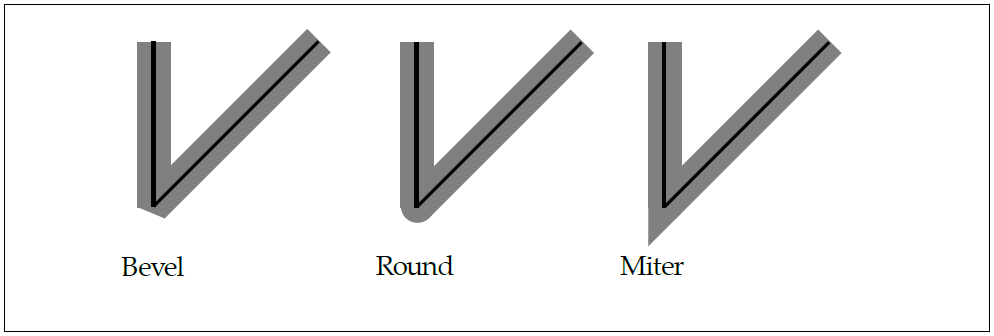
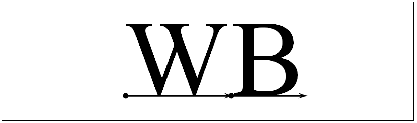
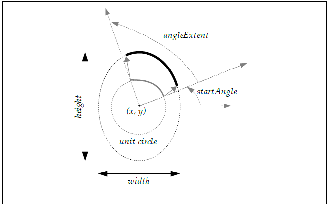

---
puppeteer:
  format: A4
  displayHeaderFooter: false
  headerTemplate: "<span>This is header</span>"
  footerTemplate: "<span>This is footer</span>"
  margin:
    top: 1.8cm
    right: 1.6cm
    bottom: 1.6cm
    left: 1.5cm
---


# OpenVG 1.1 Lite Specification

Updates
* Version 1.0 - August 1, 2005
* Version 1.0.1 - January 26, 2007
* Version 1.1 - December 3, 2008
* Version 1.1 Lite - January 31, 2020 (Release A003)

Editors
* Hwanyong Lee, Ajou University
* Robert J. Simpson, Qualcomm
* Daniel Rice, Google, Inc.

<div style="page-break-after: always;"> </div>

<a name="table-of-contents"></a>
# Table of Contents
<!-- TOC depthFrom:1 depthTo:6 withLinks:1 updateOnSave:1 orderedList:0 -->
- [Table of Contents](#table-of-contents)
<!-- /TOC -->

- [1 Introduction](#chapter01)
	- [1.1 Features and functionalities Set](#Feature_Set_and_functionality_Set)
	- [1.2 Target Applications](#Target_Applications)
	- [1.3 Target Devices](#Target_Devices)
	- [1.4 Design Philosophy](#Design_Philosophy)
	- [1.5 Naming and Typographical Conventions](#Naming_and_Typographical_Conventions)
	- [1.6 Library Naming](#Library_Naming)

- [2 The OpenVG Pipeline](#chapter02)
	- [2.1 Stage 1: Path, Transformation, Stroke, and Paint](#Stage_1)
	- [2.2 Stage 2: Stroked Path Generation](#Stage_2)
	- [2.3 Stage 3: Transformation](#Stage_3)
	- [2.4 Stage 4: Rasterization](#Stage_4)
	- [2.5 Stage 5: Clipping and Masking](#Stage_5)
	- [2.6 Stage 6: Paint Generation](#Stage_6)
	- [2.7 Stage 7: Image Interpolation](#Stage_7)
	- [2.8 Stage 8: Color Transformation, Blending, and Antialiasing](#Stage_8)
	- [2.9 Multisampling](#Multisampling)

- [3 Constants, Functions and Data Types](#chapter03)
	- [3.1 Versioning](#Versioning)
	- [3.2 Primitive Data Types](#Primitive_Data_Types)
	- [3.3 Floating-Point and Integer Representations](#Floating-Point_and_Integer_Representations)
	- [3.4 Colors](#Colors)
		- [3.4.1 Linear and Non-Linear Color Representations](#Linear_and_Non-Linear_Color_Representations)
		- [3.4.2 Color Space Definitions](#Color_Space_Definitions)
		- [3.4.3 Premultiplied Alpha](#Premultiplied_Alpha)
		- [3.4.4 Color Format Conversion](#Color_Format_Conversion)
	- [3.5 Enumerated Data Types](#Enumerated_Data_Types)
	- [3.6 Handle-based Data Types](#Handle-based_Data_Types)
		- [3.6.1 VGHandle](#VGHandle)
		- [3.6.2 VG_INVALID_HANDLE](#VG_INVALID_HANDLE)

- [4 The Drawing Context](#Chapter4)
	- [4.1 Errors](#Errors)
		- [4.1.1 VGErrorCode](#VGErrorCode)
		- [4.1.2 vgGetError](#vgGetError)
	- [4.2 Manipulating the Context Using EGL](#Manipulating_the_Context_Using_EGL)
		- [4.2.1 EGLConfig Attributes](#EGLConfig_Attributes)
		- [4.2.2 EGL Functions](#EGL_Functions)
	- [4.3 Forcing Drawing to Complete](#Forcing_Drawing_to_Complete)
		- [4.3.1 vgFlush](#vgFlush)
		- [4.3.2 vgFinish](#vgFinish)

- [5 Setting API Parameters](#Chapter05)
	- [5.1 Context Parameter Types](#Context_Parameter_Types)
		- [5.1.1 VGParamType](#VGParamType)
	- [5.2 Setting and Querying Context Parameter Values](#Setting_and_Querying_Context_Parameter_Values)
		- [5.2.1 vgSet](#vgSet)
		- [5.2.2 vgGet and vgGetVectorSize](#vgGet_and_vgGetVectorSize)
		- [5.2.3 Default Context Parameter Values](#Default_Context_Parameter_Values)
	- [5.3 Setting and Querying Object Parameter Values](#Setting_and_Querying_Object_Parameter_Values)
		- [5.3.1 vgSetParameter](#vgSetParameter)
		- [5.3.2 vgGetParameter and vgGetParameterVectorSize](#vgGetParameter_and_vgGetParameterVectorSize)

- [6 Rendering Quality and Antialiasing](#Chapter06)
	- [6.1 Rendering Quality](#Rendering_Quality)
		- [6.1.1 VGRenderingQuality](#VGRenderingQuality)
	- [6.2 Additional Quality Settings](#Additional_Quality_Settings)
		- [6.2.1 VGPixelLayout](#VGPixelLayout)
	- [6.3 Coordinate Systems and Transformations](#Coordinate_Systems_and_Transformations)
	- [6.4 Coordinate Systems](#Coordinate_Systems)
	- [6.5 Transformations](#Transformations)
		- [6.5.1 Homogeneous Coordinates](#Homogeneous_Coordinates)
		- [6.5.2 Affine Transformations](#Affine_Transformations)
		- [6.5.3 Projective (Perspective) Transformations](#Projective__Perspective__Transformations)
	- [6.6 Matrix Manipulation](#Matrix_Manipulation)
		- [6.6.1 VGMatrixMode](#VGMatrixMode)
		- [6.6.2 vgLoadIdentity](#vgLoadIdentity)
		- [6.6.3 vgLoadMatrix](#vgLoadMatrix)
		- [6.6.4 vgGetMatrix](#vgGetMatrix)
		- [6.6.5 vgMultMatrix](#vgMultMatrix)
		- [6.6.6 vgTranslate](#vgTranslate)
		- [6.6.7 vgScale](#vgScale)
		- [6.6.8 vgShear](#vgShear)
		- [6.6.9 vgRotate](#vgRotate)

- [7 Scissoring, Masking, and Clearing](#Chapter07)
	- [7.1 Scissoring](#Scissoring)
		- [7.1.1 VG_MAX_SCISSOR_RECTS](#VG_MAX_SCISSOR_RECTS)
		- [7.1.2 Specifying Scissoring Rectangles](#Specifying_Scissoring_Rectangles)
	- [7.2 Masking](#Masking)
		- [7.2.1 VGMaskOperation](#VGMaskOperation)
		- [7.2.2 vgMask](#vgMask)
		- [7.2.3 vgRenderToMask](#vgRenderToMask)
		- [7.2.4 VGMaskLayer](#VGMaskLayer)
		- [7.2.5 vgCreateMaskLayer](#vgCreateMaskLayer)
		- [7.2.6 vgDestroyMaskLayer](#vgDestroyMaskLayer)
		- [7.2.7 vgFillMaskLayer](#vgFillMaskLayer)
		- [7.2.8 vgCopyMask](#vgCopyMask)
	- [7.3 Fast Clearing](#Fast_Clearing)
		- [7.3.1 vgClear](#vgClear)

- [8.Paths](#Paths)
	- [8.1 Moves](#Moves)
	- [8.2 Straight Line Segments](#Straight_Line_Segments)
	- [8.3 Bezier Curves](#Bezier_Curves)
		- [8.3.1 Quadratic Bezier Curves](#Quadratic_Bezier_Curves)
		- [8.3.2 Cubic Bezier Curves](#Cubic_Bezier_Curves)
		- [8.3.3 G1 Smooth Segments](#G1_Smooth_Segments)
		- [8.3.4 C1 Smooth Segments](#C1_Smooth_Segments)
		- [8.3.5 C2 Smooth Segments](#C2_Smooth_Segments)
		- [8.3.6 Converting Segments From Quadratic to Cubic Form](#Converting_Segments_From_Quadratic_to_Cubic_Form)
	- [8.4 Elliptical Arcs](#Elliptical_Arcs)
	- [8.5 The Standard Path Format](#The_Standard_Path_Format)
		- [8.5.1 Path Segment Command Side Effects](#Path_Segment_Command_Side_Effects)
		- [8.5.2 Segment Commands](#Segment_Commands)
		- [8.5.3 Coordinate Data Formats](#Coordinate_Data_Formats)
		- [8.5.4 Segment Type Marker Definitions](#Segment_Type_Marker_Definitions)
		- [8.5.5 Path Example](#Path_Example)
	- [8.6 Path Operations](#Path_Operations)
		- [8.6.1 Storage of Paths](#Storage_of_Paths)
		- [8.6.2 Creating and Destroying Paths](#Creating_and_Destroying_Paths)
		- [8.6.4 Querying and Modifying Path Capabilities](#Querying_and_Modifying_Path_Capabilities)
		- [8.6.5 Copying Data Between Paths](#Copying_Data_Between_Paths)
		- [8.6.6 Appending Data to a Path](#Appending_Data_to_a_Path)
		- [8.6.7 Modifying Path Data](#Modifying_Path_Data)
		- [8.6.8 Transforming a Path](#Transforming_a_Path)
		- [8.6.9 Interpolating Between Paths](#Interpolating_Between_Paths)
		- [8.6.10 Length of a Path](#Length_of_a_Path)
		- [8.6.11 Position and Tangent Along a Path](#Position_and_Tangent_Along_a_Path)
		- [8.6.12 Querying the Bounding Box of a Path](#Querying_the_Bounding_Box_of_a_Path)
	- [8.7 Interpretation of Paths](#Interpretation_of_Paths)
		- [8.7.1 Filling Paths](#Filling_Paths)
		- [8.7.2 Stroking Paths](#Stroking_Paths)
		- [8.7.3 Stroke Parameters](#Stroke_Parameters)
		- [8.7.4 Stroke Generation](#Stroke_Generation)
		- [8.7.5 Setting Stroke Parameters](#Setting_Stroke_Parameters)
		- [8.7.6 Non-Scaling Strokes](#Non-Scaling_Strokes)
	- [8.8 Filling or Stroking a Path](#Filling_or_Stroking_a_Path)

- [9 Paint](#chapter09)
	- [9.1 Paint Definitions](#Paint_Definitions)
		- [9.1.1 Creating and Destroying Paint Objects](#Creating_and_Destroying_Paint_Objects)
		- [9.1.2 Setting the Current Paint](#Setting_the_Current_Paint)
		- [9.1.3 Setting Paint Parameters](#Setting_Paint_Parameters)
	- [9.2 Color Paint](#Color_Paint)
	- [9.3 Gradient Paint](#Gradient_Paint)
		- [9.3.1 Linear Gradients](#Linear_Gradients)
		- [9.3.2 Radial Gradients](#Radial_Gradients)
		- [9.3.3 Color Ramps](#Color_Ramps)
		- [9.3.4 Gradient Examples](#Gradient_Examples)
	- [9.4 Pattern Paint](#Pattern_Paint)
		- [9.4.1 Pattern Tiling](#Pattern_Tiling)

- [10 Images](#chapter10)
	- [10.1 Image Coordinate Systems](#Image_Coordinate_Systems)
	- [10.2 Image Formats](#Image_Formats)
	- [10.3 Creating and Destroying Images](#Creating_and_Destroying_Images)
	- [10.4 Querying Images](#Querying_Images)
	- [10.5 Reading and Writing Image Pixels](#Reading_and_Writing_Image_Pixels)
	- [10.6 Child Images](#Child_Images)
	- [10.7 Copying Pixels Between Images](#Copying_Pixels_Between_Images)
	- [10.8 Drawing Images to the Drawing Surface](#Drawing_Images_to_the_Drawing_Surface)
	- [10.9 Reading and Writing Drawing Surface Pixels](#Writing_Drawing_Surface_Pixels)
	- [10.10 Copying Portions of the Drawing Surface](#Copying_Portions_of_the_Drawing_Surface)

- [11 Text](#chapter11)
	- [11.1 Text Rendering](#Text_Rendering)
	- [11.2 Font Terminology](#Font_Terminology)
	- [11.3 Glyph Positioning and Text Layout](#Glyph_Positioning_and_Text_Layout)
	- [11.4 Fonts in OpenVG](#Fonts_in_OpenVG)
	  - [11.4.1 VGFont Objects and Glyph Mapping](#VGFont_Objects_and_Glyph_Mapping)
	  - [11.4.2 Managing VGFont Objects](#Managing_VGFont_Objects)
	- [11.5 Text Layout and Rendering](#Text_Layout_and_Rendering)

- [12 Image Filters](#chapter12)
  - [12.1 Format Normalization](#Format_Normalization)
  - [12.2 Channel Masks](#Channel_Masks)
  - [12.3 Color Combination](#Color_Combination)
  - [12.4 Convolution](#Convolution)
  - [12.5 Lookup Tables](#Lookup_Tables)

- [13 Color Transformation and Blending](#chapter13)
  - [13.1 Color Transformation](#Color_Transformation)
  - [13.2 Blending Equations](#Blending_Equations)
  - [13.3 Porter-Duff Blending](#Porter-Duff_Blending)
  - [13.4 Additional Blending Modes](#Additional_Blending_Modes)
  - [13.5 Additive Blending](#Additive_Blending)
  - [13.6 Setting the Blend Mode](#Setting_the_Blend_Mode)

- [14 Querying Hardware Capabilities](#chapter14)
- [15 Extending the API](#chapter15)
  - [15.1 Extension Naming Conventions](#Extension_Naming_Conventions)
  - [15.2 The Extension Registry](#The_Extension_Registry)
  - [15.3 Using_Extensions](#Using_Extensions)
    - [15.3.1 Accessing Extensions Statically](#Accessing_Extensions_Statically)
    - [15.3.2 Accessing Extensions Dynamically](#Accessing_Extensions_Dynamically)
  - [15.4 Creating Extensions](#Creating_Extensions)

- [16 API Conformance](#chapter16)
	- [16.1 Conformance Test Principles](#Conformance_Test_Principles)
		- [16.1.1 Window System Independence](#Window_System_Independence)
		- [16.1.2 Antialiasing Algorithm Independence"](#Antialiasing_Algorithm_Independence)
		- [16.1.3 On-Device and Off-Device Testing](#On-Device_and_Off-Device_Testing)
		- [16.1.4 Exclude extreme precision requirement](#Exclude_extreme_precision_requirement)
	- [16.2 Types of Conformance Tests](#Types_of_Conformance_Tests)
		- [16.2.1 Pipeline Tests](#Pipeline_Tests)
		- [16.2.2 Self-Consistency Tests](#Self-Consistency_Tests)
		- [16.2.3 Matrix Tests](#Matrix_Tests)
		- [16.2.4 Interior/Exterior Tests](#Interior_Exterior_Tests)
		- [16.2.5 Positional Invariance](#Positional_Invariance)
		- [16.2.6 Image Comparison Tests](#Image_Comparison_Tests)
		- [16.2.7 Quality of Rendering](#Quality_of_Rendering)
- [17 The VGU Utility Library](#chapter17)
	- [17.1 Higher-level Geometric Primitives](#Higher-level_Geometric_Primitives)
		- [17.1.1 Lines](#Lines)
		- [17.1.2 Polylines and Polygons](#Polylines_and_Polygons)
		- [17.1.3 Rectangles](#Rectangles)
		- [17.1.4 Round-Cornered Rectangles](#Round_Cornered_Rectangles)
		- [17.1.5 Ellipses](#Ellipses)
		- [17.1.6 Arcs](#Arcs)
	- [17.2 Image Warping](#Image_Warping)
- [18 Appendix A: Mathematics of Ellipses](#chapter18)
	- [18.1 The Center Parameterization](#The_Center_Parameterization)
	- [18.2 The Endpoint Parameterization](#The_Endpoint_Parameterization)
	- [18.3 Converting from Center to Endpoint Parameterization](#Converting_from_Center_to_Endpoint_Parameterization)
	- [18.4 Converting from Endpoint to Center Parameterization](#Converting_from_Endpoint_to_Center_Parameterization)
	- [18.5 Implicit Representation of an Ellipse](#Implicit_Representation_of_an_Ellipse)
	- [18.6 Transformation of Ellipses](#Transformation_of_Ellipses)
- [19 Appendix B: Header files](#chapter19)
- [20 Bibliography](#chapter20)
- [21 Document History](#chapter21)
- [22 Acknowledgments](#chapter22)
- [23 Indices](#chapter23)
	- [Index of Tables](#Index_of_Tables)
	- [Index of Figures](#Index_of_Figures)
	- [Alphabetical Index](#Alphabetical_Index)

<div style="page-break-after: always;"> </div>


<a name="chapter01"></a> <a name="Introduction"></a>
# 1 Introduction

OpenVG is an application programming interface (API) for hardware-accelerated two-dimensional vector and raster graphics developed under the auspices of Khronos Group (www.khronos.org). It provides a device- independent and vendor-neutral interface for sophisticated 2D graphical applications, while allowing device manufacturers to provide hardware acceleration where appropriate.


OpenVG Lite specification is based on OpenVG 1.1 specification. This document defines the C language binding to OpenVG Lite. We use term "OpenVG" to refer "OpenVG Lite". We use the term "OpenVG Lite" to refer to "OpenVG Lite specification", "implementation" which refers to the software and/or hardware that implements OpenVG Lite specification functionality, and the term "application" refers to any software that makes use of OpenVG Lite. We use the term "Extension" to refer to "Feature Extension of OpenVG Lite specification defined by OpenVG WG or implementation vendor".

<a name="Feature_Set_and_functionality_Set"></a>
## _1.1 Feature set and functionality Set_
OpenVG Lite provides features subset of OpenVG 1.1. Some features of OpenVG is not supported or make different rendering result on OpenVG Lite implementation.

<a name="Target_applications"></a>
## _1.2 Target applications_
Several classes of target applications were used to define requirement for the design of the OpenVG Lite API. For instance, SVG and Adobe Flash viewers, Portable Mapping Applications, E-book readers, Games, Scalable User Interface, Low-Level Graphics Interface.

<a name="Target_Devices"></a>
## _1.3 Target Devices_
OpenVG Lite profile is designed to run on devices ranging from wearable devices like a wrist watches to graphics workstation and server machines. It is expected that OpenGL ES 2.X or later version of GL graphics hardware will be able to provide inexpensive incremental acceleration for OpenVG Lite functionality. It is also expected that general purpose CPU and DSP hardware with floating point processing will be able to implementing acceleration for OpenVG Lite functionality.

<a name="Design_Philosophy"></a>
## _1.4 Design Philosophy_
OpenVG Lite is intended to provide a hardware abstraction layer that will allow accelerated performance on a variety of application platforms. Functions that are not expected to be amenable to hardware acceleration in the near future were either not included, or included as part of the optional VGU utility library. Where possible, the syntax of OpenVG is intended to be reminiscent of that of OpenGL, in order to make learning OpenVG as easy as possible for OpenGL developers. Most of the OpenVG state is encapsulated in a set of primitive-valued variables that are manipulated using the vgSet and vgGet functions. Extensions may add new state
<a name="Naming_and_Typographical_Conventions"></a>
##  _1.5 Naming and Typographical Conventions_
OpenVG Lite uses a consistent set of conventions for API names and symbols. In this document, additional typographic conventions are used to help indicate the type of each symbol, as shown in Table 1 below.

<a name="table01"></a>

| Symbol Type             | Name/Case        | Type Style      | Example                     |
|-------------------------|------------------|-----------------|-----------------------------|
| API Function            | vgXxxYyy         | Boldface        | **vgLoadMatrix**            |
| API Function with Varying Parameter Types        | vgXxx{f,i,fv,iv} | Boldface        | **vgSetfv**                 |
| Utility Function        | vguXxxYyy        | Boldface        | **vguRoundRect**            |
| Primitive Datatype      |VGxxx             |Typewriter       | `VGfloat`                   |
| Enumerated Datatype     |VGXxxYyy          | Typewriter      |`VGCapStyle`                 |
| Enumerated Value        | VG_XXX_YYY       |Typewriter       | `VG_BLEND_MODE`             |
| Utility Enumerated Value| VGU_XXX_YYY      | Typewriter      | `VGU_ARC_CHORD`             |
| Function Argument       | xxxYyy           |Typewriter       | `paintMode`                 |

_Table 1: Naming and Typographical Convention_

<a name="Library_Naming"></a>
##  _1.6 Library Naming_
The library name is defined as `libOpenVG.z` where `z` is a platform-specific library suffix (_i.e._, `.a, .so, .lib, .dll`, etc.) ***When system has OpenVG and OpenVG Lite library together, application developer should specify order of linking***.

<div style="page-break-after: always;"></div>

<a name="chapter02"></a><a name="The_OpenVG_Lite_Pipeline"></a>
# 2 The OpenVG Lite Pipeline
This section defines the OpenVG pipeline mechanism by which primitives are rendered. Implementations are not required to match the ideal pipeline stage-for-stage; they may take any approach to rendering so long as the final results match the results of the ideal pipeline within the tolerances defined by the conformance testing process. The OpenVG Lite pipeline supports both single-sampled and multisampled surfaces (see Section 2.9).

Figure 1 below provides an overview of the OpenVG pipeline, focusing on the various steps involved in drawing a thick, dashed line into a scene using a radial gradient paint.

<a name="figure01"> </a>


_Figure 1: The OpenVG Pipeline_

<a name="Stage_1"></a>
## _2.1 Stage 1: Path, Transformation, Stroke, and Paint_

The application defines the path to be drawn, and sets any transformation, stroke, and paint parameters or leaves them at their default settings. When all parameters have been set, the application initiates the rendering process by calling **vgDrawPath**, indicating whether the path is to be filled, stroked, or both. If the path is to be both filled and stroked, the remainder of the pipeline is invoked twice in a serial fashion, first to fill and then to stroke the path. If an image is being drawn (via the **vgDrawImage** function), the current path is set to a rectangle bounding the image.

<a name="Stage_2"></a>
## _2.2 Stage 2: Stroked Path Generation_
If the path is to be stroked, the stroke parameters are applied in the user coordinate system to generate a new path that describes the stroked geometry. This path is then substituted for the original path in the remainder of the pipeline, and the fill rule is set to non-zero.

<a name="Stage_3"></a>
## _2.3 Stage 3: Transformation_
The current path-user-to-surface transformation is applied to the geometry of the current path, producing drawing surface coordinates. For an image, the outline of the image is transformed using the image-user-to-surface transformation. Non-uniform transformations may result in skewed stroke outlines.

<a name="Stage_4"></a>
## _2.4 Stage 4: Rasterization_
A coverage value is computed at pixels affected by the current path using a filtering process, and saved for use in the antialiasing step.

Conceptually, a set of sample positions are evaluated for inclusion within the path. At each pixel center that is no more than 1½ pixels away from some portion of the path geometry, a reconstruction filter is applied to the binary inclusion values at nearby sample points to obtain a filtered coverage value for the pixel. If only a single sample per pixel is evaluated, the sample position must be coincident with the pixel center. Note that for a box filter (a filter that gives equal positive weight to all samples within a rectangle centered on the pixel center, and zero weight elsewhere), this filtering process amounts to estimating the area of the intersection of the path geometry with the filter rectangle.

For a single-sampled surface, if antialiasing is disabled only pixel centers are used as sample points and the reconstruction filter has value 1 at the pixel center and 0 elsewhere.

In the case where a sample point lies exactly on the boundary of a path, the implementation must enforce a consistent "tie-breaking" rule. For any two paths that share a common boundary segment, but whose interiors lie on opposite sides of the segment, a sample point that lies exactly on the boundary must be considered to be included in exactly one of the two paths. If the interiors of the two paths lie on the same side of the common segment, the sample point must belong to both paths, or neither path. Note that the common boundary segment must be specified in exactly the same manner for both paths (i.e., with bit-for-bit identical control point values, scale and bias, and transformation matrix settings, but possibly with control points in reverse order) for this guarantee to hold.

<a name="Stage_5"></a>
## _2.5 Stage 5: Clipping and Masking_
Pixels not lying within the bounds of the drawing surface, and (if scissoring is enabled) within the union of the current set of scissor rectangles are assigned a coverage value of 0.

An application-specified mask image is used to modify the coverage values generated by the previous stage. Each coverage value is multiplied by the mask value for the corresponding pixel to obtain a masked coverage value. If the resulting coverage value is zero, the remainder of the pipeline is skipped.

<a name="Stage_6"></a>
## _2.6 Stage 6: Paint Generation_
At each pixel of the drawing surface, the relevant current paint (depending on whether the original path was to be filled or stroked) is used to define a color and an alpha value. For gradient and pattern paints, the paint-to-user transformation is concatenated with the path-user-to-surface transformation to define the paint transformation that will geometrically transform the paint. Paint generation may be skipped for operations that do not utilize paint values.

For multisampled drawing surfaces, implementations may perform paint generation either at every sample, or once per pixel at the pixel center. The same approach must be used for every primitive drawn to a given drawing surface.

<a name="Stage_7"></a>
## _2.7 Stage 7: Image Interpolation_
If an image is being drawn, an image color and alpha value is computed at each pixel by interpolating image values using the inverse of the current image-user-to-surface transformation. The results are combined with the paint color and alpha values according to the current image drawing mode. If image drawing is not taking place, the results from the preceding stage are passed through unchanged.

<a name="Stage_8"></a>
## _2.8 Stage 8: Color Transformation, Blending, and Antialiasing_
At each pixel, the source color and alpha values from the preceding stage (which may be the paint color and alpha values when drawing path data or when using the "stencil" image drawing mode, or interpolated image color and alpha values when drawing an image in any of the other drawing modes) are passed through an optional color transformation and converted into the destination color space. The resulting colors are blended with the corresponding destination color and alpha values according to the current blending rule. A special blending rule is used when drawing an image using the "stencil" image drawing mode. The computed coverage value from stage 5 is used to interpolate between the blended result and the previously assigned color at the pixel (preferably in a linear color space) to produce an antialiased result.

<a name="Multisampling"></a>
## _2.9 Multisampling_
Some implementations may provide the option to obtain drawing surfaces that support antialiasing using multisampling. For multisampled surfaces, rasterization occurs at a number of sample points within each pixel. Rather than applying a filter to resolve the coverage at various sample points into a single value once a single primitive has been fully rasterized, the coverage values at each sample point are stored until all primitives for the current frame are complete. When the application requests a buffer swap, the multisampled buffer is resolved into a buffer with a single color per pixel in an implementation-dependent manner.

The determination of whether a sample falls inside a geometric primitive when rendering to a multisampled surface is performed in the same manner as for pixel rendering in nonantialiased mode, only with inclusion evaluated at multiple subpixel sample positions rather than at pixel centers only. This ensures that rendered geometry affects samples in a consistent manner. In particular, geometric primitives that collectively cover an entire pixel must result in all subpixel samples belonging to that pixel being assigned to one of the primitives.

Multisampling may allow for more accurate computation of the coverage across multiple primitives. In particular, for primitives that abut one another, multisampling avoids any possibility of background color "bleeding through,"which may be important for applications such as Adobe Flash players. Adobe Flash player implementations may also require that the samples be resolved using a single-pixel wide box filter; the choice of filter is outside of the scope of this specification, but may be possible using platform APIs such as EGL.

<div style="page-break-after: always;"></div>
<a name="Constants_Functions_and_Data_Types"></a>
<a name="chapter03"></a>
# 3 Constants, Functions and Data Types

OpenVG type definitions and function prototypes are found in an `openvg.h` header file, located in a VG subdirectory of a platform-specific header file location. OpenVG makes use of 8-, 16-, and 32-bit data types. A 64-bit data type is not required. If the `khronos_types.h` header file is provided, the primitive data types will be compatible across all Khronos APIs on the same platform.

<a name="Versioning"></a>
## _3.1 Versioning_
The `openvg.h` header file defines constants indicating the version of the specification. Future versions will continue to define the constants for all previous versions with which they are backward compatible.

<a name="OPENVG_VERSION_1_1L"></a>
#### _OPENVG_VERSION_1_1L
For the current specification, the constant `OPENVG_VERSION_1_1_L` is defined. The older version `OPENVG_VERSION_1_0, OPENVG_VERSION_1_1` continues to be defined for backwards compatibility. The version may be queried at runtime using the **vgGetString** function (see Section 15.3.2).

```C
#define OPENVG_VERSION_1_0 1
#define OPENVG_VERSION_1_1 2
#define OPENVG_VERSION_1_1_L 3
```

<a name="Primitive_Data_Types"></a>
## _3.2 Primitive Data Types_
OpenVG defines a number of primitive data types by means of C  `typedef`s. The actual data types used are platform-specific.

<a name="VGbyte"></a>
#### _VGbyte_

`VGbyte` defines an 8-bit two’s complement signed integer, which may contain values between -128 and 127, inclusive. If `khronos_types.h` is defined, `VGbyte` will be defined as `khronos_int8_t.`

<a name="VGubyte"></a>
#### _VGubyte_

`VGubyte` defines an 8-bit unsigned integer, which may contain values between 0 and 255, inclusive. If `khronos_types.h` is defined, `VGubyte` will be defined as `khronos_uint8_t.`

<a name="VGshort"></a>
#### _VGshort_

`VGshort` defines a 16-bit two’s complement signed integer, which may contain values between -32768 and 32767, inclusive. If `khronos_types.h` is defined, `VGshort` will be defined as `khronos_int16_t.`

<a name="VGint"></a>
#### _VGint_
`VGint` defines a 32-bit two’s complement signed integer. If `khronos_types.h` is defined, `VGint` will be defined as `khronos_int32_t.`

<a name="VGuint"></a>
#### _VGuint_
`VGuint` defines a 32-bit unsigned integer. Overflow behavior is undefined. If `khronos_types.h` is defined, `VGuint` will be defined as `khronos_uint32_t`.

<a name="VGbitfield"></a>
#### _VGbitfield_
`VGbitfield` defines a 32-bit unsigned integer value, used for parameters that may combine a number of independent single-bit values. A `VGbitfield` must be able to hold at least 32 bits. If `khronos_types.h` is defined, `VGbitfield` will be defined as `khronos_uint32_t`.

<a name="VGboolean"></a>
#### _VGboolean_
`VGboolean` is an enumeration that only takes on the values of `VG_FALSE` (0) or `VG_TRUE` (1). Any non-zero value used as a `VGboolean` will be interpreted as `VG_TRUE`.

```C
typedef enum {
VG_FALSE = 0,
VG_TRUE = 1
} VGboolean;
```

<a name="VGfloat"></a>
#### _VGfloat_
`VGfloat` defines a 32-bit IEEE 754 floating-point value. If `khronos_types.h` is defined, `VGfloat` will be defined as `khronos_float_t`.

<a name="Floating-Point_and_Integer_Representations"></a>
## _3.3 Floating-Point and Integer Representations_
All floating-point values are specified in standard IEEE 754 format. However, implementations may clamp extremely large or small values to a restricted range, and internal processing may be performed with lesser precision. At least 16 bits of mantissa, 6 bits of exponent, and a sign bit must be present, allowing values from  $\pm 2^{-30}$ to $\pm 2^{31}$ to be represented with a fractional precision of at least 1 in $2^{16}$.

Path data (_i.e._, vertex and control point coordinates and ellipse parameters) may be pecified in one of four formats: 8-, 16-, or 32-bit signed integers, or floating-point. Floating-point scale and bias factors are used to map the incoming integer and floatingpoint values into a desired range when path processing occurs.

Handling of special values is as follows. Positive and negative 0 values must be treated identically. Values of +Infinity, -Infinity, or `NaN` (not a number) yield unspecified results. Optionally, incoming floating-point values of `NaN` may be treated as 0, and values of +Infinity and -Infinity may be clamped to the largest and smallest available values within the implementation, respectively. Denormalized numbers may be truncated to 0. Passing any arbitrary value as input to any floating-point argument must not lead to OpenVG interruption or termination.

<a name="VG_MAXSHORT"></a>
#### _VG_MAXSHORT_
The macro `VG_MAXSHORT` contains the largest positive value that may be represented by a `VGshort. VG_MAXSHORT` is defined to be equal to 2<sup>15</sup> – 1, or 32,767. The smallest negative value that may be represented by a `VGshort` is given by (– `VG_MAXSHORT` – 1), or -32,768.

<a name="VG_MAXINT"></a>
#### _VG_MAXINT_
The macro `VG_MAXINT` contains the largest positive value that may be represented by a VGint. `VG_MAXINT` is defined to be equal to 2<sup>31</sup> – 1, or 2,147,483,647. The smallest negative value that may be represented by a `VGint` is given by (`–VG_MAXINT` – 1), or -2,147,483,648.

<a name="VG_MAX_FLOAT"></a>
#### _VG_MAX_FLOAT_
The parameter `VG_MAX_FLOAT` contains the largest floating-point number that will be accepted by an implementation. To query the parameter, use the **vgGetf** function with a `paramType` argument of `VG_MAX_FLOAT` (see Section 5.2). All implementations must define `VG_MAX_FLOAT` to be at least 10<sup>10</sup>.

<a name="Colors"></a>
## _3.4 Colors_
Colors in OpenVG Lite other than those stored in image pixels (_e.g._, colors for clearing, painting, and edge extension for convolution) are represented as non-premultiplied (see Section 3.4.3) sRGBA [[sRGB99](#sRGB99)] color values.</r> Image pixels may be defined in a number of color spaces, including sRGB, linear RGB, linear grayscale (or _luminance_) and nonlinearly coded, perceptually-uniform grayscale, in premultiplied or non-premultiplied form. Color and alpha values lie in the range [0,1] unless otherwise noted. This applies to intermediate values in the pixel pipeline as well as to application-specified values. If an alpha channel is present but has a bit depth of zero, the alpha value of each pixel is taken to be 1.

Non-linear quantities are denoted using primed (’) symbols below. [POYN03] contains an excellent discussion of the use of non-linear coding to achieve perceptual uniformity.

<a name="Linear_and_Non-Linear_Color_Representations"></a>
### _3.4.1 Linear and Non-Linear Color Representations_
OpenVG Lite use linear RGBA color in processing. Therefore, if user want display rendering result with sRGB format, user should add conversion process for input or output color data in his application. It may be executed in OpenVG Lite or EGL. In a linear color representation, the numeric values associated with a color channelvalue measure the rate at which light is emitted by an object, multiplied by someconstant scale factor. Informally, it can be thought of as counting the number of photonsemitted in a given amount of time. Linear representations are useful for computation,since light values may be added together in a physically meaningful way.

However, the human visual system responds non-linearly to the light power ("intensity") of an image. Accordingly, many common image coding standards (e.g., the EXIF JPEG format used by many digital still cameras and the MPEG format used for video) utilize non-linear relationships between light power and code values. This allows a larger number of distinguishable colors to be represented in a given number of bits than is possible with a linear encoding. Common display devices such as CRTs and LCDs also emit light whose power at each pixel component is proportional to a non-linear power function (i.e., a function of the form xa where a is constant) of the applied code value, whether due to the properties of analog CRT electronics or to the deliberate application of a non-linear transfer function elsewhere in the signal path. The exponent, or gamma, of this power function is typically between 2.2 and 2.5. OpenVG makes use of the nonlinear sRGB color specification described below.

Because linear coding of intensity fails to optimize the number of distinguishablevalues, 8-bit linear pixel formats suffer from poor contrast ratios and banding artifacts; their use with photographic imagery is not recommended. However, synthetic imagery generated by other APIs such as OpenGL ES that make use of linear light may require the use of linear formats. 8-bit linear coding is also appropriate for representing pseudoimages such as coverage masks that are not based on perceptual light intensity.

Although computing directly with non-linear representations may lead to significant errors compared with the results of first converting to a linear representation, it is common industry practice in many imaging domains to do so. Because the cost of performing linearization on pixel values to be interpolated or blended is considered prohibitive for mobile devices in the near future, OpenVG may perform these operations directly on non-linear code values. A future version of this specification may introduce flags to force values to be converted to a linear representat***

<a name="Color_Space_Definitions"></a>
### _3.4.2 Color Space Definitions_
The linear lRGB color space is defined in terms of the standard CIE XYZ color space [WYSZ00], following ITU Rec. 709 [ITU90] using a D65 white point:

$$
R = 3.240479 X -1.537150 Y –0.498535 Z\\
G =-0.969256X +1.875992 Y +0.041556 Z\\
B = 0.055648 X –0.204043 Y +1.057311 Z
$$

The sRGB color space defines values $R_{sRGB}'$, $G_{sRGB}'$, $B_{sRGB}'$ in terms of the linear lRGB primaries by applying a gamma ($\gamma$) mapping consisting of a linear segment and an offset power function:

$$
if \quad x \leq 0.00304 \\
    \gamma(x) = 12.92 x \\
else\\
    \gamma(x) = 1.0556 x^{1/2.4} - 0.0556
$$

The inverse mapping $\gamma^{-1}$ is defined as:

$$
if \quad  x \leq 0.03928 \\
  \gamma^{-1}(x) = x/ 12.92 \\
else \\
   \gamma^{-1}(x) = [(x+0.0556)/1.0556]^{2.4}
$$

To convert from lRGB to sRGB, the gamma mapping is used:

$$
R_{sRGB}' = \gamma(R)\\
G_{sRGB}' =\gamma(G)\tag{1} \\
B_{sRGB}' =\gamma(B)
$$

To convert from sRGB to lRGB, the inverse gamma mapping is used:

$$
R = \gamma^{-1}(R_{sRGB}') \\
G = \gamma^{-1}(G_{sRGB}')\tag{2} \\
B = \gamma^{-1}(B_{sRGB}')
$$

Because the gamma function involves offset and scaling factors, it behaves similarly to a pure power function with an exponent of 1/2.2 (or approximately 0.45) rather than the "advertised" exponent of 1/2.4, (or approximately 0.42).

The linear grayscale (luminance) color space (which we denote as lL) is related to the linear lRGB color space by the equations:

$$ L = 0.2126 R + 0.7152 G + 0.0722 B  \\
R = G = B = L \tag{4}
$$

The perceptually-uniform grayscale color space (which we denote as sL) is related to the linear grayscale (luminance) color space by the gamma mapping:

$$
L'=\gamma (L) \tag{5}
$$

$$
L=\gamma^1 (L')\tag{6}
$$

Conversion from perceptually-uniform grayscale to sRGB is performed by replication:

$$R’ = G’ = B’ = L’\tag{7}$$

The remaining conversions take place in multiple steps, as shown in Table 2 below. The source format is indicated by the left column, and the destination format is indicated by the top row. The numbers indicate the equations from this section that are to be applied, in left-to-right order.

<a name="table02"></a>
|Source/Dest |lRGB| sRGB |lL| sL|
| :--- | :---: | :---: | :---: | :---:|
|**lRGB** |—| 1| 3| 3,5|
|**sRGB**| 2| — |2,3| 2,3,5|
|**lL** |4 |4,1 |—| 5|
|**sL**| 7,2| 7 |6 |—|

_Table 2: Pixel Format Conversions_

<a name="Premultiplied_Alpha"></a>
### _3.4.3 Premultiplied Alpha_
In _premultiplied alpha_ (or simply _premultiplied_) formats, a pixel ($R, G, B, \alpha$) is represented as ($\alpha*R$, $\alpha*G$, $\alpha*B$, $alpha$). Alpha is always coded linearly, regardless of the color space. The terms _associated alpha_ and _premultiplied alpha_ are synonymous.


<a name="Color_Format_Conversion"></a>
### _3.4.4 Color Format Conversion_

Color values are converted between different formats and bit depths as follows. First, premultiplied color values are clamped to the range [0, alpha] and non-zero alpha values are divided out to obtain a non-premultiplied representation for the color.

If the source and destination color formats are of differing color spaces (_i.e._, linear RGB, sRGB, linear grayscale, perceptually-uniform grayscale), each source channel is divided by the maximum channel value to produce a number between 0 and 1. The color space conversion is performed as described above. The resulting values are then scaled by the maximum value for each destination channel.

If the source and destination formats have the same color format, but differ in the number of bits per color channel, the source value is multiplied by the quotient $(2^d – 1)/(2^s – 1)$ (where $d$ is the number of bits in the destination and $s$ is the number of bits in the source) and rounded to the nearest integer.

The following approximation may be used in place of exact multiplication: If the source channel has a greater number of bits than the destination, the most significant bits are preserved and the least significant bits are discarded. If the source channel has a lesser number of bits than the destination, the value is shifted left and the most significant bits are replicated in the less significant bit positions. For example, a 5-bit source value $b_4 b_3 b_2 b_1 b_0$ will be converted to an 8-bit destination value $b_4 b_3 b_2 b_1 b_0 b_4 b_3 b_2$. This rule approximates the correct result since if $d = k*s$ for some integer k > 1 the quotient $(2^d – 1)/(2^s – 1)$ will be an integer of the form $2^{(k-1) s} + 2^{(k-2) s} + ... + 2^s + 1$, and multiplication of an s-bit value by this value will be exactly equivalent to bit replication. When the destination bit depth is not an integer multiple of the source bit depth, this rule still provides greater accuracy than other possible approximations such as padding the source with zeros or with copies of the rightmost bit.

Note that converting from a lesser to a greater number of bits and back again using either exact scaling or the approximation will result in an unchanged value. If the destination format has stored alpha, the previously saved alpha value is stored into the destination. If the destination format has premultiplied alpha, each color channel value is multiplied by the corresponding alpha value and the resulting values are clamped to the range [0, alpha].

<a name="Enumerated_Data_Types"></a>
## _3.5 Enumerated Data Types_
A number of data types are defined using the C `enum` keyword. In all cases, this specification assigns each enumerated constant a particular integer value. Extensions to the specification wishing to add new enumerated values must register with the Khronos Group to receive a unique value (see Section 15).

Applications making use of extensions should cast the extension-defined integer value to the proper enumerated type.

The enumerated types (apart from `VGboolean`) defined by OpenVG Lite are:

* `VGBlendMode`
* `VGCapStyle`
* `VGColorRampSpreadMode`
* `VGErrorCode`
* `VGFillRule`
* `VGFontParamType`
* `VGHardwareQueryResult`
* `VGHardwareQueryType`
* `VGImageChannel`
* `VGImageFormat`
* `VGImageMode`
* `VGImageParamType`
* `VGImageQuality`
* `VGJoinStyle`
* `VGMaskOperation`
* `VGMatrixMode`
* `VGPaintMode`
* `VGPaintParamType`
* `VGPaintType`
* `VGParamType`
* `VGPathAbsRel`
* `VGPathCapabilities`
* `VGPathCommand`
* `VGPathDatatype`
* `VGPathParamType`
* `VGPathSegment`
* `VGPixelLayout`
* `VGRenderingQuality`
* `VGStringID`
* `VGTilingMode`

The VGU utility library defines the enumerated types:

* `VGUArcType`
* `VGUErrorCode`

<a name="Handle-based_Data_Types"></a>
## _3.6 Handle-based Data Types_
Images, paint objects, and paths are accessed using opaque _handles_. The use of handles allows these potentially large and complex objects to be stored under API control. For example, they may be stored in special memory and/or formatted in a way that is suitable for use by a hardware implementation. Handles are created relative to the current context, and may only be used as OpenVG function parameters when that context or one of its shared contexts is current.

Handles employ _reference count_ semantics; if a handle is in use by the implementation, a request to destroy the handle prevents the handle from being used further by the application, but allows it to continue to be used internally by the implementation until it is no longer referenced.

<a name="VGHandle"></a>
#### _3.6.1 VGHandle_
Handles make use of the `VGHandle` data type. For reasons of binary compatibility between different OpenVG implementations on a given platform, a `VGHandle` is defined as a `VGuint`.
```C
typedef VGuint VGHandle;
```
Live handles to distinct objects must compare as unequal using the C == (double equals) operator.

The `VGHandle` subtypes defined in the API are:
* `VGFont` – a reference to font data (see Section 11)
* `VGImage` – a reference to image data (see Section 10)
* `VGMaskLayer` – a reference to mask data (see Section 7.2)
* `VGPaint` – a reference to a paint specification (see Section 9)
* `VGPath` – a reference to path data (see Section 8)

<a name="VG_INVALID_HANDLE"></a>
#### _3.6.2 VG_INVALID_HANDLE_
The symbol `VG_INVALID_HANDLE` represents an invalid `VGHandle` that is used as an error return value from functions that return a `VGHandle`. `VG_INVALID_HANDLE` is defined as (`VGHandle`)0.
```C
#define VG_INVALID_HANDLE ((VGHandle)0)
```
<div style="page-break-after: always;"></div>

<a name="Chapter4"></a><a name="The Drawing Context"></a>
# 4 The Drawing Context

OpenVG functions that perform drawing, or that modify or query drawing state make use of an implicit _drawing context_ (or simply a _context_). A context is created, attached to a drawing surface, and bound to a running application thread outside the scope of the OpenVG API, for example by the Khronos EGL API. OpenVG API calls are executed with respect to the context currently bound to the thread in which they are executed. A call to any OpenVG API function when no drawing context is bound to the current thread has no effect. The drawing context currently bound to a running thread is referred to as the _current context_.

When an image, paint, path, font, or mask handle is defined, it is permanently attached to the context that is current at that time. It is an error to use the handle as an argument to any OpenVG function when a different context is active, unless that context has been designated as a _shared context_ of the original context by the API responsible for context creation (usually EGL).

Images created by OpenVG may be used as the rendering target of a drawing context. All drawing performed by any API that makes use of that context will use that image as the drawing surface.

Passing an image that is currently the rendering target of a drawing context to any OpenVG function (excluding **vgGetParameter** and **vgDestroyImage**) will result in a `VG_IMAGE_IN_USE_ERROR`. The image may once again be used by OpenVG when it is no longer in use as a rendering target.

An image that is related to any other image (as defined in Section 10.6), or that is set as a paint pattern image on a paint object or a glyph image on a font object, may not be used as a rendering target. A parent image (one that was created by **vgCreateImage**) may be used as a rendering target when all other images that are related to it have been destroyed and it is not being used as a paint pattern image on any paint object or as a glyph image on any font object.

It is possible to provide OpenVG on a platform without supporting EGL. In this case, the host operating system must provide some alternative means of creating a context and binding it to a drawing surface and a rendering thread.

The context is responsible for maintaining the API state, as shown in Table 3.

<a name="table03"> </a>
|State Element| Description|
|---|---|
|Drawing Surface |Surface for drawing|
|Matrix Mode| Transformation to be manipulated|
|Path user-to-surface Transformation |Affine transformation for filled and stroked geometry|
|Image user-to-surface Transformation| Affine or projective transformation for images|
|Paint-to-user Transformations| Affine transformations for paint applied to geometry|
|Glyph user-to-surface Transformation| Affine transformation for glyphs|
|Glyph origin |(X,Y) origin of a glyph to be drawn|
|Fill Rule| Rule for filling paths|
|Quality Settings |Image and rendering quality, pixel layout|
|Color Transformation| Color Transformation Function|
|Blend Mode| Pixel blend function|
|Image Mode| Image/paint combination function|
|Scissoring |Current scissoring rectangles and enable/disable |
|Stroke |Stroke parameters|
|Pixel and Screen layout| Pixel layout information|
|Tile fill color |Color for FILL tiling mode|
|Clear color |Color for fast clear|
|Filter Parameters |Image filtering parameters|
|Paint |Paint definitions|
|Mask| Coverage mask and enable/disable|
|Error |Oldest unreported error code|

_Table 3: State Elements of a Context_

<a name="Errors"></a>
## _4.1 Errors_
Some OpenVG functions may encounter errors. Unless otherwise specified, any value returned from a function following an error is undefined.

All OpenVG functions may signal `VG_OUT_OF_MEMORY_ERROR`. This allows implementations to defer memory allocation until it is needed, rather than requiring them to proactively allocate memory only in certain functions that are allowed to generate an error. Such an error may occur midway through the execution of an OpenVG function, in which case the function may have caused changes to the state of OpenVG or to drawing surface pixels prior to failure.

When an OpenVG function encounters an error other than a `VG_OUT_OF_MEMORY_ERROR`, the context state is not modified and no drawing takes place.

An error condition within an OpenVG function must never result in process termination, with the exception of illegal memory accesses taking place within functions that accept an application-provided pointer. Applications should take care to check return values where provided. Functions that do not provide return values may still flag errors that may be retrieved using the **vgGetError** function described below. Errors are stored in the context in which the function was called.

All pointer arguments must be aligned according to their datatype, _e.g._, a `VGfloat` * argument must be a multiple of 4 bytes.

<a name="VGErrorCode"></a>
#### _4.1.1 VGErrorCode_
The error codes and their numerical values are defined by the VGErrorCode enumeration:
```C
typedef enum {
VG_NO_ERROR                       = 0,
VG_BAD_HANDLE_ERROR               = 0x1000,
VG_ILLEGAL_ARGUMENT_ERROR         = 0x1001,
VG_OUT_OF_MEMORY_ERROR            = 0x1002,
VG_PATH_CAPABILITY_ERROR          = 0x1003,
VG_UNSUPPORTED_IMAGE_FORMAT_ERROR = 0x1004,
VG_UNSUPPORTED_PATH_FORMAT_ERROR  = 0x1005,
VG_IMAGE_IN_USE_ERROR             = 0x1006,
VG_NO_CONTEXT_ERROR               = 0x1007
} VGErrorCode;
```

<a name="vgGetError"></a>
#### _4.1.2 vgGetError_
**vgGetError** returns the oldest error code provided by an API call on the current context since the previous call to vgGetError on that context (or since the creation of the context). No error is indicated by a return value of 0 (`VG_NO_ERROR`). After the call, the error code is cleared to 0. The possible errors that may be generated by each OpenVG function (apart from `VG_OUT_OF_MEMORY_ERROR`) are shown below the definition of the function.

If no context is current at the time vgGetError is called, the error code `VG_NO_CONTEXT_ERROR` is returned. Pending error codes on existing contexts are not affected by the call.
```C
VGErrorCode vgGetError(void)
```

<a name="Manipulating_the_Context_Using_EGL"></a>
## _4.2 Manipulating the Context Using EGL_
Most OpenVG implementations are expected to make use of version 1.2 or later of the EGL API to obtain drawing contexts. This section provides only a partial, non-normative description of some aspects of the use of EGL that are specific to OpenVG. Refer to the EGL 1.2 specification for more details.

<a name="EGLConfig_Attributes"></a>
### _4.2.1 EGLConfig Attributes_
An `EGLConfig` describes the capabilities of a configuration. Each `EGLConfig` encapsulates a set of attributes and their values.

<a name="EGL_OPENVG_BIT"></a>
#### _EGL_OPENVG_BIT_
`EGLConfig`s that may be used with OpenVG will have the bit `EGL_OPENVG_BIT` set in their `EGL_RENDERABLE_TYPE` attribute.

<a name="EGL_ALPHA_MASK_SIZE"></a>
#### _EGL_ALPHA_MASK_SIZE_
The `EGL_ALPHA_MASK_SIZE` attribute contains the bit depth of the mask associated with a configuration. Masking will take place in the OpenVG pipeline only if the bit depth for the drawing surface mask is greater than zero.

<a name="EGL_Functions"></a>
### _4.2.2 EGL Functions_

<a name="eglBindAPI"></a>
#### _eglBindAPI_
EGL has a notion of the _current rendering API_. This setting acts as an implied parameter to some EGL functions. To set OpenVG as the current rendering API in EGL, it is necessary to call **eglBindAPI** with an `api` argument of `EGL_OPENVG_API`:
```C
EGLBoolean eglBindAPI(EGLenum api)
```

<a name="eglCreateContext"></a>
#### _eglCreateContext_
Once **eglBindAPI** has been called to set OpenVG as the current rendering API, an EGL context that is suitable for use with OpenVG may be obtained by calling **eglCreateContext**. An existing OpenVG context may be passed in as the `share_context` parameter; any `VGPath` and `VGImage` objects defined in `share_context` will be accessible from the new context, and vice versa. If no sharing is desired, the value `EGL_NO_CONTEXT` should be used.
```C
EGLContext eglCreateContext(EGLDisplay dpy, EGLConfig config,
                            EGLContext share_context,
                            const EGLint * attrib_list)
```

<a name="eglCreateWindowSurface"></a>
#### _eglCreateWindowSurface_
Drawing takes place onto an `EGLSurface`. An `EGLSurface` may be created from a platform native window using **eglCreateWindowSurface**. It is possible to request _single-buffered_ rendering, in which drawing takes place directly to the visible window, using the `attrib_list` parameter to set the `EGL_RENDER_BUFFER` attribute to a value of `EGL_SINGLE_BUFFER`. Implementations that do not support single-buffered rendering may ignore this setting. Applications should query the returned surface to determine if it is single- or double-buffered.
```C
EGLSurface eglCreateWindowSurface(EGLDisplay dpy, EGLConfig config,
                                  NativeWindowType win,
                                  const EGLint *attrib_list);
```

<a name="eglCreatePbufferFromClientBuffer"></a>
#### _eglCreatePbufferFromClientBuffer_
An EGLSurface that allows rendering into a `VGImage` (see Section 10) may be created by binding the `VGImage` to a _Pbuffer_ (off-screen buffer). EGL defines the function **eglCreatePbufferFromClientBuffer**, which may be used with a `buftype` argument of `EGL_OPENVG_IMAGE`. The `VGImage` to be targeted is cast to the `EGLClientBuffer` type and passed as the `buffer` parameter.

If EGL is used with OpenVG, the version of EGL used must support the creation of a Pbuffer from a `VGImage` either as part of its core functionality or by means of an extension.
```C
EGLSurface eglCreatePbufferFromClientBuffer( EGLDisplay dpy,
                      EGLenum buftype, EGLClientBuffer buffer,
                      EGLConfig config, const EGLint *attrib_list)
```

<a name="eglMakeCurrent"></a>
#### _eglMakeCurrent_
The **eglMakeCurrent** function causes a given context to become current on the running thread. Any context that is current on the thread prior to the call is flushed and marked as no longer current.
```C
EGLBoolean eglMakeCurrent(EGLDisplay dpy, EGLSurface draw,
                          EGLSurface read, EGLContext ctx)
```

<a name="eglGetCurrentContext"></a>
#### _eglGetCurrentContext_
The OpenVG context for the current rendering API that is bound to the current thread may be retrieved by calling **eglGetCurrentContext**:
```C
EGLContext eglGetCurrentContext()
```

<a name="eglDestroyContext"></a>
#### _eglDestroyContext_
An EGL context is destroyed by calling **eglDestroyContext**.
```C
EGLBoolean eglDestroyContext(EGLDisplay display, EGLContext context)
```

<a name="eglSwapBuffers"></a>
#### _eglSwapBuffers_
When drawing occurs in _double-buffered_ mode, all drawing takes place into an invisible back buffer, and it is necessary to call **eglSwapBuffers** to force the buffer contents to be copied to the visible window. If the visible buffer has a lesser color bit depth than the back buffer, dithering may be performed as part of the buffer copy operation.
```C
EGLBoolean eglSwapBuffers(EGLDisplay dpy, EGLSurface surface);
```

<a name="Forcing_Drawing_to_Complete"></a>
## _4.3 Forcing Drawing to Complete_
OpenVG provides functions to force the completion of rendering, in order to allow applications to synchronize between multiple rendering APIs.

<a name="vgFlush"></a>
### _4.3.1 vgFlush_
The **vgFlush** function ensures that all outstanding requests on the current context will complete in finite time. **vgFlush** may return prior to the actual completion of all requests.
```C
void vgFlush(void)
```

<a name="vgFinish"></a>
### _4.3.2 vgFinish_
The **vgFinish** function forces all outstanding requests on the current context to complete, returning only when the last request has completed.
```C
void vgFinish(void)
```
<div style="page-break-after: always;"></div>

<a name="chapter05"></a><a name="Setting_API_Parameters"></a>
# 5 Setting API Parameters

API parameters may be set and retrieved using generic _get_ and _set_ functions. The use of generic functions allows for extensibility of the API without the addition of additional functions. Extensions may receive unique identifier values for new parameter types by registering with the Khronos group.

Parameters take two forms: some are set relative to a rendering context, and others are set on a particular `VGHandle`-based object. The former make use of the **vgSet** and **vgGet** functions and the latter make use of the **vgSetParameter** and **vgGetParameter** functions.

<a name="Context_Parameter_Types"></a>
## _5.1 Context Parameter Types_
Parameter types that are set on a rendering context are defined in the `VGParamType` enumeration. The datatype and default value associated with each parameter is shown in Table 4.
<a name="VGParam_Type"></a>
#### _5.1.1 VGParamType_
The `VGParamType` enumeration defines the parameter type of the value to be set or retrieved using **vgSet** and **vgGet**:

```c
typedef enum {
  /* Mode settings */
  VG_MATRIX_MODE                            = 0x1100,
  VG_FILL_RULE                              = 0x1101,
  VG_IMAGE_QUALITY                          = 0x1102,
  VG_RENDERING_QUALITY                      = 0x1103,
  VG_BLEND_MODE                             = 0x1104,
  VG_IMAGE_MODE                             = 0x1105,

  /* Scissoring rectangles */
  VG_SCISSOR_RECTS                          = 0x1106,

  /* Color Transformation */
  VG_COLOR_TRANSFORM                        = 0x1170,
  VG_COLOR_TRANSFORM_VALUES                 = 0x1171,

  /* Stroke parameters */
  VG_STROKE_LINE_WIDTH                      = 0x1110,
  VG_STROKE_CAP_STYLE                       = 0x1111,
  VG_STROKE_JOIN_STYLE                      = 0x1112,
  ```

  ```c
  VG_STROKE_MITER_LIMIT                     = 0x1113,
  VG_STROKE_DASH_PATTERN                    = 0x1114,
  VG_STROKE_DASH_PHASE                      = 0x1115,
  VG_STROKE_DASH_PHASE_RESET                = 0x1116,

  /* Edge fill color for VG_TILE_FILL tiling mode */
  VG_TILE_FILL_COLOR                        = 0x1120,

  /* Color for vgClear */
  VG_CLEAR_COLOR                            = 0x1121,

  /* Glyph origin */
  VG_GLYPH_ORIGIN                           = 0x1122,

  /* Enable/disable masking and scissoring */
  VG_MASKING                                = 0x1130,
  VG_SCISSORING                             = 0x1131,

  /* Pixel layout information */
  VG_PIXEL_LAYOUT                           = 0x1140,
  VG_SCREEN_LAYOUT                          = 0x1141,

  /* Source format selection for image filters */
  VG_FILTER_FORMAT_LINEAR                   = 0x1150,
  VG_FILTER_FORMAT_PREMULTIPLIED            = 0x1151,

  /* Destination write enable mask for image filters */
  VG_FILTER_CHANNEL_MASK                    = 0x1152,

  /* Implementation limits (read-only) */
  VG_MAX_SCISSOR_RECTS                      = 0x1160,
  VG_MAX_DASH_COUNT                         = 0x1161,
  VG_MAX_KERNEL_SIZE                        = 0x1162,
  VG_MAX_SEPARABLE_KERNEL_SIZE              = 0x1163,
  VG_MAX_COLOR_RAMP_STOPS                   = 0x1164,
  VG_MAX_IMAGE_WIDTH                        = 0x1165,
  VG_MAX_IMAGE_HEIGHT                       = 0x1166,
  VG_MAX_IMAGE_PIXELS                       = 0x1167,
  VG_MAX_IMAGE_BYTES                        = 0x1168,
  VG_MAX_FLOAT                              = 0x1169,
  VG_MAX_GAUSSIAN_STD_DEVIATION             = 0x116A,

} VGParamType;
```

<a name="Setting_and_Querying_Context_Parameter_Values"></a>
## _5.2 Setting and Querying Context Parameter values_
Each **vgGet**/**vgGetParameter** or vgSet/vgSetParameter function has four variants, depending on the data type of the value being set, differentiated by a suffix: **i** for scalar integral values, **f** for scalar floating-point values, and **iv** and **fv** for vectors of integers and floating-point values, respectively. The vector variants may also be used to set scalar values using a `count` of 1. When setting a value of integral type using a floating-point **vgSet** variant (ending with **f** or **fv**), or retrieving a floating-point value using an integer **vgGet** function (ending with **i** or **iv**), the value is converted to an integer using a mathematical _floor_ operation. If the resulting value is outside the range of integer values, the closest valid integer value is substituted.

The `count` parameter used by the array variants (ending with **iv** or **fv**) limits the number of values that are read from the `values` array parameter. For parameters that require a fixed number of values (_e.g._, color values of type `VGfloat[4]`), `count` must have the appropriate value. For parameters that place restrictions on the number of values that may be accepted (_e.g._, that it be a multiple of a specific number, as for scissor rectangles which are specified as a set of 4-tuples), `count` must obey the restriction. For parameters that accept an arbitrary number of values up to some maximum number (_e.g._, dash patterns) , all `count` specified values up to the maximum are used and values beyond the maximum are ignored. If the count parameter is 0, the pointer argument is not dereferenced. For example, the call `vgSet(VG_STROKE_DASH_PATTERN, 0, (void *) 0)` sets the dash pattern to a zero-length array (which has the effect of disabling dashing) without dereferencing the third parameter. If an error occurs due to an inappropriate value of `count`, the call has no effect on the parameter value.

Certain parameter values are read-only. Calling **vgSet** or **vgSetParameter** on these values has no effect.

<a name="vgSet"></a>
#### _5.2.1 vgSet_
The **vgSet** functions set the value of a parameter on the current context.
```C
void vgSetf (VGParamType paramType, VGfloat value)
void vgSeti (VGParamType paramType, VGint value)
void vgSetfv(VGParamType paramType, VGint count,
             const VGfloat * values)
void vgSetiv(VGParamType paramType, VGint count,
             const VGint * values)
```
>**ERRORS**
>
>`VG_ILLEGAL_ARGUMENT_ERROR`
>* if paramType is not a valid value from the VGParamType enumeration
>* if paramType refers to a vector parameter in vgSetf or vgSeti
>* if paramType refers to a scalar parameter in vgSetfv or vgSetiv and count is not equal to 1
>* if value is not a legal enumerated value for the given parameter in vgSetf or vgSeti, or if values[i] is not a legal enumerated value for the given parameter in vgSetfv or vgSetiv for 0 <= i < count
>* if values is NULL in vgSetfv or vgSetiv and count is greater than 0
>* if values is not properly aligned in vgSetfv or vgSetiv
>* if count is less than 0 in vgSetfv or vgSetiv
>* if count is not a valid value for the given parameter

For example, to set the blending mode to the integral value `VG_BLEND_SRC_OVER` (see Section 13.6), the application would call:

```C
vgSeti(VG_BLEND_MODE, VG_BLEND_SRC_OVER);
```

<a name="vgGet_and_vgGetVectorSize"></a>
#### _5.2.2 vgGet and vgGetVectorSize_
The **vgGet** functions return the value of a parameter on the current context.

The **vgGetVectorSize** function returns the maximum number of elements in the vector that will be retrieved by the **vgGetiv** or **vgGetfv** functions if called with the given paramType argument. For scalar values, 1 is returned. If **vgGetiv** or **vgGetfv** is called with a smaller value for count than that returned by **vgGetVectorSize**, only the first count elements of the vector are retrieved. Use of a greater value for count will result in an error.


The original value passed to **vgSet** (except as specifically noted, and provided the call to **vgSet** completed without error) is returned by **vgGet**, even if the implementation makes use of a truncated or quantized value internally. This rule ensures that OpenVG state may be saved and restored without degradation.

If an error occurs during a call to **vgGetf**, **vgGeti**, or **vgGetVectorSize**, the return value is undefined. If an error occurs during a call to **vgGetfv** or **vgGetiv**, nothing is written to `values`.
```C
VGfloat vgGetf (VGParamType paramType)
VGint   vgGeti (VGParamType paramType)

VGint   vgGetVectorSize(VGParamType paramType)

void    vgGetfv(VGParamType paramType, VGint count, VGfloat * values)
void    vgGetiv(VGParamType paramType, VGint count, VGint * values)
```

>**ERRORS**
>
>`VG_ILLEGAL_ARGUMENT_ERROR`
>* if `paramType` is not a valid value from the `VGParamType` enumeration
>* if `paramType` refers to a vector parameter in **vgGetf** or **vgGeti**
>* if `values` is NULL in **vgGetfv** or **vgGetiv**
>* if `values` is not properly aligned in **vgGetfv** or **vgGetiv**
>* if `count` is less than or equal to 0 in **vgGetfv** or **vgGetiv**
>* if `count` is greater than the value returned by **vgGetVectorSize** for the given parameter in **vgGetfv** or **vgGetiv**


<a name="Default_Context_Parameter_Values"></a>
### _5.2.3 Default Context Parameter values_

When a new OpenVG context is created, it contains default values as shown in Table 4. Note that some tokens have been split across lines for reasons of space.

<a name="table04"></a>
|Parameter|Datatype| Default Value|
|---|---|---|
|`VG_MATRIX_MODE`| `VGMatrixMode`|`VG_MATRIX_PATH_USER_TO_SURFACE` |
|`VG_FILL_RULE` |`VGFillRule` |`VG_EVEN_ODD` |
|`VG_IMAGE_QUALITY` |`VGImageQuality`| `VG_IMAGE_QUALITY_FASTER` |
|`VG_RENDERING_QUALITY` |`VGRenderingQuality`| `VG_RENDERING_QUALITY_BETTER`|
|`VG_BLEND_MODE` |`VGBlendMode` |`VG_BLEND_SRC_OVER`|
|`VG_IMAGE_MODE` |`VGImageMode`| `VG_DRAW_IMAGE_NORMAL`|
|`VG_SCISSOR_RECTS` |`VGint *` |`{ } (array of length 0)` |
|`VG_COLOR_TRANSFORM`| `VGboolean` |`VG_FALSE` (disabled)|
|`VG_COLOR_TRANSFORM_VALUES`| `VGfloat[8]`| `{ 1.0f, 1.0f, 1.0f, 1.0f,` `0.0f, 0.0f, 0.0f, 0.0f }` |
|`VG_STROKE_LINE_WIDTH` |`VGfloat` |`1.0f` |
|`VG_STROKE_CAP_STYLE` |`VGCapStyle` |`VG_CAP_BUTT`|
|`VG_STROKE_JOIN_STYLE` |`VGJoinStyle` |`VG_JOIN_MITER` |
|`VG_STROKE_MITER_LIMIT`| `VGfloat`| `4.0f` |
|`VG_STROKE_DASH_PATTERN` |`VGfloat *`| `{ } (array of length 0) (disabled)`|
|`VG_STROKE_DASH_PHASE` |`VGfloat`| `0.0f`|
|`VG_STROKE_DASH_PHASE_RESET` |`VGboolean` |`VG_FALSE` (disabled)|
|`VG_TILE_FILL_COLOR`| `VGfloat[4]` |`{ 0.0f, 0.0f, 0.0f, 0.0f }`|
|`VG_CLEAR_COLOR` |`VGfloat[4]` |`{ 0.0f, 0.0f, 0.0f, 0.0f }`|
|`VG_GLYPH_ORIGIN` |`VGfloat[2]`| `{ 0.0f, 0.0f }`|
|`VG_MASKING`| `VGboolean` |`VG_FALSE (disabled)`|
|`VG_SCISSORING` |`VGboolean` |`VG_FALSE (disabled)`|
|`VG_PIXEL_LAYOUT` |`VGPixelLayout`| `VG_PIXEL_LAYOUT_UNKNOWN`|
|`VG_SCREEN_LAYOUT`| `VGPixelLayout` | `Layout of the drawing surface`|
|`VG_FILTER_FORMAT_LINEAR` |`VGboolean`| `VG_FALSE (disabled)`|
|`VG_FILTER_FORMAT_PREMULTIPLIED`| `VGboolean`| `VG_FALSE (disabled)` |
|`VG_FILTER_CHANNEL_MASK`| `VGbitfield`| `(VG_RED | VG_GREEN` `| VG_BLUE | VG_ALPHA)` |
_Table 4: Default Parameter Values for a Context_

The read-only parameter values `VG_MAX_SCISSOR_RECTS`,
`VG_MAX_DASH_COUNT`, `VG_MAX_KERNEL_SIZE`, `VG_MAX_SEPARABLE_KERNEL_SIZE`, `VG_MAX_GAUSSIAN_STD_DEVIATION`, `VG_MAX_COLOR_RAMP_STOPS`, `VG_MAX_IMAGE_WIDTH`, `VG_MAX_IMAGE_HEIGHT`, `VG_MAX_IMAGE_PIXELS`, `VG_MAX_IMAGE_BYTES`,and `VG_MAX_FLOAT`, are initialized to implementation-defined values.

The `VG_SCREEN_LAYOUT` parameter is initialized to the current layout of the display device containing the current drawing surface, if applicable.

The matrices for matrix modes `VG_MATRIX_PATH_USER_TO_SURFACE`, `VG_MATRIX_IMAGE_USER_TO_SURFACE`, `VG_MATRIX_GLYPH_USER_TO_SURFACE`, `VG_MATRIX_FILL_PAINT_TO_USER`, and `VG_MATRIX_STROKE_PAINT_TO_USER` are initialized to the identity matrix (see Section 6.5):

$\begin{bmatrix} sx & shx & tx \\
 shy & sy & ty \\ w_0 & w_1 & w_2 \end{bmatrix} = \begin{bmatrix} 1 & 0 & 0 \\
 0 & 1 & 0 \\ 0 & 0 & 1 \end{bmatrix}$

 By default, no paint object is set for filling or stroking paint modes. The default paint parameter values are used instead, as described in Section 9.1.3.

<a name="Setting_and_Querying_Object_Parameter_Values"></a>
 ## _5.3 Setting and Querying Object Parameter Values_
 Objects that are referenced using a `VGHandle` (_i.e.,_ `VGImage, VGPaint, VGPath, VGFont,` and `VGMaskLayer` objects) may have their parameters set and queried using a number of **vgSetParameter** and **vgGetParameter** functions. The semantics of these functions (including the handling of invalid count values) are similar to those of the **vgGet** and **vgSet** functions.

<a name = "vgSetParameter"></a>
 #### _5.3.1 vgSetParameter_
 The **vgSetParameter** functions set the value of a parameter on a given `VGHandle-` based `object`.

 ```C
void vgSetParameterf (VGHandle object, VGint paramType,
                    VGfloat value)
void vgSetParameteri (VGHandle object, VGint paramType,
                      VGint value)
void vgSetParameterfv(VGHandle object, VGint paramType,
                      VGint count, const VGfloat * values)
void vgSetParameteriv(VGHandle object, VGint paramType,
                      VGint count, const VGint * values)
 ```

>**ERRORS**
>
>`VG_BAD_HANDLE_ERROR`
>* if object is not a valid handle, or is not shared with the current context `VG_ILLEGAL_ARGUMENT_ERROR`
>* if paramType is not a valid value from the appropriate enumeration
>* if paramType refers to a vector parameter in **vgSetParameterf** or **vgSetParameteri**
>* if paramType refers to a scalar parameter in **vgSetParameterfv** or **vgSetParameteriv** and count is not equal to 1
>* if value is not a legal enumerated value for the given parameter in **vgSetParameterf** or **vgSetParameteri**, or if values[i] is not a legal enumerated value for the given parameter in **vgSetParameterfv** or **vgSetParameteriv** for 0 <= i < count
>* if values is NULL in **vgSetParameterfv** or **vgSetParameteriv** and count is greater than 0
>* if values is not properly aligned in **vgSetParameterfv** or **vgSetParameteriv**
>* if count is less than 0 in vgSetParameterfv or vgSetParameteriv
>* if count is not a valid value for the given parameter

<a name="vgGetParameter_and_vgGetParameterVectorSize"></a>
### _5.3.2 vgGetParameter and vgGetParameterVectorSize_
The **vgGetParameter** functions return the value of a parameter on a given `VGHandle-` based object.

The **vgGetParameterVectorSize** function returns the number of elements in the vector that will be returned by the **vgGetParameteriv** or **vgGetParameterfv** functions if called with the given paramType argument. For scalar values, 1 is returned. If **vgGetParameteriv** or **vgGetParameterfv** is called with a smaller value for count than that returned by **vgGetParameterVectorSize**, only the first count elements of the vector are retrieved. Use of a greater value for count will result in an error.

The original value passed to **vgSetParameter** (provided the call to **vgSetParameter** completed without error) should be returned by **vgGetParameter** (except where specifically noted), even if the implementation makes use of a truncated or quantized value internally.

If an error occurs during a call to **vgGetParameterf**, **vgGetParameteri**, or **vgGetParameterVectorSize**, the return value is undefined. If an error occurs during a call to **vgGetParameterfv** or **vgGetParameteriv**, nothing is written to values.
```C
VGfloat vgGetParameterf (VGHandle object, VGint paramType)
VGint   vgGetParameteri (VGHandle object, VGint paramType)
VGint   vgGetParameterVectorSize (VGHandle object,VGint  paramType)
void    vgGetParameterfv(VGHandle object,VGint paramType,
                       VGint count, VGfloat * values)
void    vgGetParameteriv(VGHandle object,VGint paramType,
                       VGint count, VGint * values)
```

>**ERRORS**
>
>`VG_BAD_HANDLE_ERROR`
>* if object is not a valid handle, or is not shared with the current context
>
>`VG_ILLEGAL_ARGUMENT_ERROR`
>* if *paramType* is not a valid value from the appropriate enumeration
>* if *paramType* refers to a vector parameter in **vgGetParameterf** or **vgGetParameteri**
>* if values is NULL in **vgGetParameterfv** or **vgGetParameteriv**
>* if values is not properly aligned in **vgGetParameterfv** or **vgGetParameteriv**
>* if count is less than or equal to 0 in **vgGetParameterfv* or **vgGetParameteriv**
>* if count is greater than the value returned by **vgGetParameterVectorSize** for the given parameter in **vgGetParameterfv** or **vgGetParameteriv**

<div style="page-break-after: always;"> </div>

<a name="chapter06"></a><a name="Rendering_Quality_and_Antialiasing"></a>
# 6 Rendering Quality and Antialiasing

Rendering quality settings are available to control implementation-specific trade-offs between quality and performance. For example, an application might wish to use the highest quality setting for still images, and the fastest setting during UI operations or animation. The implementation must satisfy conformance requirements regardless of the quality setting.

A non-antialiased mode is provided for single-sampled drawing surfaces in which pixel coverage is always assigned to be 0 or 1, based on the inclusion of the pixel center in the geometry being rendered. When antialiasing is disabled, a coverage value of 1 will be assigned to each pixel whose center lies within the estimated path geometry, and a coverage value of 0 will be assigned otherwise. A consistent tie-breaking rule must be used for paths that pass through pixel centers.

For purposes of estimating whether a pixel center is included within a path, implementations may make use of approximations to the exact path geometry, providing that the following constraints are met. Conceptually, draw a disc D around each pixel center with a radius of just under 1⁄2 a pixel (in topological terms, an open disc of radius 1⁄2) and consider its intersection with the exact path geometry:

1. If _D_ is entirely inside the path, the coverage at the pixel center must be estimated as 1;
2. If _D_ is entirely outside the path, the coverage at the pixel center must be estimated as 0;
3. If _D_ lies partially inside and partially outside the path, the coverage may be estimated as either 0 or 1 subject to the additional constraints that:
    a. The estimation is deterministic and invariant with respect to state variables apart from the current user-to-surface transformation, path coordinate geometry, and clipping due to different drawing surface dimensions; and
    b. For two disjoint paths that share a common segment, if D is partially covered by each path and completely covered by the union of the paths, the coverage must be estimated as 1 for exactly one of the paths. A segment is considered common to two paths if and only if both paths have the same path format, path datatype, scale, and bias, and the segments have bit-for-bit identical segment types and coordinate values, possibly in flipped order. If the segment is specified using relative coordinates, any preceding segments that may influence the segment must also have identical segment types and coordinate values.

Non-antialiased rendering may be useful for previewing results or for techniques such as picking (selecting the geometric primitive that appears at a given screen location) that require a single geometric entity to be associated with each pixel after rendering has completed.

Applications may indicate the sub-pixel color layout of the display in order to optimize rendering quality.

<a name="Rendering_Quality"></a>
## _6.1 Rendering Quality_

The overall rendering quality may be set to one of three settings: non-antialiased, faster, or better. These settings do not affect rendering to multisampled surfaces; for such surfaces, each sample is evaluated independently and antialiasing occurs automatically as part of the process of resolving multiple samples into pixels.

<a name="VGRenderingQuality"></a>
### _6.1.1 VGRenderingQuality_
The `VGRenderingQuality` enumeration defines the values for setting the rendering quality:

```c
typedef enum {
  VG_RENDERING_QUALITY_NONANTIALIASED = 0x1200,
  VG_RENDERING_QUALITY_FASTER         = 0x1201,
  VG_RENDERING_QUALITY_BETTER         = 0x1202  /* Default */
} VGRenderingQuality;
```
The `VG_RENDERING_QUALITY_NONANTIALIASED` Setting disables antialiasing when used with a single-sampled drawing surface.

The `VG_RENDERING_QUALITY_FASTER` setting causes rendering to be done at the highest available speed, while still satisfying all API conformance criteria. The `VG_RENDERING_QUALITY_BETTER` setting, which is the default, causes rendering to be done with the highest available quality.

The **vgSet** function is used to control the quality setting to one of `VG_RENDERING_QUALITY_NONANTIALIASED`,`VG_RENDERING_QUALITY_FASTER`, or `VG_RENDERING_QUALITY_BETTER`:

```c
vgSeti(VG_RENDERING_QUALITY, VG_RENDERING_QUALITY_NONANTIALIASED);
vgSeti(VG_RENDERING_QUALITY, VG_RENDERING_QUALITY_FASTER);
vgSeti(VG_RENDERING_QUALITY, VG_RENDERING_QUALITY_BETTER);
```

<a name="Additional_Quality_Settings"></a>
## _6.2 Additional Quality Settings_

<a name="VGPixelLayout"></a>
#### _6.2.1 VGPixelLayout_
The `VGPixelLayout` enumeration describes a number of possible geometric layouts of the red, green, and blue emissive or reflective elements within a pixel. This information may be used as a hint to the rendering engine to improve rendering quality. The supported pixel layouts are illustrated in Figure 2.

```c
typedef enum {
  VG_PIXEL_LAYOUT_UNKNOWN
  VG_PIXEL_LAYOUT_RGB_VERTICAL
  VG_PIXEL_LAYOUT_BGR_VERTICAL
  VG_PIXEL_LAYOUT_RGB_HORIZONTAL = 0x1303,
  VG_PIXEL_LAYOUT_BGR_HORIZONTAL = 0x1304
} VGPixelLayout;
```

The pixel layout of the display device associated with the current drawing surface may be queried using **vgGeti** with a paramType value of `VG_SCREEN_LAYOUT`. The value `VG_PIXEL_LAYOUT_UNKNOWN`may indicate that the color elements of a pixel are geometrically coincident, or that no layout information is available to the implementation.

To provide the renderer with a pixel layout hint, use **vgSeti** with a `paramType` value of `VG_PIXEL_LAYOUT` and a value from the `VGPixelLayout` enumeration. The value `VG_PIXEL_LAYOUT_UNKNOWN` disables any optimizations based on pixel layout, treating the color elements of a pixel as geometrically coincident. Reading back the value of `VG_PIXEL_LAYOUT` with **vgGet** simply returns the value set by the application or the default value and does not reflect the properties of the drawing surface.

<a name="figure02"> </a>


*_Figure 2: `VGPixelLayout` Values_*

<a name="Coordinate_Systems_and_Transformations"></a>
## _6.3 Coordinate Systems and Transformations_

Geometry is defined in a two-dimensional coordinate system that may or may not correspond to pixel coordinates. Drawing may be performed independently of the details of screen size, resolution, and drawing area by establishing suitable transformations between coordinate systems.

<a name="Coordinate_Systems"></a>
## _6.4 Coordinate Systems_
Geometric coordinates are specified in the user coordinate system. The path-user-to- surface and image-user-to-surface transformations map between the user coordinate system and pixel coordinates on the destination drawing surface. This pixel-based coordinate system is known as the surface coordinate system. The relationship between the user and surface coordinate systems and the transformations that map between them is shown in Figure 3 below.

The user coordinate system is oriented such that values along the X axis increase from left to right and values along the Y axis increase from bottom to top, as in OpenGL. When the user-to-surface transformation is the identity transformation, a change of 1 unit along the X axis corresponds to moving by one pixel.

In the surface coordinate system, pixel (0, 0) is located at the lower-left corner of the drawing surface. The pixel (x, y) has its center at the point (x + 1⁄2, y + 1⁄2). Antialiasing filters used to evaluate the color or coverage of a pixel are centered at the pixel center. If antialiasing is disabled, the evaluation of each pixel occurs at its center.

<a name="Transformations"></a>
## _6.5 Transformations_
Geometry is defined in the user coordinate system, and is ultimately transformed into surface coordinates and assigned colors by means of a set of user-specified transformations that apply to geometric path data and to paint.

<a name="Homogeneous_Coordinates"></a>
### _6.5.1 Homogeneous Coordinates_
Homogeneous coordinates are used in order to allow translation factors to be included in the affine matrix formulation, as well as to allow perspective effects for images. In homogeneous coordinates, a two-dimensional point (x, y) is represented by the three- dimensional column vector $[x, y, 1]^T$. The same point may be equivalently represented by the vector $[s*x, s*y, s]^T$ for any non-zero scale factor s. More detailed explanations of the use of homogeneous coordinates may be found in most standard computer graphics textbooks, for example [[FvDFH95](#FvDFH95)].

<a name="figure03"> </a>


_Figure 3: Coordinates, Transformation, Clipping, and Scissoring_

<a name="Affine_Transformations"></a>
### _6.5.2 Affine Transformations_
Geometric objects to be drawn are transformed from user coordinates to surface coordinates as they are drawn by means of a 3x3 affine transformation matrix with the following entries:

$$
\begin{bmatrix} sx & shx & tx \\
 shy & sy & ty \\ 0 & 0 & 1 \end{bmatrix}
$$

The entries may be divided by their function:

 * $sx$ and $sy$ define scaling in the $x$ and $y$ directions, respectively;
 * $shx$ and $shy$ define shearing in the $x$ and $y$ directions, respectively;
 * $tx$ and $ty$ define translation in the $x$ and $y$ directions, respectively.

An affine transformation maps a point (x, y) (represented using homogeneous coordinates as the column vector $[x, y, 1]^T$)  into the point  $(x*sx + y*shx + tx, x*shy + y*sy + ty)$ using matrix multiplication:

 $$
 \begin{bmatrix} sx & shx & tx \\
  shy & sy & ty \\ 0 & 0 & 1 \end{bmatrix} \begin{bmatrix} x \\ y \\ 1 \end{bmatrix}\ = \begin{bmatrix} x*sx & + y*shx & + tx \\ x*shy & + y*sy & + ty \\ &1 \end{bmatrix}
  $$

Affine transformations allow any combination of scaling, rotation, shearing, and translation. The concatenation of two affine transformations is an affine transformation, whose matrix form is the product of the matrices of the original transformations.

Gradients and patterns are subject to an additional affine transformation mapping the coordinate system used to specify the gradient parameters into user coordinates. The path-user-to-surface transformation is then applied to yield surface coordinates.

OpenVG does not provide the notion of a hierarchy of transformations; applications must maintain their own matrix stacks if desired.

<a name="Projective_Perspective_Transformations"></a>
### _6.5.3 Projective (Perspective) Transformations_
The **vgDrawImage** function uses a 3x3 projective (or perspective) transformation matrix (representing the image-user-to-surface transformation) with the following entries to transform from user coordinates to surface coordinates

$$
\begin{bmatrix} sx & shx & tx \\
 shy & sy & ty \\ w_0 & w_1 & w_2 \end{bmatrix}
 $$

A projective transformation maps a point (x, y) into the point:

$$
\left( \frac { x*sx+y*shx+tx }{ x*w_ 0+y*w_ 1+w_ 2 } ,\frac { x*shy+y*sy+ty }{ x*w_ 0+y*w_ 1+ w_ 2 }  \right)
$$

using matrix multiplication and division by the third homogeneous coordinate:

$$
\begin{bmatrix} sx & shx & tx \\ shy & sy & ty \\ w_{ 0 } & w_1 & w_2 \end{bmatrix}\begin{bmatrix} x \\ y \\ 1 \end{bmatrix}=\begin{bmatrix} x*sx+y*shx+tx \\ x*shy+y*sy+ty \\ x*w_0+y*w_1+w_2 \end{bmatrix}=\begin{bmatrix} \frac { x*sx+y*shx+tx }{ x*w_0+y*w_1+w_2 }  \\ \frac {w*shy+y*sy+ty  }{ x*w_0+y*w_1+w_2 } \\ 1\end{bmatrix}
$$

The concatenation of two projective transformations is a projective transformation, whose matrix form is the product of the matrices of the original transformations.

Both affine and projective transformations map straight lines to straight lines. However, affine transformations map evenly spaced points along a source line to evenly spaced points in the destination, whereas projective transformations allow the distance between points to vary due to the effect of division by the denominator $d = (x*w_0 + y*w_1 + w_2)$.
Although OpenVG does not provide support for three-dimensional coordinates, proper setting of the w matrix entries can simulate the effect of placement of images in three dimensions, as well as other warping effects.

<a name="Matrix_Manipulation"></a>
## _6.6 Matrix Manipulation_
Transformation matrices are manipulated using the **vgLoadIdentity**, **vgLoadMatrix**, and **vgMultMatrix** functions. For convenience, the **vgTranslate**, **vgScale**, **vgShear**, and **vgRotate** functions may be used to concatenate common types of transformations.
The matrix conventions used by OpenVG are similar to those of OpenGL. A point to be transformed is given by a homogeneous column vector $[x, y, 1]^T$. Transformation of a point p by a matrix M is defined as the product M $\cdot$ p. Concatenation of transformations is performed using right-multiplication of matrices.
In the following sections, the matrix being updated by each call will be represented by the symbol $M$.

<a name="VGMatrixMode"></a>
#### _6.6.1 VGMatrixMode_
The current matrix to be manipulated is specified by setting the matrix mode. Separate matrices are maintained for transforming paths, images, and paint (gradients and patterns). The matrix modes are defined in the `VGMatrixMode` enumeration:

```c
typedef enum {
  VG_MATRIX_PATH_USER_TO_SURFACE  = 0x1400,
  VG_MATRIX_IMAGE_USER_TO_SURFACE = 0x1401,
  VG_MATRIX_FILL_PAINT_TO_USER    = 0x1402,
  VG_MATRIX_STROKE_PAINT_TO_USER  = 0x1403,
  VG_MATRIX_GLYPH_USER_TO_SURFACE = 0x1404
} VGMatrixMode;
```


To set the matrix mode, call **vgSeti** with a type of `VG_MATRIX_MODE` and a value of `VG_MATRIX_*`. For example, to set the matrix mode to allow manipulation of the path- user-to-surface transformation, call:

```c
vgSeti(VG_MATRIX_MODE, VG_MATRIX_PATH_USER_TO_SURFACE);
```

<a name="vgLoadIdentity"></a>
#### _6.6.2 vgLoadIdentity_
The **vgLoadIdentity** function sets the current matrix M to the identity matrix:

$$
M =\begin{bmatrix} 1 & 0 & 0 \\ 0 & 1 & 0 \\ 0 & 0 & 1 \end{bmatrix}
$$

```c
void vgLoadIdentity(void)
```

<a name="vgLoadMatrix"></a>
#### _6.6.3 vgLoadMatrix_
The vgLoadMatrix function loads an arbitrary set of matrix values into the current matrix. Nine matrix values are read from m, in the order:

$$
\left\{ sx, shy, w_0, shx, sy, w_1, tx, ty, w_2  \right\}
$$

defining the matrix:

$$
M=\begin{bmatrix} sx & shx & tx \\ shy & sy & ty \\ w_{ 0 } & w_{ 1 } & w_{ 2 } \end{bmatrix}
$$

However, if the targeted matrix is affine (_i.e.,_ the matrix mode is not `VG_MATRIX_IMAGE_USER_TO_SURFACE`), the values _{$w_0, w_1, w_2$}_ are ignored and replaced by the values _{ $0, 0, 1$ }_, resulting in the affine matrix:

$$
\begin{bmatrix} sx & shx & tx \\ shy & sy & ty \\ 0 & 0 &1 \end{bmatrix}
$$

```c
void vgLoadMatrix(const VGfloat * m)
```

>**ERRORS**
>
>`VG_ILLEGAL_ARGUMENT_ERROR`
>* if `m` is `NULL`
>* if `m` is not properly aligned

<a name="vgGetMatrix"></a>
#### _6.6.4 vgGetMatrix_
It is possible to retrieve the value of the current transformation by calling **vgGetMatrix**. Nine values are written to m in the order:

$$
{ sx, shy, w_0, shx, sy, w_1, tx, ty, w_2}
$$

For an affine matrix, w0 and w1 will always be $0$ and $w_2$ will always be 1.

```c
void vgGetMatrix(VGfloat * m)
```

>**ERRORS**
>
>`VG_ILLEGAL_ARGUMENT_ERROR`
>* if `m` is `NULL`
>* ***if m is not properly aligned***

<a name="vgMultMatrix"></a>
#### _6.6.5 vgMultMatrix_
The **vgMultMatrix** function right-multiplies the current matrix **M** by a given matrix:

$M\leftarrow M ・ \begin{bmatrix} sx & shx & tx \\ shy & sy & ty \\ w_{ 0 } & w_{ 1 } & w_{ 2 } \end{bmatrix}$

Nine matrix values are read from m in the order:

$$ \{ sx, shy, w_0, shx, sy, w_1, tx, ty, w_2 \} $$

and the current matrix is multiplied by the resulting matrix. However, if the targeted matrix is affine (_i.e.,_ the matrix mode is not `VG_MATRIX_IMAGE_USER_TO_SURFACE`), the values _{ $w_0, w_1, w_2$ }_ are ignored and replaced by the values _{ $0, 0, 1$ }_ prior to multiplication.
```c
void vgMultMatrix(const VGfloat * m)
```

>**ERRORS**
>
>`VG_ILLEGAL_ARGUMENT_ERROR`
>* if `m` is `NULL`
>* **`if m is not properly aligned`**

<a name="vgTranslate"></a>
#### _6.6.6 vgTranslate_
The **vgTranslate** function modifies the current transformation by appending a translation. This is equivalent to right-multiplying the current matrix **M** by a translation matrix:

$$ M\leftarrow M ・ \begin{bmatrix} 1 & 0 & tx \\ 0 & 1 & ty \\ 0 & 0 & 1 \end{bmatrix}
$$

```c
void vgMultMatrix(const VGfloat * m)
```

<a name="vgScale"></a>
#### _6.6.7 vgScale_
The **vgScale** function modifies the current transformation by appending a scale. This is equivalent to right-multiplying the current matrix $M$ by a scale matrix:

$$
M\leftarrow M ・ \begin{bmatrix} sx & 0 & 0 \\ 0 & sy & 0 \\ 0 & 0 & 1 \end{bmatrix}
$$

```c
void vgScale(VGfloat sx, VGfloat sy)
```

<a name="vgShear"></a>
#### _6.6.8 vgShear_
The **vgShear** function modifies the current transformation by appending a shear. This is equivalent to right-multiplying the current matrix $M$ by a shear matrix:

$$
M\leftarrow M ・ \begin{bmatrix} 1 & shx & 0 \\ shy & 1 & 0 \\ 0 & 0 & 1 \end{bmatrix}
$$

```c
void vgShear(VGfloat shx, VGfloat shy)
```

<a name="vgRotate"></a>
#### _6.6.9 vgRotate_
The **vgRotate** function modifies the current transformation by appending a counter- clockwise rotation by a given angle (expressed in degrees) about the origin. This is equivalent to right-multiplying the current matrix $M$ by the following matrix (using the symbol a to represent the value of the `angle` parameter):

$$
M\leftarrow M ・ \begin{bmatrix} cos(a) & -sin(a) & 0 \\ sin(a) & cos(a) & 0 \\ 0 & 0 & 1 \end{bmatrix}
$$

To rotate about a center point $(cx, cy)$ other than the origin, the application may perform a translation by $(cx, cy)$, followed by the rotation, followed by a translation by $(-cx, -cy)$.

```c
void vgRotate(VGfloat angle)
```

<div style="page-break-after: always;"> </div>

<a name="chapter07"></a><a name="Scissoring__Masking__and_Clearing"></a>
# 7 Scissoring, Masking, and Clearing
All drawing is _clipped_ (restricted) to the bounds of the drawing surface, and may be further clipped to the interior of a set of scissoring rectangles. If available, a mask is applied for further clipping and to create soft edge and partial transparency effects.

Pixels outside the drawing surface bounds, or (when scissoring is enabled) not in any scissoring rectangle are not affected by any drawing operation. For any drawing operation, each pixel will receive the same value for any setting of the scissoring rectangles that contains the pixel. That is, the placement of the scissoring rectangles, and whether scissoring is enabled, affects only whether a given pixel will be written, without affecting what value it will receive.

<a name="Scissoring"></a>
## _7.1 Scissoring_
Drawing may be restricted to the union of a set of scissoring rectangles. Scissoring is enabled when the parameter `VG_SCISSORING` has the value `VG_TRUE`. Scissoring may be disabled by calling **vgSeti** with a `paramType` argument of `VG_SCISSORING` and a value of `VG_FALSE`.

<a name="VG_MAX_SCISSOR_RECTS"></a>
#### _7.1.1 VG_MAX_SCISSOR_RECTS_
All imprementation must support at least 1 scissor rectangle.

The `VG_MAX_SCISSOR_RECTS` parameter contains the maximum number of scissoring rectangles that may be supplied for the `VG_SCISSOR_RECTS` parameter. If there is no implementation-defined limit, a value of `VG_MAXINT` may be returned. The value may be retrieved by calling **vgGeti** with a `paramType` argument of `VG_MAX_SCISSOR_RECTS`:

```c
VGint maxScissorRects = vgGeti(VG_MAX_SCISSOR_RECTS);
```

<a name="Specifying_Scissoring_Rectangles"></a>
#### _7.1.2 Specifying Scissoring Rectangles_
Each scissoring rectangle is specified as an integer 4-tuple of the form $(minX, minY, width, height)$, where $minX$ and $minY$ are inclusive. A rectangle with $width \le 0$ or $height \le 0$ is ignored. The scissoring region is defined as the union of all the specified rectangles. The rectangles as specified need not be disjoint. If scissoring is enabled and no valid scissoring rectangles are present, no drawing occurs. If more than `VG_MAX_SCISSOR_RECTS` rectangles are specified, those beyond the first `VG_MAX_SCISSOR_RECTS` are discarded immediately (and will not be returned by **vgGet**).

```c
#define NUM_RECTS 2
/* { Min X, Min Y, Width, Height } 4-Tuples */
VGint coords[4*NUM_RECTS] = { 20, 30, 100, 200,
                              50, 70,  80,  80 };
vgSetiv(VG_SCISSOR_RECTS, 4*NUM_RECTS, coords)
```

<a name="Masking"></a>
## _7.2 Masking_
All drawing operations may be modified by a drawing surface mask (also known as an alpha mask for historical reasons), which is a separate implementation-internal buffer defining an additional coverage value at each sample of the drawing surface. The values from this buffer modify the coverage value computed by the rasterization stage of the pipeline.

Masking is enabled when a mask is present for the drawing surface (_e.g.,_ by specifying an `EGLConfig` with an `EGL_ALPHA_MASK_SIZE` attribute having a value greater than zero) and the `VG_MASKING` parameter has the value `VG_TRUE`. Masking may be disabled by calling **vgSeti** with a parameter of `VG_MASKING` and a value of `VG_FALSE`. If a drawing surface mask is present, it may be manipulated by the **vgMask** function regardless of the value of `VG_MASKING` at the time of the call. If a drawing surface mask is not present, the behavior is the same as though there were a mask having a value of 1 at every pixel; functions that manipulate the mask values have no effect.

In addition to the drawing surface mask, OpenVG applications may manipulate _mask layer_ objects, which are application-level objects accessed via handles. The term _layer_ is not meant to imply any ordering between such objects; rather, it is up to the application to modify the drawing surface mask using mask layer objects in order to affect the rendering process. A mask layer that is created when a multisampled drawing surface is current may only be used to modify that drawing surface's mask or other drawing surface masks that share the same bit depth and subpixel sample layout.

In this section, we will describe coverage values as ranging from 0 to 1. The actual bit depth used for computation is implementation-dependent. For single- sampled surfaces, it must be possible to obtain configurations supporting a mask with at least 1 bit for 1-bit black and white drawing surfaces, a mask with at least 4 bits for 16-bit color drawing surfaces, and a mask with at least 8 bits for 8-bit grayscale and 24-bit color drawing surfaces. For multi-sampled surfaces, implementations are only required to provide 1 mask bit per sample.

The drawing surface mask may be thought of as a single-channel image with the same size as the current drawing surface. Initially, the mask has the value of 1 at every pixel. Changes to the mask outside of its bounds are ignored. If the drawing surface size changes, the drawing surface mask associated with it is resized accordingly, with new pixels being initialized to a coverage value of 1. If the context acquires a new drawing surface, the drawing surface mask is reset. Some implementations may modify primitive drawing using the path geometry used to generate the mask directly, without first rasterizing such geometry into a pixel-based representation.

A mask defines a stencil area through which primitives are placed before being drawn. The union, intersection, and subtraction operations on masks are defined by analogy with the corresponding operations on the stencil areas.

The mask coverage values are multiplied by the corresponding coverage values of each primitive being drawn in the clipping and masking stage (stage 5) of the rendering pipeline (see Section 2.5). The masking step is equivalent (except for color space conversions that may occur) to replacing the source image with the result of the Porter-Duff operation "Src in Mask" (see Section 13.3).

#### _7.2.1 VGMaskOperation_ <a name="VGMaskOperation"></a>
The `VGMaskOperation` enumeration defines the set of possible operations that may be used to modify a mask, possibly making use of a new mask image. Each operation occurs within a rectangular region of interest.

The `VG_CLEAR_MASK` operation sets all mask values in the region of interest to 0, ignoring the new mask image.

The `VG_FILL_MASK` operation sets all mask values in the region of interest to 1, ignoring the new mask image.

The `VG_SET_MASK` operation copies values in the region of interest from the new mask image, overwriting the previous mask values.

The `VG_UNION_MASK` operation replaces the previous mask in the region of interest by its union with the new mask image. The resulting values are always greater than or equal to their previous value.

The `VG_INTERSECT_MASK` operation replaces the previous mask in the region of interest by its intersection with the new mask image. The resulting mask values are always less than or equal to their previous value.

The `VG_SUBTRACT_MASK` operation subtracts the new mask from the previous mask and replaces the previous mask in the region of interest by the resulting mask. The resulting values are always less than or equal to their previous value.

Table 5 gives the equations defining the new mask value for each mask operation in terms of the previous mask value $\mu_{prev}$ and the newly supplied mask value $\mu_{mask}$.

<a name="table05"></a>
Operation|Mask Equation
---------|-------------
`VG_CLEAR_MASK`|$\mu_{new} = 0$
`VG_FILL_MASK`|$\mu_{new} = 1$
`VG_SET_MASK`|$\mu_{new} = \mu_{mask}$
`VG_UNION_MASK`|$\mu_{new} = 1 – (1 – \mu_{mask})*(1 – \mu_{prev})$
` VG_INTERSECT_MASK`|$\mu_{new} = \mu_{mask} *\mu_{prev}$
`VG_SUBTRACT_MASK`|$\mu_{new} = \mu_{prev}*(1 – \mu_{mask})$

_Table 5: VGMaskOperation Equations_

```c
typedef enum {
  VG_CLEAR_MASK     = 0x1500,
  VG_FILL_MASK      = 0x1501,
  VG_SET_MASK       = 0x1502,
  VG_UNION_MASK     = 0x1503,
  VG_INTERSECT_MASK = 0x1504,
  VG_SUBTRACT_MASK  = 0x1505
} VGMaskOperation;
```

<a name="vgMask"></a>
#### _7.2.2 vgMask_
The **vgMask** function modifies the drawing surface mask values according to a given operation, possibly using coverage values taken from a mask layer or bitmap image given by the mask parameter. If no mask is configured for the current drawing surface, **vgMask** has no effect.

The affected region is the intersection of the drawing surface bounds with the rectangle extending from pixel $(x, y)$ of the drawing surface and having the given width and height in pixels. For operations that make use of the mask parameter (_i.e.,_ operations other than `VG_CLEAR_MASK` and `VG_FILL_MASK`), mask pixels starting at $(0, 0)$ are used, and the region is further limited to the width and height of mask. For the `VG_CLEAR_MASK` and `VG_FILL_MASK` operations, the mask parameter is ignored and does not affect the region being modified. The value `VG_INVALID_HANDLE` may be supplied in place of an actual image handle.

If `mask` is a `VGImage` handle, the image defines coverage values at each of its pixels as follows. If the image pixel format includes an alpha channel, the alpha channel is used. Otherwise, values from the red (for color image formats) or grayscale (for grayscale formats) channel are used. The value is divided by the maximum value for the channel to obtain a value between 0 and 1. If the image is bi-level (black and white), black pixels receive a value of 0 and white pixels receive a value of 1.

If `mask` is a `VGMaskLayer` handle, it must be compatible with the current drawing surface mask.

If the drawing surface mask is multisampled, this operation may perform dithering. That is, it may assign different values to different drawing surface mask samples within a pixel so that the average mask value for the pixel will match the incoming value more accurately.

```c
void vgMask(VGHandle mask, VGMaskOperation operation,
            VGint x, VGint y, VGint width, VGint height)
```

>**ERRORS**
>
>`VG_BAD_HANDLE_ERROR`
>* if operation is not `VG_CLEAR_MASK` or `VG_FILL_MASK`, and mask is not a valid mask layer or image handle, or is not shared with the current context `VG_IMAGE_IN_USE_ERROR`
>* if mask is a `VGImage` that is currently a rendering target `VG_ILLEGAL_ARGUMENT_ERROR`
>* if `operation` is not a valid value from the `VGMaskOperation` enumeration
>* if `width` or `height` is less than or equal to 0
>* if `mask` is a `VGMaskLayer` and is not compatible with the current surface mask

<a name="vgRenderToMask"></a>
#### _7.2.3 vgRenderToMask_
The **vgRenderToMask** function modifies the current surface mask by applying the given `operation` to the set of coverage values associated with the rendering of the given `path`. If `paintModes` contains `VG_FILL_PATH`, the path is filled; if it contains `VG_STROKE_PATH`, the path is stroked. If both are present, the mask `operation` is performed in two passes, first on the filled path geometry, then on the stroked path geometry.

Conceptually, for each pass, an intermediate single-channel image is initialized to 0, then filled with those coverage values that would result from the first four stages of the OpenVG pipeline (_i.e.,_ state setup, stroked path generation if applicable, transformation, and rasterization) when drawing a path with **vgDrawPath** using the given set of paint modes and all current OpenVG state settings that affect path rendering (scissor rectangles, rendering quality, fill rule, stroke parameters, etc.). Paint settings (e.g., paint matrices) are ignored. Finally, the drawing surface mask is modified as though **vgMask** were called using the intermediate image as the mask parameter. Changes to path following this call do not affect the mask. If operation is `VG_CLEAR_MASK` or `VG_FILL_MASK`, path is ignored and the entire mask is affected.

An implementation that supports geometric clipping of primitives may cache the contents of `path` and make use of it directly when primitives are drawn, without generating a rasterized version of the clip mask. Other implementation-specific optimizations may be used to avoid materializing a full intermediate mask image.

```c
 void vgRenderToMask(VGPath path, VGbitfield paintModes,
                    VGMaskOperation operation)
```

>**ERRORS**
>
>`VG_BAD_HANDLE_ERROR`
>
>* if `path` is not a valid path handle `VG_ILLEGAL_ARGUMENT_ERROR`
>* if `paintModes` is not a valid bitwise OR of values from the `VGPaintMode` enumeration
>* if `operation` is not a valid value from the `VGMaskOperation` enumeration

<a name="VGMaskLayer"></a>
#### _7.2.4 VGMaskLayer_
Mask layers may be stored and manipulated using opaque handles of type `VGMaskLayer`. When a mask layer is created, it is assigned a fixed size and a subpixel layout determined by the multisampling properties of the current drawing surface. A mask layer may only be used with the surface that was current at the time it was created or with another surface with the same multisampling properties.

```c
typedef VGHandle VGMaskLayer;
```

<a name="vgCreateMaskLayer"></a>
#### _7.2.5 vgCreateMaskLayer_
**vgCreateMaskLayer** creates an object capable of storing a mask layer with the given `width` and `height` and returns a `VGMaskLayer` handle to it. The mask layer is defined to be compatible with the format and multisampling properties of the current drawing surface. If there is no current drawing surface, no mask is configured for the current drawing surface, or an error occurs, `VG_INVALID_HANDLE` is returned. All mask layer values are initially set to one.

```c
VGMaskLayer vgCreateMaskLayer(VGint width, VGint height)
```

>**ERRORS**
>
>`VG_ILLEGAL_ARGUMENT_ERROR`
>
>* if `width` or `height` are less than or equal to 0
>* if `width` is greater than `VG_MAX_IMAGE_WIDTH`
>* if `height` is greater than `VG_MAX_IMAGE_HEIGHT`
>* if `width*height` is greater than `VG_MAX_IMAGE_PIXELS`

<a name="vgDestroyMaskLayer"></a>
#### _7.2.6 vgDestroyMaskLayer_

The resources associated with a mask layer may be deallocated by calling **vgDestroyMaskLayer**. Following the call, the maskLayer handle is no longer valid in the current context.

```c
void vgDestroyMaskLayer(VGMaskLayer maskLayer)
```

>**ERRORS**
>
>`VG_BAD_HANDLE_ERROR`
>* if `maskLayer` is not a valid mask handle

<a name="vgFillMaskLayer"></a>
#### _7.2.7 vgFillMaskLayer_

The `vgFillMaskLayer` function sets the values of a given `maskLayer` within a given rectangular region to a given value. The floating-point value value must be between 0 and 1. The value is rounded to the closest available value supported by the mask layer. If two values are equally close, the larger value is used.

```c
void vgFillMaskLayer(VGMaskLayer maskLayer,
                     VGint x, VGint y, VGint width, VGint height,
                     VGfloat value)
```
>**ERRORS**
>
>`VG_BAD_HANDLE_ERROR`
>* if `maskLayer` is not a valid mask layer handle, or is not shared with the current context
>
>`VG_ILLEGAL_ARGUMENT_ERROR`
>* if `value` is less than 0 or greater than 1
>* if `width` or `height` is less than or equal to 0
>* if `x` or `y` is less than 0
>* if `x + width` is greater than the width of the mask
>* if `y + height` is greater than the height of the mask

<a name="vgCopyMask"></a>
#### _7.2.8 vgCopyMask_
**vgCopyMask** copies a portion of the current surface mask into a `VGMaskLayer` object. The source region starts at $(sx, sy)$ in the surface mask, and the destination region starts at $(dx, dy)$ in the destination `maskLayer`. The copied region is clipped to the given `width` and `height` and the bounds of the source and destination. If the current context does not contain a surface mask, **vgCopyMask** does nothing.

```c
   void vgCopyMask(VGMaskLayer maskLayer,
                VGint dx, VGint dy, VGint sx, VGint sy,
                VGint width, VGint height)
```

>**ERRORS**
>
>`VG_BAD_HANDLE_ERROR`
>* if maskLayer is not a valid mask layer handle
>`VG_ILLEGAL_ARGUMENT_ERROR`
>* if `width` or `height` are less than or equal to 0
>* if `maskLayer` is not compatible with the current surface mask

<a name="Fast_Clearing"></a>
## _7.3 Fast Clearing_
The **vgClear** function allows a region of pixels to be set to a single color with a single call.

<a name="vgClear"></a>
### _7.3.1 vgClear_
The **vgClear** function fills the portion of the drawing surface intersecting the rectangle extending from pixel $(x, y)$ and having the given `width` and `height` with a constant color value, taken from the `VG_CLEAR_COLOR` parameter. The color value is expressed in non-premultiplied RGBA (sRGB color plus alpha)format. Values outside the $[0, 1]$ range are interpreted as the nearest endpoint of the range. The color is converted to the destination color space in the same manner as if a rectangular path were being filled. Clipping and scissoring take place in the usual fashion, but antialiasing, masking, and blending do not occur.

```c
void vgClear(VGint x, VGint y, VGint width, VGint height)
```

>**ERRORS**
>
>`VG_ILLEGAL_ARGUMENT_ERROR`
>* if `width` or `height` is less than or equal to 0

For example, to set the entire drawing surface with dimensions `WIDTH` and `HEIGHT` to an opaque yellow color, the following code could be used:

```C
VGfloat color[4] = { 1.0f, 1.0f, 0.0f, 1.0f }; /* Opaque yellow */
vgSeti(VG_SCISSORING, VG_FALSE);
vgSetfv(VG_CLEAR_COLOR, 4, color);
vgClear(0, 0, WIDTH, HEIGHT);
```

<div style="page-break-after: always;"></div>

<a name="chapter08"></a><a name="Paths"></a>
# 8 Paths

Paths are the heart of the OpenVG API. All geometry to be drawn must be defined in terms of one or more paths. Paths are defined by a sequence of _segment commands_ (or _segments_). Each segment command in the standard format may specify a move, a straight line segment, a quadratic or cubic Bezier segment, or an elliptical arc. Extensions may define other segment types.

<a name="Moves"></a>
## _8.1 Moves_
A path segment may consist of a "move to" segment command that causes the path to jump directly to a given point, starting a new subpath without drawing.

<a name="Straight_Line_Segments"></a>
## _8.2 Straight Line Segments_
Paths may contain horizontal, vertical, or arbitrary line segment commands. A special "close path" segment command may be used to generate a straight line segment joining the current vertex of a path to the vertex that began the current portion of the path.

<a name="Bezier_Curves"></a>
## _8.3 Bezier Curves_
Bezier curves are polynomial curves defined using a parametric representation. That is, they are defined as the set of points of the form $(x(t), y(t))$, where $x(t)$ and $y(t)$ are polynomials of t and t varies continuously from 0 to 1. Paths may contain quadratic or cubic Bezier segment commands.

<a name="Quadratic_Bezier_Curves"></a>
### _8.3.1 Quadratic Bezier Curves_
A quadratic Bezier segment is defined by three control points, $(x0, y0)$, $(x1, y1)$, and $(x2, y2)$. The curve starts at $(x0, y0)$ and ends at $(x2, y2)$. The shape of the curve is influenced by the placement of the internal control point $(x1, y1)$, but the curve does not usually pass through that point. Assuming non-coincident control points, the tangent of the curve at the initial point $x_0$ is aligned with and has the same direction as the vector $x_1 – x_0$ and the tangent at the final point $x_2$ is aligned with and has the same direction as the vector $x_2 – x_1$. The curve is defined by the set of points $(x(t), y(t))$ as $t$ varies from 0 to 1, where:

$$x(t)=x_0*(1-t)^2+2*x_1*(1-t)*t+x_2*t^2\\
y(t)=y_0*(1-t)^2+2*y_1*(1-t)*t+y_2*t^2$$

<a name="Cubic_Bezier_Curves"></a>
### _8.3.2 Cubic Bezier Curves_
Cubic Bezier segments are defined by four control points $(x0, y0)$, $(x1, y1)$, $(x2, y2)$, and $(x3, y3)$. The curve starts at $(x_0, y_0)$ and ends at $(x_3, y_3)$. The shape of the curve is influenced by the placement of the internal control points $(x_1, y_1)$ and $(x_2, y_2)$, but the curve does not usually pass through those points. Assuming non-coincident control points, the tangent of the curve at the initial point $x_0$ is aligned with and has the same direction as the vector $x_1 – x_0$ and the tangent at the final point $x_3$ is aligned with and has the same direction as the vector $x_3 – x_2$. The curve is defined by the set of points $(x(t), y(t))$ as $t$ varies from 0 to 1, where:

$$x(t)=x_0*(1-t)^3+3*x_1*(1-t)^2*t+3*x_2*(1-t)*t^2+x_3*t^3\\
y(t)=y_0*(1-t)^3+3*y_1*(1-t)^2*t+3*y_2*(1-t)*t^2+y_3*t^3$$

<a name="G1_Smooth_Segments"></a>
### _8.3.3 **$G^1$** Smooth Segments_
$G^1$ Smooth quadratic or cubic segments implicitly define their first internal control point in such a manner as to guarantee a continuous tangent direction at the join point when they are joined to a preceding quadratic or cubic segment. Geometrically, this ensures that the two segments meet without a sharp corner. However, the length of the unnormalized tangent vector may experience a discontinuity at the join point.

$G^1$ smoothness at the initial point of a quadratic or cubic segment may be guaranteed by suitable placement of the first internal control point $(x_1, y_1)$ of the following segment. Given a previous quadratic or cubic segment with an internal control point $(px, py)$ and final endpoint $(ox, oy)$, we compute $(x_1, y_1)$ as $(2 * ox – px, 2 * oy – py)$ (_i.e.,_ the reflection of the point $(px, py)$ about the point $(ox, oy)$). For segments of the same type, this will provide $C^1$ smoothness (see the next section).

<a name="figure04"> </a>


_Figure 4: Smooth Curve Construction_

<a name="C1_Smooth_Segments"></a>
### _8.3.4 **$C^1$** Smooth Segments_
_[ Note: this section is informative only. ]_

$C^1$ smooth quadratic or cubic segments define their first internal control point $(x_1, y_1)$ in such a manner as to guarantee a continuous first derivative at the join point when they are joined to a preceding quadratic or cubic segment. Geometrically, this ensures that the two segments meet with continuous parametric velocity at the join point. This is a stronger condition than $G^1$ continuity.

Note that joining a $C^1$ smooth segment to a preceding line segment will not produce a smooth join. To guarantee a smooth join, convert line segments to equivalent quadratic or cubic curves whose internal control points all lie along the line segment.

Given a previous quadratic or cubic segment with an internal control point $(px, py)$ and final endpoint $(ox, oy)$, $(x_1, y_1)$ is computed as follows:

* When joining a previous quadratic or cubic segment to a following segment of the same type (quadratic or cubic):
$$ (x_1,y_1) = (2 * ox-px,2 * oy-py) $$
* When joining a previous quadratic segment to a following cubic segment:
$$ (x_1,y_1) = (5 * ox - 2 * px,5 * oy - 2 * py)/3 $$
* When joining a previous cubic segment to a following quadratic segment:
$$ (x_1,y_1) = (5 * ox- 3 * px, 5 * oy-3 * py)/2 $$

<a name="C2_Smooth_Segments"></a>
### _8.3.5 $C^2$ Smooth Segments_
_[ Note: this section is informative only. ]_
$C^2$ smooth cubic segments implicitly define both of their internal control points $(x_1, y_1)$ and $(x_2, y_2)$ in such a manner as to guarantee continuous first and second derivatives at the join point when they are joined to a preceding quadratic or cubic segment. Geometrically, this ensures that the two segments meet with continuous velocity and acceleration at the join point.

Note that joining a $C^2$ smooth segment to a preceding line segment will not produce a smooth join. To guarantee a smooth join, convert line segments to equivalent quadratic or cubic curves whose internal control points all lie along the line segment.

Given three previous control points $(qx, qy)$, $(px, py)$, and $(ox, oy)$ (for a quadratic segment, $(qx, qy)$ is the initial endpoint, $(px, py)$ is the internal control point and $(ox, oy)$ is the final endpoint; for a cubic segment, $(qx, qy)$, and $(px, py)$ are the first and second internal control points, respectively, and $(ox, oy)$ is the final endpoint), $(x_1, y_1)$ is computed as described in the preceding section, and $(x_2, y_2)$ is computed as follows.

* When joining a previous quadratic segment to a following cubic segment:
$$ (x_2,y_2) = (8 * ox-6 * px+qx, 8 * oy-6 *py+qy)/3 $$
* When joining a previous cubic segment to a following cubic segment:
$$ (x_2,y_2) = (4 * (ox-px)+qx, 4*(oy-py)+qy) $$

<a name="Converting_Segments_From_Qudratic_to_Cubic_Form"></a>
### _8.3.6 Converting Segments From Quadratic to Cubic Form_
_[ Note: This section is informative only. ]_

Given a quadratic Bezier curve with control points $(x_0, y_0)$, $(x_1, y_1)$, and $(x_2, y_2)$, an
identical cubic Bezier curve may be formed using the control points $(x_0, y_0)$, $(x_0 + 2 * x_1, y_0 + 2 * y_1)/3, (x_2 + 2 * x_1, y_2 + 2 * y_1)/3, (x_2, y_2)$.

<a name="Elliptical_Arcs"></a>
## _8.4 Elliptical Arcs_
Elliptical arc segments join a pair of points with a section of an ellipse with given horizontal and vertical axes and a rotation angle (in degrees). Given these parameters,there are four possible arcs distinguished by their direction around the ellipse (clockwise or counter-clockwise) and whether they take the smaller or larger path around the ellipse.

Figure 5 below shows the two possible ellipses with horizontal axis $rh$, vertical axis $rv$, and counter-clockwise rotation angle rot (shown as the angle between the vertical line labeled rot and the line labeled $rv$) passing through the points $(x_0, y_0)$ and $(x_1, y_1)$. The four arcs connecting the points are labeled L and S for large and small, and CW and CCW for clockwise and counter-clockwise.

Negative values of $rh$ and $rv$ are replaced with their absolute values. If exactly one of $rh$ and $rv$ is 0, and the arc endpoints are not coincident, the arc is drawn as if it were projected onto the line containing the endpoints. If both $rh$ and $rv$ are 0, or if the arc endpoints are coincident, the arc is drawn as a line segment between its endpoints. The rot parameter is taken modulo 360 degrees.

If no elliptical arc exists with the given parameters because the endpoints are too far apart (as detailed in the next section), the arc is drawn as if the radii were scaled up uniformly by the smallest factor that permits a solution.

Notes on the mathematics of ellipses are provided in Appendix A (Section 18).

<a name="figure05"> </a>


_Figure 5: Elliptical Arcs_

<a name="The_Standard_Path_Format"></a>
## _8.5 The Standard Path Format_
Complex paths may be constructed in application memory and passed into OpenVG to define a `VGPath` object. Such path data is defined by a sequence of segment commands referencing a separate sequence of geometric coordinates and parameters.

In this section, we define the standard data format for paths that may be used to definesequences of various types of path segments. Extensions may define other path data formats.

<a name="VG_PATH_FORMAT_STANDARD"></a>
#### _VG_PATH_FORMAT_STANDARD_

The `VG_PATH_FORMAT_STANDARD `macro defines a constant to be used as an argument to **vgCreatePath** to indicate that path data are stored using the standard format. As this API is revised, the lower 16 bits of version number may increase. Each version of OpenVG will accept formats defined in all prior specification versions with which it is backwards-compatible.

Extensions wishing to define additional path formats may register for format identifiers that will differ in their upper 16 bits;the lower 16 bits may be used by the extension vendor for versioning purposes.
```c
#define VG_PATH_FORMAT_STANDARD 0;
```

<a name="Path_Segment_Command_Side_Effects"></a>
### _8.5.1 Path Segment Command Side Effects_

In order to define the semantics of each segment command type, we define three reference points (all are initially (0, 0)):

* *(sx, sy)*: the beginning of the current subpath, _i.e_., the position of the last `MOVE_TO` segment.
* *(ox, oy)*: the last point of the previous segment.
* *(px, py)*: the last internal control point of the previous segment, if the segment was a (regular or smooth) quadratic or cubic Bezier, or else the last point of the previous segment.

Figure 6 illustrates the locations of these points at the end of a sequence of segment commands `{ MOVE_TO, LINE_TO, CUBIC_TO }`.

<a name="figure06"> </a>

*Figure 6: Segment Reference Points*

We define points *(x0, y0)*, *(x1, y1)*, and *(x2, y2)* in the discussion below as absolute coordinates. For segments defined using relative coordinates, *(x0, y0)*, etc., are defined as the incoming coordinate values added to $(ox, oy)$. Ellipse rh, rv, and rot parameters are unaffected by the use of relative coordinates. Each segment (except for `MOVE_TO` segments) begins at the point $(ox, oy)$ defined by the previous segment.

A path consists of a sequence of subpaths. As path segment commands are encountered, each segment is appended to the current subpath. The current subpath is ended by a `MOVE_TO` or `CLOSE_PATH` segment, and a new current subpath is begun. The end of the path data also ends the current subpath.

<a name="Segment_Commands"></a>
### _8.5.2 Segment Commands_

The following table describes each segment command type along with its prefix, the number of specified coordinates and parameters it requires, the numerical value of the segment command, the formulas for any implicit coordinates, and the side effects of the segment command on the points $(ox, oy)$, $(sx, sy)$ and $(px, py)$ and on the termination of the current subpath.

<a name="table06"> </a>
<div style="font-size:10pt">

Type | `VGPathSegment` | Coordinates | Value | Implicit Points | Side Effects
---- | ------------- | ----------- | ----- | --------------- | ------------
Close Path| `CLOSE_PATH` | none | 0 | | (px,py)=(ox,oy)<br>=(sx,sy) <br> End current subpath
Move|`MOVE_TO`|x0,y0|2||(sx,sy)=(px,py)<br>=(ox,oy)=(x0,y0) <br> End current subpath
Line|`LINE_TO`|x0,y0|4||(px,py)=(ox,oy)<br>=(x0,y0)
Horiz Line|`HLINE_TO`|x0 |6| y0=oy|(px,py)=(x0,oy) <br>ox=x0
Vertical Line|`VLINE_TO`|y0|8|x0=ox|(px,py)=(ox,y0) <br>oy=y0
Quadratic|`QUAD_TO`|x0,y0,x1,y1|10||(px,py)=(x0,y0) <br>(ox,oy)=(x1,y1)
Cubic|`CUBIC_TO`|x0,y0,x1,<br>y1,x2,y2|12||(px,py)=(x1,y1) <br>(ox,oy)=(x2,y2)
G1 Smooth <br>Quad|`SQUAD_TO`|x1,y1|14|(x0,y0)=<br>(2ox-px,2oy-py)|(px,py)=<br>(2ox-px, 2oy-py) <br> (ox,oy)=(x1,y1)
G1 Smooth <br>Cubic|`SCUBIC_TO`|x1,y1,x2,y2|16|(x0,y0)=<br>(2ox-px,2oy-py)|(px,py)=(x1,y1) <br> (ox,oy)=(x2,y2)
Small <br>CCW Arc|`SCCWARC_TO`|rh,rv,rot,x0,y0|18||(px,py)=(ox,oy)<br>=(x0,y0)
Small <br>CW Arc|`SCWARC_TO`|rh,rv,rot,x0,y0|20||(px,py)=(ox,oy)<br>=(x0,y0)
Large <br>CCW Arc |`LCCWARC_TO`|rh,rv,rot,x0,y0|22||(px,py)=(ox,oy)<br>=(x0,y0)
Large <br>CW Arc|`LCWARC_TO`|rh,rv,rot,x0,y0|24||(px,py)=(ox,oy)<br>=(x0,y0)
Reserved|Reserved| |26, 28, 30| |

</div>

*Table 6: Path Segment Commands*

Each segment type may be defined using either absolute or relative coordinates. A relative coordinate $(x, y)$ is added to $(ox, oy)$ to obtain the corresponding absolute coordinate $(ox + x, oy + y)$. Relative coordinates are converted to absolute coordinates immediately as each segment is encountered during rendering.

The `HLINE_TO` and `VLINE_TO` segment types are provided in order to avoid the need for an SVG viewing application (for example) to perform its own relative to absolute conversions when parsing path data.

In SVG, the behavior of smooth quadratic and cubic segments differs slightly from the behavior defined above. If a smooth quadratic segment does not follow a quadratic segment, or a smooth cubic segment does not follow a cubic segment, the initial control point $(x0, y0)$ is placed at $(ox, oy)$ instead of being computed as the reflection of $(px, py)$.This behavior may be emulated by converting an SVG smooth segment into a regular segment with all of its control points specified when the preceding segment is of a different degree.

Note that the coordinates of a path are defined even if the path begins with a segment type other than `MOVE_TO` (including `HLINE_TO`, `VLINE_TO`, or relative segment types) since the coordinates are based on the initial values of $(ox, oy)$, $(sx, sy)$, and *(px, py)* which are each defined as (0, 0).

<a name="Coordinate_Data_Formats"></a>
### _8.5.3 Coordinate Data Formats_

Coordinate and parameter data (henceforth called simply coordinate data) may be expressed in the set of formats shown in Table 7 below. Multi-byte coordinate data (*i.e*., `S_16`, `S_32` and F datatypes) are represented in application memory using the native byte order (endianness) of the platform. Implementations may quantize incoming data in the `S_32` and F formats to a lesser number of bits, provided at least 16 bits of precision are maintained.

Judicious use of smooth curve segments and 8- and 16-bit datatypes can result in substantial memory savings for common path data, such as font glyphs. Using smaller datatypes also conserves bus bandwidth when transferring paths from application memory to OpenVG Lite.

<a name="table07"> </a>
Datatype|`VG_PATH_DATATYPE_`_`Suffix`_|bytes|Value
--------------|-------------------------------|-----------|-----------
8-bit signed integer|`S_8`|1|0
16-bit signed integer|`S_16`|2|1
32-bit signed integer|`S_32`|4|2
IEEE 754 floating-point|`F`|4|3

*Table 7: Path Coordinate Datatypes*

<a name="VGPathDatatype"></a>
#### _VGPathDatatype_

The `VGPathDatatype` enumeration defines values describing the possible numerical datatypes for path coordinate data.

```c
typedef enum {
  VG_PATH_DATATYPE_S_8 = 0,
  VG_PATH_DATATYPE_S_16 = 1,
  VG_PATH_DATATYPE_S_32 = 2,
  VG_PATH_DATATYPE_F = 3
} VGPathDatatype;
```

<a name="Segment_Type_Marker_Definitions"></a>
### _8.5.4 Segment Type Marker Definitions_

Segment type markers are defined as 8-bit integers, with the leading 3 bits reserved for future use, the next 4 bits containing the segment command type, and the least significant bit indicating absolute vs. relative coordinates (0 for absolute, 1 for relative). The reserved bits must be set to 0.

For the `CLOSE_PATH` segment command, the value of the Abs/Rel bit is ignored.

<a name="figure07"> </a>


*Figure 7: Segment Type Marker Layout*

<a name=" VGPathAbsRel"></a>
#### _VGPathAbsRel_

The `VGPathAbsRel` enumeration defines values indicating absolute (`VG_ABSOLUTE`) and relative (`VG_RELATIVE`) values.

```c
typedef enum {
  VG_ABSOLUTE = 0,
  VG_RELATIVE = 1
} VGPathAbsRel;
```

<a name="VGPathSegment"></a>
#### _VGPathSegment_

The `VGPathSegment` enumeration defines values for each segment command type. The values are pre-shifted by 1 bit to allow them to be combined easily with values from `VGPathAbsRel`.

```c
typedef enum {
  VG_CLOSE_PATH = (0 << 1),
  VG_MOVE_TO = (1 << 1),
  VG_LINE_TO = (2 << 1),
  VG_HLINE_TO = (3 << 1),
  VG_VLINE_TO = (4 << 1),
  VG_QUAD_TO = (5 << 1),
  VG_CUBIC_TO = (6 << 1),
  VG_SQUAD_TO = (7 << 1),
  VG_SCUBIC_TO = (8 << 1),
  VG_SCCWARC_TO = (9 << 1),
  VG_SCWARC_TO = (10 << 1),
  VG_LCCWARC_TO = (11 << 1),
  VG_LCWARC_TO = (12 << 1)
} VGPathSegment;
```

<a name="VGPathCommand"></a>
#### _VGPathCommand_

The `VGPathCommand` enumeration defines combined values for each segment command type and absolute/relative value. The values are shifted left by one bit and ORed bitwise (*i.e*., using the C | operator) with the appropriate value from `VGPathAbsRel` to obtain a complete segment command value.

```c
typedef enum {
  VG_MOVE_TO_ABS = VG_MOVE_TO | VG_ABSOLUTE,
  VG_MOVE_TO_REL = VG_MOVE_TO | VG_RELATIVE,
  VG_LINE_TO_ABS = VG_LINE_TO | VG_ABSOLUTE,
  VG_LINE_TO_REL = VG_LINE_TO | VG_RELATIVE,
  VG_HLINE_TO_ABS = VG_HLINE_TO | VG_ABSOLUTE,
  VG_HLINE_TO_REL = VG_HLINE_TO | VG_RELATIVE,
  VG_VLINE_TO_ABS = VG_VLINE_TO | VG_ABSOLUTE,
  VG_VLINE_TO_REL = VG_VLINE_TO | VG_RELATIVE,
  VG_QUAD_TO_ABS = VG_QUAD_TO | VG_ABSOLUTE,
  VG_QUAD_TO_REL = VG_QUAD_TO | VG_RELATIVE,
  VG_CUBIC_TO_ABS = VG_CUBIC_TO | VG_ABSOLUTE,
  VG_CUBIC_TO_REL = VG_CUBIC_TO | VG_RELATIVE,
  VG_SQUAD_TO_ABS = VG_SQUAD_TO | VG_ABSOLUTE,
  VG_SQUAD_TO_REL = VG_SQUAD_TO | VG_RELATIVE,
  VG_SCUBIC_TO_ABS = VG_SCUBIC_TO | VG_ABSOLUTE,
  VG_SCUBIC_TO_REL = VG_SCUBIC_TO | VG_RELATIVE,
  VG_SCCWARC_TO_ABS = VG_SCCWARC_TO | VG_ABSOLUTE,
  VG_SCCWARC_TO_REL = VG_SCCWARC_TO | VG_RELATIVE,
  VG_SCWARC_TO_ABS = VG_SCWARC_TO | VG_ABSOLUTE,
  VG_SCWARC_TO_REL = VG_SCWARC_TO | VG_RELATIVE,
  VG_LCCWARC_TO_ABS = VG_LCCWARC_TO | VG_ABSOLUTE,
  VG_LCCWARC_TO_REL = VG_LCCWARC_TO | VG_RELATIVE,
  VG_LCWARC_TO_ABS = VG_LCWARC_TO | VG_ABSOLUTE,
  VG_LCWARC_TO_REL = VG_LCWARC_TO | VG_RELATIVE
} VGPathCommand;
```

<a name="Path_Example"></a>
### _8.5.5 Path Example_

The following code example shows how to traverse path data stored in application memory using the standard representation. A byte is read containing a segment command, and the segment command type and relative/absolute flag are extracted by application-defined `SEGMENT_COMMAND` and `SEGMENT_ABS_REL` macros. The number of coordinates and number of bytes per coordinate (for the given data format) are also determined using lookup tables. Finally, the relevant portion of the path data stream representing the current segment is copied into a temporary buffer and used as an argument to a user-defined **processSegment** function that may perform further processing.

```c
#define PATH_MAX_COORDS 6 /* Maximum number of coordinates/command */
#define PATH_MAX_BYTES 4 /* Bytes in largest data type */
#define SEGMENT_COMMAND(command) /* Extract segment type */ \
((command) & 0x1e)
#define SEGMENT_ABS_REL(command) /* Extract absolute/relative bit */ \
((command) & 0x1)
/* Number of coordinates for each command */
static const VGint numCoords[] = {0,2,2,1,1,4,6,2,4,5,5,5,5};
/* Number of bytes for each datatype */
static const VGint numBytes[] = {1,2,4,4};
/* User-defined function to process a single segment */
extern void
processSegment(VGPathSegment command, VGPathAbsRel absRel,
    VGPathDatatype datatype, void * segmentData);
/* Process a path in the standard format, one segment at a time. */
void processPath(const VGubyte * pathSegments, const void * pathData,
    int numSegments, VGPathDatatype datatype)
{
  VGubyte segmentType, segmentData[PATH_MAX_COORDS*PATH_MAX_BYTES];
  VGint segIdx = 0, dataIdx = 0;
  VGint command, absRel, numBytes;
  while (segIdx < numSegments)
  {
    segmentType = pathSegments[segIdx++];
    command = SEGMENT_COMMAND(segmentType);
    absRel = SEGMENT_ABS_REL(segmentType);
    numBytes = numCoords[command]*numBytes[datatype];
    /* Copy segment data for further processing */
    memcpy(segmentData, &pathData[dataIdx], numBytes);
    /* Process command */
    processSegment(command, absRel, datatype, (void *) segmentData);
    dataIdx += numBytes;
  }
}
```

<a name="Path_Operations"></a>
## _8.6 Path Operations_

In addition to filling or stroking a path, the API allows the following basic operations on paths:

* Create a path with a given set of capabilities (**vgCreatePath**)
* Remove data from a path (**vgClearPath**)
* Deallocate a path (**vgDestroyPath**)
* Query path information (**using vgGetParameter**)
* Query the set of capabilities for a path (**vgGetPathCapabilities**)
* Reduce the set of capabilities for a path (**vgRemovePathCapabilities**)
* Append data from one path onto another (**vgAppendPath**)
* Append data onto a path (**vgAppendPathData**)
* Modify coordinates stored in a path (**vgModifyPathCoords**)
* Transform a path (**vgTransformPath**)
* Interpolate between two paths (**vgInterpolatePath**)
* Determine the geometrical length of a path (**vgPathLength**)
* Get position and tangent information for a point at a given geometric distance along path (**vgPointAlongPath**)
* Get an axis-aligned bounding box for a path (**vgPathBounds**, **vgTransformedPathBounds**)

Higher-level geometric primitives are defined in the optional `VGU` utility library (see Section 17):

* Append a line to a path (**vguLine**)
* Append a polyline (connected sequence of line segments) or polygon to a path (**vguPolygon**)
* Append a rectangle to a path (**vguRect**)
* Append a round-cornered rectangle to a path (**vguRoundRect**)
* Append an ellipse to a path (**vguEllipse**)
* Append a circular arc to a path (**vguArc**)

<a name="Storage_of_Paths"></a>
### _8.6.1 Storage of Paths_

OpenVG stores path data internally to the implementation. Paths are referenced via opaque VGPath handles. Applications may initialize paths using the memory representation defined above or other representations defined by extensions. It is possible for an implementation to store path data in hardware-accelerated memory. Implementations may also make use of their own internal representation of path segments. The intent is for applications to be able to define a set of paths, for example one for each glyph in the current typeface, and to be able to re-render each previously defined path with maximum efficiency.

<a name="VGPath"></a>
#### _VGPath_

`VGPath` represents an opaque handle to a path.

```c
typedef VGHandle VGPath;
```

<a name="Creating_and_Destroying_Paths"></a>
### _8.6.2 Creating and Destroying Paths_

Paths are created and destroyed using the **vgCreatePath** and **vgDestroyPath** functions. During the lifetime of a path, an application may indicate which path operations it plans to perform using path capability flags defined by the `VGPathCapabilities` enumeration.

<a name="VGPathCapabilities"></a>
#### _**VGPathCapabilities**_

The `VGPathCapabilities` enumeration defines a set of constants specifying which operations may be performed on a given path object. At the time a path is defined, the application specifies which operations it wishes to be able to perform on the path. Over time, the application may disable previously enabled capabilities, but it may not reenable capabilities once they have been disabled. This feature allows OpenVG implementations to make use of internal path representations that may not support all path operations, possibly resulting in higher performance on paths where those operations will not be performed.

The capability bits and the functionality they allow are described below:

* `VG_PATH_CAPABILITY_APPEND_FROM` – use path as the 'srcPath' argument to **vgAppendPath**
* `VG_PATH_CAPABILITY_APPEND_TO` – use path as the 'dstPath' argument to **vgAppendPath** and **vgAppendPathData**
* `VG_PATH_CAPABILITY_MODIFY` – use path as the 'dstPath' argument to **vgModifyPathCoords**
* `VG_PATH_CAPABILITY_TRANSFORM_FROM` – use path as the 'srcPath argument to **vgTransformPath**
* `VG_PATH_CAPABILITY_TRANSFORM_TO` – use path as the 'dstPath' argument to **vgTransformPath**
* `VG_PATH_CAPABILITY_INTERPOLATE_FROM` – use path as the `startPath` or `endPath` argument to **vgInterpolatePath**
* `VG_PATH_CAPABILITY_INTERPOLATE_TO` – use path as the `dstPath` argument to **vgInterpolatePath**
* `VG_PATH_CAPABILITY_PATH_LENGTH` – use path as the `path` argument to **vgPathLength**
* `VG_PATH_CAPABILITY_POINT_ALONG_PATH` – use path as the `path` argument to **vgPointAlongPath**
* `VG_PATH_CAPABILITY_TANGENT_ALONG_PATH` – use path as the `path` argument to **vgPointAlongPath** with non-`NULL tangentX` and `tangentY` arguments
* `VG_PATH_CAPABILITY_PATH_BOUNDS` – use path as the `path` argument to **vgPathBounds**
* `VG_PATH_CAPABILITY_PATH_TRANSFORMED_BOUNDS` – use path as the `path` argument to **vgPathTransformedBounds**
* `VG_PATH_CAPABILITY_ALL` – a bitwise OR of all the defined path capabilities

```c
typedef enum {
  VG_PATH_CAPABILITY_APPEND_FROM = (1 << 0),
  VG_PATH_CAPABILITY_APPEND_TO = (1 << 1),
  VG_PATH_CAPABILITY_MODIFY = (1 << 2),
  VG_PATH_CAPABILITY_TRANSFORM_FROM = (1 << 3),
  VG_PATH_CAPABILITY_TRANSFORM_TO = (1 << 4),
  VG_PATH_CAPABILITY_INTERPOLATE_FROM = (1 << 5),
  VG_PATH_CAPABILITY_INTERPOLATE_TO = (1 << 6),
  VG_PATH_CAPABILITY_PATH_LENGTH = (1 << 7),
  VG_PATH_CAPABILITY_POINT_ALONG_PATH = (1 << 8),
  VG_PATH_CAPABILITY_TANGENT_ALONG_PATH = (1 << 9),
  VG_PATH_CAPABILITY_PATH_BOUNDS = (1 << 10),
  VG_PATH_CAPABILITY_PATH_TRANSFORMED_BOUNDS = (1 << 11),
  VG_PATH_CAPABILITY_ALL = (1 << 12) - 1
} VGPathCapabilities;
```

It is legal to call **vgCreatePath**, **vgClearPath**, and **vgDestroyPath** regardless of the current setting of the path’s capability bits, as these functions discard the existing path definition.

<a name="vgCreatePath"></a>
#### _vgCreatePath_

**vgCreatePath** creates a new path that is ready to accept segment data and returns a `VGPath` handle to it. The path data will be formatted in the format given by `pathFormat`, typically `VG_PATH_FORMAT_STANDARD`. The `datatype` parameter contains a value from the `VGPathDatatype` enumeration indicating the datatype that will be used for coordinate data. The `capabilities` argument is a bitwise OR of the desired `VGPathCapabilities` values. Bits of `capabilities` that do not correspond to values from `VGPathCapabilities` have no effect. If an error occurs, `VG_INVALID_HANDLE` is returned.


The `scale` and `bias` parameters are used to interpret each coordinate of the path data; an incoming coordinate value *v* will be interpreted as the value (scale * v + bias). `scale` must not equal 0. The datatype, scale, and bias together define a valid coordinate data range for the path; segment commands that attempt to place a coordinate in the path that is outside this range will overflow silently, resulting in an undefined coordinate value. Functions that query a path containing such values, such as **vgPathLength** and **vgPointAlongPath**, also return undefined results.

The `segmentCapacityHint` parameter provides a hint as to the total number of segments that will eventually be stored in the path. The `coordCapacityHint` parameter provides a hint as to the total number of specified coordinates (as defined in the "Coordinates" column of Table 6) that will eventually be stored in the path. A value less than or equal to 0 for either hint indicates that the capacity is unknown. The path storage space will in any case grow as needed, regardless of the hint values. However, supplying hints may improve performance by reducing the need to allocate additional space as the path grows. Implementations should allow applications to append segments and coordinates up to the stated capacity in small batches without degrading performance due to excessive memory reallocation.

```c
VGPath vgCreatePath(VGint pathFormat,
VGPathDatatype datatype,
VGfloat scale, VGfloat bias,
VGint segmentCapacityHint,
VGint coordCapacityHint,
VGbitfield capabilities)
```

> **_ERRORS_**
>
> `VG_UNSUPPORTED_PATH_FORMAT_ERROR`
> * if `pathFormat` is not a supported format `VG_ILLEGAL_ARGUMENT_ERROR`
> * if `datatype` is not a valid value from the `VGPathDatatype` enumeration
> * if `scale` is equal to 0

<a name="vgClearPath"></a>
#### _vgClearPath_

**vgClearPath** removes all segment command and coordinate data associated with a path. The handle continues to be valid for use in the future, and the path format and datatype retain their existing values. The `capabilities` argument is a bitwise OR of the desired VGPathCapabilities values. Bits of `capabilities` that do not correspond to values from `VGPathCapabilities` have no effect. Using **vgClearPath** may be more efficient than destroying and re-creating a path for short-lived paths.

```c
void vgClearPath(VGPath path, VGbitfield capabilities)
```
> **_ERRORS_**
>
>`VG_BAD_HANDLE_ERROR`
> * if `path` is not a valid path handle, or is not shared with the current context

<a name="vgDestroyPath"></a>
#### _vgDestroyPath_

**vgDestroyPath** releases any resources associated with `path`, and makes the handle invalid in all contexts that shared it.

```c
void vgDestroyPath(VGPath path)
```
> **_ERRORS_**
>
>`VG_BAD_HANDLE_ERROR`
> * if `path` is not a valid path handle, or is not shared with the current context

<a name="Path_Queries"></a>
### _8.6.3 Path Queries_

<a name="VGPathParamType"></a>
#### _VGPathParamType_

Values from the `VGPathParamType` enumeration may be used as the `paramType` argument to **vgGetParameter** to query various features of a path. All of the parameters defined by `VGPathParamType` are read-only. Table 8 shows the datatypes for each parameter type.

```c
typedef enum {
  VG_PATH_FORMAT = 0x1600,
  VG_PATH_DATATYPE = 0x1601,
  VG_PATH_SCALE = 0x1602,
  VG_PATH_BIAS = 0x1603,
  VG_PATH_NUM_SEGMENTS = 0x1604,
  VG_PATH_NUM_COORDS = 0x1605
} VGPathParamType;
```

<a name="table08"> </a>
_**Parameter**_ | _**Datatype**_
--------------- | --------------
`VG_PATH_FORMAT`|VGint
`VG_PATH_DATATYPE`|VGint
`VG_PATH_SCALE`|VGfloat
`VG_PATH_BIAS`|VGfloat
`VG_PATH_NUM_SEGMENTS`|VGint
`VG_PATH_NUM_COORDS`|VGint

*Table 8: VGPathParamType Datatypes*

<a name="Path_Format"></a>
#### _Path Format_

The command format of a path is queried as an integer value using the `VG_PATH_FORMAT` parameter:

```c
VGPath path;
VGint pathFormat = vgGetParameteri(path, VG_PATH_FORMAT);
```

<a name="Path_Datatype"></a>
#### _Path Datatype_

The coordinate datatype of a path is queried as an integer value using the `VG_PATH_DATATYPE` parameter. The returned integral value should be cast to the `VGPathDatatype` enumeration:

```c
VGPath path;
VGPathDatatype pathDatatype =
  (VGPathDatatype)vgGetParameteri(path, VG_PATH_DATATYPE);
```

<a name="Path_Scale"></a>
#### _Path Scale_

The scale factor of the path is queried as a floating-point value using the `VG_PATH_SCALE` parameter:

```c
VGPath path;
VGfloat pathScale = vgGetParameterf(path, VG_PATH_SCALE);
```

<a name="Path_Bias"></a>
#### _Path Bias_

The bias of the path is queried as a floating-point value using the `VG_PATH_BIAS` parameter:

```c
VGPath path;
VGfloat pathBias = vgGetParameterf(path, VG_PATH_BIAS);
```

<a name="Number_of_Segments"></a>
#### _Number of Segments_

The number of segments stored in the path is queried as an integer value using the `VG_PATH_NUM_SEGMENTS` parameter:

```c
VGPath path;
VGint pathNumSegments = vgGetParameteri(path, VG_PATH_NUM_SEGMENTS);
```

#### _Number of Coordinates_<a name="Number_of_Coordinates"></a>

The total number of specified coordinates (*i.e*., those defined in the "Coordinates" column of Table 6) stored in the path is queried as an integer value using the `VG_PATH_NUM_COORDS` parameter:

```c
VGPath path;
VGint pathNumCoords = vgGetParameteri(path, VG_PATH_NUM_COORDS);
```

<a name="Querying_and_Modifying_Path _Capabilities"></a>
### _8.6.4 Querying and Modifying Path Capabilities_

<a name="vgGetPathCapabilities"></a>
#### _vgGetPathCapabilities_

The **vgGetPathCapabilities** function returns the current capabilities of the `path`, as a bitwise OR of `VGPathCapabilities` constants. If an error occurs, 0 is returned.

```c
VGbitfield vgGetPathCapabilities(VGPath path)
```

> **_ERRORS_**
>
>`VG_BAD_HANDLE_ERROR`
> * if `path` is not a valid path handle, or is not shared with the current context

<a name="vgRemovePathCapabilities"></a>
#### _vgRemovePathCapabilities_

The **vgRemovePathCapabilities** function requests the set of capabilities specified in the `capabilities` argument to be disabled for the given `path`. The `capabilities` argument is a bitwise OR of the `VGPathCapabilities` values whose removal is requested. Attempting to remove a capability that is already disabled has no effect. Bits of `capabilities` that do not correspond to values from `VGPathCapabilities` have no effect.

An implementation may choose to ignore the request to remove a particular capability if no significant performance improvement would result. In this case, **vgGetPathCapabilities** will continue to report the capability as enabled.

```c
void vgRemovePathCapabilities(VGPath path, VGbitfield capabilities)
```

> **_ERRORS_**
>
>`VG_BAD_HANDLE_ERROR`
> * if `path` is not a valid path handle, or is not shared with the current context

<a name="Copying_Data_Between_Paths"></a>
### _8.6.5 Copying Data Between Paths_

<a name="vgAppendPath"></a>
#### _vgAppendPath_

**vgAppendPath** appends a copy of all path segments from `srcPath` onto the end of the existing data in `dstPath`. It is legal for `srcPath` and `dstPath` to be handles to the same path object, in which case the contents of the path are duplicated. If `srcPath` and `dstPath` are handles to distinct path objects, the contents of srcPath will not be affected by the call.

The `VG_PATH_CAPABILITY_APPEND_FROM` capability must be enabled for `srcPath`, and the `VG_PATH_CAPABILITY_APPEND_TO` capability must be enabled for `dstPath`.

If the scale and bias of `dstPath` define a narrower range than that of `srcPath`, overflow may occur silently.

```c
void vgAppendPath(VGPath dstPath, VGPath srcPath)
```

> **_ERRORS_**
>
>`VG_BAD_HANDLE_ERROR`
> * if either `dstPath` or `srcPath` is not a valid path handle, or is not shared with the current context
> `VG_PATH_CAPABILITY_ERROR`
> if `VG_PATH_CAPABILITY_APPEND_FROM` is not enabled for srcPath
> if `VG_PATH_CAPABILITY_APPEND_TO` is not enabled for dstPath

<a name="Appending_Data_to_a_Path"></a>
### _8.6.6 Appending Data to a Path_

<a name="vgAppendPathData"></a>
#### _vgAppendPathData_

**vgAppendPathData** appends data taken from `pathData` to the given path `dstPath`. The data are formatted using the path format of `dstPath` (as returned by querying the path’s `VG_PATH_FORMAT` parameter using **vgGetParameteri**). The `numSegments` parameter gives the total number of entries in the `pathSegments` array, and must be greater than 0. Legal values for the **pathSegments** array are the values from the `VGPathCommand` enumeration as well as `VG_CLOSE_PATH` and (`VG_CLOSE_PATH` | `VG_RELATIVE`) (which are synonymous).

The `pathData` pointer must be aligned on a 1-, 2-, or 4-byte boundary (as defined in the "Bytes" column of Table 7) depending on the size of the coordinate datatype (as returned by querying the path’s `VG_PATH_DATATYPE` parameter using **vgGetParameteri**). The `VG_PATH_CAPABILITY_APPEND_TO` capability must be enabled for `path`.

Each incoming coordinate value, regardless of datatype, is transformed by the scale factor and bias of the path.

```c
void vgAppendPathData(VGPath dstPath,
                      VGint numSegments,
                      const VGubyte * pathSegments,
                      const void * pathData)
```

> **_ERRORS_**
>
>`VG_BAD_HANDLE_ERROR`
> * if `dstPath` is not a valid path handle, or is not shared with the current context
> `VG_PATH_CAPABILITY_ERROR`
> * if `VG_PATH_CAPABILITY_APPEND_TO` is not enabled for dstPath `VG_ILLEGAL_ARGUMENT_ERROR`
> * if `pathSegments` or `pathData` is `NULL`
> * if `pathData` is not properly aligned
> * if `numSegments` is less than or equal to 0
> * if `pathSegments` contains an illegal command

<a name="Modifying_Path_Data"></a>
### _8.6.7 Modifying Path Data_

Coordinate data in an existing path may be modified, for example to create animation effects. Implementations should choose an internal representation for paths that have the `VG_PATH_CAPABILITY_MODIFY` capability enabled that allows for efficient modification of the coordinate data.

<a name="vgModifyPathCoords"></a>
#### _vgModifyPathCoords_

**vgModifyPathCoords** modifies the coordinate data for a contiguous range of segments of `dstPath`, starting at `startIndex` (where 0 is the index of the first path segment) and having length `numSegments`. The data in `pathData` must be formatted in exactly the same manner as the original coordinate data for the given segment range, unless the path has been transformed using **vgTransformPath** or interpolated using **vgInterpolatePath**. In these cases, the path will have been subject to the segment promotion rules specified in those functions.

The `pathData` pointer must be aligned on a 1-, 2-, or 4-byte boundary depending on the size of the coordinate datatype (as returned by querying the path’s `VG_PATH_DATATYPE` parameter using **vgGetParameteri**). The `VG_PATH_CAPABILITY_MODIFY` capability must be enabled for path

Each incoming coordinate value, regardless of datatype, is transformed by the scale factor and bias of the path.

```c
void vgModifyPathCoords(VGPath dstPath,
                        VGint startIndex, VGint numSegments,
                        const void * pathData)
```

> **_ERRORS_**
>
>`VG_BAD_HANDLE_ERROR`
> * if `dstPath` is not a valid path handle, or is not shared with the current context
> `VG_PATH_CAPABILITY_ERROR`
> * if `VG_PATH_CAPABILITY_APPEND_TO` is not enabled for dstPath `VG_ILLEGAL_ARGUMENT_ERROR`
> * if `pathData` is `NULL`
> * if `pathData` is not properly aligned
> * if `startIndex` is less than 0
> * if `numSegments` is less than or equal to 0
> * if `startIndex + numSegments` is greater than the number of segments in the path

<a name="Transforming_a_Path"></a>
### _8.6.8 Transforming a Path_

<a name="vgTransformPath"></a>
#### _vgTransformPath_

**vgTransformPath** appends a transformed copy of `srcPath` to the current contents ofdstPath. The appended path is equivalent to the results of applying the current pathuser-to-surface transformation (`VG_MATRIX_PATH_USER_TO_SURFACE`) to `srcPath`.

It is legal for `srcPath` and `dstPath` to be handles to the same path object, in which case the transformed path will be appended to the existing path. If `srcPath` and `dstPath` are handles to distinct path objects, the contents of `srcPath` will not be affected by the call.

All `HLINE_TO_*` and `VLINE_TO_*` segments present in `srcPath` are implicitlyconverted to `LINE_TO_*` segments prior to applying the transformation. The original copies of these segments in `srcPath` remain unchanged.

Any `*ARC_TO` segments are transformed, but the endpoint parametrization of the resulting arc segments are implementation-dependent. The results of calling **vgInterpolatePath** on a transformed path that contains such segments are undefined.

The `VG_PATH_CAPABILITY_TRANSFORM_FROM` capability must be enabled for `srcPath`, and the` VG_PATH_CAPABILITY_TRANSFORM_TO` capability must be enabled for `dstPath`.

Overflow may occur silently if coordinates are transformed outside the datatype range of dstPath.

```c
void vgTransformPath(VGPath dstPath, VGPath srcPath)
```

> **_ERRORS_**
>
>`VG_BAD_HANDLE_ERROR`
> * if either `dstPath` or `srcPath` is not a valid path handle, or is not shared with the current context
> `VG_PATH_CAPABILITY_ERROR`
> * if `VG_PATH_CAPABILITY_TRANSFORM_FROM` is not enabled for srcPath
> * if `VG_PATH_CAPABILITY_TRANSFORM_TO` is not enabled for dstPath

<a name="Interpolating_Between_Paths"></a>
### _8.6.9 Interpolating Between Paths_

Interpolation takes two compatible paths, in a sense described below, and defines a new path that interpolates between them by a parameter `amount`. When `amount` is equal to 0, the result is equivalent to the first path; when `amount` is equal to 1, the result is equivalent to the second path. Values between 0 and 1 produce paths that smoothly interpolate between the two extremes. Values outside the [0, 1] range produce extrapolated paths. Conceptually, interpolation occurs as follows. First, the two path parameters are copied and the copies are normalized by:

* Converting all coordinates to floating-point format, applying the path scale and bias parameters
* Converting all relative segments to absolute form
* Converting `{H,V}LINE_TO_* `segments to `LINE_TO form`
* Converting `(S)QUAD_TO_* / SCUBIC_TO_*` segments to `CUBIC_TO` form
* Retaining all `*ARC_TO_*` and `CLOSE_PATH` segments

If, following normalization, both paths have the same sequence of segment types (treating all forms of arc as the same), interpolation proceeds by linearly interpolating between each corresponding pair of segment parameters in the normalized paths. If the starting arc type differs from the final arc type, the starting arc type is used for values of amount less than 0.5, and the final arc type is used for values greater than or equal to 0.5. Finally, the coordinates are converted to the data type of the destination.

<a name="vgInterpolatePath"></a>
#### _vgInterpolatePath_

The **vgInterpolatePath** function appends a path, defined by interpolation (or extrapolation) between the paths `startPath` and `endPath` by the given `amount`, to the path `dstPath`. It returns `VG_TRUE` if interpolation was successful (*i.e*., the paths had compatible segment types after normalization), and `VG_FALSE` otherwise. If interpolation is unsuccessful, `dstPath` is left unchanged.

It is legal for `dstPath` to be a handle to the same path object as either `startPath` or `endPath` or both, in which case the contents of the source path or paths referenced by `dstPath` will have the interpolated path appended. If `dstPath` is not the a handle to the same path object as either `startPath` or `endPath`, the contents of `startPath` and `endPath` will not be affected by the call.

Overflow may occur silently if the datatype of `dstPath` has insufficient range to store an interpolated coordinate value.

The `VG_PATH_CAPABILITY_INTERPOLATE_FROM` capability must be enabled for both of `startPath` and `endPath`, and the `INTERPOLATE_TO` capability must be enabled for `dstPath`.

```c
VGboolean vgInterpolatePath(VGPath dstPath,
                            VGPath startPath,
                            VGPath endPath,
                            VGfloat amount)
```

> **_ERRORS_**
>
>`VG_BAD_HANDLE_ERROR`
> * if any of `dstPath`, `startPath`, or `endPath` is not a valid path handle, or is not shared with the current context
> `VG_PATH_CAPABILITY_ERROR`
> * if `VG_PATH_CAPABILITY_PATH_INTERPOLATE_TO` is not enabled for dstPath
> * if `VG_PATH_CAPABILITY_PATH_INTERPOLATE_FROM` is not enabled for `startPath` or `endPath`

<a name="Length_of_a_Path"></a>
### _8.6.10 Length of a Path_

An approximation to the geometric length of a portion of a path may be obtained by calling the **vgPathLength** function. `MOVE_TO` segments and implicit path closures (see Section 8.7.1) do not contribute to the path length. `CLOSE_PATH` segments have the same length as a `LINE_TO` segment with the same endpoints.

<a name="vgPathLength"></a>
#### _vgPathLength_

The **vgPathLength** function returns the length of a given portion of a path in the user coordinate system (that is, in the path’s own coordinate system, disregarding any matrix settings). Only the subpath consisting of the `numSegments` path segments beginning with `startSegment` (where the initial path segment has index 0) is used. If an error occurs, -1.0f is returned. The `VG_PATH_CAPABILITY_PATH_LENGTH` capability must be enabled for `path`.

```c
VGfloat vgPathLength(VGPath path,
                     VGint startSegment,
                     VGint numSegments);
```

> **_ERRORS_**
>
>`VG_BAD_HANDLE_ERROR`
> * if `path` is not a valid path handle, or is not shared with the current context `VG_PATH_CAPABILITY_ERROR`
> if `VG_PATH_CAPABILITY_PATH_LENGTH` is not enabled for `path VG_ILLEGAL_ARGUMENT_ERROR`
> * if startSegment is less than 0 or greater than the index of the final path segment
> * if `numSegments` is less than or equal to 0
> * if `(startSegment + numSegments – 1)` is greater than the index of the final path segment

<a name="Position_and_Tangent_Along_a_Path"></a>
### _8.6.11 Position and Tangent Along a Path_

Some path operations, such as the placement and orientation of text along a path, require the computation of a set of points along a path as well as a normal (perpendicular) vector at each point. The **vgPointAlongPath** function provides points along the path as well as normalized tangent vectors (from which normals may easily be derived).

<a name="The_Tangents_of_a_Path_Segment"></a>
#### _The Tangents of a Path Segment_

The tangent at a given point along a path is defined as a vector pointing in the same direction as the path at that point. The tangent at any point of a line segment is parallel to the line segment; the tangent at any point along a Bézier curve or elliptical arc segment may be defined using the derivatives of the parametric equations *x(t)* and *y(t)* that define the curve. The incoming tangent at a point is defined using the direction in which the curve is "traveling" prior to arriving at the point; the outgoing tangent is defined using the direction the curve is traveling as it leaves the point. The incoming and outgoing tangents may differ at a vertex joining different curve segments, or at a sharp "cusp" in a curve.


If a point along a path segment has no tangent defined, for example where a path segment has collapsed to a single point, the following algorithm is used to define incoming and outgoing tangents at the point. Search backwards until a segment is found with a tangent defined at its end point, or the start of the current path is reached; if a tangent is found, use it as the incoming tangent. Search forwards until a segment is found with a tangent defined at its starting point, or the end of the current path is reached; if a tangent is found, use it as the outgoing tangent. If these searches produce exactly one defined tangent, that tangent is used as both the incoming and outgoing tangent. If the searches produced no defined tangent, the incoming and outgoing tangents are both assigned the value (1, 0). Tangent vectors are normalized to have unit length.

<a name="vgPointAlongPath"></a>
#### _vgPointAlongPath_

The **vgPointAlongPath** function returns the point lying a given distance along a given portion of a path and the unit-length tangent vector at that point. Only the subpath consisting of the `numSegments` path segments beginning with `startSegment` (where the initial path segment has index 0) is used. For the remainder of this section we refer only to this subpath when discussing paths. If `distance` is less than or equal to 0, the starting point of the path is used. If `distance` is greater than or equal to the path length (*i.e*., the value returned by **vgPathLength** when called with the same `startSegment` and `numSegments` parameters), the visual ending point of the path is used. Intermediate values return the $(x, y)$ coordinates and tangent vector of the point at the given distance along the path. Because it is not possible in general to compute exact distances along a path, an implementation is not required to use exact computation even for segments where such computation would be possible. For example, the path:

`MOVE_TO 0, 0;`
`LINE_TO 10, 0 // draw a line of length 10`
`MOVE_TO 10, 10 // create a discontinuity`
`LINE_TO 10, 20 // draw a line of length 10`

may return either (10, 0) or (10, 10) (or points nearby) as the point at distance 10.0. Implementations are not required to compute distances exactly, as long as they satisfy the constraint that as `distance` increases monotonically the returned point and tangent move forward monotonically along the path.

Where the implementation is able to determine that the point being queried lies exactly at a discontinuity or cusp, the incoming point and tangent should be returned. In the example above, returning the pre-discontinuity point (10, 0) and incoming tangent (1, 0) is preferred to returning the post-discontinuity point (10,10) and outgoing tangent (0, 1).

The `VG_PATH_CAPABILITY_POINT_ALONG_PATH` capability must be enabled for path.

If the reference arguments x and y are both non-`NULL`, and the `VG_PATH_CAPABILITY_POINT_ALONG_PATH` capability is enabled for `path`, the point $(x, y)$ is returned in *x* and *y*. Otherwise the variables referenced by *x* and *y* are not written.

If the reference arguments `tangentX` and `tangentY` are both non-`NULL`, and the `VG_PATH_CAPABILITY_TANGENT_ALONG_PATH` capability is enabled for `path`, the geometric tangent vector at the point $(x, y)$ is returned in `tangentX` and `tangentY`. Otherwise the variables referenced by `tangentX` and `tangentY` are not written.

Where the incoming tangent is defined, **vgPointAlongPath** returns it. Where only the outgoing tangent is defined, the outgoing tangent is returned.

The points returned by **vgPointAlongPath** are not guaranteed to match the path as rendered; some deviation is to be expected.

```c
void vgPointAlongPath(VGPath path,
                      VGint startSegment,
                      VGint numSegments,
                      VGfloat distance,
                      VGfloat * x,
                      VGfloat * y,
                      VGfloat * tangentX,
                      VGfloat * tangentY)
```

> **_ERRORS_**
>
>`VG_BAD_HANDLE_ERROR`
> * if `path` is not a valid path handle, or is not shared with the current context `VG_PATH_CAPABILITY_ERROR`
> * If x and y are both non-`NULL`, and the `VG_PATH_CAPABILITY_POINT_ALONG_PATH` is not enabled for `path`
> * If `tangentX` and `tangentY` are both non-`NULL`, and the `VG_PATH_CAPABILITY_TANGENT_ALONG_PATH` capability is not enabled for `path`
>
> `VG_ILLEGAL_ARGUMENT_ERROR`
> * if startSegment is less than 0 or greater than the index of the final path segment
> * if `numSegments` is less than or equal to 0
> * if (startSegment + numSegments – 1) is less than 0 or greater than the index of the final path segment
> * if x, y, tangentX or tangentY is not properly aligned

<a name="Querying_the_Bounding_Box_of_a_Path"></a>
### _8.6.12 Querying the Bounding Box of a Path_

To draw complex scenes efficiently, it is important to avoid drawing objects that do not appear in the region being drawn. A simple way to determine whether an object may be visible is to determine whether its *bounding box* – an axis-aligned rectangle that is guaranteed to contain the entire object – intersects the drawn region. The **vgPathBounds** and **vgPathTransformedBounds** functions provide bounding box information.

Two types of bounding boxes may be obtained for a path. The first, obtained by calling **vgPathBounds**, returns a tight axis-aligned bounding box for the area contained within the path in its own coordinate system. The second, obtained by calling **vgPathTransformedBounds**, returns an axis-aligned bounding box for the path as it will appear when drawn on the drawing surface (*i.e*., following application of the current path-user-to-surface transform). The latter function does not guarantee to bound the shape tightly, but still may provide tighter bounds than those obtained by transforming the result of **vgPathBounds**, at a lower cost.

The bounding box of a path is defined to contain all points along the path, including isolated points created by `MOVE_TO` segments. The fill rule has no effect on the determination of the bounding box. If the path is to be stroked, the application must adjust the bounding box to take the stroking parameters into account. Note that Miter joins in particular may extend far outside the bounding box.

#### _vgPathBounds_ <a name="vgPathBounds"></a>

The **vgPathBounds** function returns an axis-aligned bounding box that tightly bounds the interior of the given path. Stroking parameters are ignored. If path is empty, `minX` and `minY` are set to 0 and `width` and `height` are set to -1. If `path` contains a single point, `minX` and `minY` are set to the coordinates of the point and `width` and `height` are set to 0.

The `VG_PATH_CAPABILITY_PATH_BOUNDS` capability must be enabled for path

```c
void vgPathBounds(VGPath path,
                  VGfloat * minX,
                  VGfloat * minY,
                  VGfloat * width,
                  VGfloat * height)
```

> **_ERRORS_**
>
>`VG_BAD_HANDLE_ERROR`
> * if `path` is not a valid path handle, or is not shared with the current context `VG_PATH_CAPABILITY_ERROR`
> * if minX, minY, width, or height is `NULL`
> * if minX, minY, width, or height is not properly aligned `VG_PATH_CAPABILITY_ERROR`
> if `VG_PATH_CAPABILITY_PATH_BOUNDS` is not enabled for path


#### _vgPathTransformedBounds_<a name="vgPathTransformedBounds"></a>

The **vgPathTransformedBounds** function returns an axis-aligned bounding box that is guaranteed to enclose the geometry of the given `path` following transformation by the current path-user-to-surface transform. The returned bounding box is not guaranteed to fit tightly around the path geometry. If `path` is empty, `minX` and `minY` are set to 0 and `width` and `height` are set to -1. If `path` contains a single point, `minX` and `minY` are set to the coordinates of the point and `width` and `height` are set to 0.

The `VG_PATH_CAPABILITY_PATH_BOUNDS` capability must be enabled for path.

```c
void vgPathTransformedBounds(VGPath path,
                             VGfloat * minX,
                             VGfloat * minY,
                             VGfloat * width,
                             VGfloat * height)
```

> **_ERRORS_**
>
>`VG_BAD_HANDLE_ERROR`
> * if `path` is not a valid path handle, or is not shared with the current context `VG_PATH_CAPABILITY_ERROR`
> * if minX, minY, width, or height is `NULL`
> * if minX, minY, width, or height is not properly aligned `VG_PATH_CAPABILITY_ERROR`
> if `VG_PATH_CAPABILITY_PATH_TRANSFORMED_BOUNDS` is not enabled for path

<a name="Interpretation_of_Paths"></a>
## _8.7 Interpretation of Paths_

The interpretation of a path, composed of a sequence of one or more subpaths, depends on whether it is to be stroked or filled. For stroked paths, each subpath has stroking parameters applied to it separately, with the dash phase at the end of each subpath used at the beginning of the next subpath. This process results in a set of stroked shapes. The union of these shapes then defines the outline path to be filled. For filled paths, the interior of the path (as defined below) is filled.

<a name="Filling_Paths"></a>
### _8.7.1 Filling Paths_

A simple, non-self-intersecting closed path divides the plane into two regions, a bounded *inside* region and an unbounded *outside* region. Note that knowing the orientation of the outermost path (*i.e*., clockwise or counter-clockwise) is not necessary to differentiate between the inside and outside regions.

A path that self-intersects, or that has multiple overlapping subpaths, requires additional information in order to define the inside region. Two rules that provide different definitions for the area enclosed by such paths, known as the non-zero and even/odd fill rules, are supported by OpenVG. To determine whether any point in the plane is contained in the inside region, imagine drawing a line from that point out to infinity in any direction such that the line does not cross any vertex of the path. For each edge that is crossed by the line, add 1 to the counter if the edge crosses from left to right, as seen by an observer walking along the line towards infinity, and subtract 1 if the edge crosses from right to left. In this way, each region of the plane will receive an integer value.

The non-zero fill rule says that the point is inside the shape if the resulting sum is not equal to 0. The even/odd rule says that the point is inside the shape if the resulting sum is odd, regardless of sign (*e.g*., -7 is odd, 0 is even). Consider the star-shaped path shown in Figure 8 below, indicated with solid lines. The orientation of the lines making up the path is indicated with arrows. An imaginary line to infinity starting in the central region of the star is shown as a dashed line pointing to the right. Two edges of the star cross the line to infinity going left to right, indicated by the downward-pointing arrows. The central region therefore has a count of +2. According to the even/odd rule, it is outside the path, whereas according to the non-zero rule it is inside. Implementations must be able to deal with paths having up to 255 crossings along any line. The behavior of more complex paths is undefined.

<a name="figure08"> </a>


*Figure 8: Even/Odd Fill Rule*

<a name="Creating_Holes_in_Paths"></a>
#### _Creating Holes in Paths_

The fill rule is applied with respect to all subpaths simultaneously during filling. Thus, one subpath may be used to create a hole inside an enclosing subpath by defining the two subpaths with opposing orientations (clockwise versus counter-clockwise). Note that the orientation of extremely small paths may depend on the numerical precision of the internal representation of points. Care should be taken to avoid the use of paths that have nearly collapsed to a line or a point.

The relative orientation of subpaths, along with the fill rule, determines whether overlapping subpaths will result in holes, as shown in Figure 9 below.

<a name="figure09"> </a>

||_**Even/Old Fil Rule**_|_**Non-Zero Fill Rule**_|
|-|-------|-------|
|_**Same Orientation**_|||
|_**Opposing Orientation**_|||

*Figure 9: Creating Holes with Subpaths*

<a name="Implicit_Closure_of_Filled_Subpaths"></a>
#### _Implicit Closure of Filled Subpaths_

When filling a path, any subpaths that do not end with a `CLOSE_PATH` segment command (_i.e_., that are terminated with a `MOVE_TO_ABS` or `MOVE_TO_REL` segment command, or that contain the final segment of the path) are implicitly closed, without affecting the position of any other vertices of the path or the $\left( sx, sy\right)$, $\left( px, py\right)$ or $\left( ox, oy\right)$ variables. For example, consider the sequence of segment commands:

`MOVE_TO_ABS 0, 0`; `LINE_TO_ABS 10, 10`; `LINE_TO_ABS 10, 0`
`MOVE_TO_REL 10, 2`; `LINE_TO_ABS 30, 12`; `LINE_TO_ABS 30, 2`

If filled, this sequence will result in one filled triangle with vertices $\left( 0, 0\right)$, $\left( 10, 10\right)$, and $\left( 10, 0\right)$ and another filled triangle with vertices $\left( 20, 2\right)$, $\left( 30, 12\right)$, and $\left( 30, 2\right)$. Note that the implicit closure of the initial subpath prior to the `MOVE_TO_REL` segment command has no effect on the starting coordinate of the second triangle; it is computed by adding the relative offset $\left( 10, 2\right)$ to the final coordinate of the previous segment $\left( 10, 0\right)$ to obtain $\left( 20, 2\right)$ and is not altered by the (virtual) insertion of the line connecting the first subpath’s final vertex $\left( 10, 0\right)$ to its initial vertex $\left( 0, 0\right)$). Figure 10 illustrates this process, with the resulting filled areas highlighted. When stroking a path, no implicit closure takes place, as shown in Figure 11. Implicit closure affects only the output when filling a path, and does not alter the path data in any way.

<a name="figure10"> </a>


_Figure 10: Implicit Closure of Filled Paths_


<a name="figure11"> </a>


_Figure 11: Stroked Paths Have No Implicit Closure_

<a name="Stroking_Paths"></a>
### _8.7.2 Stroking Paths_

Stroking a path consists of "widening" the edges of the path using a straight-line pen held perpendicularly to the path. At the start and end vertices of the path, an additional end-cap style is applied. At interior vertices of the path, a line join style is applied. At a cusp of a Bézier segment, the pen is rotated smoothly between the incoming and outgoing tangents.

Conceptually, stroking of a path is performed in two steps. First, the stroke parameters are applied in the user coordinate system to form a new shape representing the end result of dashing, widening the path, and applying the end cap and line join styles. Second, a path is created that defines the outline of this stroked shape. This path is transformed using the path-user-to-surface transformation (possibly involving shape distortions due to non-uniform scaling or shearing). Finally, the resulting path is filled with paint in exactly the same manner as when filling a user-defined path using the non-zero fill rule.

Stroking a path applies a single "layer" of paint, regardless of any intersections between portions of the thickened path. Figure 12 illustrates this principle. A single stroke (above) is drawn with a black color and an alpha value of 50%, compared with two separate strokes (below) drawn with the same color and alpha values. The single stroke produces a shape with a uniform color of 50% gray, as if a single layer of translucent paint has been applied, even where portions of the path overlap one another. By contrast, the separate strokes produce two applications of the translucent paint in the area of overlap, resulting in a darkened area.

<a name="figure12"></a>


_Figure 12: Each Stroke Applies a Single Layer of Paint_

<a name="Stroke_Parameters"></a>
### _8.7.3 Stroke Parameters_

Stroking a path involves the following parameters, set on a context:

* Line width in user coordinate system units
* End cap style – one of Butt, Round, or Square
* Line join style – one of Miter, Round, or Bevel
* Miter limit – if using Miter join style
* Dash pattern – array of dash on/off lengths in user units
* Dash phase – initial offset into the dash pattern

These parameters are set on the current context using the variants of the **vgSet** function. The values most recently set prior to calling **vgDrawPath** (see Section 8.8) are applied to generate the stroke.

<a name="End_Cap_Styles"></a>
#### _End Cap Styles_

Figure 13 illustrates the Butt (top), Round (center), and Square (bottom) end cap styles applied to a path consisting of a single line segment. Figure 14 highlights the additional geometry created by the end caps. The Butt end cap style terminates each segment with a line perpendicular to the tangent at each endpoint. The Round end cap style appends a semicircle with a diameter equal to the line width centered around each endpoint. The Square end cap style appends a rectangle with two sides of length equal to the line width perpendicular to the tangent, and two sides of length equal to half the line width parallel to the tangent, at each endpoint. The outgoing tangent is used at the left endpoint and the incoming tangent is used at the right endpoint.

<a name="figure13"></a>


_Figure 13: End Cap Styles_

<a name="figure14"></a>


_Figure 14: End Cap Styles with Additional Geometry Highlighted_

<a name="Line_Join_Styles"></a>
#### _Line Join Styles_

Figure 15 illustrates the Bevel (left), Round (center), and Miter (right) line join styles applied to a pair of line segments. Figure 16 highlights the additional geometry created by the line joins. The Bevel join style appends a triangle with two vertices at the outer endpoints of the two "fattened" lines and a third vertex at the intersection point of the two original lines. The Round join style appends a wedge-shaped portion of a circle, centered at the intersection point of the two original lines, having a radius equal to half the line width. The Miter join style appends a trapezoid with one vertex at the intersection point of the two original lines, two adjacent vertices at the outer endpoints of the two "fattened" lines and a fourth vertex at the extrapolated intersection point of the outer perimeters of the two "fattened" lines.

When stroking using the Miter join style, the _miter length_ (_i.e_., the length between the intersection points of the inner and outer perimeters of the two "fattened" lines) is compared to the product of the user-set miter limit and the line width. If the miter length exceeds this product, the Miter join is not drawn and a Bevel join is substituted.

<a name="figure15"></a>



_Figure 15: Line Join Styles_


<a name="figure16"></a>


_Figure 16: Line Join Styles with Additional Geometry Highlighted_

<a name="Miter_Length"></a>
#### _Miter Length_

The ratio of miter length to line width may be computed directly from the angle $\theta$ between the two line segments being joined as ${ 1 }/{ \sin { \left( { \theta  }/{ 2 } \right)}}$. A number of angles with their corresponding miter limits for a line width of 1 are shown in Table 9.

<a name="table09"></a>
| _Angle (degrees)_ | _Miter Limit_ | _Angle (degrees)_ |  _Miter Limit_ |
| :---: | :---: | :---: | :---: |
| 10 | 11.47 | 45 | 2.61 |
| 11.47 | 10 | 60 | 2 |
| 23 | 5 | 90 | 1.41 |
| 28.95 | 4 | 120 | 1.15 |
| 30 | 3.86 | 150 | 1.03 |
| 38.94 | 3 | 180 | 1 |

_Table 9: Corresponding Angles and Miter_

<a name="Dashing"></a>
#### _Dashing_
The dash pattern consists of a sequence of lengths of alternating "on" and "off" dash segments. The first value of the dash array defines the length, in user coordinates, of the first "on" dash segment. The second value defines the length of the following "off" segment. Each subsequent pair of values defines one "on" and one "off" segment.

The dash phase defines the starting point in the dash pattern that is associated with the start of the first segment of the path. For example, if the dash pattern is [ 10 20 30 40 ] and the dash phase is 35, the path will be stroked with an "on" segment of length 25 (skipping the first "on" segment of length 10, the following "off" segment of length 20, and the first 5 units of the next "on" segment), followed by an "off" segment of length 40. The pattern will then repeat from the beginning, with an "on" segment of length 10, an "off" segment of length 20, an "on" segment of length 30, etc. Figure 17 illustrates this dash pattern.

Conceptually, dashing is performed by breaking the path into a set of subpaths according to the dash pattern. Each subpath is then drawn independently using the end cap, line join style, and miter limit that were set for the path as a whole.

Dashes of length 0 are drawn only if the end cap style is `VG_CAP_ROUND` or `VG_CAP_SQUARE`. The incoming and outgoing tangents (which may differ if the dash falls at a vertex of the path) are evaluated at the point, using the **vgPointAlongPath** algorithm. The end caps are drawn using the orientation of each tangent, and a join is drawn between them if the tangent directions differ. If the end cap style is `VG_CAP_BUTT`, nothing will be drawn.

A dash, or space between dashes, with length less than 0 is treated as having a length of 0.

A negative dash phase is equivalent to the positive phase obtained by adding a suitable multiple of the dash pattern length.

<a name="figure17"></a>


_Figure 17: Dash Pattern and Phase Example_

<a name="Stroke_Generation"></a>
### _8.7.4 Stroke Generation_

The algorithm for generating a stroke is as follows. The steps described in this section conceptually take place in user coordinates, on a copy of the path being stroked in which all relative and implicit coordinates have been converted to absolute coordinates. An initial `MOVE_TO 0,0` segment is added if the path does not begin with a `MOVE_TO`.

The path to be stroked is divided into subpaths, each ending with a `MOVE_TO` or `CLOSE_PATH` segment command or with the final path segment. Subpaths consisting of only a single `MOVE_TO` segment are discarded.

A subpath consisting of a single point (_i.e_., a `MOVE_TO` segment followed by a sequence of `LINE_TO`, `QUAD_TO`, `CUBIC_TO`, and/or `ARC_TO` segments with all control points equal to the current point, possibly followed by a `CLOSE_PATH` segment) is collapsed to a lone vertex, which is marked as an END vertex (for later generation of end caps). A tangent vector of (1, 0) is used for Square end caps.

Subpaths that do not consist only of a single point have any zero-length segments removed.

If a subpath does not end with a `CLOSE_PATH` segment command, its first and last vertices are marked as END vertices. All the internal vertices that begin or end path segments within the subpath, as well as the initial/final vertex if the subpath ends with a `CLOSE_PATH` segment, are marked as JOIN vertices (for later generation of line joins).

Each subpath is processed in turn as described below until all subpaths have been stroked.

If dashing is enabled, the dash pattern and phase are used to break the subpath into a series of smaller subpaths representing the "on" portions of the dash pattern. New vertices are created at the endpoints of each dash subpath and marked as END vertices. The old subpath is discarded and replaced with the dash subpaths for the remainder of the stroke processing. The dash phase is advanced for each subsequent segment by the length of the previous segment (where `CLOSE_PATH` segments are treated as `LINE_TO`segments). If `VG_DASH_PHASE_RESET` is disabled (set to `VG_FALSE`), the final dash phase at the end of the subpath is used as the initial dash phase for the next subpath. Otherwise, the original dash phase is used for all subpaths.

For each END vertex, an end cap is created (if Square or Round end caps have been requested) using the orientation given by the tangent vector. The tangent vector is defined in the same manner as for the **vgPointAlongPath** function (see Section 8.6.11).

For each JOIN vertex, a line join is created using the orientations given by the tangent vectors of the two adjacent path segments. If Miter joins are being used, the length of the miter is computed and compared to the product of the line width and miter limit; if the miter would be too long, a Bevel join is substituted.

<a name="Setting_Stroke_Parameters"></a>
### _8.7.5 Setting Stroke Parameters_

Setting the line width of a stroke is performed using **vgSetf** with a `paramType`argument of `VG_STROKE_LINE_WIDTH`. A line width less than or equal to 0 prevents stroking from taking place.

```c
VGfloat lineWidth;
vgSetf(VG_STROKE_LINE_WIDTH, lineWidth);
```

<a name="VGCapStyle"></a>
#### _VGCapStyle_

The `VGCapStyle` enumeration defines constants for the Butt, Round, and Square end cap styles:

```c
typedef enum {
  VG_CAP_BUTT = 0x1700,
  VG_CAP_ROUND = 0x1701,
  VG_CAP_SQUARE = 0x1702
} VGCapStyle;
```

Setting the end cap style is performed using **vgSeti** with a `paramType` argument of `VG_STROKE_CAP_STYLE` and a value from the `VGCapStyle` enumeration.

```c
VGCapStyle capStyle;
vgSeti(VG_STROKE_CAP_STYLE, capStyle);
```

<a name="VGJoinStyle"></a>
#### _VGJoinStyle_

The `VGJoinStyle` enumeration defines constants for the Miter, Round, and Bevel line join styles:

```c
typedef enum {
  VG_JOIN_MITER = 0x1800,
  VG_JOIN_ROUND = 0x1801,
  VG_JOIN_BEVEL = 0x1802
} VGJoinStyle;
```

Setting the line join style is performed using **vgSeti** with a `paramType` argument of `VG_STROKE_JOIN_STYLE` and a value from the `VGJoinStyle` enum.

```c
VGJoinStyle joinStyle;
vgSeti(VG_STROKE_JOIN_STYLE, joinStyle);
```

Setting the miter limit is performed using **vgSetf** with a `paramType` argument of `VG_STROKE_MITER_LIMIT`:

```c
VGfloat miterLimit;
vgSetf(VG_STROKE_MITER_LIMIT, miterLimit);
```
Miter limit values less than 1 are silently clamped to 1.

<a name="VG_MAX_DASH_COUNT"></a>
#### _VG_MAX_DASH_COUNT_

The `VG_MAX_DASH_COUNT` parameter contains the maximum number of dash segments that may be supplied for the `VG_STROKE_DASH_PATTERN` parameter. All implementations must must support at least 16 dash segments (8 on/off pairs). If there is no implementation-defined limit, a value of `VG_MAXINT` may be returned. The value may be retrieved by calling **vgGeti**:

```c
VGint maxDashCount = vgGeti(VG_MAX_DASH_COUNT);
```

<a name="Setting_the_Dash_Pattern"></a>
#### _Setting the Dash Pattern_

The dash pattern is set using **vgSetfv** with a `paramType` argument of `VG_STROKE_DASH_PATTERN`:

```c
VGfloat dashPattern[DASH_COUNT];
VGint count = DASH_COUNT;
vgSetfv(VG_STROKE_DASH_PATTERN, count, dashPattern);
```

Dashing may be disabled by calling **vgSetfv** with a `count` of 0:

```c
vgSetfv(VG_STROKE_DASH_PATTERN, 0, NULL);
```

The dash phase is set using **vgSetf** with a `paramType` argument of `VG_STROKE_DASH_PHASE`. The resetting behavior of the dash phase when advancing to a new subpath is set using **vgSeti** with a `paramType` argument of `VG_STROKE_DASH_PHASE_RESET`:

```c
VGfloat dashPhase;
VGboolean dashPhaseReset;
vgSetf(VG_STROKE_DASH_PHASE, dashPhase);
vgSeti(VG_STROKE_DASH_PHASE_RESET, dashPhaseReset);
```

If the dash pattern has length 0, dashing is not performed. If the dash pattern has an odd number of elements, the final element is ignored. Note that this behavior is different from that defined by SVG; the SVG behavior may be implemented by duplicating the oddlength dash pattern to obtain one with even length.

If more than `VG_MAX_DASH_COUNT` dashes are specified, those beyond the first `VG_MAX_DASH_COUNT` are discarded immediately (and will not be returned by **vgGet**).

<a name="Non-Scaling_Strokes"></a>
### _8.7.6 Non-Scaling Strokes_

In some cases, applications may wish stroked geometry to appear with a particular stroke width in the surface coordinate system, independent of the current user-to-surface transformation. For example, a stroke representing a road on a map might stay the same width as the user zooms in and out of the map, since the stroke width is intended to indicate the type of road (_e.g_., one-way street, divided road, interstate highway or Autobahn) rather than its true width on the ground.

OpenVG does not provide direct support for this "non-scaling stroke" behavior. However, the behavior may be obtained relatively simply using a combination of features.

If the current user-to-surface transformation consists only of uniform scaling, rotation, and translation (_i.e_., no shearing or non-uniform scaling), then the stroke width may be set to the desired stroke width in drawing surface coordinates, divided by the scaling factor introduced by the transformation. This scaling factor may be known to the application _a priori_, or else it may be computed as the square root of the absolute value of the determinant $\left( sx\ast sy-shx\ast shy \right)$ of the user-to-surface transformation.

If the user-to-surface transformation includes shearing or non-uniform scaling, the geometry to be stroked must be transformed into surface coordinates prior to stroking. The paint transformation must also be set to the concatenation of the paint-to-user and user-to-surface transformations in order to allow correct painting of the stroked geometry. The following code illustrates this technique:

```c
VGPath srcPath; /* Path to be drawn with non-scaling stroke */
VGPath dstPath; /* Path in drawing surface coordinates */
VGfloat strokePaintToUser[9]; /* Paint-to-user transformation */
VGfloat pathUserToSurface[9]; /* User-to-surface transformation */

/* Transform the geometry into surface coordinates. */
vgSeti(VG_MATRIX_MODE, VG_MATRIX_PATH_USER_TO_SURFACE);
vgLoadMatrix(pathUserToSurface);
vgTransformPath(dstPath, srcPath);

/* Use the identity matrix for drawing the stroked path. */
vgLoadIdentity();

/* Set the paint transformation to the concatenation of the
 * paint-to-user and user-to-surface transformations.
 */
vgSeti(VG_MATRIX_MODE, VG_MATRIX_FILL_PAINT_TO_USER);
vgLoadMatrix(pathUserToSurface);
vgMultMatrix(strokePaintToUser);

/* Stroke the transformed path. */
vgDrawPath(dstPath, VG_STROKE_PATH);
```

<a name="Filling_or_Stroking_a_Path"></a>
## _8.8 Filling or Stroking a Path_

<a name="VGFillRule"></a>
#### _VGFillRule_

The `VGFillRule` enumeration defines constants for the even/odd and non-zero fill rules.

```c
typedef enum {
  VG_EVEN_ODD = 0x1900,
  VG_NON_ZERO = 0x1901
} VGFillRule;
```

To set the rule for filling, call **vgSeti** with a `type` parameter value of `VG_FILL_RULE` and a `value` parameter defined using a value from the `VGFillRule` enumeration. When the path is filled, the most recent setting of the fill rule on the current context is used. The fill rule setting has no effect on stroking.

```c
VGFillRule fillRule;
vgSeti(VG_FILL_RULE, fillRule);
```

<a name="VGPaintMode"></a>
#### _VGPaintMode_

The `VGPaintMode` enumeration defines constants for stroking and filling paths, to be used by the **vgDrawPath**, **vgSetPaint**, and **vgGetPaint** functions.

```c
typedef enum {
  VG_STROKE_PATH = (1 << 0),
  VG_FILL_PATH   = (1 << 1)
} VGPaintMode;
```

<a name="vgDrawPath"></a>
#### _vgDrawPath_

Filling and stroking are performed by the **vgDrawPath** function. The `paintModes` argument is a bitwise OR of values from the `VGPaintMode` enumeration, determining whether the path is to be filled (`VG_FILL_PATH`), stroked (`VG_STROKE_PATH`), or both (`VG_FILL_PATH` | `VG_STROKE_PATH`). If both filling and stroking are to be performed, the path is first filled, then stroked.

```c
void vgDrawPath(VGPath path, VGbitfield paintModes)
```

> **_ERRORS_**
>
> `VG_BAD_HANDLE_ERROR`
> * if `path` is not a valid path handle, or is not shared with the current context
>
> `VG_ILLEGAL_ARGUMENT_ERROR`
> * if `paintModes` is not a valid bitwise OR of values from the `VGPaintMode` enumeration

<a name="Filling_a_Path"></a>
#### _Filling a Path_

Calling **vgDrawPath** with a `paintModes` argument of `VG_FILL_PATH` causes the given path to be filled, using the paint defined for the `VG_FILL_PATH` paint mode and the current fill rule.

The matrix currently set for the `VG_MATRIX_FILL_PAINT_TO_USER` matrix mode is applied to the paint used to fill the path outline. The matrix currently set for the `VG_MATRIX_PATH_USER_TO_SURFACE` matrix mode is used to transform the outline of the path and the paint into surface coordinates.

```c
vgDrawPath(VGPath path, VG_FILL_PATH);
```

#### _Stroking a Path_ <a name="Stroking_a_Path"></a>

Calling **vgDrawPath** with a `paintModes` argument of `VG_STROKE_PATH` causes the given path to be stroked, using the paint defined for the `VG_STROKE_PATH` paint mode and the current set of stroke parameters.

The matrix currently set for the `VG_MATRIX_STROKE_PAINT_TO_USER` matrix mode is applied to the paint used to fill the stroked path outline. The matrix currently set for the `VG_MATRIX_PATH_USER_TO_SURFACE` matrix mode is used to transform the outline of the stroked path and the paint into surface coordinates.

```c
vgDrawPath(VGPath path, VG_STROKE_PATH);
```

The following code sample shows how an application might set stroke parameters using variants of **vgSet**, and stroke a path object (defined elsewhere):

```c
VGPath path;
/* Set the line width to 2.5 */
vgSetf(VG_STROKE_LINE_WIDTH, 2.5f);
/* Set the miter limit to 10.5 */
vgSetf(VG_STROKE_MITER_LIMIT, 10.5f);
/* Set the cap style to CAP_SQUARE */
vgSeti(VG_STROKE_CAP_STYLE, VG_CAP_SQUARE);
/* Set the join style to JOIN_MITER */
vgSeti(VG_STROKE_JOIN_STYLE, VG_JOIN_MITER);

/* Set the dash pattern */
VGfloat dashes[] = { 1.0f, 2.0f, 2.0f, 2.0f };
vgSetfv(VG_STROKE_DASH_PATTERN, 4, dashes);

/* Set the dash phase to 0.5 and reset it for every subpath */
vgSetf(VG_STROKE_DASH_PHASE, 0.5f);
vgSeti(VG_STROKE_DASH_PHASE_RESET, VG_TRUE);

/* Stroke the path */
vgDrawPath(path, VG_STROKE_PATH);
```

<a name="Filling_and_Stroking_a_Path"></a>
#### _Filling and Stroking a Path_

Calling **vgDrawPath** with a `paintModes` argument of (`VG_FILL_PATH` | `VG_STROKE_PATH`) causes the given path to be first filled, then stroked, exactly as if **vgDrawPath** were called twice in succession, first with a `paintModes` argument of `VG_FILL_PATH` and second with a `paintModes` argument of `VG_STROKE_PATH`.
```c
vgDrawPath(VGPath path, VG_FILL_PATH | VG_STROKE_PATH);
```

<div style="page-break-after: always;"></div>
<a name="chapter09"></a> <a name="Paint"></a>

# 9 Paint

Paint defines a color and an alpha value for each pixel being drawn. _Color paint_ defines a constant color for all pixels; _gradient paint_ defines a linear or radial pattern of smoothly varying colors; and _pattern paint_ defines a possibly repeating rectangular pattern of colors based on a source image. It is possible to define new types of paint as extensions.

Paint is defined in its own coordinate system, which is transformed into user coordinates by means of the fill-paint-to-user and stroke-paint-to-user transformations (set using the `VG_MATRIX_FILL_PAINT_TO_USER` and `VG_MATRIX_STROKE_PAINT_TO_USER` matrix modes) depending on whether the current geometry is being filled or stroked.

Given a (fill or stroke) paint-to-user transformation $T_p$ and user-to-surface transformation $T_u$, the paint color and alpha of a pixel to be drawn with surface coordinates $\left( x,y \right)$ is defined by mapping its center point $\left( x+1/2,y+1/2\right)$ through the inverse transformation ${ \left( T_u\circ T_p \right)  }^{ -1 }$, resulting in a sample point in the paint coordinate space. This transformation must be evaluated with sufficient accuracy to ensure a deviation from the ideal of no more than 1/8 of a pixel along either axis. The paint value nearest that point may be used (point sampling), or paint values from multiple points surrounding the central sample point may be combined to produce an interpolated paint value. Paint color values are processed in premultiplied alpha format during interpolation. The user-to-surface transformation $T_u$ is taken from the path-user-to-surface transformation when fulfilling a **vgDrawPath** call, from the image-user-to-surface transformation when fulfilling a **vgDrawImage** call, or from the glyph-user-to-surface transformation when fulfilling a **vgDrawGlyph** or **vgDrawGlyphs** call.

If the inverse transformation cannot be computed due to a (near-)singularity, no drawing occurs.

<a name="Paint_Definitions"></a>
## _9.1 Paint Definitions_
The OpenVG context stores two paint definitions at a time, one to be applied to stroked shapes and one for filled shapes. This allows the interior of a path to be filled using one type of paint and its outline to be stroked with another kind of paint in a single **vgDrawPath** operation. Initially, default values are used.

<a name="VGPaint"></a>
#### _VGPaint_
`VGPaint` represents an opaque handle to a paint object. A `VGPaint` object is _live_; changes to a `VGPaint` object (using `vgSetParameter`, or by altering an attached pattern image) attached to a context will immediately affect drawing calls on that context. If a `VGPaint` object is accessed from multiple threads, the application must ensure (using **vgFinish** along with application-level synchronization primitives) that the paint definition is not altered from one context while another context may still be using it for drawing.
```c
typedef VGHandle VGPaint;
```

<a name="Creating_and_Destroying_Paint_Objects"></a>
### _9.1.1 Creating and Destroying Paint Objects_

<a name="vgCreatePaint"></a>
#### _vgCreatePaint_
**vgCreatePaint** creates a new paint object that is initialized to a set of default values and returns a `VGPaint` handle to it. If insufficient memory is available to allocate a
new object, `VG_INVALID_HANDLE` is returned.
```c
VGPaint vgCreatePaint(void)
```

<a name="vgDestroyPaint"></a>
#### _vgDestroyPaint_
The resources associated with a paint object may be deallocated by calling **vgDestroyPaint**. Following the call, the `paint` handle is no longer valid in any of the contexts that shared it. If the paint object is currently active in a drawing context, the context continues to access it until it is replaced or the context is destroyed.
```c
void vgDestroyPaint(VGPaint paint)
```

> **_ERRORS_**
>
> `VG_BAD_HANDLE_ERROR`
> * if `paint` is not a valid paint handle, or is not shared with the current context

<a name="Setting_the_Current_Paint"></a>
### _9.1.2 Setting the Current Paint_

<a name="vgSetPaint"></a>
#### _vgSetPaint_
Paint definitions are set on the current context using the **vgSetPaint** function. The `paintModes` argument is a bitwise OR of values from the `VGPaintMode` enumeration, determining whether the paint object is to be used for filling (`VG_FILL_PATH`), stroking (`VG_STROKE_PATH`), or both (`VG_FILL_PATH` | `VG_STROKE_PATH`). The current `paint` replaces the previously set paint object, if any, for the given paint mode or modes. If `paint` is equal to `VG_INVALID_HANDLE`, the previously set paint object for the given mode (if present) is removed and the paint settings are restored to their default values.
```c
void vgSetPaint(VGPaint paint, VGbitfield paintModes)
```

> **_ERRORS_**
>
> `VG_BAD_HANDLE_ERROR`
> * if `paint` is neither a valid paint handle nor equal to `VG_INVALID_HANDLE`, or is not shared with the current context
>
> `VG_ILLEGAL_ARGUMENT_ERROR`
>* if `paintModes` is not a valid bitwise OR of values from the `VGPaintMode` enumeration

<a name="vgGetPaint"></a>
#### _vgGetPaint_
The **vgGetPaint** function returns the paint object currently set for the given `paintMode`, or `VG_INVALID_HANDLE` if an error occurs or if no paint object is set (_i.e_., the default paint is present) on the given context with the given `paintMode`.
```c
VGPaint vgGetPaint(VGPaintMode paintMode)
```

> **_ERRORS_**
>
> `VG_ILLEGAL_ARGUMENT_ERROR`
> * if `paintMode` is not a valid value from the `VGPaintMode` enumeration

<a name="Setting_Paint_Parameters"></a>
### _9.1.3 Setting Paint Parameters_
Paint functionality is controlled by a number of paint parameters that are stored in each paint object.

<a name="VGPaintParamType"></a>
#### _VGPaintParamType_
Values from the `VGPaintParamType` enumeration may be used as the `paramType` argument to **vgSetParameter** and **vgGetParameter** to set and query various features of a paint object:

```c
typedef enum {
  /* Color paint parameters */
  EGLConfig = 0x1A00,
  VG_PAINT_COLOR = 0x1A01,
  VG_PAINT_COLOR_RAMP_SPREAD_MODE = 0x1A02,
  VG_PAINT_COLOR_RAMP_STOPS = 0x1A03,
  VG_PAINT_COLOR_RAMP_PREMULTIPLIED = 0x1A07,

  /* Linear gradient paint parameters */
  VG_PAINT_LINEAR_GRADIENT = 0x1A04,

  /* Radial gradient paint parameters */
  VG_PAINT_RADIAL_GRADIENT = 0x1A05,

  /* Pattern paint parameters */
  VG_PAINT_PATTERN_TILING_MODE = 0x1A06
} VGPaintParamType;
```

The default values that are used when no paint object is present (_i.e_., in a newly-created context or following a call to **vgSetPaint** with a `paint` value of `VG_INVALID_HANDLE`) are shown in Table 10. These values are also used as the initial parameter value for a newly created paint object.

<a name="table10"></a>
| **_Parameter_** | **_Datatype_** | **_Default Value_** |
| :--- | :--- | :--- |
| `VG_PAINT_TYPE` | `VGPaintType` | `VG_PAINT_TYPE_COLOR` |
| `VG_PAINT_COLOR` | `VGfloat`[4] | `{ 0.0f, 0.0f, 0.0f, 1.0f }` |
| `VG_PAINT_COLOR_RAMP_SPREAD_MODE` | `VGColorRampSpreadMode` | `VG_COLOR_RAMP_SPREAD_PAD` |
| `VG_PAINT_COLOR_RAMP_STOPS` | `VGfloat *` | Array of Length 0 |
| `VG_PAINT_COLOR_RAMP_PREMULTIPLIED` | `VGboolean` | `VG_TRUE` |
| `VG_PAINT_LINEAR_GRADIENT` | `VGfloat[4]` | `{ 0.0f, 0.0f, 1.0f, 0.0f }` |
| `VG_PAINT_RADIAL_GRADIENT` | `VGfloat[5]` | `{ 0.0f, 0.0f, 0.0f, 0.0f, 1.0f }` |
| `VG_PAINT_PATTERN_TILING_MODE` | `VGTilingMode` | `VG_TILE_FILL` |

_Table 10: VGPaintParamType Defaults_

<a name="VGPaintType"></a>
#### _VGPaintType_
The `VGPaintType` enumeration is used to supply values for the `VG_PAINT_TYPE` paint parameter to determine the type of paint to be applied.
```c
typedef enum {
  VG_PAINT_TYPE_COLOR = 0x1B00,
  VG_PAINT_TYPE_LINEAR_GRADIENT = 0x1B01,
  VG_PAINT_TYPE_RADIAL_GRADIENT = 0x1B02,
  VG_PAINT_TYPE_PATTERN = 0x1B03
} VGPaintType;
```

<a name="Color_Paint"></a>
## _9.2 Color Paint_
Color paint uses a fixed color and alpha for all pixels. An alpha value of 1 produces a fully opaque color. Colors are specified in non-premultiplied sRGBA format.

<a name="Setting_Color_Paint_Parameters"></a>
#### _Setting Color Paint Parameters_
To enable color paint, use **vgSetParameteri** to set the paint type to `VG_PAINT_TYPE_COLOR`.

The **vgSetParameterfv** function allows the color and alpha values to be set using the `VG_PAINT_COLOR` paint parameter to values between 0 and 1. Values outside this range are interpreted as the nearest endpoint of the range.
```c
VGfloat fill_red, fill_green, fill_blue, fill_alpha;
VGfloat stroke_red, stroke_green, stroke_blue, stroke_alpha;
VGPaint myFillPaint, myStrokePaint;

VGfloat * fill_RGBA = {
  fill_red, fill_green, fill_blue, fill_alpha
};
VGfloat * stroke_RGBA = {
  stroke_red, stroke_green, stroke_blue, stroke_alpha
};

/* Fill with color paint */
vgSetParameteri(myFillPaint, VG_PAINT_TYPE, VG_PAINT_TYPE_COLOR);
vgSetParameterfv(myFillPaint, VG_PAINT_COLOR, 4, fill_RGBA);

/* Stroke with color paint */
vgSetParameteri(myStrokePaint, VG_PAINT_TYPE, VG_PAINT_TYPE_COLOR);
vgSetParameterfv(myStrokePaint, VG_PAINT_COLOR, 4, stroke_RGBA);

```

<a name="vgSetColor"></a>
#### _vgSetColor_
As a shorthand, the **vgSetColor** function allows the `VG_PAINT_COLOR` parameter of a given `paint` object to be set using a 32-bit non-premultiplied `sRGBA_8888` representation (see Section 10.210.2). The `rgba` parameter is a `VGuint` with 8 bits of red starting at the most significant bit, followed by 8 bits each of green, blue, and alpha. Each color or alpha channel value is conceptually divided by 255.0f to obtain a value between 0 and 1.
```c
void vgSetColor(VGPaint paint, VGuint rgba)
```
> **_ERRORS_**
>
> `VG_BAD_HANDLE_ERROR`
> * if `paint` is not a valid paint handle, or is not shared with the current context

The code:
```c
VGPaint paint;
VGuint rgba;
vgSetColor(paint, rgba)
```
is equivalent to the code:
```c
VGfloat rgba_f[4];
rgba_f[0] = ((rgba >> 24) & 0xff)/255.0f;
rgba_f[1] = ((rgba >> 16) & 0xff)/255.0f;
rgba_f[2] = ((rgba >> 8)  & 0xff)/255.0f;
rgba_f[3] = ( rgba        & 0xff)/255.0f;
vgSetParameterfv(paint, VG_PAINT_COLOR, 4, rgba_f);
```

<a name="vgGetColor"></a>
#### _vgGetColor_
The current setting of the `VG_PAINT_COLOR` parameter on a given `paint` object may be queried as a 32-bit non-premultiplied `sRGBA_8888` value. Each color channel or alpha value is clamped to the range [0, 1] , multiplied by 255, and rounded to obtain an 8-bit integer; the resulting values are packed into a 32-bit value in the same format as for **vgSetColor**.
```c
VGuint vgGetColor(VGPaint paint)
```

> **_ERRORS_**
>
> `VG_BAD_HANDLE_ERROR`
> * if `paint` is not a valid paint handle, or is not shared with the current context

The code:
```c
VGPaint paint;
VGuint rgba;
rgba = vgGetColor(paint);
```
is equivalent to the code:
```c
#define CLAMP(x) ((x) < 0.0f ? 0.0f : ((x) > 1.0f ? 1.0f : (x)))

VGfloat rgba_f[4];
int red, green, blue, alpha;

vgGetParameterfv(paint, VG_PAINT_COLOR, 4, rgba_f);

/*
* Clamp color and alpha values from vgGetParameterfv to the
* [0, 1] range, scale to 8 bits, and round to integer.
*/
red = (int)(CLAMP(rgba_f[0])*255.0f + 0.5f);
green = (int)(CLAMP(rgba_f[1])*255.0f + 0.5f);
blue = (int)(CLAMP(rgba_f[2])*255.0f + 0.5f);
alpha = (int)(CLAMP(rgba_f[3])*255.0f + 0.5f);
rgba = (red << 24) | (green << 16) | (blue << 8) | alpha;
```

<a name="Gradient_Paint"></a>
## _9.3 Gradient Paint_
Gradients are patterns used for filling or stroking. They are defined mathematically in two parts; a scalar-valued _gradient function_ defined at every point in the two-dimensional plane (in paint coordinates), followed by a _color ramp_ mapping.

<a name="Linear_Gradients"></a>
### _9.3.1 Linear Gradients_
Linear gradients define a scalar-valued gradient function based on two points $\left( x0,y0 \right)$ and $\left( x1,y1 \right)$ (in the paint coordinate system) with the following properties:
* It is equal to 0 at $\left( x0,y0 \right)$
* It is equal to 1 at $\left( x1,y1 \right)$
* It increases linearly along the line from $\left( x0,y0 \right)$ to $\left( x1,y1 \right)$
* It is constant along lines perpendicular to the line from $\left( x0,y0 \right)$ to $\left( x1,y1 \right)$

An expression for the gradient function is:
$$g\left( x,y \right) =\frac { \Delta x\left( x-x0 \right) +\Delta y\left( y-y0 \right)  }{ \Delta { x }^{ 2 }+\Delta { y }^{ 2 } }$$
where $\Delta x=x1-x0$ and $\Delta y=y1-y0$. If the points $\left( x0,y0 \right)$ and $\left( x1,y1 \right)$ are coincident (and thus $\Delta { x }^{ 2 }+\Delta { y }^{ 2 }=0$), the function is given the value 1 everywhere.

<a name="Setting_Linear_Gradient_Parameters"></a>
#### _Setting Linear Gradient Parameters_
To enable linear gradient paint, use **vgSetParameteri** to set the paint type to `VG_PAINT_TYPE_LINEAR_GRADIENT`.
The linear gradient parameters are set using **vgSetParameterfv** with a `paramType` argument of `VG_PAINT_LINEAR_GRADIENT`. The gradient values are supplied as a vector of 4 floats in the order { $x0,y0,x1,y1$ }.

```c
VGfloat fill_x0, fill_y0, fill_x1, fill_y1;
VGfloat stroke_x0, stroke_y0, stroke_x1, stroke_y1;
VGPaint myFillPaint, myStrokePaint;
VGfloat * fill_linear_gradient = {
  fill_x0, fill_y0, fill_x1, fill_y1
};
VGfloat * stroke_linear_gradient = {
  stroke_x0, stroke_y0, stroke_x1, stroke_y1
};

/* Fill with linear gradient paint */
vgSetParameteri(myFillPaint, VG_PAINT_TYPE,
                VG_PAINT_TYPE_LINEAR_GRADIENT);
vgSetParameterfv(myFillPaint, VG_PAINT_LINEAR_GRADIENT,
                4, fill_linear_gradient);
/* Stroke with linear gradient paint */
vgSetParameteri(myStrokePaint, VG_PAINT_TYPE,
                VG_PAINT_TYPE_LINEAR_GRADIENT);
vgSetParameterfv(myStrokePaint, VG_PAINT_LINEAR_GRADIENT,
                4, stroke_linear_gradient);
```

<a name="Radial_Gradients"></a>
### _9.3.2 Radial Gradients_
Radial gradients define a scalar-valued gradient function based on a _gradient circle_ defined by a _center point_ $\left( cx,cy \right)$, a radius $r$, and a _focal point_ $\left( fx,fy \right)$ that is forced to lie within the circle. All parameters are given in the paint coordinate system.

The computation of the radial gradient function is illustrated in Figure 18. The function is equal to 0 at the focal point and 1 along the circumference of the gradient circle.

Elsewhere, it is equal to the distance between $\left( x,y \right)$ and $\left( fx,fy \right)$ (shown as $d_1$) divided by the length of the line segment starting at $\left( fx,fy \right)$, passing through $\left( x,y \right)$, and ending on the circumference of the gradient circle (shown as $d_2$). If the radius is less than or equal to 0, the function is given the value 1 everywhere.

An expression for the gradient function may be derived by defining the line between $\left( fx,fy \right)$ and $\left( x,y \right)$ by the parametric expression $\left( fx,fy \right)  + t\ast \left( x-fx,y-fy \right)$ and determining the positive value of $t$ at which the line intersects the circle ${ \left( x-cx \right)  }^{ 2 }+{ \left( y-cy \right)  }^{ 2 }={ r }^{ 2 }$. Figure 18 illustrates the construction. The gradient value $g\left( x,y \right)$ is then given by $1/t$. The resulting expression is:
$$g\left( x,y \right) =\frac { { dx }^{ 2 }+{ dy }^{ 2 }\quad  }{ \sqrt { { r }^{ 2 }\left( d{ x }^{ 2 }+d{ y }^{ 2 } \right) -{ \left( dx fy' -dy fx'  \right)  }^{ 2 } } -\left( dx fx' +dy fy' \right)}$$
where $fx' =fx-cx, fy' =fy-cy, dx=x-fx$ and $dy = y – fy$.
This may be rearranged and simplified to obtain a formula that does not require per-pixel division:
$$g\left( x,y \right) =\frac { \left( dx fx' +dy fy'  \right) +\sqrt { { { r }^{ 2 }\left( d{ x }^{ 2 }+d{ y }^{ 2 } \right) -\left( dx fy' -dy fx'  \right)  }^{ 2 } }  }{ { r }^{ 2 }-\left( { fx'  }^{ 2 }+{ fy'  }^{ 2 } \right)  }$$
One way to evaluate the gradient function efficiently is to rewrite it in the form:
$${ g }_{ y }\left( x \right) =\left( Ax+B \right) +\sqrt { C{ x }^{ 2 }+Dx+E }$$
and to use forward differencing of $Ax+B$ and $C{ x }^{ 2 }+Dx+E$ to evaluate it incrementally along a scanline with several additions and a single square root per pixel.

<a name="figure18"> </a>


_Figure 18: Radial Gradient Function_

<a name="Setting_Radial_Gradient_Parameters"></a>
#### _Setting Radial Gradient Parameters_
To enable radial gradient paint, use **vgSetParameteri** to set the paint type to `VG_PAINT_TYPE_RADIAL_GRADIENT`. The radial gradient parameters are set using **vgSetParameterfv** with a `paramType` argument of `VG_PAINT_RADIAL_GRADIENT`. The gradient values are supplied as a vector of 5 floats in the order { $cx,cy,fx,fy,r$ }.

If $\left(fx,fy\right)$ lies outside the circumference of the circle, the intersection of the line from the center to the focal point with the circumference of the circle is used as the focal point in place of the specified point. To avoid a division by 0, the implementation may move the focal point along the line towards the center of the circle by an amount sufficient to avoid numerical instability, provided the new location lies at a distance of at least .99r from the circle center. The following code illustrates the setting of radial gradient parameters:

```c
VGPaint myFillPaint, myStrokePaint;
VGfloat fill_cx, fill_cy, fill_fx, fill_fy, fill_r;
VGfloat stroke_cx, stroke_cy, stroke_fx, stroke_fy, stroke_r;
VGfloat * fill_radial_gradient = { fill_cx, fill_cy,
  fill_fx, fill_fy, fill_r };
VGfloat * stroke_radial_gradient = { stroke_cx, stroke_cy,
  stroke_fx, stroke_fy, stroke_r };
vgSetParameteri(myFillPaint, VG_PAINT_TYPE, /* Fill */
                VG_PAINT_TYPE_RADIAL_GRADIENT);
vgSetParameterfv(myFillPaint, VG_PAINT_RADIAL_GRADIENT,
                5, fill_radial_gradient);
vgSetParameteri(myStrokePaint, VG_PAINT_TYPE, /* Stroke */
                VG_PAINT_TYPE_RADIAL_GRADIENT);
vgSetParameterfv(myStrokePaint, VG_PAINT_RADIAL_GRADIENT,
                5, stroke_radial_gradient);
```

<a name="Color_Ramps"></a>
### _9.3.3 Color Ramps_
Color ramps map the scalar values produced by gradient functions to colors. The application defines the non-premultiplied sRGBA color and alpha value associated with each of a number of values, called _stops_. A stop is defined by an _offset_ between 0 and 1, inclusive, and a color value. Stops must be specified in increasing order; if they are not, the entire sequence is ignored. It is legal to have multiple stops with the same offset value, which will result in a discontinuity in the color ramp, with the first stop with a given offset value defining the right endpoint of one interval and the last stop with the same offset value defining the left endpoint of the next interval. At an offset value equal to that of a stop, the color value is that of the last stop with the given offset. Intermediate stops with the same offset value have no effect. Stops with offsets less than 0 or greater than 1 are ignored.

If no valid stops have been specified (_e.g_., due to an empty input array, out-of-range, or out-of-order stops), a stop at 0 with $\left( R,G,B,\alpha \right)$ color $(0.0, 0.0, 0.0, 1.0)$ (opaque black) and a stop at 1 with color $(1.0, 1.0, 1.0, 1.0)$ (opaque white) are implicitly defined. If at least one valid stop has been specified, but none has been defined with an offset of 0, an implicit stop is added with an offset of 0 and the same color as the first user-defined stop. If at least one valid stop has been specified, but none has been defined with an offset of 1, an implicit stop is added with an offset of 1 and the same color as the last user-defined stop.

If a color or alpha value of a given stop falls outside of the range [0, 1], the closest endpoint of the range is used instead.

If the paint’s `VG_PAINT_COLOR_RAMP_PREMULTIPLIED` flag is set to `VG_TRUE`, color and alpha values at each gradient stop are multiplied together to form premultiplied sRGBA values prior to interpolation. Otherwise, color and alpha values are processed independently.

Color and alpha values at offset values between the stops are defined by means of linear interpolation between the premultiplied or non-premultiplied color values defined at the nearest stops above and below the given offset value.

<a name="VG_MAX_COLOR_RAMP_STOPS"></a>
#### _VG_MAX_COLOR_RAMP_STOPS_
The `VG_MAX_COLOR_RAMP_STOPS` parameter contains the maximum number of gradient stops supported by the OpenVG implementation. All implementations must support at least 32 stops. If there is no implementation-defined limit, a value of `VG_MAXINT` may be returned. Implicitly defined stops at offsets 0 and 1 are not counted against this maximum. The value may be retrieved by calling **vgGeti**:
```c
VGint maxStops = vgGeti(VG_MAX_COLOR_RAMP_STOPS);
```

<a name="VGColorRampSpreadMode"></a>
#### _VGColorRampSpreadMode_
The application may only define stops with offsets between 0 and 1. Spread modes define how the given set of stops are repeated or extended in order to define interpolated color values for arbitrary input values outside the [0,1] range. The `VGColorRampSpreadMode` enumeration defines three modes:
* `VG_COLOR_RAMP_SPREAD_PAD` – extend stops
* `VG_COLOR_RAMP_SPREAD_REPEAT` – repeat stops
* `VG_COLOR_RAMP_SPREAD_REFLECT` – repeat stops in reflected order

```c
typedef enum {
  VG_COLOR_RAMP_SPREAD_PAD = 0x1C00,
  VG_COLOR_RAMP_SPREAD_REPEAT = 0x1C01,
  VG_COLOR_RAMP_SPREAD_REFLECT = 0x1C02
} VGColorRampSpreadMode;
```

In pad mode, the colors defined at 0 and 1 are used for all stop values less than 0 or greater than 1, respectively.

In repeat mode, the color values defined between 0 and 1 are repeated indefinitely in both directions. Gradient values outside the [0, 1] range are shifted by an integer amount to place them into that range. For example, a gradient value of 5.6 will receive the same color as a gradient value of 0.6. A gradient value of -5.6 will receive the same color as a gradient value of 0.4 (since 0.4 = -5.6 + 6).

In reflect mode, the color values defined between 0 and 1 are repeated indefinitely in both directions, but with alternate copies of the range reversed. A gradient value of 1.2 will receive the same color as a gradient value of 0.8, since 0.8 = 1.0 – 0.2 and 1.2 = 1.0 + 0.2. A gradient value of 2.4 will receive the same color as a gradient value of 0.4.

The color ramp pad modes are illustrated schematically in Figure 19.

<a name="figure19"> </a>


_Figure 19: Color Ramp Pad Modes_

<a name="Setting_Color_Ramp_Parameters"></a>
#### _Setting Color Ramp Parameters_
Color ramp parameters are set using **vgSetParameter**. The `VG_PAINT_COLOR_RAMP_SPREAD_MODE` parameter controls the spread mode using a value from the `VGColorRampSpreadMode` enumeration. The `VG_PAINT_COLOR_RAMP_PREMULTIPLIED` parameter takes a `VGboolean` value and controls whether color and alpha values are interpolated in premultiplied or non premultiplied form. The `VG_PAINT_COLOR_RAMP_STOPS` parameter takes an array of floating- point values giving the offsets and colors of the stops, in order. Each stop is defined by a floating- point offset value and four floating-point values containing the sRGBA color and alpha value associated with each stop, in the form of a non-premultiplied $\left( R,G,B,\alpha \right)$ quad. The **vgSetParameter** function will generate an error if the number of values submitted is not a multiple of 5 (zero is acceptable). Up to `VG_MAX_COLOR_RAMP_STOPS` 5-tuples may be set. If more than `VG_MAX_COLOR_RAMP_STOPS` 5-tuples are specified, those beyond the first `VG_MAX_COLOR_RAMP_STOPS` are discarded immediately (and will not be returned by **vgGetParameter**).

```c
VGPaint myFillPaint, myStrokePaint;

VGColorRampSpreadMode fill_spreadMode;
VGboolean fill_premultiplied;
VGfloat fill_stops[5*FILL_NUM_STOPS];

VGColorRampSpreadMode stroke_spreadMode;
VGboolean stroke_premultiplied;
VGfloat stroke_stops[5*STROKE_NUM_STOPS];

vgSetParameteri(myFillPaint, VG_PAINT_COLOR_RAMP_SPREAD_MODE,
fill_spreadMode);
vgSetParameteri(myFillPaint, VG_PAINT_COLOR_RAMP_PREMULTIPLIED,
fill_premultiplied);
vgSetParameterfv(myFillPaint, VG_PAINT_COLOR_RAMP_STOPS,
5*FILL_NUM_STOPS, fill_stops);

vgSetParameteri(myStrokePaint, VG_PAINT_COLOR_RAMP_SPREAD_MODE,
stroke_spreadMode);
vgSetParameteri(myStrokePaint, VG_PAINT_COLOR_RAMP_PREMULTIPLIED,
stroke_premultiplied);
vgSetParameterfv(myStrokePaint, VG_PAINT_COLOR_RAMP_STOPS,
5*STROKE_NUM_STOPS, stroke_stops);
```

A common set of color ramp settings are used for both linear and radial gradients defined on a given paint object.

<a name="Formal_Definition_of_Spread_Modes"></a>
#### _Formal Definition of Spread Modes_
This section provides a formal definition of the color ramp spread modes.

In the following, assume that a sequence of stops { $S_0,S_1, ... , S_{ N-1 }$ } have been defined by the application, and/or by default or implicit values. The stop $S_i$ is defined to have offset $x_i$ and color $c_i$. The stops are assumed to be ordered by offset but may have duplicate offsets; that is, for all $i<j$, ${ x }_{ i }\le{ x }_{ j }$. To determine the interpolated color value at a given offset value v, determine the smallest $i$ such that ${ x }_{ i+1 }>v$. If $x_i = v$, use the color $c_i$, otherwise perform linear interpolation between the stops $S_i$ and $S_{i+1}$ to produce the color $c_{ i }+( c_{ i+1 }-c_{ i }) ( v-x_{ i } ) / ( x_{ i+1 }-x_{ i } )$.

In pad mode, values smaller than 0 are assigned the color $c_0$ and values greater than or equal to 1 are assigned the color ${ c }_{ N-1 }$.

In repeat mode, the offset value v is mapped to a new value $v'$ that is guaranteed to lie between 0 and 1. Following this mapping, the color is defined as for pad mode:


$$v'_{repeat} = v-|v|$$

In reflect mode, the offset value v is mapped to a new value v´ that is guaranteed to liebetween 0 and 1. Following this mapping, the color is defined as for pad mode:

$$
v'_{reflect} =
\begin{cases}
 & v-|v| \text{, if |v| is even }  \\
 & 1-(v-|v|) \text{, if |v| is odd }
\end{cases}
$$

<a name="Gradient_Examples"></a>
### 9.3.4 Gradient Examples

Figure 20 shows a square from $(0, 0)$ to $(400, 400)$ painted with a set of linear gradients with $(x0, y0) = (100, 100)$, $(x1, y1) = (300, 300)$.

Figure 21 shows the same square painted with radial gradients with centered and noncentered focal points. The centered gradient, shown in the top row, has its center $(cx, cy)$and focal point $(fx, fy)$ both at (200, 200). The non-centered gradient, shown in thebottom row, has its center $(cx, cy)$ at $(200, 200)$ and its focal point $(fx, fy)$ at $(250, 250)$.The radius r for both gradients is equal to 100.

All the gradients shown in this section utilize a color ramp with stops at offsets 0.0,0.33, 0.66, and 1.0 colored white, red, green, and blue, respectively, as shown in Figure22.

<a name="figure20"> </a>


Figure 20: Linear Gradients

<a name="figure21"> </a>


Figure 21: Centered and Non-Centered Radial Gradients

<a name="figure22"> </a>


Figure 22: Color Ramp used for Gradient Examples

<a name="Pattern_Paint"></a>
## 9.4 Pattern Paint

Pattern paint defines a rectangular pattern of colors based on the pixel values of an image. Images are described below in Section 10. Each pixel (x, y) of the pattern imagedefines a point of color at the pixel center (x + 1/2, y + 1/2).

Filtering may be used to construct an interpolated pattern value at the sample point,based on the pattern image pixel values. The pattern tiling mode is used to define valuesfor pixel centers in the pattern space that lie outside of the bounds of the pattern.

Interpolation may be performed between multiple pixels of the pattern image to producean antialiased pattern value. The image quality setting at the time of drawing (determinedby the `VG_IMAGE_QUALITY` parameter) is used to control the quality of patterninterpolation. If the image quality is set `toVG_IMAGE_QUALITY_NONANTIALIASED`, nearest-neighbor interpolation (pointsampling) is used. If the image quality is set to `VG_IMAGE_QUALITY_FASTER` or `VG_IMAGE_QUALITY_BETTER`, higher -quality interpolation will be used if available. Interpolation is done in the color space of the image using a premultiplied representation.

<a name="vgPaintPattern"></a>
#### vgPaintPattern

The `vgPaintPattern` function replaces any previous pattern image defined on thegiven paint object for the given set of paint modes with a new pattern image. Avalue of `VG_INVALID_HANDLE` for the pattern parameter removes the currentpattern image from the paint object.

If the current paint object has its `VG_PAINT_TYPE` parameter set to `VG_PAINT_TYPE_PATTERN`, but no pattern image is set, the paint object behaves as if `VG_PAINT_TYPE` were set to `VG_PAINT_TYPE_COLOR`.

While an image is set as the paint pattern for any paint object, it may not be used as arendering target. Conversely, an image that is currently a rendering target may not be setas a paint pattern.

```c
void vgPaintPattern(VGPaint paint, VGImage pattern)
```

> **_ERRORS_**
>
> `VG_BAD_HANDLE_ERROR`
> * if paint is not a valid paint handle, or is not shared with the current context
> * if pattern is neither a valid image handle nor equal to `VG_INVALID_HANDLE`, or is not shared with the current context
>
> `VG_IMAGE_IN_USE_ERROR`
> * if pattern is currently a rendering targe

<a name="Pattern_Tiling"></a>
### 9.4.1 Pattern Tiling

Patterns may be extended (tiled) using one of four possible tiling modes, defined by the `VGTilingMode` enumeration.

<a name="VGTilingMode"></a>
#### VGTilingMode

The `VGTilingMode` enumeration defines possible methods for defining colors forsource pixels that lie outside the bounds of the source image.

The `VG_TILE_FILL` condition specifies that pixels outside the bounds of the sourceimage should be taken as the color `VG_TILE_FILL_COLOR`. The color is expressed asa non-premultiplied sRGBA color and alpha value. Values outside the [0, 1] range areinterpreted as the nearest endpoint of the range.

The `VG_TILE_PAD` condition specifies that pixels outside the bounds of the sourceimage should be taken as having the same color as the closest edge pixel of the sourceimage. That is, a pixel $(x, y)$ has the same value as the image pixel $(max(0, min(x, width- 1)), max(0, min(y, height - 1)))$.

The `VG_TILE_REPEAT` condition specifies that the source image should be repeatedindefinitely in all directions. That is, a pixel (x, y) has the same value as the image pixel $\text {(x mod width, y mod height)}$ where the operator $\text {a mod b}$ returns a value between 0 and $(b-1)$ such that $a = k*b + ( \text {a mod b} )$ for some integer k.

The `VG_TILE_REFLECT` condition specifies that the source image should be reflectedindefinitely in all directions. That is, a pixel $(x, y)$ has the same value as the image pixel $(x', y')$ where:

$$
x' =
\begin{cases}
  & \text{x mod width, if floor(x/width) is even} \\
  & \text{width - 1 - x mod width, otherwise}
\end{cases}
$$

$$
y' =
\begin{cases}
  & \text{y mod height, if floor(y/height) is even} \\
  & \text{height - 1 - y mod height, otherwise}
\end{cases}
$$

```c
typedef enum {
  VG_TILE_FILL = 0x1D00,
  VG_TILE_PAD = 0x1D01,
  VG_TILE_REPEAT = 0x1D02,
  VG_TILE_REFLECT = 0x1D03,
} VGTilingMode;
```

#### Setting the Pattern Tiling Mode

The pattern tiling mode is set using vgSetParameteri with a paramType argument of `VG_PAINT_PATTERN_TILING_MODE`.

```c
VGPaint myFillPaint, myStrokePaint;
VGImage myFillPaintPatternImage, myStrokePaintPatternImage;
VGTilingMode fill_tilingMode, stroke_tilingMode;
vgSetParameteri(myFillPaint, VG_PAINT_TYPE,
VG_PAINT_TYPE_PATTERN);
vgSetParameteri(myFillPaint, VG_PAINT_PATTERN_TILING_MODE,
fill_tilingMode);
vgPaintPattern(myFillPaint, myFillPaintPatternImage);
vgSetParameteri(myStrokePaint, VG_PAINT_TYPE,
VG_PAINT_TYPE_PATTERN);
vgSetParameteri(myStrokePaint, VG_PAINT_PATTERN_TILING_MODE,
stroke_tilingMode);
vgPaintPattern(myStrokePaint, myStrokePaintPatternImage);
```

<div style="page-break-after: always;"> </div>

<a name="chapter10"></a><a name="Images"></a>
# 10 Images

Images are rectangular collections of pixels. Image data may be inserted or extracted in avariety of formats with varying bit depths, color spaces, and alpha channel types. Theactual storage format of an image is implementation-dependent, and may be optimized for a given device, but must allow pixels to be read and written loss lessly. Images may be drawn to a drawing surface, used to define paint patterns, or operated on directly by image filter operations.

<a name="Image_Coordinate_Systems"></a>
## _10.1 Image Coordinate Systems_

An image defines a coordinate system in which pixels are indexed using integer coordinates, with each integer corresponding to a distinct pixel. The lower-left pixel hasa coordinate of $(0, 0)$, the x coordinate increases horizontally from left to right, and the y coordinate increases vertically from bottom to top. Note that this orientation is consistent with the other coordinate systems used in the OpenVG API, but differs from the top-tobottom orientation used by many other imaging systems.

The "energy" of a pixel is located at the pixel center; that is, the pixel with coordinate $(x,y)$ has its energy at the point $(x + ½, y + ½)$. The color at a point not located at a pixel center may be defined by applying a suitable filter to the colors defined at a set of nearby pixel centers.

<a name="Image_Formats"></a>
## _10.2 Image Formats_

<a name="VGImageFormat"></a>
#### _VGImageFormat_
The `VGImageFormat` enumeration defines the set of supported pixel formats and colorspaces for images:

```c
typedef enum {
	/* RGB{A,X} channel ordering */
	VG_sRGBX_8888 = 0,
	VG_sRGBA_8888 = 1,
	VG_sRGBA_8888_PRE = 2,
	VG_sRGB_565 = 3,
	VG_sRGBA_5551 = 4,
	VG_sRGBA_4444 = 5,
```
```c
	VG_sL_8 = 6,
	VG_lRGBX_8888 = 7,
	VG_lRGBA_8888 = 8,
	VG_lRGBA_8888_PRE = 9,
	VG_lL_8 = 10,
	VG_A_8 = 11,
	VG_BW_1 = 12,
	VG_A_1 = 13,
	VG_A_4 = 14,
	/* {A,X}RGB channel ordering */
	VG_sXRGB_8888 = 0 | (1 << 6),
	VG_sARGB_8888 = 1 | (1 << 6),
	VG_sARGB_8888_PRE = 2 | (1 << 6),
	VG_sARGB_1555 = 4 | (1 << 6),
	VG_sARGB_4444 = 5 | (1 << 6),
	VG_lXRGB_8888 = 7 | (1 << 6),
	VG_lARGB_8888 = 8 | (1 << 6),
	VG_lARGB_8888_PRE = 9 | (1 << 6),
	/* BGR{A,X} channel ordering */
	VG_sBGRX_8888 = 0 | (1 << 7),
	VG_sBGRA_8888 = 1 | (1 << 7),
	VG_sBGRA_8888_PRE = 2 | (1 << 7),
	VG_sBGR_565 = 3 | (1 << 7),
	VG_sBGRA_5551 = 4 | (1 << 7),
	VG_sBGRA_4444 = 5 | (1 << 7),
	VG_lBGRX_8888 = 7 | (1 << 7),
	VG_lBGRA_8888 = 8 | (1 << 7),
	VG_lBGRA_8888_PRE = 9 | (1 << 7),
	/* {A,X}BGR channel ordering */
	VG_sXBGR_8888 = 0 | (1 << 6) | (1 << 7),
	VG_sABGR_8888 = 1 | (1 << 6) | (1 << 7),
	VG_sABGR_8888_PRE = 2 | (1 << 6) | (1 << 7),
	VG_sABGR_1555 = 4 | (1 << 6) | (1 << 7),
	VG_sABGR_4444 = 5 | (1 << 6) | (1 << 7),
	VG_lXBGR_8888 = 7 | (1 << 6) | (1 << 7),
	VG_lABGR_8888 = 8 | (1 << 6) | (1 << 7),
	VG_lABGR_8888_PRE = 9 | (1 << 6) | (1 << 7)
} VGImageFormat;

```

The letter `A` denotes an alpha ($\alpha$) channel , `R` denotes red, `G` denotes green, and `B` denotes blue. `X` denotes a padding byte that is ignored. `L` denotes grayscale, and `BW`denotes (linear) bi-level grayscale (black-and-white), with 0 representing black and 1 representing white in either case. A lower-case letter `s` represents a non-linear,perceptually-uniform color space, as in sRGB and sL; a lower-case letter l represents a linear color space using the sRGB primaries. Formats with a suffix of `_PRE` store pixel values in permultiplied format.

Bit 6 of the numeric values of the enumeration indicates the position of the alpha channel(or unused byte for formats that do not include alpha). If bit 6 is disabled, the alpha or unused channel appears as the last channel, otherwise it appears as the first channel. Bit 7 indicates the ordering of the RGB color channels. If bit 7 is disabled, the color channels appear in RGB order, otherwise they appear in BGR order.

The `VG_A_8` format is treated as though it were `VG_lRGBA_8888`, withR=G=B=1. Color information is discarded when placing an RGBA value into a `VG_A_8` pixel.

Abbreviated names such as lL or sRGBA_PRE are used in this document where the exact number of bits per channel is not relevant, such as when pixel values are considered to have been remapped to a [0, 1] range. Such abbreviated names are not an official part of the API.

The bits for each color channel are stored within a machine word representing a single pixel from left to right (MSB to LSB) in the order indicated by the pixel format name.For example, in a pixel with a format of `VG_sRGB_565`, the bits representing the red channel may be obtained by shifting right by 11 bits (to remove 6 bits of green and 5 bits of blue) and masking with the 5-bit wide mask value 0x1f. Note that this definition isindependent of the endianness of the underlying platform as sub-word memory addresses are not involved.

Table 11 summarizes the symbols used in image format names.

Table 12 lists the size of a single pixel for each image format, in terms of bytes and bits.Note that all formats other than `VG_BW_1`, `VG_A_1`, and `VG_A_4` use a whole numberof bytes per pixel.

Formats having linear-light coding (`VG_lRGBX_8888`, `VG_lRGBA_8888`,`VG_lRGBA_8888_PRE`, and `VG_lL8`) are liable to exhibit banding (or contouring)artifacts when viewed with a contrast ratio greater than about 10:1 [POYN03] and are intended mainly for in putting existing linearly-coded imagery. For high-quality imaging, consider using one of the non-linear, perceptually uniform image formats such as `VG_sRGBX_8888`, `VG_sRGBA_8888`, `VG_sRGBA_8888_PRE`, and `VG_sL_8`.

<a name="table11"></a>
|Symbol|Interperetation|
|-----|-----|
|A|Alpha channel|
|R|Red color channel|
|G|Green color channel|
|B|Blue color channel|
|X|Uninterpreted padding byte|
|L|Grayscale|
|BW|1-bit Black and White|
|l|Linear color space|
|s|Non-linear (sRGB) color space|
|PRE|Alpha values are premultiplied|

_Table 11: Symbols Used in Image Format Names_

<a name="table12"></a>
|Format|Bytes Per Pixel|Bits Per Pixel|
|-----|-----|----|
|VG_sRGBX_8888|4|32|
|VG_sRGBA_8888|4|32|
|VG_sRGBA_8888_PRE|4|32|
|VG_sRGB_565|2|16|
|VG_sRGBA_5551|2|16|
|VG_sRGBA_4444|2|16|
|VG_sL_8|1|8|
|VG_lRGBX_8888|4|32|
|VG_lRGBA_8888|4|32|
|VG_lRGBA_8888_PRE|4|32|
|VG_lL_8|1|8|
|VG_A_1|n/a|1|
|VG_A_4|n/a|4|
|VG_A_8|1|8|
|VG_BW_1|n/a|1|

_Table 12: Image Format Pixel Sizes_

<a name="Creating_and_Destroying_Images"></a>
## _10.3 Creating and Destroying Images_

<a name="VGImage"></a>
#### _VGImage_

Images are accessed using opaque handles of type VGImage.

```c
typedef VGHandle VGImage;
```

<a name="VGImageQuality"></a>
#### _VGImageQuality_

The `VGImageQuality` enumeration defines varying levels of resampling quality to be used when drawing images.

The `VG_IMAGE_QUALITY_NONANTIALIASED` setting disables resampling; images are drawn using point sampling (also known as nearest-neighborinterpolation) only. `VG_IMAGE_QUALITY_FASTER` enables low-to-mediumquality resampling that does not require extensive additional resource allocation. `VG_IMAGE_QUALITY_BETTER` enables high-quality resampling that may allocateadditional memory for pre-filtering, tables, and the like. Implementations are not required to provide three distinct resampling algorithms, but the non-antialiased (point sampling) mode must be supported.

```c
typedef enum {
	VG_IMAGE_QUALITY_NONANTIALIASED = (1 << 0),
	VG_IMAGE_QUALITY_FASTER = (1 << 1),
	VG_IMAGE_QUALITY_BETTER = (1 << 2)
} VGImageQuality;
```

Use vgSeti with a parameter type of `VG_IMAGE_QUALITY` to set the filter type to beused for image drawing:

```c
VGImageQuality quality;
vgSeti(VG_IMAGE_QUALITY, quality);
```

<a name="VG_MAX_IMAGE_WIDTH"></a>
#### *VG_MAX_IMAGE_WIDTH*

The `VG_MAX_IMAGE_WIDTH` read-only parameter contains the largest legal valueof the width parameter to the vgCreateImage and vgCreateMask functions. Allimplementations must define `VG_MAX_IMAGE_WIDTH` to be an integer no smallerthan 256. If there is no implementation-defined limit, a value of `VG_MAXINT` may bereturned. The value may be retrieved by calling vgGeti:

```c
VGint imageMaxWidth = vgGeti(VG_MAX_IMAGE_WIDTH);
```

<a name="VG_MAX_IMAGE_HEIGHT"></a>
#### *VG_MAX_IMAGE_HEIGHT*

The `VG_MAX_IMAGE_HEIGHT` read-only parameter contains the largest legal valueof the height parameter to the vgCreateImage and vgCreateMask functions. Allimplementations must define `VG_MAX_IMAGE_HEIGHT` to be an integer no smallerthan 256. If there is no implementation-defined limit, a value of `VG_MAXINT` may bereturned. The value may be retrieved by calling vgGeti:

```c
VGint imageMaxHeight = vgGeti(VG_MAX_IMAGE_HEIGHT);
````

<a name="VG_MAX_IMAGE_PIXELS"></a>
#### *VG_MAX_IMAGE_PIXELS*

The `VG_MAX_IMAGE_PIXELS` read-only parameter contains the largest legal value of the product of the width and height parameters to the vgCreateImage andvgCreateMask functions. All implementations must define `VG_MAX_IMAGE_PIXELS` to be an integer no smaller than 65536. If there is no implementation-defined limit, avalue of VG_MAXINT may be returned. The value may be retrieved by calling vgGeti:

```c
VGint imageMaxPixels = vgGeti(VG_MAX_IMAGE_PIXELS);
```

<a name="VG_MAX_IMAGE_BYTES"></a>
#### *VG_MAX_IMAGE_BYTES*

The `VG_MAX_IMAGE_BYTES` read-only parameter contains the largest number of bytes that may make up the image data passed to the vgCreateImage function. All implementations must define `VG_MAX_IMAGE_BYTES` to be an integer no smaller than65536. If there is no implementation-defined limit, a value of `VG_MAXINT` may bereturned. The value may be retrieved by calling vgGeti:

```c
VGint imageMaxBytes = vgGeti(VG_MAX_IMAGE_BYTES);
```

<a name="vgCreateImage"></a>
#### *vgCreateImage*

vgCreateImage creates an image with the given width, height, and pixel formatand returns a `VGImage` handle to it. If an error occurs, `VG_INVALID_HANDLE` is returned. All color and alpha channel values are initially set to zero. The formatparameter must contain a value from the `VGImageFormat` enumeration.

The allowed Quality parameter is a bitwise OR of values from the `VGImageQuality` enumeration, indicating which levels of resampling quality may beused to draw the image. It is always possible to draw an image using the `VG_IMAGE_QUALITY_NONANTIALIASED` quality setting even if it is not explicitlyspecified.

```c
VGImage vgCreateImage(VGImageFormat format,
      VGint width, VGint height,
      VGbitfield allowedQuality)
```

> **_ERRORS_**
>
> `VG_UNSUPPORTED_IMAGE_FORMAT_ERROR`
> * if format is not a valid value from the `VGImageFormat` enumeration
>
> `VG_ILLEGAL_ARGUMENT_ERROR`
> * if width or height are less than or equal to 0
> * if width is greater than `VG_MAX_IMAGE_WIDTH`
> * if height is greater than `VG_MAX_IMAGE_HEIGHT`
> * if width\*height is greater than `VG_MAX_IMAGE_PIXELS`
> * if width\*height\*(pixel size of format) is greater than
>
> `VG_MAX_IMAGE_BYTES`
> * if `allowedQuality` is not a bitwise OR of values from the `VGImageQuality` enumeration

<a name="vgDestoryImage"></a>
#### *vgDestroyImage*

The resources associated with an image may be deallocated by callin `vgDestroyImage`. Following the call, the image handle is no longer valid in anycontext that shared it. If the image is currently in use as a rendering target, is the ancestor of another image (see `vgChildImage`), is set as a paint pattern image ona VGPaint object, or is set as a glyph an a VGFont object, its definition remainsavailable to those consumers as long as they remain valid, but the handle may nolonger be used. When those uses cease, the image’s resources will automatically be deallocated.

```c
void vgDestroyImage(VGImage image);
```

> **_ERRORS_**
>
> `VG_BAD_HANDLE_ERROR`
> * if image is not a valid image handle, or is not shared with the current context

<a name="Querying_Images"></a>
## *10.4 Querying Images*

<a name="VGImageParamType"></a>
#### *VGImageParamType*

Values from the `VGImageParamType` enumeration may be used as the paramType argument to `vgGetParameter` to query various features of an image. All of the parameters defined by `VGImageParamType` have integer values and are read-only.

```c
typedef enum {
  VG_IMAGE_FORMAT = 0x1E00,
  VG_IMAGE_WIDTH = 0x1E01,
  VG_IMAGE_HEIGHT = 0x1E02
} VGImageParamType;
```

<a name="Image_Formats"></a>
#### *Image Format*

The value of the format parameter that was used to define the image may be queriedusing the VG_IMAGE_FORMAT parameter. The returned integral value should becast to the VGImageFormat enumeration:

```c
VGImage image;
VGImageFormat imageFormat =
  (VGImageFormat)vgGetParameteri(image, VG_IMAGE_FORMAT);
```

<a name="Image_Width"></a>
#### *Image Width*

The value of the width parameter that was used to define the image may be queriedusing the `VG_IMAGE_WIDTH` parameter:

```c
VGImage image;
VGint imageWidth = vgGetParameteri(image, VG_IMAGE_WIDTH);
```

<a name="Image_Height"></a>
#### *Image Height*

The value of the height parameter that was used to define the image may be queriedusing the `VG_IMAGE_HEIGHT` parameter:

```c
VGImage image;
VGint imageHeight = vgGetParameteri(image, VG_IMAGE_HEIGHT);
```

<a name="Reading_and_Writing_Image_Pixels"></a>
## *10.5 Reading and Writing Image Pixels*

<a name="vgClearImage"></a>
#### *vgClearImage*

The `vgClearImage` function fills a given rectangle of an image with the color specifiedby the `VG_CLEAR_COLOR` parameter. The rectangle to be cleared is given by x, y,width, and height, which must define a positive region. The rectangle is clipped to the bounds of the image.

```c
void vgClearImage(VGImage image,
		VGint x, VGint y, VGint width, VGint height)
```

> **_ERRORS_**
>
> `VG_BAD_HANDLE_ERROR`
> * if image is not a valid image handle, or is not shared with the current
>
> context
> `VG_IMAGE_IN_USE_ERROR`
> * if image is currently a rendering target
>
> `VG_ILLEGAL_ARGUMENT_ERROR`
> * if width or height is less than or equal to 0

<a name="vgImageSubData"></a>
#### *vgImageSubData*

The `vgImageSubData` function reads pixel values from memory, performs format conversion if necessary, and stores the resulting pixels into a rectangular portion of animage.

Pixel values are read starting at the address given by the pointer data; adjacents canlines are separated by dataStride bytes. Negative or zero values ofdataStride are allowed. The region to be written is given by x, y, width, and height, which must define a positive region. Pixels that fall outside the boundsof the image are ignored.

Pixel values in memory are formatted according to the dataFormat parameter, whichmust contain a value from the `VGImageFormat` enumeration. The data pointer mustbe aligned according to the number of bytes of the pixel format specified by dataFormat, unless dataFormat is equal to VG_BW_1, VG_A_1, or VG_A_4, in which case 1 byte alignment is sufficient. Each pixel is converted into the format ofthe destination image as it is written.

If dataFormat is not equal to `VG_BW_1`, `VG_A_1`, or `VG_A_4`, the destination imagepixel (x + i, y + j) for 0 i < width and 0, j < height is taken from the N bytes ofmemory starting at data + j*dataStride + i*N, where N is the number of bytes per pixelgiven in Table 12. For multi-byte pixels, the bits are arranged in the same order used tostore native multi-byte primitive datatypes. For example, a 16-bit pixel would be writtento memory in the same format as when writing through a pointer with a native  16-bit integral datatype.

If dataFormat is equal to VG_BW_1 or VG_A_1, pixel (x + i, y + j) of the destination image is taken from the bit at position (i % 8) within the byte at data +j *dataStride + floor(i/8) where the least significant bit (LSB) of a byte is considered to be at position 0 and the most significant bit (MSB) is at position 7. Each scanline mustbe padded to a multiple of 8 bits. Note that dataStride is always given in terms of bytes, not bits.

If dataFormat is equal to VG_A_4, pixel (x + i, y + j) of the destination image istaken from the 4 bits from position (4*(i % 2)) to (4*(i % 2) + 3) within the byte at data+ j*dataStride + floor(i/2). Each scanline must be padded to a multiple of 8 bits.

If dataFormat specifies a premultiplied format (`VG_sRGBA_8888_PRE` or `VG_lRGBA_8888_PRE`), color channel values of a pixel greater than theircorresponding alpha value are clamped to the range [0, alpha].

```c
void vgImageSubData(VGImage image,
    const void * data, VGint dataStride,
    VGImageFormat dataFormat,
    VGint x, VGint y, VGint width, VGint height)
```

> **_ERRORS_**
>
> `VG_BAD_HANDLE_ERROR`
> * if image is not a valid image handle, or is not shared with the current
> context
>
> `VG_IMAGE_IN_USE_ERROR`
> * if image is currently a rendering target
>
> `VG_UNSUPPORTED_IMAGE_FORMAT_ERROR`
> * if dataFormat is not a valid value from the VGImageFormat enumeration
>
> `VG_ILLEGAL_ARGUMENT_ERROR`
> * if width or height is less than or equal to 0
> * if data is NULL
> * if data is not properly aligned

<a name="vgGetImageSubData"></a>
#### *vgGetImageSubData*

The `vgGetImageSubData` function reads pixel values from a rectangular portion of animage, performs format conversion if necessary, and stores the resulting pixels intomemory.

Pixel values are written starting at the address given by the pointer data; adjacentscanlines are separated by dataStride bytes. Negative or zero values ofdataStride are allowed. The region to be read is given by x, y, width, andheight, which must define a positive region. Pixels that fall outside the boundsof the image are ignored.

Pixel values in memory are formatted according to the dataFormat parameter, whichmust contain a value from the `VGImageFormat` enumeration. If dataFormatspecifies a premultiplied format (`VG_sRGBA_8888_PRE` or `VG_lRGBA_8888_PRE`),color channel values of a pixel that are greater than their corresponding alpha value areclamped to the range [0, alpha]. The data pointer alignment and the pixel layout inmemory are as described in the **vgImageSubData** section.

```c
void vgGetImageSubData(VGImage image,
    void * data, VGint dataStride,
    VGImageFormat dataFormat,
    VGint x, VGint y, VGint width, VGint height)
```

> **_ERRORS_**
>
> `VG_BAD_HANDLE_ERROR`
> * if image is not a valid image handle, or is not shared with the current
>
> `VG_IMAGE_IN_USE_ERROR`
> * if image is currently a rendering target
>
> `VG_UNSUPPORTED_IMAGE_FORMAT_ERROR`
> * if dataFormat is not a valid value from the VGImageFormat enumeration
>
> `VG_ILLEGAL_ARGUMENT_ERROR`
> * if width or height is less than or equal to 0
> * if data is NULL
> * if data is not properly aligned

<a name="Child_Images"></a>
## *10.6 Child Images*
A _child image_ is an image that shares physical storage with a portion of an existing image, known as its _parent_. An image may have any number of children, but each image has only one parent (that may be itself). An _ancestor_ of an image is defined as the image itself, its parent, its parent's parent, etc. By definition, a pair of images are said to be _related_ if and only if they have a common ancestor. Specifically, two images that are children of a common parent are considered to be related even if their respective pixel areas within the parent do not overlap. Changes to an image are immediately reflected in all other images to which it is related.

A child image remains valid even following a call to **vgDestroyImage** on one of its ancestors (other than itself). When the last image of a set of related images is destroyed,the entire storage will be reclaimed. Implementations may use a reference count todetermine when image storage may be reclaimed.

A child image may not be used as a rendering target. A parent image may not be used asa rendering target until all the child images derived from it have been destroyed.

<a name="vgChildImage"></a>
#### _vgChildImage_
The **vgChildImage** function returns a new `VGImage` handle that refers to a portion of the `parent` image. The region is given by the intersection of the bounds of the parent image with the rectangle beginning at pixel (`x, y`) with dimensions `width` and `height`, which must define a positive region contained entirely within `parent`.
```C
VGImage vgChildImage(VGImage parent,
		     VGint x, VGint y, VGint width, VGint height)
```
> **_ERRORS_**
>
> `VG_BAD_HANDLE_ERROR`
> * if `parent` is not a valid image handle, or is not shared with the current context
>
> `VG_IMAGE_IN_USE_ERROR`
> * if `parent` is currently a rendering target
>
> `VG_UNSUPPORTED_IMAGE_FORMAT_ERROR`
> * if dataFormat is not a valid value from the VGImageFormat enumeration
>
> `VG_ILLEGAL_ARGUMENT_ERROR`
> * if `x` is less than 0 or greater than or equal to the parent width
> * if `y` is less than 0 or greater than or equal to the parent height
> * if `width` or `height` is less than or equal to 0
> * if `x + width` is greater than the parent width
> * if `y + height` is greater than the parent height

<a name="vgGetParent"></a>
#### _vgGetParent_
The **vgGetParent** function returns the closest valid ancestor (_i.e_., one that has not been the target of a **vgDestroyImage** call) of the given `image`. If `image` has no ancestors, `image` is returned. The following pseudocode sequence illustrates this behavior.
```c
VGImage A = vgCreateImage(...); // Create a new image A
VGImage B = vgChildImage(A, ...); // Make B a child of A
VGImage C = vgChildImage(B, ...); // Make C a child of B
VGImage parentA = vgGetParent(A); // A has no ancestors, parentA == A
VGImage parentB = vgGetParent(B); // A is B's parent, parentB == A
VGImage parentC1 = vgGetParent(C); // B is C's parent, parentC1 == B
vgDestroyImage(B); // Destroy B
VGImage parentC2 = vgGetParent(C); // B is not valid, parentC2 == A
vgDestroyImage(A); // Destroy A
VGImage parentC3 = vgGetParent(C); // A, B are not valid, parentC3 == C
```

```c
VGImage vgGetParent(VGImage image)
```

> **_ERRORS_**
> `VG_BAD_HANDLE_ERROR`
> * if `image` is not a valid image handle, or is not shared with the current context
>
> `VG_IMAGE_IN_USE_ERROR`
> * if `image` is currently a rendering target

<a name="Copying_Pixels_Between_Images"></a>
## *10.7 Copying Pixels Between Images*

<a name="vgCopyImage"></a>
#### *vgCopyImage*

Pixels may be copied between images using the `vgCopyImage` function. The sourceimage pixel (sx + i, sy + j) is copied to the destination image pixel(dx + i, dy + j), for 0 <= i < width and 0 <= j < height. Pixels whose source ordestination lie outside of the bounds of the respective image are ignored. Pixelformat conversion is applied as needed.

If the dither flag is equal to `VG_TRUE`, an implementation-dependent ditheringalgorithm may be applied. This may be useful when copying into a destinationimage with a smaller color bit depth than that of the source image. Implementations should choose an algorithm that will provide good resultswhen the output images are displayed as successive frames in an animation.

If src and dst are the same image, or are related, the copy will occur in aconsistent fashion as though the source pixels were first copied into a temporarybuffer and then copied from the temporary buffer to the destination.

```c
void vgCopyImage(VGImage dst, VGint dx, VGint dy,
    VGImage src, VGint sx, VGint sy,
    VGint width, VGint height,
    VGboolean dither)
```

> **_ERRORS_**
> `VG_BAD_HANDLE_ERROR`
> * if either dst or src is not a valid image handle, or is not shared with the current context
>
> `VG_IMAGE_IN_USE_ERROR`
> * if either dst or src is currently a rendering target
>
> `VG_ILLEGAL_ARGUMENT_ERROR`
> * if width or height is less than or equal to 0

<a name="Drawing_Images_to_the_Drawing_Surface"></a>
## *10.8 Drawing Images to the Drawing Surface*

Images may be drawn onto a drawing surface. An affine or projective transformationmay be applied while drawing. The current image and blending modes are used tocontrol how image pixels are combined with the current paint and blended into thedestination. Conversion between the image and destination pixel formats is applied automatically.

<a name="VGImageMode"></a>
#### *VGImageMode*

The `VGImageMode` enumeration is used to select between several styles of imagedrawing, described in the vgDrawImage section below.

```c
typedef enum {
  VG_DRAW_IMAGE_NORMAL = 0x1F00,
  VG_DRAW_IMAGE_MULTIPLY = 0x1F01,
  VG_DRAW_IMAGE_STENCIL = 0x1F02
} VGImageMode;
```

To set the mode, use `vgSeti` with a paramType value of `VG_IMAGE_MODE`:


```c
VGImageMode drawImageMode;
vgSeti(VG_IMAGE_MODE, drawImageMode);
```
<html div color="red"> VG_DRAW_IMAGE_STENCIL, is optional in OpenVG Lite </div>

<a name="vgDrawImage"></a>
#### *vgDrawImage*

An image may be drawn to the current drawing surface using the `vgDrawImage` function. The current image-user-to-surface transformation Ti is applied to the image, sothat the image pixel centered at (px + 1/2, py + 1/2) is mapped to the point (Ti)(px + 1/2, py + 1/2). In practice, backwards mapping may be used. That is, a sample located at (x, y) inthe surface coordinate system is colored according to an interpolated image pixel valueat the point (Ti)-1(x, y) in the image coordinate system. If Ti is non-invertible (or nearlyso, within the limits of numerical accuracy), no drawing occurs.

Interpolation is done in the color space of the image. Image color values are processed inpremultiplied alpha format during interpolation. Color channel values are clamped to therange [0, alpha] before interpolation.

When a projective transformation is used (i.e., the bottom row of the image-user-tosurface transformation contains values [ w0 w1 w2 ] different from [ 0 0 1 ]), each cornerpoint (x, y) of the image must result in a positive value of d = (x*w0 + y*w1 + w2), or elsenothing is drawn. This rule prevents degeneracies due to transformed image pointspassing through infinity, which occurs when d passes through 0. By requiring d to bepositive at the corners, it is guaranteed to be positive at all interior points as well.

When a projective transformation is used, the value of the `VG_IMAGE_MODE` parameteris ignored and the behavior of `VG_DRAW_IMAGE_NORMAL` is substituted. This avoidsthe need to generate paint pixels in perspective.

The set of pixels affected consists of the quadrilateral with vertices (Ti)(0, 0), (Ti)(w, 0),(Ti)(w, h), and (Ti)(0, h) (where w and h are respectively the width and height of theimage), plus a boundary of up to 1/2 pixels for filtering purposes.

Clipping, masking, and scissoring are applied in the same manner as with `vgDrawPath`.To limit drawing to a subregion of the image, create a child image using `vgChildImage`.

The image quality will be the maximum quality allowed by the image (as determined by the allowedQuality parameter to `vgCreateImage`) that is not higher than the currentsetting of `VG_IMAGE_QUALITY`.

```c
void vgDrawImage(VGImage image)
```

> **_ERRORS_**
>
> `VG_BAD_HANDLE_ERROR`
> * if image is not a valid image handle, or is not shared with the current context
>
> `VG_IMAGE_IN_USE_ERROR`
> * if image is currently a rendering target

The effects of `vgDrawImage` depend on the current setting of the `VG_IMAGE_MODE` parameter:

<a name="VG_DRAW_IMAGE_NORMAL"></a>
#### *VG_DRAW_IMAGE_NORMAL*

When the `VG_IMAGE_MODE` parameter is set to `VG_DRAW_IMAGE_NORMAL`, theimage is drawn. If the image contains an alpha channel, the alpha values associated witheach pixel are used as the source alpha values. Otherwise, the source alpha is taken to be1 at each pixel. No paint generation takes place. When a projective transformation isused, this mode is used regardless of the setting of the `VG_IMAGE_MODE` parameter.

<a name="VG_DRAW_IMAGE_MULTIPLY"></a>
#### *VG_DRAW_IMAGE_MULTIPLY*

When the `VG_IMAGE_MODE` parameter is set to `VG_DRAW_IMAGE_MULTIPLY`, theimage being drawn is multiplied by the paint color and alpha values. This allows theimage to be drawn translucently (by setting the paint color to R=G=B=1 and A=opacity),or to be modulated in other ways. For example, a gradient paint could be used to create afading effect, or a pattern paint could be used to vary the opacity on a pixel-by-pixelbasis. If the paint color is opaque white (R=G=B=A=1) everywhere, the results areequivalent to those of `VG_DRAW_IMAGE_NORMAL`.

Paint generation (using the `VGPaint` object defined for the `VG_FILL_PATH` paintmode) occurs at each pixel, and the interpolated image and paint color and alpha valuesare multiplied channel-by-channel. The result (considered to be in the same color spaceas the image) is used as the input to the color transform stage, the output of which is usedas the input to the current blend function, and normal blending takes place. Luminanceformats are expanded to RGB using formula (4) of section 3.4.2

Note that the use of a source image having a linear pixel format (e.g., lRGB_888) will result in a brightened output due to the fact that the paint values are not converted froms RGB to linear, yet the results are treated as linear. Therefore the use of a linear sourceimage in this mode is recommended only for special effects.

<a name="VG_DRAW_IMAGE_STENCIL"></a>
#### *VG_DRAW_IMAGE_STENCIL*

When the `VG_IMAGE_MODE` parameter is set to `VG_DRAW_IMAGE_STENCIL`, theimage being drawn acts as a stencil through which the current paint is applied. This allows an image to take the place of a geometric path definition in some cases, such asdrawing text glyphs. A special set of blending equations allows the red, green, and bluechannels to be blended using distinct alpha values taken from the image. This featureallows stencils to take advantage of sub-pixel effects on LCD displays.

Paint generation (using the `VGPaint` object defined for the `VG_FILL_PATH` paintmode) occurs at each pixel. The interpolated image and paint color and alpha values arecombined at each pixel as follows. Each image color channel value is multiplied by itscorresponding alpha value (if the image has an alpha channel) and by the paint alphavalue to produce an alpha value associated with that color channel. The current blending equation (see Section 13) is applied separately for each destination color channel, usingthe alpha value computed above as the source alpha value for the blend; the paint colorvalue is used as input to the color transform stage, the output of which is used as thesource color value for blending

In terms of the blending functions $\alpha(\alpha_{src}, \alpha_{dst})$ and $C(C_{src}, C_{dst}, \alpha_{src}, \alpha_{dst})$ defined inSection 13.2, the stenciled output color and alpha values for an RGB destination are:

$$
a_{tmp} = a*(a_{image}*a_{paint},a_{dst})
$$$$
R_{dst} \leftarrow c*(R_{paint},R_{dst},R_{image}*a_{image}*a_{paint}*a_{dst})/a_{tmp}
$$$$
G_{dst} \leftarrow c*(G_{paint},G_{dst},G_{image}*a_{image}*a_{paint}*a_{dst})/a_{tmp}
$$$$
B_{dst} \leftarrow c*(B_{paint},B_{dst},B_{image}*a_{image}*a_{paint}*a_{dst})/a_{tmp}
$$$$
a_{dst} \leftarrow a_{tmp}
$$

For example, if Porter-Duff "Src **over** Dst" blending is enabled (see Section 13.3), the destination alpha and color values are computed as:

$$
a_{tmp} = a_{image}*a_{paint}+a_{dst}*(1-a_{image}*a_{paint})
$$$$
R_{dst} \leftarrow (a_{image}*a_{paint}*R_{image}*R_{paint}+a_{dst}*R_{dst}*(1-a_{image}*a_{paint}*R_{image}))/a_{tmp}
$$$$
G_{dst} \leftarrow (a_{image}*a_{paint}*G_{image}*G_{paint}+a_{dst}*G_{dst}*(1-a_{image}*a_{paint}*G_{image}))/a_{tmp}
$$$$
B_{dst} \leftarrow (a_{image}*a_{paint}*B_{image}*B_{paint}+a_{dst}*B_{dst}*(1-a_{image}*a_{paint}*B_{image}))/a_{tmp}
$$

If the drawing surface has a luminance-only format, the pixels of the image being drawn are each converted to luminance format using formula (3) of section 3.4.2 prior to applying the stencil equations. In terms of the blending functions  $\alpha(\alpha_{src}, \alpha_{dst})$ and $C(C_{src}, C_{dst}, \alpha_{src}, \alpha_{dst})$ defined in Section 13.2, the stenciled output luminance and alpha values for an luminance-only destination are:

$$
\alpha = \alpha ( \alpha_{image} * \alpha_{paint}, \alpha_{dst})
$$$$
L_{dst} \leftarrow c(L_{paint} * L_{dst}, L_{image} * \alpha_{image} * 	\alpha_{paint}, \alpha_{dst}) / \alpha_{tmp}
$$$$
\alpha_{dst} \leftarrow \alpha_{tmp}
$$

<a name="Reading_and_Writing_Drawing_Surface_Pixels"></a>
## *10.9 Reading and Writing Drawing Surface Pixels*

Several functions are provided to read and write pixels on the drawing surface directly,without applying transformations, masking, or blending. Table 13 below summarizes the `OpenVG` functions that copy between sources and destinations in application memory,`VGImage` handles, and the drawing surface.

When the source of a pixel copy operation is multisampled, and the destination is eithersingle sampled or multisampled with a different sample layout, each source pixel isresolved to a single average value prior to being written to the destination.

If the destination of a pixel copy operation is multisampled, and the source is eithersingle-sampled or multisampled with a different sample layout, the source value is eithercopied to each sample within the destination pixel, or the implementation may performdithering, i.e., write different values to each destination sample in order to ensure that theaverage value within the destination is as close as possible to the incoming value.

<a name="table13"> </a>
|Source/Dest|Memory|VGImage|Surface|
|---|---|---|---|
|Memory|n/a|vgImageSubData|vgWritePixels|
|VGImage|vgGetImageSubData|vgCopyImage|vgSetPixels|
|Surface|vgReadPixels|vgGetPixels|vgCopyPixels|

Table 13: Pixel Copy Functions

<a name="Writing_Drawing_Surface_Pixels"></a>
### *10.9.1 Writing Drawing Surface Pixels*

<a name="vgSetPixels"></a>
#### *vgSetPixels*

The `vgSetPixels` function copies pixel data from the image src onto the drawingsurface. The image pixel (sx + i, sy + j) is copied to the drawing surface pixel (dx + i, dy + j), for 0 <= i < width and 0 <= j < height. Pixels whose source lies outside ofthe bounds of src or whose destination lies outside the bounds of the drawing surfaceare ignored. Pixel format conversion is applied as needed. Scissoring takes placenormally. Transformations, masking, and blending are not applied.

```c
void vgSetPixels(VGint dx, VGint dy,
    VGImage src, VGint sx, VGint sy,
    VGint width, VGint height)
```

> **_ERRORS_**
> `VG_BAD_HANDLE_ERROR`
> * if src is not a valid image handle, or is not shared with the current context
>
> `VG_IMAGE_IN_USE_ERROR`
> * if src is currently a rendering target
>
> `VG_ILLEGAL_ARGUMENT_ERROR`
> * if width or height is less than or equal to 0

<a name="vgWritePixels"></a>
#### *vgWritePixels*

The vgWritePixels function allows pixel data to be copied to the drawing surfacewithout the creation of a VGImage object. The pixel values to be drawn are taken fromthe data pointer at the time of the vgWritePixels call, so future changes to the data haveno effect. The effects of changes to the data by another thread at the time of the call tovgWritePixels are undefined.

The dataFormat parameter must contain a value from the `VGImage` Format enumeration. The alignment and layout of pixels is the same as for `vgImageSubData`.

If dataFormat specifies a premultiplied format (VG_sRGBA_8888_PRE orVG_lRGBA_8888_PRE), color channel values of a pixel greater than theircorresponding alpha value are clamped to the range [0, alpha].

Pixels whose destination coordinate lies outside the bounds of the drawingsurface are ignored. Pixel format conversion is applied as needed. Scissoringtakes place normally. Transformations, masking, and blending are not applied.

```c
void vgWritePixels(const void * data, VGint dataStride,
    VGImageFormat dataFormat,
    VGint dx, VGint dy,
    VGint width, VGint height)
```

> **_ERRORS_**
>
> `VG_UNSUPPORTED_IMAGE_FORMAT_ERROR`
> * if dataFormat is not a valid value from the `VGImageFormat` enumeration
>
> `VG_ILLEGAL_ARGUMENT_ERROR`
> * if width or height is less than or equal to 0
> * if data is NULL
> * if data is not properly aligned

The code:

```c
void * data;
VGImageFormat dataFormat;
VGint dataStride;
VGint dx, dy, width, height;
vgWritePixels(data, dataStride, dataFormat, dx, dy, width, height);
```

is equivalent to the code:

```c
VGImage image;
void * data;
VGImageFormat dataFormat;
VGint dataStride;
VGint dx, dy, width, height;

image = vgCreateImage(dataFormat, width, height, 0);
vgImageSubData(image, data, dataStride, dataFormat,
    0, 0, width, height);

vgSetPixels(dx, dy, image, width, height);
vgDestroyImage(image);
```

<a name="Reading_Drawing_Surface_Pixels"></a>
### *10.9.2 Reading Drawing Surface Pixels*

<a name="vgGetPixels"></a>
#### *vgGetPixels*

The vgGetPixels function retrieves pixel data from the drawing surface into the imagedst. The drawing surface pixel (sx + i, sy + j) is copied to pixel (dx + i, dy + j) of the image dst, for 0 <= i < width and 0 <= j < height. Pixels whose source liesoutside of the bounds of the drawing surface or whose destination lies outside the boundsof dst are ignored. Pixel format conversion is applied as needed. The scissoring regiondoes not affect the reading of pixels.

```c
void vgGetPixels(VGImage dst, VGint dx, VGint dy,
		VGint sx, VGint sy, VGint width, VGint height)
```

> **_ERRORS_**
>
> `VG_BAD_HANDLE_ERROR`
> * if dst is not a valid image handle, or is not shared with the current context
>
> `VG_IMAGE_IN_USE_ERROR`
> * if dst is currently a rendering target
>
> `VG_ILLEGAL_ARGUMENT_ERROR`
> * if width or height is less than or equal to 0

<a name="vgREadPixels"></a>
#### *vgReadPixels*

The `vgReadPixels` function allows pixel data to be copied from the drawing surface without the creation of a `VGImage` object.

Pixel values are written starting at the address given by the pointer data; adjacent scanlines are separated by dataStride bytes. Negative or zero values of `dataStride` are allowed. The region to be read is given by `x, y, width`, and h`eight`, which must define a positive region.

Pixel values in memory are formatted according to the dataFormat parameter, whichmust contain a value from the `VGImageFormat` enumeration. The data pointeralignment and the pixel layout in memory is as described in the vgImageSubData section.

Pixels whose source lies outside of the bounds of the drawing surface areignored. Pixel format conversion is applied as needed. The scissoring regiondoes not affect the reading of pixels.

```c
void vgReadPixels(void * data, VGint dataStride,
    VGImageFormat dataFormat, VGint sx, VGint sy,
    VGint width, VGint height)
```

> **_ERRORS_**
>
> `VG_UNSUPPORTED_IMAGE_FORMAT_ERROR`
> * if dataFormat is not a valid value from the `VGImageFormat` enumeration
>
> `VG_ILLEGAL_ARGUMENT_ERROR`
> * if width or height is less than or equal to 0
> * if data is NULL
> * if data is not properly aligned

The code:

```c
void * data;
VGImageFormat dataFormat;
VGint dataStride;
VGint sx, sy, width, height;

vgReadPixels(data, dataStride, dataFormat, sx, sy, width, height);
```

is equivalent to the following code, assuming the specified rectangle lies completely
within the drawing surface bounds :

```c
VGImage image;
void * data;
VGint dataStride;
VGImageFormat dataFormat;
VGint sx, sy, width, height;

image = vgCreateImage(dataFormat, width, height, 0);
vgGetPixels(image, 0, 0, sx, sy, width, height);
vgGetImageSubData(image, data, dataStride, dataFormat, width, height);
vgDestroyImage(image);
```

<a name="Copying_Portions_of_the_Drawing_Surface"></a>
## *10.10 Copying Portions of the Drawing Surface*

<a name="vgCopyPixels"></a>
#### *vgCopyPixels*

The `vgCopyPixels` function copies pixels from one region of the drawing surface toanother. Copies between overlapping regions are allowed and always produce consistentresults identical to copying the entire source region to a scratch buffer followed bycopying the scratch buffer into the destination region.

The drawing surface pixel (sx + i, sy + j) is copied to pixel (dx + i, dy + j) for 0 <= i < width and 0 <= j < height. Pixels whose source or destination lies outside of thebounds of the drawing surface are ignored. Transformations, masking, and blending arenot applied. Scissoring is applied to the destination, but does not affect the reading of pixels.

```c
void vgCopyPixels(VGint dx, VGint dy,
    VGint sx, VGint sy,
    VGint width, VGint height)
```

> **_ERRORS_**
>
> `VG_ILLEGAL_ARGUMENT_ERROR`
> * if width or height is less than or equal to 0

<div style="page-break-after: always;"> </div>

<a name="chapter11"></a><a name="Text"></a>
# 11 Text

Several classes of applications were considered in order to determining the set of features supported by the OpenVG text rendering API. E-book readers, scalable user interfaces with text-driven menus, and SVG viewers used to display textintensive content rely on high-quality text rendering using well-hinted fonts. For these applications, the use of unhinted outlines, or the use of hardwareaccelerated glyph scaling that does not support hints, would be detrimental to application rendering quality. Gaming applications that use special custom fonts, applications where text is rotated or placed along a path, or SVG viewers where unhinted SVG fonts are specified are less sensitive to the use of unhinted fonts for text rendering and may benefit from hardware-accelerated glyph scaling. These application requirements made it clear that OpenVG must provide a fast, low-level hardware-accelerated API that is capable of supporting both hinted and unhinted vector glyph outlines, as well as glyphs represented as bitmaps.

<a name="Text_Rendering"></a>
## _11.1 Text Rendering_

The process of text rendering involves the following steps:

- selection of a font, font style and size;
- scaling of glyphs used in a text fragment, including hint processing;
- composing the text on a page or within a text box;
- rendering of glyph outlines into bitmap images; and
- blitting of bitmap images to a frame buffer or a screen.

Font and glyph scaling is usually done once for each selected text size; however, the rendering of glyph outlines and blitting of bitmaps is repeated routinely. While caching of rendered bitmaps may improve performance of software rendering solutions, hardware acceleration of routine and repetitive tasks may significantly improve the overall performance of applications.

OpenVG provides a mechanism to allow applications to define a `VGFont` object as a collection of glyphs, where each glyph can be represented as either a `VGPath` representing either an original unhinted outline that can be scaled and rendered, or a scaled and hinted outline; or a `VGImage` representing a scaled, optionally hinted, and rendered image of a glyph. Use of a `VGImage` provides the opportunity to use hardware acceleration with bitmap fonts, or when a font size or rendering quality requirement cannot be satisfied by generic outline rendering. No further hinting is applied to image glyphs.

OpenVG can assist applications in text composition by hardware-accelerating glyph positioning calculations; however, the text layout and positioning are the responsibilities of the application.

<a name="Font_Terminology"></a>
## _11.2 Font Terminology_

In typesetting literature, and throughout this chapter, the terms _character_ and _glyph_ are sometimes used interchangeably to refer to a single letter, number, punctuation mark, accent, or symbol in a string of text, or in a font or a typeface. In strict terms, the term "character" refers to a computer code representing the unit of text content (_e.g._, a symbol from a particular alphabet – a Latin character, Chinese character, etc.) while the term "glyph" refers to the unit of text display defining an image of a character or group of characters (ligature). Each character may be represented by many different glyphs from multiple typefaces having different styles. In complex scripts, a character can change its appearance depending on its position in a word and on adjacent characters, and can be associated with more than one glyph of the same font.

When fonts are scaled to a small size, there may not be enough pixels to display all the subtleties of the typeface design. Some features of the glyphs may be severely distorted, or may even completely disappear at small sizes. In order to make sure that the original design and legibility of a typeface is preserved, fonts typically contain additional data – a set of special instructions that are executed when a font is scaled to a particular size, known as _hints_. In TrueType and OpenType font formats, the hints are special byte-code instructions that are interpreted and executed by the rasterizer. Hints allow font developers to control the alignment of the outline data points with the pixel grid of the output device to ensure that glyph outlines are always rendered faithfully to the original design.

<a name="Glyph_Positioning_and_Text_Layout"></a>
## _11.3 Glyph Positioning and Text Layout_

Scalable fonts define glyphs using vector outlines and additional set of data, such as hinting instructions, font and glyph metrics, etc. A typical glyph would be defined as presented in Figure 23 below:

<a name="figure23"></a>


*Figure 23: Implicit Closure of Filled Paths*

The glyph origin is not always located at the glyph boundary. Glyphs from various custom or script fonts may have swashes and ornamental design with the glyph origin located inside the bounding box, as can be seen (see letter 'p') in the following

<a name="figure23a"></a> 

The complexity of text rendering and composition depends on language scripts. In many simple scripts (such as western and eastern European languages) text is composed by simply planking glyphs next to each other along the horizontal baseline. Each scaled and rendered glyph is positioned in such a way that the current glyph origin is located at the same point that is defined by the "advance width", or _escapement_ of the previous character (see Figure 24 below).

<a name="figure24"></a>



*Figure 24: Glyph Positioning*

The next glyph origin must be calculated using the escapement for the current glyph. Note that vector defined by two points [glyph_origin, escapement] must be subjected to the same matrix transformation that is applied to a glyph outline when the glyph is scaled. This operation is equivalent to calling the function:

```c
vgTranslate(escapement.x, escapement.y);
```

The glyph origin is stored in the `VG_GLYPH_ORIGIN` parameter of the OpenVG state, and is updated after drawing each glyph of sequence of glyphs.

In some cases, the text composition requires that glyph layout and positioning be adjusted along the baseline (using kerning) to account for the difference in appearance of different glyphs and to achieve uniform typographic color (optical density) of the text (see Figure 25 below).

<a name="figure25"></a>


*Figure 25: Glyph Positioning With Kerning*

When two or more language scripts are used in the same text fragment, multiple adjustments for glyph positioning may be required. For example, Latin scripts have lowercase characters that have features descending below the text baseline, while Asian scripts typically have glyphs positioned on the baseline. When combining characters from these two scripts the position of the baseline for Asian characters should be adjusted.

Some complex scripts require glyph positioning be adjusted in both directions. Figure 26 below demonstrates text layout in a complex (Arabic) script, involving diagonal writing, ligatures and glyph substitutions. A sequence of characters (right, reading right to left) is combined to form a resulting Urdu word (left) which is displayed in the "Nastaliq" style.

<a name="figure26"></a>


*Figure 26: Text Layout in a Complex Script*

Therefore, when a text composition involves support for complex scripts, the inter-character spacing between each pair of glyphs in a text string may have to be defined using the _escapement_ for the current glyph [i], and the additional _adjustment_ vector for the pair of glyphs [i, i+1]. The new glyph origin calculation for the glyph [i+1] is equivalent to performing the following operation:

```c
vgTranslate((escapement.x[i] + adjustment.x[i]),
            (escapement.y[i] + adjustment.y[i]));
```

<a name="Fonts_in_OpenVG"></a>
## _11.4 Fonts in OpenVG_

<a name="VGFont_Objects_and_Glyph_Mapping"></a>
### _11.4.1 VGFont Objects and Glyph Mapping_

OpenVG provides `VGFont` objects to assist applications with text rendering. Each VGFont object defines a collection of glyphs. Glyphs in OpenVG can be represented either using `VGPath` or `VGImage` data. `VGFont` objects are created by an application, and can contain either a full set of glyphs or a subset of glyphs of an original font. `VGFont` objects do not contain any metric or layout information; instead, applications are responsible for all text layout operations using the information provided by the original fonts.

<a name="VGFont"></a>
#### _VGFont_

A `VGFont` is an opaque handle to a font object.

```c
typedef VGHandle VGFont;
```

<a name="Glyph_Mapping"></a>
#### _Glyph Mapping_

Glyphs in a VGFont are identified by a glyph index, which is an arbitrary number assigned to a glyph when it is created. This mapping mechanism is similar to the glyph mapping used in standard font formats, such as TrueType or OpenType fonts, where each glyph is assigned an index that is mapped to a particular character code using a separate mapping table. The semantics of the mapping are application-dependent. Possible mappings include:

- _Unicode character codes_

When a `VGFont` is created as a subset that supports only simple language scripts (_e.g._, Latin, with simple one-to-one character-toglyph mapping), the character code values may be used as glyph indices. This eliminates the need for an additional mapping table and simplifies text rendering – a text string may be passed directly as an argument (as an array of glyph indices) to OpenVG API call
for text rendering.

- _Native font glyph indices_

OpenVG applications may re-use native glyph indices from an original TrueType or OpenType font when `VGFont` object is created – this simplifies text composition and layout decisions by re-using OpenType/TrueType layout and character-to-glyph mapping tables (and any platform-supplied text composition engine).

- _Application-defined (custom) glyph indices_

OpenVG applications may assign arbitrary numbers as glyph indices. This may be beneficial for special purpose fonts that have a limited number of glyphs (_e.g._, SVG fonts).

<a name="Managing_VGFont_Objects"></a>
### _11.4.2 Managing VGFont Objects_

`VGFont` objects are created and destroyed using the **vgCreateFont** and **vgDestroyFont** functions. Font glyphs may be added, deleted, or replaced after the font has been created.

<a name="vgCreateFont"></a>
#### _vgCreateFont_

**vgCreateFont** creates a new font object and returns a `VGFont` handle to it. The `glyphCapacityHint` argument provides a hint as to the capacity of a `VGFont`, _i.e._, the total number of glyphs that this `VGFont` object will be required to accept. A value of 0 indicates that the value is unknown. If an error occurs during execution, `VG_INVALID_HANDLE` is returned.

```c
VGFont vgCreateFont (VGint glyphCapacityHint);
```


<a name="vgDestroyFont"></a>
#### _vgDestroyFont_

**vgDestroyFont** destroys the VGFont object pointed to by the font argument.

Note that **vgDestroyFont** will not destroy underlying objects that were used to define glyphs in the font. It is the responsibility of an application to destroy all `VGPath` or `VGImage` objects that were used in a VGFont, if they are no longer in use.

```c
void vgDestroyFont (VGFont font);
```


<a name="Querying_VGFont_Objects"></a>
### _11.4.3 Querying VGFont Objects_

<a name="VGFontParamType"></a>
#### _VGFontParamType_

Values from the `VGFontParamType` enumeration can be used as the `paramType` argument to **vgGetParameter** to query font features. All of the parameters defined by `VGFontParamType` are read-only. In the current specification, the single value `VG_FONT_NUM_GLYPHS` is defined.

```c
typedef enum {
VG_FONT_NUM_GLYPHS = 0x2F00
} VGFontParamType;
```


<a name="table14"></a>
Parameter                   | Datatype
----------------------------|-----------------------------
`VG_FONT_NUM_GLYPHS`        | `VGint`

_Table 14: `VGFontParamType` Datatypes_

<a name="Number_of_Glyphs"></a>
#### _Number of Glyphs_

The actual number of glyphs in a font (not the hinted capacity) is queried using the `VG_FONT_NUM_GLYPHS` parameter.

```c
VGFont font;
VGint numGlyphs = vgGetParameteri(font, VG_FONT_NUM_GLYPHS);
```

<a name="Adding_and_Modifying_Glyphs_in_VGFonts"></a>
### _11.4.4 Adding and Modifying Glyphs in VGFonts_

`VGFonts` are collections of glyph data and may have glyphs represented using `VGPath` objects (for vector outline fonts) or `VGImage` objects (for bitmap fonts). `VGFont` may be created for a particular target text size, where the glyphs can be defined using either scaled and hinted outlines or embedded bitmaps. The **vgSetGlyphToPath**, **vgSetGlyphToImage**, and **vgClearGlyph** functions are provided to add and/or modify glyphs in a `VGFont`.

A call to **vgSetGlyphToPath** or **vgSetGlyphToImage** increases the reference count of the provided `VGPath` or `VGImage` if the function call completes without producing an error. A call to **vgClearGlyph**, setting an existing glyph to a different `VGPath` or `VGImage`, or destroying the `VGFont` decreases the reference count for the referenced object. When the reference count of an object falls to 0, the resources of the object are released.

Applications are responsible for destroying path or image objects they have assigned as font glyphs. It is recommended that applications destroy the path or image using **vgDestroyPath** or **vgDestroyImage** immediately after setting the object as a glyph. Since path and image objects are reference counted, destroying the object will mark its handle as invalid while leaving the resource available to the `VGFont` object. This usage model will prevent inadvertent modification of path and image objects, and may allow implementations to optimize the storage and rendering of the referenced data. Applications can re-assign a new path object to the same `glyphIndex` in a font by simply calling **vgSetGlyphToPath** with the new path argument, in which case the number of glyphs remains the same.

A `VGFont` may have glyphs defined as a mix of vector outlines and bitmaps. The `VG_MATRIX_GLYPH_USER_TO_SURFACE` matrix controls the mapping from glyph coordinates to drawing surface coordinates.

Implementations may improve the quality of text rendering by applying optional auto-hinting of unhinted glyph outlines. Glyph outlines that are scaled and hinted at very small sizes may exhibit missing pixels (dropouts) when rendered in B/W mode without antialiasing. OpenVG implementations may attempt to improve the quality of B/W glyph rendering at small sizes by identifying and drawing such pixels.

It is recommended that when a path object defines the original unhinted glyph outline, the `scale` parameter of the path object should be set to a value of 1/units-per-EM to achieve the effective size of 1 pixel per EM. This allows path data to be independent of the design unit metrics and original font format, and simplifies affine transformations applied to a glyph. For example, applying an affine transform with the matrix elements $sx = sy = 12$ would result in scaling the glyph to 12 pixels (or 12 units in the surface coordinate system). Both the `glyphOrigin` and `escapement` values are scaled identically.

Original font glyphs that are vector outlines are designed in a deviceindependent coordinate system (design units). The scale of the design coordinates is determined by the EM size (defined as "units-per-EM") – a number that represents the distance between two adjacent, non-adjusted
baselines of text.

If a path object defines a scaled and hinted glyph outline, its `scale` parameter should be set to 1. Since the process of scaling and hinting of original glyph outlines is based on fitting the outline contour's control points to the pixel grid of the destination surface, applying affine transformations to a path (other than translations mapped to the pixel grid in surface coordinate system) may reduce glyph legibility and should be avoided as much as possible.

<a name="vgSetGlyphToPath"></a>
#### _vgSetGlyphToPath_

**vgSetGlyphToPath** creates a new glyph and assigns the given `path` to a glyph associated with the `glyphIndex` in a font object. The `glyphOrigin` argument defines the coordinates of the glyph origin within the path, and the `escapement` parameter determines the advance width for this glyph (see Figure 24). Both `glyphOrigin` and `escapement` coordinates are defined in the same coordinate system as the path. For glyphs that have no visual representation (_e.g._, the <space> character), a value of `VG_INVALID_HANDLE` is used for path. The reference count for the path is incremented.

The `path` object may define either an original glyph outline, or an outline that has been scaled and hinted to a particular size (in surface coordinate units); this is defined by the `isHinted` parameter, which can be used by implementation for text-specific optimizations (_e.g._, heuristic auto-hinting of unhinted outlines). When `isHinted` is equal to `VG_TRUE`, the implementation will never apply auto-hinting; otherwise, auto hinting will be applied at the implementation's discretion.

```c
void vgSetGlyphToPath(VGFont font,
                      VGuint glyphIndex,
                      VGPath path,
                      VGboolean isHinted,
                      const VGfloat glyphOrigin[2],
                      const VGfloat escapement[2]);
```

> ERRORS
>
> `VG_BAD_HANDLE_ERROR`
>
> – if `font` is not a valid font handle, or is not shared with the current context
>
> – if `path` is not a valid font handle or `VG_INVALID_HANDLE`, or is not shared
with the current context
>
> `VG_ILLEGAL_ARGUMENT_ERROR`
>
> – if the pointer to `glyphOrigin` or `escapement` is NULL or is not properly
aligned

<a name="vgSetGlyphToImage"></a>
#### _vgSetGlyphToImage_

**vgSetGlyphToImage** creates a new glyph and assigns the given `image` into a glyph associated with the `glyphIndex` in a font object. The `glyphOrigin` argument defines the coordinates of the glyph origin within the image, and the `escapement` parameter determines the advance width for this glyph (see Figure 24). Both `glyphOrigin` and `escapement` coordinates are defined in the image coordinate system. Applying transformations to an image (other than translations mapped to pixel grid in surface coordinate system) should be avoided as much as possible. For glyphs that have no visual representation (_e.g._, the <space> character), a value of `VG_INVALID_HANDLE` is used for image. The reference count for the `image` is incremented.

```c
void vgSetGlyphToImage(VGFont font,
                       VGuint glyphIndex,
                       VGImage image,
                       const VGfloat glyphOrigin[2],
                       const VGfloat escapement[2]);
```

> ERRORS
>
> `VG_BAD_HANDLE_ERROR`
> – if `font` is not a valid font handle, or is not shared with the current context
>
> – if `image` is not a valid font handle or `VG_INVALID_HANDLE`, or is not
shared with the current context
>
> `VG_ILLEGAL_ARGUMENT_ERROR`
> – if the pointer to `glyphOrigin` or `escapement` is NULL or is not properly
aligned
>
> `VG_IMAGE_IN_USE_ERROR`
>
> – if `image` is currently a rendering target

<a name="vgClearGlyph"></a>
#### _vgClearGlyph_

**vgClearGlyph** deletes the glyph defined by a `glyphIndex` parameter from a font. The reference count for the `VGPath` or `VGImage` object to which the glyph was previously set is decremented, and the object's resources are released if the count has fallen to 0.

```c
void vgClearGlyph (VGFont font, VGuint glyphIndex);
```

> ERRORS
>
> `VG_BAD_HANDLE_ERROR`
>
> – if `font` is not a valid font handle, or is not shared with the current context
`VG_ILLEGAL_ARGUMENT_ERROR`
>
> – if `glyphIndex` is not defined for the `font`

<a name="Font_Sharing"></a>
### _11.4.5 Font Sharing_

Mobile platforms usually provide a limited number of resident fonts. These fonts are available for use by any application that is running on a device, and the same font could be used by more than one application utilizing OpenVG. The sharing of `VGFont` objects may increase the efficiency of using OpenVG memory and other resources.

In order for `VGFont` objects to be shared, the `VGFont` (and underlying `VGPath` and `VGImage` objects) must be bound to a shared context. In addition, applications that create a font must share the following additional information about the font object:

- the relationship between original fonts and `VGFont` objects
created by the application;
- the character subset for which a particular `VGFont` object was
created (if applicable);
- the point or "pixels per EM" size (if applicable), for which a
`VGFont` object was created; and
- the custom mapping between character codes and glyph indices
in the `VGFont` object.

In order to avoid additional complexity associated with character-to-glyph mapping, it is recommended that shared `VGFont` objects utilize character-toglyph mappings based on either Unicode or native OpenType/TrueType glyph indices., as the use of custom glyph indices requires maintaining a standalone character-to glyph mapping table for each `VGFont` object.

<a name="Text_Layout_and_Rendering"></a>
## _11.5 Text Layout and Rendering_
OpenVG provides a dedicated glyph rendering API to assist applications in compositing, layout, and rendering of text. Implementations may apply specific optimizations for rendering of glyphs. For example, auto-hinting algorithms that attempt to "snap" glyph outlines to the pixel grid may be used to improve the quality of text rendering for `VGFont` objects that contain unhinted glyph outlines. Autohinting may not be appropriate for animated text or when precise glyph placement is required.

<a name="vgDrawGlyph"></a>
#### _vgDrawGlyph_

**vgDrawGlyph** renders a glyph defined by the `glyphIndex` using the given `font` object. The user space position of the glyph (the point where the glyph origin will be placed) is determined by value of `VG_GLYPH_ORIGIN`.

**vgDrawGlyph** calculates the new text origin by translating the glyph origin by the escapement vector of the glyph defined by `glyphIndex`. Following the call, the `VG_GLYPH_ORIGIN` parameter will be updated with the new origin.

The `paintModes` parameter controls how glyphs are rendered. If `paintModes` is 0, neither `VGImage-`based nor `VGPath-`based glyphs are drawn. This mode is useful for determining the metrics of the glyph sequence. If `paintModes` is equal to one of `VG_FILL_PATH`, `VG_STROKE_PATH`, or (`VG_FILL_PATH` | `VG_STROKE_PATH`), path-based glyphs are filled, stroked (outlined), or both, respectively, and image-based glyphs are drawn.

When the `allowAutoHinting` flag is set to `VG_FALSE`, rendering occurs without hinting. If `allowAutoHinting` is equal to `VG_TRUE`, autohinting may be optionally applied to alter the glyph outlines slightly for better rendering quality. In this case, the escapement values will be adjusted to match the effects of hinting. Autohinting is not applied to image-based glyphs or path-based glyphs marked as `isHinted` in **vgSetGlyphToPath**.

```c
void vgDrawGlyph(VGFont font, VGuint glyphIndex,
                 VGbitfield paintModes,
                 VGboolean allowAutoHinting);
```

> ERRORS
>
> `VG_BAD_HANDLE_ERROR`
>
> – if font is not a valid font handle, or is not shared with the current context
`VG_ILLEGAL_ARGUMENT_ERROR`
>
> – if `glyphIndex` has not been defined for a given font object
>
> – if `paintModes` is not a valid bitwise OR of values from the `VGPaintMode`
enumeration, or 0

<a name="vgDrawGlyphs"></a>
#### _vgDrawGlyphs_

**vgDrawGlyphs** renders a sequence of glyphs defined by the array pointed to by `glyphIndices` using the given `font` object. The values in the `adjustments_x` and `adjustments_y` arrays define positional adjustment values for each pair of glyphs defined by the `glyphIndices` array. The `glyphCount` parameter defines the number of elements in the `glyphIndices` and `adjustments_x` and `adjustments_y` arrays. The adjustment values defined in these arrays may represent kerning or other positional adjustments required for each pair of glyphs. If no adjustments for glyph positioning in a particular axis are required (all horizontal and/or vertical adjustments are zero), `NULL` pointers may be passed for either or both of `adjustment_x` and `adjustment_y`. The adjustments values should be defined in the same coordinate system as the font glyphs; if the glyphs are defined by path objects with path data scaled (_e.g._, by a factor of 1/units-per-EM), the values in the `adjustment_x` and `adjustment_y` arrays are scaled using the same scale factor.

The user space position of the first glyph (the point where the glyph origin will be placed) is determined by the value of `VG_GLYPH_ORIGIN`.

**vgDrawGlyphs** calculates a new glyph origin for every glyph in the `glyphIndices` array by translating the glyph origin by the `escapement` vector of the current glyph, and applying the necessary positional adjustments (see Section 11.3), taking into account both the escapement values associated with the glyphs as well as the `adjustments_x` and `adjustments_y` parameters. Following the call, the `VG_GLYPH_ORIGIN` parameter will be updated with the new origin.

The `paintModes` parameter controls how glyphs are rendered. If `paintModes` is 0, neither `VGImage-`based nor `VGPath-`based glyphs are drawn. This mode is useful for determining the metrics of the glyph sequence. If `paintModes` equals `VG_FILL_PATH`, `VG_STROKE_PATH`, or `VG_FILL_PATH` | VG_STROKE_PATH, path-based glyphs are filled, stroked (outlined), or both, respectively, and image-based glyphs are drawn.

When the `allowAutoHinting` flag is set to `VG_FALSE`, rendering occurs without hinting. If `allowAutoHinting` is equal to `VG_TRUE`, autohinting may be optionally applied to alter the glyph outlines slightly for better rendering quality. In this case, the escapement values will be adjusted to match the effects of hinting.

```c
void vgDrawGlyphs(VGFont font,
                  VGint glyphCount,
                  const VGuint * glyphIndices,
                  const VGfloat * adjustments_x,
                  const VGfloat * adjustments_y,
                  VGbitfield paintModes,
                  VGboolean allowAutoHinting);
```

> ERRORS
>
> `VG_BAD_HANDLE_ERROR`
>
> – if font is not a valid font handle, or is not shared with the current context
> `VG_ILLEGAL_ARGUMENT_ERROR`
>
> – if glyphCount is zero or a negative value
>
> – if the pointer to the glyphIndices array is NULL or is not properly aligned
>
> – if a pointer to either of the adjustments_x or adjustments_y arrays are non-NULL and are not properly aligned
>
> – if any of the glyphIndices has not been defined in a given font object
>
> – if paintModes is not a valid bitwise OR of values from the VGPaintMode enumeration, or 0

<div style="page-break-after: always;"> </div>


<a name="chapter12"></a><a name="Image Filters"></a>
# 12 Image Filters

Image filters allow images to be modified and/or combined using a variety of imaging operations. Operations are carried out using a bit depth greater than or equal to the largest bit depth of the supplied images. The lower-left corners of all source and destination images are aligned. The destination area to be written is the intersection of the source and destination image areas. The entire source image area is used as the filter input. The source and destination images involved in the filter operation must not overlap (i.e., have any pixels in common within any common ancestor image). Source and destination images may have a common ancestor as long as they occupy disjoint areas within that area.

<a name="Format_Normalization"></a>
## 12.1 _Format Normalization_

A series of steps are carried out on application-supplied source images in order to produce normalized source images for filtering. In practice, these normalizations may be combined with the filter operations themselves for efficiency.

The source pixels are converted to one of `sRGBA`, `sRGBA_PRE`, `lRGBA`, or `lRGBA_PRE` formats, as determined by the current values of the `VG_FILTER_FORMAT_PREMULTIPLIED` and `VG_FILTER_FORMAT_LINEAR` parameters. The conversions take place in the following order (equivalent to the conversion rules defined in Section 3.4):

1. Source color and alpha values are scaled linearly to lie in a [0, 1] range. The exact precision of the internal representation is implementation-dependent.
2. If the source image has premultiplied alpha, the alpha values are divided out of each source color channel, and stored for later use. If the source image has no alpha channel, an alpha value of 1 is added to each pixel.
3. If the source pixel is in a grayscale format (`lL` or `sL`), it is converted to an RGB format (`lRGB` or `sRGB`, respectively) by replication.
4. If the `VG_FILTER_FORMAT_LINEAR` parameter is set to `VG_TRUE`, and the source pixel is in non-linear format, it is converted into the corresponding linear format (`sRGBA`$\rightarrow$`lRGBA`). If the `VG_FILTER_FORMAT_LINEAR` parameter is set to `VG_FALSE`, and the source pixel is in linear format, it is converted into the corresponding non-linear format (`lRGBA`$\rightarrow$`sRGBA`).
5. If the `VG_FILTER_FORMAT_PREMULTIPLIED` parameter is equal to `VG_TRUE`, each source color channel is multiplied by the corresponding alpha value. Otherwise, the color channels are left undisturbed.

An implementation may collapse steps algebraically; for example, if no conversion is to take place in step 4, the division and multiplication by alpha in steps 2 and 5 may be implemented as a no-op.

The resulting pixel will be in `sRGBA`, `sRGBA_PRE`, `lRGBA`, or `lRGBA_PRE` format. The image filter then processes each of the four source channels in an identical manner, resulting in a set of filtered pixels in the same pixel format as the incoming pixels.

Finally, the filtered pixels are converted into the destination format using the normal pixel format conversion rules, as described in section 3.4. Premultiplied alpha values are divided out prior to color-space conversion, and restored afterwards if necessary. The destination channels specified by the `VG_FILTER_CHANNEL_MASK` parameter (see below) are written into the destination image.

<a name="Channel_Masks"></a>
## _12.2 Channel Masks_

<a name="VGImageChannel"></a>
#### _VGImageChannel_

All image filter functions make use of the `VG_FILTER_CHANNEL_MASK` parameter that specifies which destination channels are to be written. The parameter is supplied as a bitwise OR of values from the `VGImageChannel` enumeration. If the destination pixel format is one of `VG_sL_8`, `VG_lL_8` or `VG_BW_1` pixel format, the parameter is ignored. If the destination pixel format does not contain an alpha channel, the `VG_ALPHA` bit is ignored. Bits other than those defined by the `VGImageChannel` enumeration are ignored.

`VG_FILTER_CHANNEL_MASK` controls which color channels of the filtered image are written into the destination image. In the case where the destination image is premultiplied, and `VG_FILTER_CHANNEL_MASK` does not specify that all channels are to be written, the following steps are taken to ensure consistency:

1. If `VG_FILTER_FORMAT_PREMULTIPLIED` is enabled, the filtered color channels are clamped to the range [0, alpha], and converted into nonpremultiplied form (as described in Section 3.4)
2. The resulting color is converted into the destination color space
3. The destination is read and converted into non-premultiplied form
4. The destination channels specified by `VG_FILTER_CHANNEL_MASK` are replaced by the corresponding filtered values
5. The results are converted into premultiplied form and written to the destination image

```c
typedef enum {
  VG_RED   = (1 << 3),
  VG_GREEN = (1 << 2),
  VG_BLUE  = (1 << 1),
  VG_ALPHA = (1 << 0)
} VGImageChannel;
```

<a name="Color_Combination"></a>
## _12.3 Color Combination_

Color channel values may be combined using the **vgColorMatrix** function, which computes output colors as linear combinations of input colors.

<a name="vgColorMatrix"></a>
#### _vgColorMatrix_

The **vgColorMatrix** function computes a linear combination of color and alpha values $(R_{src}, G_{src}, B_{src}, \alpha_{src})$ from the normalized source image `src` at each pixel:

or:

$$
\left[ \begin{matrix} R_{ dst }\newline G_{ dst }\newline B_{ dst }\newline \alpha _{ dst } \end{matrix} \right] =\left[ \begin{matrix} m_{ 00 } & m_{ 01 } & m_{ 02 } & m_{ 03 } \\ m_{ 10 } & m_{ 11 } & m_{ 12 } & m_{ 13 } \\ m_{ 20 } & m_{ 21 } & m_{ 22 } & m_{ 23 } \\ m_{ 30 } & m_{ 31 } & m_{ 32 } & m_{ 33 } \end{matrix} \right] \cdot \left[ \begin{matrix} R_{ src }\newline G_{ src }\newline B_{ src }\newline \alpha _{ src } \end{matrix} \right] +\left[ \begin{matrix} m_{ 04 }\newline m_{ 14 }\newline m_{ 24 }\newline m_{ 34 } \end{matrix} \right]
$$

$$
R_{dst} =
m_{00}R_{src} +
m_{01}G_{src} +
m_{02}B_{src} +
m_{03}\alpha_{src} +
m_{04}
$$

$$
G_{dst} =
m_{10}R_{src} +
m_{11}G_{src} +
m_{12}B_{src} +
m_{13}\alpha_{src} +
m_{14}
$$

$$
B_{dst} =
m_{20}R_{src} +
m_{21}G_{src} +
m_{22}B_{src} +
m_{23}\alpha_{src} +
m_{24}
$$

$$
\alpha_{dst} =
m_{30}R_{src} +
m_{31}G_{src} +
m_{32}B_{src} +
m_{33}\alpha_{src} +
m_{34}
$$

The matrix entries are supplied in the `matrix` argument in the order $\{ m_{00}, m_{10}, m_{20}, m_{30}, m_{01}, m_{11}, m_{21}, m_{31},$
$m_{02}, m_{12}, m_{22}, m_{32}, m_{03}, m_{13}, m_{23}, m_{33}, m_{04}, m_{14}, m_{24}, m_{34}\}$.

```c
void vgColorMatrix(VGImage dst, VGImage src,
                   const VGfloat * matrix)
```

> ERRORS
>
> `VG_BAD_HANDLE_ERROR`
>
> -  if either `dst` or `src` is not a valid image handle, or is not shared with the current context
>
> `VG_IMAGE_IN_USE_ERROR`
>
> - if either dst or src is currently a rendering target
>
> `VG_ILLEGAL_ARGUMENT_ERROR`
>
> - if `src` and `dst` overlap
>
> - if `matrix` is NULL
>
> - if `matrix` is not properly aligned

<a name="Convolution"></a>
## _12.4 Convolution_

The **vgConvolve**, **vgSeparableConvolve**, and vgGaussianBlur functions define destination pixels based on a weighted average of neighboring source pixels, a process known as `convolution`. The set of weights, along with their relative locations, is known as the `convolution kernel`. In the discussion below, width and `height` refer to the dimensions of the source image.

<a name="VG_MAX_KERNEL_SIZE"></a>
#### _VG_MAX_KERNEL_SIZE_

The `VG_MAX_KERNEL_SIZE` parameter contains the largest legal value of the `width` and `height` parameters to the **vgConvolve** function. All implementations must define `VG_MAX_KERNEL_SIZE` to be an integer no smaller than 7. If there is no implementation-defined limit, a value of `VG_MAXINT` may be returned. The value may be retrieved by calling **vgGeti**:

```c
VGint maxKernelSize = vgGeti(VG_MAX_KERNEL_SIZE);
```

<a name="VG_MAX_SEPARABLE_KERNEL_SIZE"></a>
#### _VG_MAX_SEPARABLE_KERNEL_SIZE_

The `VG_MAX_SEPARABLE_KERNEL_SIZE` parameter contains the largest legal value of the `size` parameter to the **vgSeparableConvolve** function. All implementations must define `VG_MAX_SEPARABLE_KERNEL_SIZE` to be an integer no smaller than 15. If there is no implementation-defined limit, a value of `VG_MAXINT` may be returned. The value may be retrieved by calling **vgGeti**:

```c
VGint maxSeparableKernelSize = vgGeti(VG_MAX_SEPARABLE_KERNEL_SIZE);
```

<a name="VG_MAX_GAUSSIAN_STD_DEVIATION"></a>
#### _VG_MAX_GAUSSIAN_STD_DEVIATION_

The `VG_MAX_GAUSSIAN_STD_DEVIATION` parameter contains the largest legal value of the `stdDeviationX` and `stdDeviationY` parameters to the **vgGaussianBlur** function. All implementations must define `VG_MAX_GAUSSIAN_STD_DEVIATION` to be an integer no smaller than 16. If there is no implementation-defined limit, a value of `VG_MAXINT` may be returned. The value may be retrieved by calling **vgGeti**:

```c
VGint maxGaussianStdDeviation = vgGeti(VG_MAX_GAUSSIAN_STD_DEVIATION);
```

<a name="vgConvolve"></a>
#### _vgConvolve_

The **vgConvolve** function applies a user-supplied convolution kernel to a normalized source image `src`. The dimensions of the kernel are given by `kernelWidth` and `kernelHeight`; the kernel values are specified as `kernelWidth * kernelHeight` `VGshorts` in column-major order. That is, the kernel entry $(i, j)$ is located at position $i*kernelHeight + j$ in the input sequence. The `shiftX` and `shiftY` parameters specify a translation between the source and destination images. The result of the convolution is multiplied by a `scale` factor, and a `bias` is added.

The output pixel $(x, y)$ is defined as:
$$
s(\sum_{0\le i < w}\sum_{0\le j < h} k_{(w-i-1),(h-j-1)}p(x+i-shiftX,y+j-shiftY))+b,
$$

where w = `kernelWidth`, h = `kernelHeight`, ki,j is the kernel element at position $(i, j), s$ is the `scale`, b is the bias, and $p(x, y)$ is the source pixel at $(x, y)$, or the result of source edge extension defined by `tilingMode`, which takes a value from the `VGTilingMode` enumeration (see Section 9.4.1). Note that the use of the kernel index $(w-i-1, h-j-1)$ implies that the kernel is rotated 180 degrees relative to the source image in order to conform to the mathematical definition of convolution when `shiftX` = $w - 1$ and `shiftY` = $h - 1$. Figure 27 depicts the flipping of the kernel relative to the image pixels for a 3x3 kernel.

The operation is applied to all channels (color and alpha) independently. Version 1.1

```c
void vgConvolve(VGImage dst, VGImage src,
                VGint kernelWidth, VGint kernelHeight,
                VGint shiftX, VGint shiftY,
                const VGshort * kernel,
                VGfloat scale,
                VGfloat bias,
                VGTilingMode tilingMode)
```

<a name="figure27"></a>


_Figure 27: Convolution With a Flipped Kernel_

> ERRORS
>
> `VG_BAD_HANDLE_ERROR`
> - if either `dst` or `src` is not a valid image handle, or is not shared with the current context
> `VG_IMAGE_IN_USE_ERROR`
> - if either `dst` or `src` is currently a rendering target
> `VG_ILLEGAL_ARGUMENT_ERROR`
> - if `src` and `dst` overlap
> - if `kernelWidth` or `kernelHeight` is less than or equal to 0 or greater than
> `VG_MAX_KERNEL_SIZE`
> - if `kernel` is NULL
> - if `kernel` is not properly aligned
> - if `tilingMode` is not one of the values from the `VGTilingMode` enumeration

<a name="vgSeparableConvolve"></a>
#### _vgSeparableConvolve_

The **vgSeparableConvolve** function applies a user-supplied separable convolution kernel to a normalized source image `src`. A separable kernel is a two-dimensional kernel in which each entry $kij$ is equal to a product $kxi * kyj$ of elements from two onedimensional kernels, one horizontal and one vertical.

The lengths of the one-dimensional arrays `kernelX` and `kernelY` are given by `kernelWidth` and `kernelHeight`, respectively; the kernel values are specified as arrays of `VGshorts`. The `shiftX` and `shiftY` parameters specify a translation between the source and destination images. The result of the convolution is multiplied by a `scale` factor, and a `bias` is added.

The output pixel $(x, y)$ is defined as:
$$
s(\sum_{0\le i< w}\sum_{0\le j< h} kx_{(w-i-1)} ky_{(h-j-1)} p(x+i-shiftX,y+j-shiftY))+b,
$$

where w = `kernelWidth`, h = `kernelHeight`, $kxi$ is the one-dimensional horizontal kernel element at position $i$, $kyj$ is the one-dimensional vertical kernel element at position $j$, $s$ is the `scale`, b is the bias, and $p(x, y)$ is the source pixel at $(x, y)$, or the result of source edge extension defined by `tilingMode`, which takes a value from the `VGTilingMode` enumeration (see Section 9.4.1). Note that the use of the kernel indices $(w-i-1)$ and $(h-j-1)$ implies that the kernel is rotated 180 degrees relative to the source image in order to conform to the mathematical definition of convolution.

```c
void vgSeparableConvolve(VGImage dst, VGImage src,
                         VGint kernelWidth, VGint kernelHeight,
                         VGint shiftX, VGint shiftY,
                         const VGshort * kernelX,
                         const VGshort * kernelY,
                         VGfloat scale,
                         VGfloat bias,
                         VGTilingMode tilingMode)
```

> ERRORS
>
> `VG_BAD_HANDLE_ERROR`
>
> - if either `dst` or `src` is not a valid image handle, or is not shared with the
current context
>
> `VG_IMAGE_IN_USE_ERROR`
>
> - if either `dst` or `src` is currently a rendering target
>
> `VG_ILLEGAL_ARGUMENT_ERROR`
>
> - if `src` and `dst` overlap
>
> - if `kernelWidth` or `kernelHeight` is less than or equal to 0 or greater than
>
> `VG_MAX_SEPARABLE_KERNEL_SIZE`
>
> - if `kernelX` or `kernelY` is NULL
>
> - if `kernelX` or `kernelY` is not properly aligned
>
> - if `tilingMode` is not one of the values from the `VGTilingMode`
enumeration

<a name="vgGaussianBlur"></a>
#### _vgGaussianBlur_

The **vgGaussianBlur** function computes the convolution of a normalized source image `src` with a separable kernel defined in each dimension by the Gaussian function $G(x, s)$:

$$G(x,s)=\frac{1}{\sqrt{2\pi s^2}}e^{-\frac{x^2}{2s^2}}$$

where $s$ is the _standard deviation_.

The two-dimensional kernel is defined by multiplying together two one-dimensional kernels, one for each axis:

$$k(x,y)=G(x,s_x)*G(y,s_y)=\frac{1}{2\pi s_xs_y}e^{-(\frac{x^2}{2s_x^2}+\frac{y^2}{2s_y^2})}$$

where $sx$ and $sy$ are the (positive) standard deviations in the horizontal and vertical directions, given by the `stdDeviationX` and `stdDeviationY` parameters respectively. This kernel has special properties that allow for very efficient implementation; for example, the implementation may use multiple passes with simple kernels to obtain the same overall result with higher performance than direct convolution. If `stdDeviationX` and `stdDeviationY` are equal, the kernel is rotationally symmetric.

Source pixels outside the source image bounds are defined by `tilingMode`, which takes a value from the `VGTilingMode` enumeration (see Section 9.4.1)

The operation is applied to all channels (color and alpha) independently.

```c
void vgGaussianBlur(VGImage dst, VGImage src,
                    VGfloat stdDeviationX,
                    VGfloat stdDeviationY,
                    VGTilingMode tilingMode)
```

> ERRORS
>
> `VG_BAD_HANDLE_ERROR`
>
> - if either `dst` or `src` is not a valid image handle, or is not shared with the current context
>
> `VG_IMAGE_IN_USE_ERROR`
>
> - if either `dst` or `src` is currently a rendering target
>
> `VG_ILLEGAL_ARGUMENT_ERROR`
>
> - if `src` and `dst` overlap
>
> - if `stdDeviationX` or `stdDeviationY` is less than or equal to 0 or greater than `VG_MAX_GAUSSIAN_STD_DEVIATION`
>
> - if `tilingMode` is not one of the values from the `VGTilingMode`
enumeration

<a name="Lookup_Tables"></a>
## _12.5 Lookup Tables_

<a name="vgLookup"></a>
#### _vgLookup_

The **vgLookup** function passes each image channel of the normalized source image `src` through a separate lookup table.

Each channel of the normalized source pixel is used as an index into the lookup table for that channel by multiplying the normalized value by 255 and rounding to obtain an 8-bit integral value. Each `LUT` parameter should contain 256 `VGubyte` entries. The outputs of the lookup tables are concatenated to form an `RGBA_8888` pixel value, which is interpreted as `lRGBA_8888`, `lRGBA_8888_PRE`, `sRGBA_8888`, or `sRGBA_8888_PRE`, depending on the values of `outputLinear` and `outputPremultiplied`.

The resulting pixels are converted into the destination format using the normal pixel format conversion rules.

```c
void vgLookup(VGImage dst, VGImage src,
              const VGubyte * redLUT,
              const VGubyte * greenLUT,
              const VGubyte * blueLUT,
              const VGubyte * alphaLUT,
              VGboolean outputLinear,
              VGboolean outputPremultiplied)
```

> ERRORS
>
> `VG_BAD_HANDLE_ERROR`
>
> - if either `dst` or `src` is not a valid image handle, or is not shared with the
current context
>
> `VG_IMAGE_IN_USE_ERROR`
>
> - if either `dst` or `src` is currently a rendering target
>
> `VG_ILLEGAL_ARGUMENT_ERROR`
>
> - if `src` and `dst` overlap
>
> - if any pointer parameter is NULL

<a name="vgLookupSingle"></a>
#### _vgLookupSingle_

The **vgLookupSingle** function passes a single image channel of the normalized source image `src`, selected by the `sourceChannel` parameter, through a combined lookup table that produces whole pixel values. Each normalized source channel value is multiplied by 255 and rounded to obtain an 8 bit integral value.

The specified `sourceChannel` of the normalized source pixel is used as an index into the lookup table. If the source image is in a single-channel grayscale (`VG_lL_8`, `VG_sL_8`, or `VG_BW_1`) or alpha-only (`VG_A_1`, `VG_A_4`, or `VG_A_8`) format, the `sourceChannel` parameter is ignored and the single channel is used. The `lookupTable` parameter should contain 256 4-byte aligned entries in an `RGBA_8888` pixel value, which is interpreted as `lRGBA_8888`, `lRGBA_8888_PRE`, `sRGBA_8888`, or `sRGBA_8888_PRE`, depending on the values of `outputLinear` and `outputPremultiplied`.

The resulting pixels are converted into the destination format using the normal pixel format conversion rules.

```c
void vgLookupSingle(VGImage dst, VGImage src,
                    const VGuint * lookupTable,
                    VGImageChannel sourceChannel,
                    VGboolean outputLinear,
                    VGboolean outputPremultiplied)
```

> ERRORS
>
> `VG_BAD_HANDLE_ERROR`
>
> - if either `dst` or `src` is not a valid image handle, or is not shared with the current context
>
> `VG_IMAGE_IN_USE_ERROR`
>
> - if either `dst` or `src` is currently a rendering target
>
> `VG_ILLEGAL_ARGUMENT_ERROR`
>
> - if `src` and `dst` overlap
>
> - if `src` is in an RGB pixel format and `sourceChannel` is not one of `VG_RED`,
`VG_GREEN`, `VG_BLUE` or `VG_ALPHA` from the `VGImageChannel`
enumeration
>
> - if `lookupTable` is NULL
>
> - if `lookupTable` is not properly aligned

<div style="page-break-after: always;"></div>


<a name="chapter13"></a><a name="13_Color_Transformation_and_Blending"></a>
# 13 Color Transformation and Blending

In the final pipeline stage, the pixels from the previous pipeline stage (paint generation or image interpolation) are optionally transformed by a color transformation matrix. If image drawing is taking place using the `VG_DRAW_IMAGE_STENCIL` mode, the color transformation is applied to the incoming paint pixels.

The resulting pixels are converted into the destination color space, and blending is performed using a subset of the standard Porter-Duff blending rules [PORT84] along with several additional rules.

<a name="Color_Transformation"></a>
## _13.1 Color Transformation_

If the `VG_COLOR_TRANSFORM` parameter is enabled, each color from the preceding pipeline stage (or the incoming paint color for the `VG_DRAW_IMAGE_STENCIL` computation) is converted to non-premultiplied form. If the color is in a luminance format, it is converted to a corresponding RGBA format. Each channel is multiplied by a per-channel scale factor, and a per-channel bias is added:

$$A^{'}=A\times S_a+B_a\\
R^{'}=R\times S_r+B_r\\
G^{'}=A\times S_g+B_g\\
B^{'}=A\times S_b+B_b$$

Scale and bias values are input in floating point format but are then modified as follows:

- Scale parameters are clamped to the range [-127.0, +127.0]. The precision may be reduced but it must be at least the equivalent of signed 8.8 fixed point (1 sign bit, 7 integer bits and 8 fractional bits).
- Bias parameters are clamped to the range [-1.0, +1.0]. The precision may be reduced but must be at least the equivalent of 1.8 fixed point (1 sign bit and 8 fractional bits).

The precision of the color transform computations must be at least the equivalent of 8.8 fixed point (1 sign bit, 7 integer bits and 8 fractional bits).

The results for each channel are clamped to the range [0, 1].

<a name="Setting_the_Color_Transformation"></a>
#### _Setting the Color Transformation_

The color transformation is set as a vector of 8 floats, consisting of the R, G, B, and A scale factors followed by the R, G, B, and A biases:

```c
/* Sr, Sg, Sb, Sa, Br, Bg, Bb, Ba */
VGfloat values[] = { 1.0, 1.0, 1.0, 1.0, 0.0, 0.0, 0.0, 0.0 };
vgSetfv(VG_COLOR_TRANSFORM_VALUES, 8, values);
vgSeti(VG_COLOR_TRANSFORM, VG_TRUE);
```

## <a name="Blending_Equations"></a> _13.2 Blending Equations_

A blending mode defines an alpha blending function $\alpha (\alpha_{src}, \alpha_{dst})$ and a color blending function $c(c_{src}, c_{dst}, \alpha_{src}, \alpha_{dst})$. Given a non-premultiplied source alpha and color tuple $(R_{src}, G_{src}, B_{src}, \alpha_{src})$ and a non-premultiplied destination alpha and color tuple $(R_{dst}, G_{dst}, B_{dst}, \alpha_{dst})$, blending replaces the destination with the blended tuple $(c(R_{src}, R_{dst}, \alpha_{src}, \alpha_{dst}), c(G_{src},G_{dst},\alpha_{src},\alpha_{dst}),c(B_{src},B_{dst},\alpha_{src},\alpha_{dst}),\alpha(\alpha_{src},\alpha_{dst}))$.

If either the source or destination is stored in a premultiplied format (_i.e._, pixels are stored as tuples of the form $(\alpha * R, \alpha * G, \alpha * B, \alpha))$, the alpha value is conceptually divided out prior to applying the blending equations described above. If the destination is premultiplied, the destination color values are clamped to the range [0, alpha] when read, and the destination alpha value is multiplied into each color channel prior to storage. If the destination format does not store alpha values, an alpha value of 1 is used in place of $\alpha_{dst}$.

<a name="Porter-Duff_Blending"></a>
## _13.3 Porter-Duff Blending_

Porter-Duff blending defines an alpha value $\alpha (\alpha_{src}, \alpha_{dst}) = \alpha_{src} * F_{src} + \alpha_{dst} * F_{dst}$ and color $c^{'}(c_{src}^{'}, c_{dst}^{'}, \alpha_{src}, \alpha_{dst}) = c_{src}^{'} * F_{src} + c_{dst}^{'} * F_{dst}$, where $F_{src}$ and $F_{dst}$ are defined by the blend mode and the source and destination alpha values according to Table 15 below and $c^{'} = \alpha*c$ is a premultiplied color value. For non-premultiplied colors, we define the equivalent formula $c(c_{src}, c_{dst}, \alpha_{src}, \alpha_{dst}) = (\alpha_{src} * c_{src} * F_{src} + \alpha_{dst} * c_{dst} * F_{dst}) / \alpha (\alpha_{src}, \alpha_{dst})$ (taking the value to be 0 where division by 0 would occur).

Porter-Duff blending modes are derived from the assumption that each additional primitive being drawn is uncorrelated with previous ones. That is, if a previously drawn primitive $p$ occupies a fraction $f_p$ of a pixel, and a new primitive $q$ occupies a fraction $f_q$, Porter-Duff blending assumes that a fraction $f_p * f_q$ of the pixel will be occupied by both primitives, a fraction $f_p - f_p * f_q = f_p(1 - f_q)$ will be occupied by $p$ only, and a fraction $f_q - f_p * f_q = f_q(1 - f_p)$ will be occupied by $q$ only. A total fraction of $f_p + f_q - f_p * f_q$ of the pixel is occupied by the union of the primitives.

<a name="table15"> </a>
**_Blend Mode_**    | $F_{src}$          |  $F_{dst}$
  :-------------:   |  :-------------:   |  :-------------:
Src                 | $1$                |  $0$
Src **over** Dst    | $1$                |  $1 - \alpha_{src}$
Dst **over** Src    | $1 - \alpha_{dst}$ |  $1$
Src **in** Dst      | $\alpha_{dst}$     |  $0$
Dst **in** Src      | $0$                |  $\alpha_{src}$

_Table 15: Porter-Duff Blending Modes_

<a name="Additional_Blending_Modes"></a>
## _13.4 Additional Blending Modes_

A number of additional blending modes are available. These modes are a subset of the SVG image blending modes. Note that the SVG "Normal" blending mode is equivalent to the Porter-Duff "Src **over** Dst" mode described above. The additional blend modes have the following effects:
- `VG_BLEND_MULTIPLY` – Multiply the source and destination colors together, producing the effect of placing a transparent filter over a background. A black source pixel forces the destination to black, while a white source pixel leaves the destination unchanged. If all alpha values are 1, this reduces to multiplying the source and destination color values.
- `VG_BLEND_SCREEN` – The opposite of multiplication, producing the effect of projecting a slide over a background. A black source pixel leaves the destination unchanged, while a white source pixel forces the destination to white. If all alpha values are 1, this reduces to adding the source and destination color values, and subtracting their product.
- `VG_BLEND_DARKEN` – Compute (Src **over** Dst) and (Dst **over** Src) and take the smaller (darker) value for each channel. If all alpha values are 1, this reduces to choosing the smaller value for each color channel.
- `VG_BLEND_LIGHTEN` -  Compute (Src **over** Dst) and (Dst **over** Src) and take the larger (lighter) value for each channel. If all alpha values are 1, this reduces to choosing the larger value for each color channel.

The new destination alpha value for the blending modes defined in this section is always equal to $\alpha (\alpha_{src}, \alpha_{dst})=\alpha_{src}+\alpha_{dst}*(1-\alpha_{src})$, as for Porter-Duff "Src **over** Dst" blending. The formulas for each additional blending mode are shown in Table 16. The right-hand column contains the pre-multiplied output values, that is, the products of the new color value $c(c_{src}, c_{dst}, \alpha_{src}, \alpha_{dst})$ and alpha value $\alpha(\alpha_{src}, \alpha_{dst})$. The source and destination color values $c_{src}$ and $c_{dst}$ are given in non-premultiplied form.

<a name="table16"> </a>
**Blend Type**          | $c'(c_{src}, c_{dst}, \alpha_{src}, \alpha_{dst})$
 :--------------------- | :--------------------------------------
 `VG_BLEND_MULTIPLY`    | $\alpha_{src} * c_{src} * (1 -\ alpha_{dst}) + \alpha_{dst} * c_{dst} * (1 - \alpha_{src}) + \alpha_{src} * c_{src} * \alpha_{dst} * c_{dst}$
 `VG_BLEND_SCREEN`      | $\alpha_{src} * c_{src} + \alpha_{dst} * c_{dst} - \alpha_{src} * c_{src} * \alpha_{dst} * c_{dst}$
 `VG_BLEND_DARKEN`      | $min(\alpha_{src} * c_{src} + \alpha_{dst} * c_{dst}  * (1 - \alpha_{src}), \alpha_{dst} * c_{dst} + \alpha_{src} * c_{src} * (1 - \alpha_{dst}))$
 `VG_BLEND_LIGHTEN`      | $max(\alpha_{src} * c_{src} + \alpha_{dst} * c_{dst} * (1 - \alpha_{src}), \alpha_{dst} * c_{dst} + \alpha_{src} * c_{src} * (1 - \alpha_{dst}))$

_Table 16: Additional Blending Equations_

<a name="Additive_Blending"></a>
## _13.5 Additive Blending_

The Porter-Duff assumption of uncorrelated alpha described above does not hold for primitives that are known to be disjoint (for example, a set of triangles with shared vertices and edges forming a mesh, or a series of text glyphs that have been spaced according to known metrics). In these cases, we expect no portion of the pixel to be occupied by both primitives and a total fraction of $fp + fq$ to be occupied by the union of the primitives. The _additive_ blending rule may be used in this case. It sets the final alpha value of the blended pixel to the clamped sum $\alpha(\alpha_{src},\alpha_{dst})=min(\alpha_{src}+\alpha_{dst},1)$ and the color to $c(c_{src}, c_{dst})=min((\alpha_{src} * c_{src}+\alpha_{dst} * c_{dst})/min(\alpha_{src}+\alpha_{dst},1),1)$. If all alpha values are 1, this reduces to adding the values of each source color channel and clamping the result.

<a name="Setting_the_Blend_Mode"></a>
## _13.6 Setting the Blend Mode_

<a name="VGBlendMode"></a>
#### _VGBlendMode_

The `VGBlendMode` enumeration defines the possible blending modes:

```c
typedef enum {
  VG_BLEND_SRC = 0x2000,
  VG_BLEND_SRC_OVER = 0x2001,
  VG_BLEND_DST_OVER = 0x2002,
  VG_BLEND_SRC_IN = 0x2003,
  VG_BLEND_DST_IN = 0x2004,
  VG_BLEND_MULTIPLY = 0x2005,
  VG_BLEND_SCREEN = 0x2006,
  VG_BLEND_DARKEN = 0x2007,
  VG_BLEND_LIGHTEN = 0x2008,
  VG_BLEND_ADDITIVE = 0x2009
} VGBlendMode;
```
Use **vgSeti** with a parameter type of `VG_BLEND_MODE` to set the blend mode:

```c
VGBlendMode mode;
vgSeti(VG_BLEND_MODE, mode);
```

<div style="page-break-after: always;"></div>


<a name="chapter14"></a> <a name="Querying_Hardware_Capabilities"></a>
# 14 Querying Hardware Capabilities
OpenVG implementations may vary considerably in their performance characteristics. A simple hardware query mechanism is provided to allow applications to make informed choices regarding data representations, in order to maximize their chances of obtaining hardware-accelerated performance. Currently, OpenVG provides hardware queries for image formats and path datatypes.

<a name="VGHardwareQueryType"></a>
#### _VGHardwareQueryType_
The `VGHardwareQueryType` enumeration defines the set of possible hardware queries. Currently these are restricted to queries regarding image formats and path datatypes.
```c
typedef enum {
 VG_IMAGE_FORMAT_QUERY = 0x2100,
 VG_PATH_DATATYPE_QUERY = 0x2101
} VGHardwareQueryType;
```

<a name="VGHardwareQueryResult"></a>
#### _VGHardwareQueryResult_

The VGHardwareQueryResult enumeration defines the return values from a hardware query, indicating whether or not the item being queried is hardware accelerated.

```c
typedef enum {
 VG_HARDWARE_ACCELERATED = 0x2200,
 VG_HARDWARE_UNACCELERATED = 0x2201
} VGHardwareQueryResult;
```

<a name="vgHardwareQuery"></a>
#### _vgHardwareQuery_
The `vgHardwareQuery` function returns a value indicating whether a given setting of a property of a type given by key is generally accelerated in hardware on the currently running OpenVG implementation.
The return value will be one of the values `VG_HARDWARE_ACCELERATED` or `VG_HARDWARE_UNACCELERATED`, taken from the `VGHardwareQueryResult` enumeration. The legal values for the setting parameter depend on the value of the key parameter, as indicated by Table 17.

<a name="table17"></a>
| _Value of_ `key` | _Allowable values for_ `setting` |
| --- | --- |
| `VG_IMAGE_FORMAT_QUERY` |  `VGImageFormat`  [(VGImageFormat)](#VGImageFormat) |
| `VG_PATH_DATATYPE_QUERY` | `VGPathDatatype` [(VGPathDatatype)](#vgPathDataType) |

_Table 17 : Query Key Enumeration Types_

> **Errors**
>
> `VG_ILLEGAL_ARGUMENT_ERROR`
> * if `key` is not one of the values from the `VGHardwareQueryType`
enumeration
> * if `setting` is not one of the values from the enumeration associated with key

<div style="page-break-after: always;"> </div>


<a name="chapter15"> </a> <a name="Extending_the_API"> </a>
# 15 Extending the API

OpenVG is designed to be extended using an extension mechanism modeled after that of OpenGL and OpenGL ES. An extension may define new state elements, new datatypes, new values for existing parameter types, and new functions. Use of these features may alter the operation of the rendering pipeline. However, an extension must have no effect on programs that do not enable any of its features.

<a name="Extension_Naming_Conventions"> </a>
## _15.1 Extension Naming Conventions_
An OpenVG extension is named by a string of the form `OVG`_\_type_name_, where _type_ is either the string `EXT` or a vendor-specific string and _name_ is a name assigned by the extension author. A letter `X` added to the end of type indicates that the extension is experimental.
Values (e.g., enumerated values or preprocessor `#defines`) defined by an extension carry the suffix _\_type_. Functions and datatypes carry the suffix _type_ without a separating underscore.
The `openvg.h` header file will define a preprocessor macro with the name `OVG`_\_type_name_ and a value of 1 for each supported extension.

<a name="The_Extension_Registry"> </a>
## _15.2 The Extension Registry_
Khronos, or its designee, will maintain a publicly-accessible registry of extensions. This registry will contain, for each extension, at least the following information:
* The name of the extension in the form `OVG`_\_type_name_
* An email address of a contact person
* A list of dependencies on other extensions
* A statement on the IP status of the extension
* An overview of the scope and semantics of the extension
* New functions defined by the extension
* New datatypes defined by the extension
* New values to be added to existing enumerated datatypes
* Additions and changes to the OpenVG specification
* New errors generated by functions affected by the extension
* New state defined by the extension
* Authorship information and revision history

<a name="Using_Extensions"> </a>
## _15.3 Using Extensions_
Extensions may be detected statically, by means of preprocessor symbols, or dynamically, by means of the **vgGetString** function. Extension functions may be included in application code statically by placing appropriate #ifdef directives around functions that require the presence of a particular extension, and may also be accessed dynamically through function pointers returned by **eglGetProcAddress** or by other platform-specific means.

<a name="Accessing_Extensions_Statically"> </a>
### _15.3.1 Accessing Extensions Statically_
The extensions defined by a given platform are defined in the `openvg.h` header file, or in header files automatically included by `openvg.h`. In order to write applications that run on platforms with and without a given extension, conditional compilation based on the presence of the extension’s preprocessor macro may be used:
```c
#ifdef OVG_EXT_my_extension
  vgMyExtensionFuncEXT(...);
#endif
```

<a name="Accessing_Extensions_Dynamically"> </a>
### _15.3.2 Accessing Extensions Dynamically_
OpenVG contains a mechanism for applications to access information about the runtime platform, and to access extensions that may not have been present when the application was compiled.

<a name="VGStringID"> </a>
#### _VGStringID_
```c
typedef enum {
  VG_VENDOR     = 0x2300,
  VG_RENDERER   = 0x2301,
  VG_VERSION    = 0x2302,
  VG_EXTENSIONS = 0x2303
} VGStringID;
```

<a name="vgGetString"> </a>
#### _vgGetString_
The **vgGetString** function returns information about the OpenVG implementation, including extension information. The values returned may vary according to the display (e.g., the `EGLDisplay` when using EGL) associated with the current context. If no context is current, **vgGetString** returns NULL.
The combination of `VG_VENDOR` and `VG_RENDERER` may be used together as a platform identifier by applications that wish to recognize a particular platform and adjust their algorithms based on prior knowledge of platform bugs and performance characteristics .
If `name` is `VG_VENDOR`, the name of company responsible for this OpenVG implementation is returned. This name does not change from release to release.
If `name` is `VG_RENDERER`, the name of the renderer is returned. This name is typically specific to a particular configuration of a hardware platform, and does not change from release to release.
If `name` is `VG_VERSION`, the version number of the specification implemented by the renderer is returned as a string in the form _major_number.minor_number_. For this specification, "1.1L" is returned.
If `name` is `VG_EXTENSIONS`, a space-separated list of supported extensions to OpenVG is returned.
For other values of name, `NULL` is returned.

```c
const VGubyte * vgGetString(VGStringID name)
```

<a name="eglGetProcAddress"> </a>
#### _eglGetProcAddress_
Functions defined by an extension may be accessed by means of a function pointer obtained from the EGL function `eglGetProcAddress`. If EGL is not present, the platform may define an alternate method of obtaining extension function pointers.

<a name="Creating_Extensions"> </a>
## _15.4 Creating Extensions_
Any vendor may define a vendor-specific extension. Each vendor should apply to Khronos to obtain a vendor string and any numerical token values required by the extension.
An OpenVG extension may be deemed a shared extension if two or more vendors agree in good faith to ship an extension, or the Khronos OpenVG working group determines that it is in the best interest of its members that the extension be shared. A shared extension may be adopted (with appropriate naming changes) into a subsequent release of the OpenVG specification.

<div style="page-break-after: always;"> </div>


</a> <a name="API_Conformance"></a><a name="chapter16"></a>
# 16 API Conformance
All OpenVG implementations are required to pass a conformance test suite. The exact details of the conformance testing process are available in a separate document.
This chapter outlines the OpenVG conformance test philosophy and provides information that may be useful in order to ensure conformant implementations.

<a name="Conformance_Test_Principles"></a>
## _16.1 Conformance Test Principles_
The OpenVG specification attempts to strike a balance between the needs of implementers and application developers.
While application developers desire a stable platform that delivers predictable results, they also wish to avoid reduced performance due to an excessively
strict API definition. By allowing some flexibility in how the API is implemented, implementations may be optimized for a wide variety of platforms with
varying price, performance, and power characteristics. The purpose of conformance testing is to ensure that implementations with different internal approaches
produce similar results.

<a name="Window_System_Independence"></a>
### _16.1.1 Window System Independence_
Because OpenVG does not mandate a specific window system or display management API, the conformance test suite will isolate all display dependencies in a module that may be customized for each platform. An EGL-based implementation of this module will be provided, but implementers are free to replace this implementation with one that is specific to their platform.

<a name="Antialiasing_Algorithm_Independence"> </a>
### _16.1.2 Antialiasing Algorithm Independence_
It is anticipated that a wide variety of antialiasing approaches will be used in the marketplace. Low-cost antialiasing remains a research topic, and new algorithms continue to emerge. The conformance suite must allow for this variation, while not allowing differences in antialiasing to cover up inadequacies in other portions of the implementation such as matrix transformation or curve subdivision.

<a name="On-Device_and_Off-Device_Testing"></a>
### _16.1.3 On-Device and Off-Device Testing_
Certain conformance tests require only a small memory footprint, and may be run directly on the target device. Other tests operate by generating an image, which must be copied off-device. A desktop tool is used to compare the generated images against a set of reference images.

<a name="Exclude extreme precision requirement"></a>
### _16.1.4 Exclude extreme precision requirement_
<span style="color:red">
There is no test for robustness of geometric operation and arithmetic operation in OpenVG Lite CTS. For instance, results of cusp detection in cubic Bezier curve may be different with precision of computation. In OpenVG CTS there is no test of changing very small input value generate big different result. </span>

<a name="Types_of_Conformance_Tests"></a>
## _16.2 Types of Conformance Tests_
Conformance tests fall into several classes, outlined below.

<a name="Pipeline_Tests"> </a>
### _16.2.1 Pipeline Tests_
A set of tests will be provided that attempt to isolate each pipeline stage by means of suitable parameter settings. These tests will provide assurance that each stage is functioning correctly.

<a name="Self-Consistency_Tests"> </a>
### _16.2.2 Self-Consistency Tests_
Certain portions of the API are required to produce exact results. For example, setting and retrieving API state, image, paint, and path parameters, setting and retrieving matrix values; error generation; and pixel copies are defined to have exact results. The conformance suite will provide strict checking for these behaviors.

<a name="Matrix_Tests"> </a>
### _16.2.3 Matrix Tests_
The conformance suite will exercise various matrix operations and compare the results against double-precision values. The comparison threshold will be set to exclude implementations with insufficient internal precision.

<a name="Interior_Exterior_Tests"> </a>
### _16.2.4 Interior/Exterior Tests_
Although antialiasing may have varying effects on shape boundaries, the portions of the interior and exterior of shapes that are more than 1 ½ pixels from a geometric boundary should not be affected by that boundary. If a shape is drawn using color paint, a set of known interior and exterior pixels may be tested for equality with the paint color.

<a name="Positional_Invariance"> </a>
### _16.2.5 Positional Invariance_
Drawing should not depend on absolute screen coordinates, except for minor differences due to spatially-variant sampling and dither patterns when copying to the screen. The conformance suite will include tests that verify the positional independence of drawing.

<a name="Image_Comparison_Tests"> </a>
### _16.2.6 Image Comparison Tests_
To allow for controlled variation, the conformance suite will provide a set of rendering code fragments, along with reference images that have been generated using a highquality implementation. Implementation-generated images will be compared to these reference images using a fuzzy comparison system. This approach is intended to allow for small differences in the accuracy of geometry and color processing and antialiasing, while rejecting larger differences that are considered visually unacceptable. The comparison threshold will be determined by generating images with a variety of acceptable and unacceptable differences and comparing them against the reference image.


<a name="Quality of Rendering"> </a>
### _16.2.7 Quality of Rendering_
OpenVG Lite allow implementation use various kind curve division methods, however all implementation should render reasonably smooth quality of curve subdivision. OpenVG Lite CTS tests for quality of curve slice have limitation of all control point located in near CTS test resolution (64x64 pixel screen coordinate plus or minus 64) without extreme transformation(400% zoom at maximum)
OpenVG Lite allow implementations use various method to generation stroke path generation of path including curves. In OpenVG Lite CTS, tests for stroke path generation for curve have limitation of all control point located in near CTS test resolution (64x64 pixel screen coordinate plus or minus 64) without extreme transformation (200% zoom horizontally and/or vertically at maximum), nor extremely big line width (at maximum 16) which can generate complex contour shape in rendering result.

<div style="page-break-after: always;"> </div>


<a name="chapter17"></a>
<a name="The_VGU_Utility_Library"></a>
# 17 The VGU Utility Library
For convenience, OpenVG provides an optional utility library known as VGU. Applications may choose whether to link to VGU at compile time; the library is not guaranteed to be present on the run-time platform. VGU is designed so it may be implemented in a portable manner using only the public functionality provided by the OpenVG library. VGU functions may alter the error state of the OpenVG context in which they run (i.e., the value returned by **vgGetError**), but do not otherwise alter the OpenVG state when they complete without generating a `VGU_OUT_OF_MEMORY_ERROR`. VGU functions are defined in a `vgu.h` header file.

<a name="VGU_VERSION_1_1_L 3"> </a>
#### VGU_VERSION_1_1_L 3
Each version of the VGU library will define constants indicating the set of supported library versions. For the current version, the constant `VGU_VERSION_1_1_L` is defined. The older version `VGU_VERSION_1_0` continues to be defined for backwards compatibility. Future versions will continue to define the constants for all previous versions with which they are backward compatible.

```c
#define VGU_VERSION_1_0 1
#define VGU_VERSION_1_1 2
#define VGU_VERSION_1_1_L 3
```

<a name="VGUErrorCode"> </a>
#### VGUErrorCode
The `VGUErrorCode` enumeration contains constants specifying possible errors
generated by VGU functions. Any VGU function may return
`VGU_OUT_OF_MEMORY_ERROR`, in which case the function may have caused
changes to the state of OpenVG or to drawing surface pixels prior to failure.

```c
typedef enum {
  VGU_NO_ERROR                = 0,
  VGU_BAD_HANDLE_ERROR        = 0xF000,
  VGU_ILLEGAL_ARGUMENT_ERROR  = 0xF001,
  VGU_OUT_OF_MEMORY_ERROR     = 0xF002,
  VGU_PATH_CAPABILITY_ERROR   = 0xF003,
  VGU_BAD_WARP_ERROR          = 0xF004
} VGUErrorCode;
```

<a name="Higher-level_Geometric_Primitives"> </a>
## _17.1 Higher-level Geometric Primitives_

The `VGU` library contains functions that allow applications to specify a number of higherlevel geometric primitives to be appended to a path. Each primitive is immediately reduced to a series of line segments, Bezier curves, and arcs. Input coordinates are mapped to input values for the **vgAppendPathData** command by subtracting the path's bias and dividing by its scale value. Coordinates may overflow silently if the resulting values fall outside the range defined by the path datatype.

<a name="Lines"> </a>
### _17.1.1 Lines_

<a name="vguLine"> </a>
#### _vguLine_
**vguLine** appends a line segment to a path. This is equivalent to the following pseudocode:

```c
LINE(x0, y0, x1, y1):

MOVE_TO_ABS x0, y0
LINE_TO_ABS x1, y1
```

```c
VGUErrorCode vguLine(VGPath path,
    VGfloat x0, VGfloat y0,
    VGfloat x1, VGfloat y1)
```

> _**ERRORS**_
> `VGU_BAD_HANDLE_ERROR`
> - if `path` is not a valid path handle, or is not shared with the current context
>
> `VGU_PATH_CAPABILITY_ERROR`
> - if `VG_PATH_CAPABILITY_APPEND_TO` is not enabled for `path`

<a name="Polylines_and_Polygons"> </a>
### _17.1.2 Polylines and Polygons_

<a name="vguPolygon"> </a>
#### _vguPolygon_
vguPolygon appends a polyline (connected sequence of line segments) or polygon to a path. This is equivalent to the following pseudo-code:

```c
POLYGON(points, count):
MOVE_TO_ABS points[0], points[1]
for (i = 1; i < count; i++) {
	LINE_TO_ABS points[2*i], points[2*i + 1]
}
if (closed) CLOSE_PATH
```

There are `2*count` coordinates in `points`.

```c
VGUErrorCode vguPolygon(VGPath path,
	const VGfloat * points, VGint count, VGboolean closed)
```

> **ERRORS**
> `VGU_BAD_HANDLE_ERROR`
> - if path is not a valid path handle, or is not shared with the current context
>
> `VGU_PATH_CAPABILITY_ERROR`
> - if `VG_PATH_CAPABILITY_APPEND_TO` is not enabled for `path`
>
> `VGU_ILLEGAL_ARGUMENT_ERROR`
> - if `points` is `NULL`
> - if points is not properly aligned
> - if `count` is less than or equal to 0

<a name="Rectangles"> </a>
### _17.1.3 Rectangles_

<a name="vguRect"> </a>
#### _vguRect_
The **vguRect** function appends an axis-aligned rectangle with its lower-left corner at `(x, y)` and a given `width` and `height` to a path. This is equivalent to the following pseudo-code:

```c
RECT(x, y, width, height):

MOVE_TO_ABS x, y
HLINE_TO_REL width
VLINE_TO_REL height
HLINE_TO_REL -width
CLOSE_PATH
```

```c
VGUErrorCode vguRect(VGPath path, VGfloat x, VGfloat y,
	VGfloat width, VGfloat height)
```

> **ERRORS**
> `VGU_BAD_HANDLE_ERROR`
> - if path is not a valid path handle, or is not shared with the current context
>
> `VGU_PATH_CAPABILITY_ERROR`
> - if VG_PATH_CAPABILITY_APPEND_TO is not enabled for path
>
> `VGU_ILLEGAL_ARGUMENT_ERROR`
> - if width or height are less than or equal to 0

<a name="Round-Cornered_Rectangles"> </a>
### _17.1.4 Round-Cornered Rectangles_

<a name="vguRoundRect"> </a>
#### _vguRoundRect_

The **vguRoundRect** function appends an axis-aligned round-cornered rectangle with the lower-left corner of its rectangular bounding box at `(x, y)` and a given `width`, `height`, `arcWidth`, and `arcHeight` to a path. This is equivalent to the following pseudo-code:

```c
ROUNDRECT(x, y, w, h, arcWidth, arcHeight):

MOVE_TO_ABS (x + arcWidth/2), y
HLINE_TO_REL width - arcWidth
SCCWARC_TO_REL arcWidth/2, arcHeight/2, 0, arcWidth/2, arcHeight/2
VLINE_TO_REL height - arcHeight
SCCWARC_TO_REL arcWidth/2, arcHeight/2, 0, -arcWidth/2, arcHeight/2
HLINE_TO_REL -(width - arcWidth)
SCCWARC_TO_REL arcWidth/2, arcHeight/2, 0, -arcWidth/2, -arcHeight/2
VLINE_TO_REL -(height - arcHeight)
SCCWARC_TO_REL arcWidth/2, arcHeight/2, 0, arcWidth/2, -arcHeight/2
CLOSE_PATH
```

If `arcWidth` is less than 0, it is clamped to 0. If `arcWidth` is greater than width, its value is clamped to that of `width`. Similarly, `arcHeight` is clamped to a value between 0 and `height`. The arcs are included even when `arcWidth` and/or `arcHeight` is 0.

> **ERRORS**
> `VGU_BAD_HANDLE_ERROR`
> * if `path` is not a valid path handle, or is not shared with the current context
>
> `VGU_PATH_CAPABILITY_ERROR`
> * if `VG_PATH_CAPABILITY_APPEND_TO` is not enabled for `path`
>
> `VGU_ILLEGAL_ARGUMENT_ERROR`
> * if `width` or `height` is less than or equal to 0

<a name="figure28"></a>


_Figure 28: Round Rectangle parameters_

<a name="Ellipses"> </a>
### _17.1.5 Ellipses_

<a name="vguEllipse"> </a>
#### _vguEllipse_

**vguEllipse** appends an axis-aligned ellipse to a path. The center of the ellipse is given by `(cx, cy)` and the dimensions of the axis-aligned rectangle enclosing the ellipse are given by width and height. The ellipse begins at `(cx + width/2, cy)` and is stroked as two equal counter-clockwise arcs. This is equivalent to the following pseudo-code:

```c
ELLIPSE(cx, cy, width, height):

MOVE_TO_ABS cx + width/2, cy
SCCWARC_TO_REL width/2, height/2, 0, -width, 0
SCCWARC_TO_REL width/2, height/2, 0, width, 0
CLOSE_PATH
```

```c
VGUErrorCode vguEllipse(VGPath path, VGfloat cx, VGfloat cy,
        VGfloat width, VGfloat height)
```

> **ERRORS**
> `VGU_BAD_HANDLE_ERROR`
> * if `path` is not a valid path handle, or is not shared with the current context
>
> `VGU_PATH_CAPABILITY_ERROR`
> * if `VG_PATH_CAPABILITY_APPEND_TO` is not enabled for `path`
>
> `VGU_ILLEGAL_ARGUMENT_ERROR`
> * if `width` or `height` is less than or equal to 0

<a name="Arcs"> </a>
### _17.1.6 Arcs_

<a name="VGUArcType"> </a>
#### _VGUArcType_

The `VGUArcType` enumeration defines three values to control the style of arcs drawn by the **vguArc** function:
`VGU_ARC_OPEN` - arc segment only
`VGU_ARC_CHORD` - arc, plus line between arc endpoints
`VGU_ARC_PIE`  - arc, plus lines from each endpoint to the ellipse center.


<a name="figure29"> </a>


_Figure 29: `VGUArcType` Value_

<a name="vguArc"> </a>
#### _vguArc_
**vguArc** appends an elliptical arc to a path, possibly along with one or two line segments, according to the `arcType` parameter. The `startAngle` and `angleExtent` parameters are given in degrees, proceeding counter-clockwise from the positive X axis. The arc is defined on the unit circle, then scaled by the width and height of the ellipse; thus, the starting point of the arc has coordinates `(x + cos(startAngle)*w/2, y + sin(startAngle)*h/2)` and the ending point has coordinates `(x + cos(startAngle + angleExtent)*w/2, y + sin(startAngle + angleExtent)*h/2)`.
If `angleExtent` is negative, the arc will proceed clockwise; if it is larger than 360 or smaller than -360, the arc will wrap around itself. The following pseudocode illustrates the arc path generation:

```c
ARC(x, y, w, h, startAngle, angleExtent, arcType):

last = startAngle + angleExtent
MOVE_TO_ABS x+cos(startAngle)*w/2, y+sin(startAngle)*h/2
if (angleExtent > 0) {
  angle = startAngle + 180
  while (angle < last) {
    SCCWARC_TO_ABS w/2, h/2, 0, x+cos(angle)*w/2, y+sin(angle)*h/2
    angle += 180
    }
  SCCWARC_TO_ABS w/2, h/2, 0, x+cos(last)*w/2, y+sin(last)*h/2
}
else {
  angle = startAngle - 180
  while (angle > last) {
    SCWARC_TO_ABS w/2, h/2, 0, x+cos(angle)*w/2, y+sin(angle)*h/2
    angle -= 180
  }
  SCWARC_TO_ABS w/2, h/2, 0, x+cos(last)*w/2, y+sin(last)*h/2
}
if arcType == VGU_ARC_PIE
  LINE_TO_ABS x, y
if arcType == VGU_ARC_PIE || arcType == VGU_ARC_CHORD
  CLOSE_PATH
```

```c
VGUErrorCode vguArc(VGPath path, VGfloat x, VGfloat y, VGfloat width, VGfloat height,
    VGfloat startAngle, VGfloat angleExtent, VGUArcType arcType)
```

> **ERRORS**
> `VGU_BAD_HANDLE_ERROR`
> * if `path` is not a valid path handle, or is not shared with the current context
>
> `VGU_PATH_CAPABILITY_ERROR`
> * if `VG_PATH_CAPABILITY_APPEND_TO` is not enabled for `path`
>
> `VGU_ILLEGAL_ARGUMENT_ERROR`
> * if `width` or `height` is less than or equal to 0
> * if `arcType` is not one of the values from the `VGUArcType` enumeration

<a name="figure30"> </a>



_Figure 30: **VGUArcType** Paramters_

<a name="Image_Warping"> </a>
## _17.2 Image Warping_
VGU provides three utility functions to compute 3x3 projective transform matrices. The first two compute the transformation from an arbitrary quadrilateral onto the unit square, and vice versa. The third computes the transformation from an arbitrary quadrilateral to an arbitrary quadrilateral. The output transformation is stored into `matrix` as 9 elements in the order _{ sx, shy, w0, shx, sy, w1, tx, ty, w2 }_ (using the nomenclature of Section 6.3).
In all cases, if there is no projective mapping that satisfies the given constraints, or the mapping would be degenerate (i.e., non-invertible), `VGU_BAD_WARP_ERROR` is returned and `matrix` is unchanged.
Formulas for computing projective warps may be found in [[HECK89](#HECK89)] and [[WOLB90](#WOLB90)].

<a name="vguComputeWarpQuadToSquare"> </a>
#### _vguComputeWarpQuadToSquare_

The **vguComputeWarpQuadToSquare** function sets the entries of matrix to a
projective transformation that maps the point _(sx0, sy0)_ to _(0, 0)_; _(sx1, sy1)_ to _(1, 0)_; _(sx2, sy2)_ to _(0, 1)_; and _(sx3, sy3)_ to _(1, 1)_. If no non-degenerate matrix satisfies the constraints, `VGU_BAD_WARP_ERROR` is returned and `matrix` is unchanged.

```c
VGUErrorCode vguComputeWarpQuadToSquare(VGfloat sx0, VGfloat sy0,
      VGfloat sx1, VGfloat sy1,
      VGfloat sx2, VGfloat sy2,
      VGfloat sx3, VGfloat sy3,
      VGfloat * matrix)
```

> **ERRORS**
> `VGU_ILLEGAL_ARGUMENT_ERROR`
> * if `matrix` is NULL
> * if `matrix` is not properly aligned
>
> `VGU_BAD_WARP_ERROR`
> * if no non-degenerate transformation satisfies the constraints
>

<a name="vguComputeWarpSquareToQuad"> </a>
#### _vguComputeWarpSquareToQuad_

The **vguComputeWarpSquareToQuad** function sets the entries of matrix to a projective transformation that maps the point _(0, 0)_ to _(dx0, dy0)_; _(1, 0)_ to _(dx1, dy1)_; _(0, 1)_ to _(dx2, dy2)_; and _(1, 1)_ to _(dx3, dy3)_. If no non-degenerate matrix satisfies the constraints, `VGU_BAD_WARP_ERROR` is returned and `matrix` is unchanged.

```c
VGUErrorCode vguComputeWarpSquareToQuad(VGfloat dx0, VGfloat dy0,
        VGfloat dx1, VGfloat dy1,
        VGfloat dx2, VGfloat dy2,
        VGfloat dx3, VGfloat dy3,
        VGfloat * matrix)
```

<a name="vguComputeWarpQuadToQuad"> </a>
#### vguComputeWarpQuadToQuad
The vguComputeWarpQuadToQuad function sets the entries of matrix to a projective transformation that maps the point _(sx0, sy0)_ to _(dx0, dy0)_; _(sx1, sy1)_ to _(dx1, dy1)_; _(sx2, sy2)_ to _(dx2, dy2)_; and _(sx3, sy3)_ to _(dx3, dy3)_. If no non-degenerate matrix satisfies the constraints, `VGU_BAD_WARP_ERROR` is returned and matrix is unchanged.

```c
VGUErrorCode vguComputeWarpQuadToQuad(VGfloat dx0, VGfloat dy0,
        VGfloat dx1, VGfloat dy1,
        VGfloat dx2, VGfloat dy2,
        VGfloat dx3, VGfloat dy3,
        VGfloat sx0, VGfloat sy0,
        VGfloat sx1, VGfloat sy1,
        VGfloat sx2, VGfloat sy2,
        VGfloat sx3, VGfloat sy3,
        VGfloat * matrix)
```

> **ERRORS**
>
> `VGU_ILLEGAL_ARGUMENT_ERROR`
> - if `matrix` is NULL
> - if `matrix` is not properly aligned
>
> `VGU_BAD_WARP_ERROR`
> - if no non-degenerate transformation satisfies the constraints

<div style="page-break-after: always;"> </div>


<a name ="chapter18"> </a> <a name ="Mathematics_of_Ellipses"> </a>
# 18 Appendix A: Mathematics of Ellipses
 The following sections are informative only. It contains mathematics pertaining to the representation of ellipses that may be of use to implementers. Some of the material is adapted from [[SVGF04](#SVGF04)]

<a name ="The_Center_Parameterization"> </a>
## _18.1 The Center Parameterization_
A common parameterization of an ellipse is in terms of the ellipse center point $(cx, cy)$, horizontal and vertical radii $rh$ and $rv$, rotation angle $phi$, and starting and ending angles $\theta_1$ and $\theta_2$ between 0 and 360 degrees. The parameters are listed in Table 18.

The elliptical arc may be evaluated in terms of an angular parameter $\theta$ that ranges from $\theta_1$ to $\theta_2$:
$$
f(cx,cy,rh,rv,\phi,\theta )=\begin{bmatrix} \cos{\phi} & -\sin{\phi} \\ \sin{\phi}  & \cos{\phi}\end{bmatrix} \cdot \left[ \begin{matrix} rh \cos{\theta}  \\ rv\sin{\theta}  \end{matrix}\right] + \left[ \begin{matrix} cx \\ cy \end{matrix} \right]
$$
An ellipse in the center parameterization may be viewed as a unit circle, parameterized as $(x, y) = (\cos{\theta}, \sin{\theta})$ that has been placed through an affine transformation consisting of a rotation and a non-uniform scale:
$$
\left[ \begin{matrix} x \\ y \\ 1 \end{matrix} \right] \quad =\quad \left[ \begin{matrix} rh\cos { \phi  }  & -rv\sin { \phi  }  & cx \\ rh\sin { \phi  }  & -rv\cos { \phi  }  & cy \\ 0 & 0 & 1 \end{matrix} \right] \cdot \left[ \begin{matrix} \cos { \theta  }  \\ \sin { \theta  }  \end{matrix} \right]
$$

<a name="table18"> </a>
|  Parameter   | Description  |
| --- | --- |
| $(cx, cy)$  | The Center point of the ellipse
| $rh, rv$  | The radii of the unrotated ellipse
| $\varphi$  | The counter-clockwise angle of the ellipse relative to the x axis, measured prior to scaling by $(rh, rv)$
| $\theta_1$ | Angle of initial point (as measured on the unscaled circle)
| $\theta_2$ | Angle of final point (as measured on the unscaled circle)

_Table 18: Center Ellipse Parameters_

## _18.2 The Endpoint Parameterization_
<a name ="The_Endpoint_Parameterization"> </a>
OpenVG paths use the endpoint parameterization of elliptical arcs as defined in SVG. An elliptical arc segment is defined in terms of its endpoints $(x0, y0), (x1, y1)$, radii $rh$ and $rv$, rotation angle $\phi$, large arc flag $f_A$, and sweep flag $f_S$. These parameters are listed in Table 19.

<a name="table19"> </a>
|  Parameter   | Description  |
| --- | --- |
| $(x0, y0)$  | The initial endpoint of the arc
| $(x1, y1)$ | The final endpoint of the arc
| $rh, rv$  | The radii of the unrotated ellipse
| $rot$ | The counter-clockwise angle of the ellipse relative to the x axis, measured prior to scaling by (rh, rv)
| $f_A$ | Large arc flag: 1 if more than 180 degrees of the arc is to be traversed (as measured on the unscaled circle), 0 otherwise
| $f_S$ | Sweep flag: 1 if the arc is to be traversed in the counter-clockwise direction, 0 otherwise

_Table 19: Endpoint Ellipse Parameters_

<a name ="Converting_from_Center_to_Endpoint_Parameterization"> </a>
## 18.3 _Converting from Center to Endpoint Parameterization_
Conversion from a center parameterization to an endpoint parameterization simply requires evaluation the initial and final endpoints of the arc, and determining the values of the large arc and sweep flags:

<!--???? there is Error in the equation x1-> x0, x2-> x1--->
$$
\begin{matrix}
\left[ \begin{matrix} x_1 \\ y_1 \end{matrix} \right] = f(cx,cy,rh,rv,\phi,\theta_1 ) \\
\left[ \begin{matrix} x_2 \\ y_2 \end{matrix} \right] = f(cx,cy,rh,rv,\phi,\theta_2 ) \\
f_A=\begin{cases} 1 & if\quad \left| \theta _{ 2 }-\theta _{ 1 } \right| >180\quad degrees \\ 0 & otherwise \end{cases} \\
f_{ S }=\begin{cases} 1 & if\quad \theta _{ 2 }-\theta _{ 1 }\quad >\quad 0\\ 0 & otherwise \end{cases}
\end{matrix}
$$

<a name ="Converting_from_Endpoint_to_Center_Parameterization"> </a>
## _18.4 Converting from Endpoint to Center Parameterization_
Given an endpoint representation of an ellipse as the set of parameters $(x_0, y_0), (x_1, y_1), rh, rv, \phi, f_S,$ and $f_A$, we wish to determine the center point $(cx, cy)$ and the initial and final angles $\theta_1$ and $\theta_2$.

An ellipse with center point $(cx, cy)$, radii rh and rv, and rotation angle rot satisfies the implicit equation $(x')^2 + (y')2 = 1$, where $x' = ((x – cx)*cos(rot) + (y – cy)*sin(rot))/rh$ and $y' = (-(x – cx)*sin(rot)$ $+ (y – cy)*cos(rot))/rv$. The transformation from $(x, y)$ to $(x', y')$ simply maps the desired ellipse into a unit circle centered at the origin.

To determine the center points of the pair of ellipses with common radii and rotation
angle that pass through the two given points $(x0, y0)$ and $(x1, y1)$, the plane is first transformed into a suitably scaled and rotated coordinate system such that the equation of each ellipse becomes $(x' – cx')^2 + (y' – cy')^2 = 1$. Then the problem is reduced to finding the centers $(cx_0', cy_0')$ and $(cx_1', cy_1')$ of the two unit circles whose circumferences pass through two given points. Finally, the center points are placed through an inverse transformation to obtain solutions in the original coordinate system.

The center points of the two unit circles that pass through points $(x_0, y_0)$ and $(x_1, y_1)$ are given by $(xm \pm \Delta y * d, ym \pm \Delta x * d)$, where $x_m = (x_0 + x_1)/2, y_m = (y_0 + y_1)/2, \Delta x = (x_0 – x_1) , \Delta y = (y_0 – y_1)$, and $d = \sqrt{(1/({\Delta x}^2 + {\Delta y}^2) – 1/4)}$. If $d$ is infinite or imaginary, no solution exists due to the input points being coincident or too far apart, respectively.

The angles $\theta_1$ and $\theta_2$ may be found by finding the slope of the endpoints on the circle and computing arctangents. The following code illustrates the process of computing the ellipse centers. The findUnitCircles function is called by findEllipses following inverse transformation of the original ellipse parameters.

```c
#include <math.h>
#ifndef M_PI
#define M_PI 3.14159265358979323846
#endif

/*  Given: Points (x0, y0) and (x1, y1)
 * Return: TRUE if a solution exists, FALSE otherwise
 *         Circle centers are written to (cx0, cy0) and (cx1, cy1)
 */
static VGboolean
findUnitCircles(double x0, double y0, double x1, double y1,
    double *cx0, double *cy0, double *cx1, double *cy1)
```
```c
{
  /* Compute differences and averages */ double dx = x0 – x1;
  double dy = y0 – y1; double xm = (x0 + x1)/2; double ym = (y0 + y1)/2;
  double dsq, disc, s, sdx, sdy;

  /* Solve for intersecting unit circles */ dsq = dx*dx + dy*dy;
  if (dsq == 0.0) return VG_FALSE; /* Points are coincident */ disc = 1.0/dsq – 1.0/4.0;
  if (disc < 0.0) return VG_FALSE; /* Points are too far apart */ s = sqrt(disc);
  sdx = s*dx; sdy = s*dy;
  *cx0 = xm + sdy;
  *cy0 = ym – sdx;
  *cx1 = xm – sdy;
  *cy1 = ym + sdx; return VG_TRUE;
}

/* Given: Ellipse parameters rh, rv, rot (in degrees),
 * endpoints (x0, y0) and (x1, y1)
 * Return: TRUE if a solution exists, FALSE otherwise
 * Ellipse centers are written to (cx0, cy0) and (cx1, cy1)
 */
VGboolean
findEllipses(double rh, double rv, double rot,
      double x0, double y0, double x1, double y1,
      double *cx0, double *cy0, double *cx1, double *cy1)
{
  double COS, SIN, x0p, y0p, x1p, y1p, pcx0, pcy0, pcx1, pcy1;
  /* Convert rotation angle from degrees to radians */
  rot *= M_PI/180.0;
  /* Pre-compute rotation matrix entries */
  COS = cos(rot); SIN = sin(rot);
  /* Transform (x0, y0) and (x1, y1) into unit space */
  /* using (inverse) rotate, followed by (inverse) scale */
  x0p = (x0*COS + y0*SIN)/rh;
  y0p = (-x0*SIN + y0*COS)/rv;
  x1p = (x1*COS + y1*SIN)/rh;
  y1p = (-x1*SIN + y1*COS)/rv;
  if (!findUnitCircles(x0p, y0p, x1p, y1p,
  &pcx0, &pcy0, &pcx1, &pcy1)) {
  return VG_FALSE;
  }
  /* Transform back to original coordinate space */
  /* using (forward) scale followed by (forward) rotate */
  pcx0 *= rh; pcy0 *= rv;
  pcx1 *= rh; pcy1 *= rv;
  *cx0 = pcx0*COS – pcy0*SIN;
  *cy0 = pcx0*SIN + pcy0*COS;
  *cx1 = pcx1*COS – pcy1*SIN;
  *cy1 = pcx1*SIN + pcy1*COS;
  return VG_TRUE;
}
```

<a name="Implicit_Representation_of_an_Ellipse"></a>
## _18.5 Implicit Representation of an Ellipse_
An ellipse (or any conic section) may be written in the implicit form:
$$
A x^2 + B x y + C y^2 + D x + E y + F = 0
$$
This equation describes an ellipse (or circle) if $B^2 – 4 A C < 0$ (and certain other degeneracies do not occur). The center of the ellipse is located at:
$$
(cx, cy) = (2 C D - B E , 2 A E - B D) / (B^2 - 4 A C)
$$
The ellipse may be re-centered about $(0, 0)$ by substituting $x ← x + cx, y ← y + cy$ to obtain an implicit equation with $D = E = 0$:
$$
A x^2 + B x y + C y^2 + \left ( \frac{A E^2 + C D^2 - B D E} {B^2 - 4 A C} + F  \right ) = 0
$$
For a centered ellipse, the constant term must be equal to -1 since the entire formula has the form of $(x')^2 + (y')^2 – 1$ where $x'$ and $y'$ contain no constant terms. Thus in order to determine the radius and axes of a centered ellipse we only need to be concerned with equations of the form:
$$
A x^2 + B x y + C y^2 + 1 = 0
$$
The angle of rotation is given by:
$$
\theta = \begin{cases}
0, &    if\quad B = 0 \\
\frac{\Pi}{4},  & if \quad B \neq 0\quad and\quad A = C \\
\frac{1}{2} \tan^{-1} \left ( { \frac { B }{ A-C }} \right ),   &  otherwise\\
\end{cases}
$$
Applying an inverse rotation by substituting $x ← x cos(-\theta) + y sin(-\theta)$ and $y ← y cos(-\theta) - x sin(-\theta)$, we obtain a further simplification to an unrotated form:
$$
A' x^2 + C' y^2 - 1 = 0
$$
where:
$$
\begin{matrix}
A' = \begin {cases}
  A, & if \quad B = 0 \\
  A+\frac{B}{2}, & if \quad B \neq 0 \quad and \quad A = C \\
  \frac{1}{2} ( A + C + K (A - C)), & otherwise \\
\end {cases} \\
C' = \begin {cases}
  C, & if \quad B = 0 \\
  A-\frac{B}{2}, & if \quad B \neq 0 \quad and \quad A = C \\
  \frac{1}{2} ( A + C + K (A - C)), & otherwise \\
\end {cases} \\
where \quad  K = \sqrt{1 + \frac{B^2}{(A-C)^2}}
\end {matrix} \\
$$
The radii of the centered, unrotated ellipse are given by:
$$
rh  = \frac{1}{\sqrt{A'}}, \quad rv  = \frac{1}{\sqrt{C'}}
$$

<a name="Transformation_of_Ellipses"> </a>
## _18.6 Transformation of Ellipses_
As previously noted, an ellipse may be viewed as the result of a scale, rotation, and translation applied to the unit circle:
$$
\left [ \begin{matrix} x \\ y \\ 1 \end{matrix} \right ] =
\left [ \begin{matrix}
    rh \cos(\theta) & -rv \sin(\theta) & cx \\
    rh \sin(\theta)  & rv \cos(\theta) & cy \\
    0 &  0 & 1 \end{matrix} \right ] \cdot
\left [ \begin{matrix} cos(\theta) \\ sin(\theta) \\ 1 \end{matrix} \right ]
$$
The resulting ellipse satisfies an implicit equation generated by placing each point on the ellipse through an affine transformation M that is the inverse of the transformation above. The resulting points lie on the unit circle, and therefore satisfy the implicit equation $x^2 + y^2 = 1$.

If $M$ is defined as:
$$
M = \left [ \begin{matrix}
  m_{00} & m_{01} & m_{02} \\
  m_{10} & m_{11} & m_{12} \\
  0  & 0  &  1 \\
\end{matrix}\right ] =
\left [ \begin{matrix}
    rh \cos(\theta) & -rv \sin(\theta) & cx \\
    rh \sin(\theta)  & rv \cos(\theta) & cy \\
    0 &  0 & 1 \end{matrix} \right ]^{-1}
$$
then the implicit equation for the ellipse is:
$$
( m_{00} x + m_{01} y + m_{02})^2 +  ( m_{10} x + m_{11} y + m_{12})^2 -1 = 0
$$
which may be written in standard form as:
$$
A x^2 + B x y + C y^2 + D x + E y + F = 0
$$
where:
$$
\begin{matrix}
A = m_{00}^2 + m_{10}^2 \\
B = 2(m_{00} m_{01} + m_{10} m_{11}) \\
C = m_{01}^2 + m_{11}^2 \\
D = 2(m_{00} m_{02} + m_{10} m_{12}) \\
E = 2(m_{01} m_{02} + m_{11} m_{12}) \\
F = m_{02}^2 + m_{12}^2 - 1 \\
\end{matrix}
$$

The center, rotation angle, and radii of the ellipse may be determined using the formulas from the previous section.

In practice, it may be simpler to represent a transformed ellipse as the affine transformation mapping an arc of the unit circle into it. The ellipse may be rendered by concatenating its transform with the current transform and rendering the circular arc. It may be transformed by simply concatenating the transforms.

<div style="page-break-after: always;"> </div>

<a name="chapter19"> </a> <a name="Appendix_B"> </a> <a name="Header_files"> </a>
# 19 Appendix B: Header files
This section defines minimal C language header files for the type definitions and functions of OpenVG and the VGU utility library. The actual header files provided by a platform vendor may differ from those shown here.

<a name="openvg_h"> </a>
#### _openvg.h_
```c
/**************************************************************************
* *
* Sample implementation of openvg.h, version 1.1 *
* *
* Copyright (C) 2008 The Khronos Group Inc. *
* *
* Permission is hereby granted, free of charge, to any person obtaining *
* a copy of this software and associated documentation files (the *
* "Software"), to deal in the Software without restriction, including *
* without limitation the rights to use, copy, modify, merge, publish, *
* distribute, sublicense, and/or sell copies of the Software, and to *
* permit persons to whom the Software is furnished to do so, subject *
* to the following conditions: *
* The above copyright notice and this permission notice shall be *
* included in all copies or substantial portions of the Software. *
* *
* THE SOFTWARE IS PROVIDED "AS IS", WITHOUT WARRANTY OF ANY KIND, *
* EXPRESS OR IMPLIED, INCLUDING BUT NOT LIMITED TO THE WARRANTIES OF *
* MERCHANTABILITY, FITNESS FOR A PARTICULAR PURPOSE AND NONINFRINGEMENT. *
* IN NO EVENT SHALL THE AUTHORS OR COPYRIGHT HOLDERS BE LIABLE FOR ANY *
* CLAIM, DAMAGES OR OTHER LIABILITY, WHETHER IN AN ACTION OF CONTRACT, *
* TORT OR OTHERWISE, ARISING FROM, OUT OF OR IN CONNECTION WITH THE *
* SOFTWARE OR THE USE OR OTHER DEALINGS IN THE SOFTWARE. *
* *
**************************************************************************/

#ifndef _OPENVG_H
#define _OPENVG_H

#ifdef __cplusplus
extern "C" {
#endif

#include <khronos_types.h>
```
```c
#define OPENVG_VERSION_1_0 		1
#define OPENVG_VERSION_1_1 		2
#define OPENVG_VERSION_1_1_L  3

typedef khronos_float_t VGfloat;
typedef khronos_int8_t VGbyte;
typedef khronos_uint8_t VGubyte;
typedef khronos_int16_t VGshort;
typedef khronos_int32_t VGint;
typedef khronos_uint32_t VGuint;
typedef khronos_uint32_t VGbitfield;
typedef VGuint VGHandle;
#define VG_INVALID_HANDLE ((VGHandle)0)

typedef enum {
  VG_NO_ERROR                                 = 0,
  VG_BAD_HANDLE_ERROR                         = 0x1000,
  VG_ILLEGAL_ARGUMENT_ERROR                   = 0x1001,
  VG_OUT_OF_MEMORY_ERROR                      = 0x1002,
  VG_PATH_CAPABILITY_ERROR                    = 0x1003,
  VG_UNSUPPORTED_IMAGE_FORMAT_ERROR           = 0x1004,
  VG_UNSUPPORTED_PATH_FORMAT_ERROR            = 0x1005,
  VG_IMAGE_IN_USE_ERROR                       = 0x1006,
  VG_NO_CONTEXT_ERROR                         = 0x1007
} VGErrorCode;

typedef enum {
  /* Mode settings */
  VG_MATRIX_MODE                              = 0x1100,
  VG_FILL_RULE                                = 0x1101,
  VG_IMAGE_QUALITY                            = 0x1102,
  VG_RENDERING_QUALITY                        = 0x1103,
  VG_BLEND_MODE                               = 0x1104,
  VG_IMAGE_MODE                               = 0x1105,

  /* Scissoring rectangles */
  VG_SCISSOR_RECTS                            = 0x1106,

  /* Color Transformation */
  VG_COLOR_TRANSFORM                          = 0x1170,
  VG_COLOR_TRANSFORM_VALUES                   = 0x1171,

  /* Stroke parameters */
  VG_STROKE_LINE_WIDTH                        = 0x1110,
  VG_STROKE_CAP_STYLE                         = 0x1111,
  VG_STROKE_JOIN_STYLE                        = 0x1112,
  VG_STROKE_MITER_LIMIT                       = 0x1113,
  VG_STROKE_DASH_PATTERN                      = 0x1114,
  VG_STROKE_DASH_PHASE                        = 0x1115,
  VG_STROKE_DASH_PHASE_RESET                  = 0x1116,

  /* Edge fill color for VG_TILE_FILL tiling mode */
  VG_TILE_FILL_COLOR                          = 0x1120,

  /* Color for vgClear */
  VG_CLEAR_COLOR                              = 0x1121,
  /* Glyph origin */
  VG_GLYPH_ORIGIN                             = 0x1122,

  /* Enable/disable alpha masking and scissoring */
  VG_MASKING                                  = 0x1130,
  VG_SCISSORING                               = 0x1131,

  /* Pixel layout information */
  VG_PIXEL_LAYOUT                             = 0x1140,
  VG_SCREEN_LAYOUT                            = 0x1141,

  /* Source format selection for image filters */
  VG_FILTER_FORMAT_LINEAR                     = 0x1150,
  VG_FILTER_FORMAT_PREMULTIPLIED              = 0x1151,

  /* Destination write enable mask for image filters */
  VG_FILTER_CHANNEL_MASK                      = 0x1152,

  /* Implementation limits (read-only) */
  VG_MAX_SCISSOR_RECTS                        = 0x1160,
  VG_MAX_DASH_COUNT                           = 0x1161,
  VG_MAX_KERNEL_SIZE                          = 0x1162,
  VG_MAX_SEPARABLE_KERNEL_SIZE                = 0x1163,
  VG_MAX_COLOR_RAMP_STOPS                     = 0x1164,
  VG_MAX_IMAGE_WIDTH                          = 0x1165,
  VG_MAX_IMAGE_HEIGHT                         = 0x1166,
  VG_MAX_IMAGE_PIXELS                         = 0x1167,
  VG_MAX_IMAGE_BYTES                          = 0x1168,
  VG_MAX_FLOAT                                = 0x1169,
  VG_MAX_GAUSSIAN_STD_DEVIATION               = 0x116A
} VGParamType;

typedef enum {
  VG_RENDERING_QUALITY_NONANTIALIASED = 0x1200, VG_RENDERING_QUALITY_FASTER                 = 0x1201,
  VG_RENDERING_QUALITY_BETTER                 = 0x1202  /* Default */
} VGRenderingQuality;

typedef enum {
  VG_PIXEL_LAYOUT_UNKNOWN                     = 0x1300,
  VG_PIXEL_LAYOUT_RGB_VERTICAL                = 0x1301,
  VG_PIXEL_LAYOUT_BGR_VERTICAL                = 0x1302,
  VG_PIXEL_LAYOUT_RGB_HORIZONTAL              = 0x1303,
  VG_PIXEL_LAYOUT_BGR_HORIZONTAL              = 0x1304
} VGPixelLayout;

  typedef enum {
  VG_MATRIX_PATH_USER_TO_SURFACE              = 0x1400,
  VG_MATRIX_IMAGE_USER_TO_SURFACE             = 0x1401,
  VG_MATRIX_FILL_PAINT_TO_USER                = 0x1402,
  VG_MATRIX_STROKE_PAINT_TO_USER              = 0x1403,
  VG_MATRIX_GLYPH_USER_TO_SURFACE             = 0x1404
} VGMatrixMode;

  typedef enum {
  VG_CLEAR_MASK                               = 0x1500,
  VG_FILL_MASK                                = 0x1501,
  VG_SET_MASK                                 = 0x1502,
  VG_UNION_MASK                               = 0x1503,
  VG_INTERSECT_MASK                           = 0x1504,
  VG_SUBTRACT_MASK                            = 0x1505
} VGMaskOperation;

#define VG_PATH_FORMAT_STANDARD 0

typedef enum {
  VG_PATH_DATATYPE_S_8                        = 0,
  VG_PATH_DATATYPE_S_16                       = 1,
  VG_PATH_DATATYPE_S_32                       = 2,
  VG_PATH_DATATYPE_F                          = 3
} VGPathDatatype;

  typedef enum {
  VG_ABSOLUTE                                 = 0,
  VG_RELATIVE                                 = 1
} VGPathAbsRel;

typedef enum {
  VG_CLOSE_PATH                               = ( 0 << 1),
  VG_MOVE_TO                                  = ( 1 << 1),
  VG_LINE_TO                                  = ( 2 << 1),
  VG_HLINE_TO                                 = ( 3 << 1),
  VG_VLINE_TO                                 = ( 4 << 1),
  VG_QUAD_TO                                  = ( 5 << 1),
  VG_CUBIC_TO                                 = ( 6 << 1),
  VG_SQUAD_TO                                 = ( 7 << 1),
  VG_SCUBIC_TO                                = ( 8 << 1),
  VG_SCCWARC_TO                               = ( 9 << 1),
  VG_SCWARC_TO                                = (10 << 1),
  VG_LCCWARC_TO                               = (11 << 1),
  VG_LCWARC_TO                                = (12 << 1)
} VGPathSegment;

typedef enum {
  VG_MOVE_TO_ABS                              = VG_MOVE_TO    | VG_ABSOLUTE,
  VG_MOVE_TO_REL                              = VG_MOVE_TO    | VG_RELATIVE,
  VG_LINE_TO_ABS                              = VG_LINE_TO    | VG_ABSOLUTE,
  VG_LINE_TO_REL                              = VG_LINE_TO    | VG_RELATIVE,
  VG_HLINE_TO_ABS                             = VG_HLINE_TO   | VG_ABSOLUTE,
  VG_HLINE_TO_REL                             = VG_HLINE_TO   | VG_RELATIVE,
  VG_VLINE_TO_ABS                             = VG_VLINE_TO   | VG_ABSOLUTE,
  VG_VLINE_TO_REL                             = VG_VLINE_TO   | VG_RELATIVE,
  VG_QUAD_TO_ABS                              = VG_QUAD_TO    | VG_ABSOLUTE,
  VG_QUAD_TO_REL                              = VG_QUAD_TO    | VG_RELATIVE,
  VG_CUBIC_TO_ABS                             = VG_CUBIC_TO   | VG_ABSOLUTE,
  VG_CUBIC_TO_REL                             = VG_CUBIC_TO   | VG_RELATIVE,
  VG_SQUAD_TO_ABS                             = VG_SQUAD_TO   | VG_ABSOLUTE,
  VG_SQUAD_TO_REL                             = VG_SQUAD_TO   | VG_RELATIVE,
  VG_SCUBIC_TO_ABS                            = VG_SCUBIC_TO  | VG_ABSOLUTE,
  VG_SCUBIC_TO_REL                            = VG_SCUBIC_TO  | VG_RELATIVE,
  VG_SCCWARC_TO_ABS                           = VG_SCCWARC_TO | VG_ABSOLUTE,
  VG_SCCWARC_TO_REL                           = VG_SCCWARC_TO | VG_RELATIVE,
  VG_SCWARC_TO_ABS                            = VG_SCWARC_TO  | VG_ABSOLUTE,
  VG_SCWARC_TO_REL                            = VG_SCWARC_TO  | VG_RELATIVE,
  VG_LCCWARC_TO_ABS                           = VG_LCCWARC_TO | VG_ABSOLUTE,
  VG_LCCWARC_TO_REL                           = VG_LCCWARC_TO | VG_RELATIVE,
  VG_LCWARC_TO_ABS                            = VG_LCWARC_TO  | VG_ABSOLUTE,
  VG_LCWARC_TO_REL                            = VG_LCWARC_TO  | VG_RELATIVE
} VGPathCommand;

typedef VGHandle VGPath;

typedef enum {
  VG_PATH_CAPABILITY_APPEND_FROM              = (1 << 0),
  VG_PATH_CAPABILITY_APPEND_TO                = (1 << 1),
  VG_PATH_CAPABILITY_MODIFY                   = (1 << 2),
  VG_PATH_CAPABILITY_TRANSFORM_FROM           = (1 << 3),
  VG_PATH_CAPABILITY_TRANSFORM_TO             = (1 << 4),
  VG_PATH_CAPABILITY_INTERPOLATE_FROM         = (1 << 5),
  VG_PATH_CAPABILITY_INTERPOLATE_TO           = (1 << 6),
  VG_PATH_CAPABILITY_PATH_LENGTH              = (1 << 7),
  VG_PATH_CAPABILITY_POINT_ALONG_PATH         = (1 << 8),
  VG_PATH_CAPABILITY_TANGENT_ALONG_PATH       = (1 << 9),
  VG_PATH_CAPABILITY_PATH_BOUNDS              = (1 << 10),
  VG_PATH_CAPABILITY_PATH_TRANSFORMED_BOUNDS  = (1 << 11),
  VG_PATH_CAPABILITY_ALL                      = (1 << 12) - 1
} VGPathCapabilities;

typedef enum {
  VG_PATH_FORMAT                              = 0x1600,
  VG_PATH_DATATYPE                            = 0x1601,
  VG_PATH_SCALE                               = 0x1602,
  VG_PATH_BIAS                                = 0x1603,
  VG_PATH_NUM_SEGMENTS                        = 0x1604,
  VG_PATH_NUM_COORDS                          = 0x1605
} VGPathParamType;

typedef enum {
  VG_CAP_BUTT                                 = 0x1700,
  VG_CAP_ROUND                                = 0x1701,
  VG_CAP_SQUARE                               = 0x1702
} VGCapStyle;

typedef enum {
  VG_JOIN_MITER                               = 0x1800,
  VG_JOIN_ROUND                               = 0x1801,
  VG_JOIN_BEVEL                               = 0x1802
} VGJoinStyle;

typedef enum {
  VG_EVEN_ODD                                 = 0x1900,
  VG_NON_ZERO                                 = 0x1901
} VGFillRule;

typedef enum {
  VG_STROKE_PATH                              = (1 << 0),
  VG_FILL_PATH                                = (1 << 1)
} VGPaintMode;

typedef VGHandle VGPaint;

typedef enum {
  /* Color paint parameters */
  VG_PAINT_TYPE                               = 0x1A00,
  VG_PAINT_COLOR                              = 0x1A01,
  VG_PAINT_COLOR_RAMP_SPREAD_MODE             = 0x1A02,
  VG_PAINT_COLOR_RAMP_PREMULTIPLIED           = 0x1A07,
  VG_PAINT_COLOR_RAMP_STOPS                   = 0x1A03,

  /* Linear gradient paint parameters */
  VG_PAINT_LINEAR_GRADIENT                    = 0x1A04,

  /* Radial gradient paint parameters */
  VG_PAINT_RADIAL_GRADIENT                    = 0x1A05,

  /* Pattern paint parameters */
  VG_PAINT_PATTERN_TILING_MODE                = 0x1A06
} VGPaintParamType;

typedef enum {
  VG_PAINT_TYPE_COLOR                         = 0x1B00,
  VG_PAINT_TYPE_LINEAR_GRADIENT               = 0x1B01,
  VG_PAINT_TYPE_RADIAL_GRADIENT               = 0x1B02,
  VG_PAINT_TYPE_PATTERN                       = 0x1B03
} VGPaintType;

typedef enum {
  VG_COLOR_RAMP_SPREAD_PAD                    = 0x1C00,
  VG_COLOR_RAMP_SPREAD_REPEAT                 = 0x1C01,
  VG_COLOR_RAMP_SPREAD_REFLECT                = 0x1C02
} VGColorRampSpreadMode;

typedef enum {
  VG_TILE_FILL                                = 0x1D00,
  VG_TILE_PAD                                 = 0x1D01,
  VG_TILE_REPEAT                              = 0x1D02,
  VG_TILE_REFLECT                             = 0x1D03
} VGTilingMode;

typedef enum {
  /* RGB{A,X} channel ordering */
  VG_sRGBX_8888                               = 0,
  VG_sRGBA_8888                               = 1,
  VG_sRGBA_8888_PRE                           = 2,
  VG_sRGB_565                                 = 3,
  VG_sRGBA_5551                               = 4,
  VG_sRGBA_4444                               = 5,
  VG_sL_8                                     = 6,
  VG_lRGBX_8888                               = 7,
  VG_lRGBA_8888                               = 8,
  VG_lRGBA_8888_PRE                           = 9,
  VG_lL_8                                     = 10,
  VG_A_8                                      = 11,
  VG_BW_1                                     = 12,
  VG_A_1                                      = 13,
  VG_A_4                                      = 14

  /* {A,X}RGB channel ordering */
  VG_sXRGB_8888                               =  0 | (1 << 6),
  VG_sARGB_8888                               =  1 | (1 << 6),
  VG_sARGB_8888_PRE                           =  2 | (1 << 6),
  VG_sARGB_1555                               =  4 | (1 << 6),
  VG_sARGB_4444                               =  5 | (1 << 6),
  VG_lXRGB_8888                               =  7 | (1 << 6),
  VG_lARGB_8888                               =  8 | (1 << 6),
  VG_lARGB_8888_PRE                           =  9 | (1 << 6),

  /* BGR{A,X} channel ordering */
  VG_sBGRX_8888                               =  0 | (1 << 7),
  VG_sBGRA_8888                               =  1 | (1 << 7),
  VG_sBGRA_8888_PRE                           =  2 | (1 << 7),
  VG_sBGR_565                                 =  3 | (1 << 7),
  VG_sBGRA_5551                               =  4 | (1 << 7),
  VG_sBGRA_4444                               =  5 | (1 << 7),
  VG_lBGRX_8888                               =  7 | (1 << 7),
  VG_lBGRA_8888                               =  8 | (1 << 7),
  VG_lBGRA_8888_PRE                           =  9 | (1 << 7),

  /* {A,X}BGR channel ordering */
  VG_sXBGR_8888                               =  0 | (1 << 6) | (1 << 7),
  VG_sABGR_8888                               =  1 | (1 << 6) | (1 << 7),
  VG_sABGR_8888_PRE                           =  2 | (1 << 6) | (1 << 7),
  VG_sABGR_1555                               =  4 | (1 << 6) | (1 << 7),
  VG_sABGR_4444                               =  5 | (1 << 6) | (1 << 7),
  VG_lXBGR_8888                               =  7 | (1 << 6) | (1 << 7),
  VG_lABGR_8888                               =  8 | (1 << 6) | (1 << 7),
  VG_lABGR_8888_PRE                           =  9 | (1 << 6) | (1 << 7)
} VGImageFormat;

typedef VGHandle VGImage;

typedef enum {
  VG_IMAGE_QUALITY_NONANTIALIASED             = (1 << 0),
  VG_IMAGE_QUALITY_FASTER                     = (1 << 1),
  VG_IMAGE_QUALITY_BETTER                     = (1 << 2)
} VGImageQuality;

typedef enum {
  VG_IMAGE_FORMAT                             = 0x1E00,
  VG_IMAGE_WIDTH                              = 0x1E01,
  VG_IMAGE_HEIGHT                             = 0x1E02
} VGImageParamType;

typedef enum {
  VG_DRAW_IMAGE_NORMAL                        = 0x1F00,
  VG_DRAW_IMAGE_MULTIPLY                      = 0x1F01,
  VG_DRAW_IMAGE_STENCIL                       = 0x1F02
} VGImageMode;

typedef enum {
  VG_RED                                      = (1 << 3),
  VG_GREEN                                    = (1 << 2),
  VG_BLUE                                     = (1 << 1),
  VG_ALPHA                                    = (1 << 0)
mageChannel;

typedef enum {
  VG_BLEND_SRC                                = 0x2000,
  VG_BLEND_SRC_OVER                           = 0x2001,
  VG_BLEND_DST_OVER                           = 0x2002,
  VG_BLEND_SRC_IN                             = 0x2003,
  VG_BLEND_DST_IN                             = 0x2004,
  VG_BLEND_MULTIPLY                           = 0x2005,
  VG_BLEND_SCREEN                             = 0x2006,
  VG_BLEND_DARKEN                             = 0x2007,
  VG_BLEND_LIGHTEN                            = 0x2008,
  VG_BLEND_ADDITIVE                           = 0x2009
} VGBlendMode;

typedef enum {
  VG_IMAGE_FORMAT_QUERY                       = 0x2100,
  VG_PATH_DATATYPE_QUERY                      = 0x2101
} VGHardwareQueryType;

typedef enum {
  VG_HARDWARE_ACCELERATED                     = 0x2200,
  VG_HARDWARE_UNACCELERATED                   = 0x2201
} VGHardwareQueryResult;

typedef enum {
  VG_VENDOR                                   = 0x2300,
  VG_RENDERER                                 = 0x2301,
  VG_VERSION                                  = 0x2302,
  VG_EXTENSIONS                               = 0x2303
} VGStringID;

typedef enum {
  VG_FONT_NUM_GLYPHS                          = 0x2F00
} VGFontParamType;


/* Function Prototypes */
#ifndef VG_API_CALL
#define VG_API_CALL extern
#endif
#ifndef VG_APIENTRY
#define VG_APIENTRY /* nothing */
#endif
#ifndef VG_APIEXIT
#define VG_APIEXIT /* nothing */
#endif

VG_API_CALL VGErrorCode VG_APIENTRY vgGetError(void) VG_APIEXIT;

VG_API_CALL void VG_APIENTRY
    vgFlush(void) VG_APIEXIT;
VG_API_CALL void VG_APIENTRY
    vgFinish(void) VG_APIEXIT;

/* Getters and Setters */
VG_API_CALL void VG_APIENTRY
    vgSetf (VGParamType type, VGfloat value) VG_APIEXIT;
VG_API_CALL void VG_APIENTRY
    vgSeti (VGParamType type, VGint value) VG_APIEXIT;
VG_API_CALL void VG_APIENTRY
    vgSetfv(VGParamType type, VGint count, const VGfloat * values) VG_APIEXIT;
VG_API_CALL void VG_APIENTRY
    vgSetiv(VGParamType type, VGint count, const VGint * values) VG_APIEXIT;
VG_API_CALL VGfloat VG_APIENTRY
    vgGetf(VGParamType type) VG_APIEXIT;
VG_API_CALL VGint  VG_APIENTRY
    vgGeti(VGParamType type) VG_APIEXIT;
VG_API_CALL VGint  VG_APIENTRY
    vgGetVectorSize(VGParamType type) VG_APIEXIT;
VG_API_CALL void   VG_APIENTRY
    vgGetfv(VGParamType type, VGint count, VGfloat * values) VG_APIEXIT;
VG_API_CALL void   VG_APIENTRY
    vgGetiv(VGParamType type, VGint count, VGint * values) VG_APIEXIT;
VG_API_CALL void VG_APIENTRY
    vgSetParameterf(VGHandle object, VGint paramType, VGfloat value) VG_APIEXIT;
VG_API_CALL void VG_APIENTRY
    vgSetParameteri(VGHandle object, VGint paramType, VGint value) VG_APIEXIT;
VG_API_CALL void VG_APIENTRY
    vgSetParameterfv(VGHandle object, VGint paramType, VGint count,
    const VGfloat * values) VG_APIEXIT;
VG_API_CALL void VG_APIENTRY
    vgSetParameteriv(VGHandle object, VGint paramType, VGint count,
    const VGint * values) VG_APIEXIT;
VG_API_CALL VGfloat VG_APIENTRY
    vgGetParameterf(VGHandle object, VGint paramType) VG_APIEXIT;
VG_API_CALL VGint VG_APIENTRY
    vgGetParameteri(VGHandle object, VGint paramType) VG_APIEXIT;
VG_API_CALL VGint VG_APIENTRY
    vgGetParameterVectorSize(VGHandle object, VGint paramType) VG_APIEXIT;
VG_API_CALL void VG_APIENTRY
    vgGetParameterfv(VGHandle object, VGint paramType, VGint count,
    VGfloat * values) VG_APIEXIT;
VG_API_CALL void VG_APIENTRY
    vgGetParameteriv(VGHandle object, VGint paramType,
    VGint count, VGint * values) VG_APIEXIT;

/* Matrix Manipulation */
VG_API_CALL void VG_APIENTRY
    vgLoadIdentity(void) VG_APIEXIT;
VG_API_CALL void VG_APIENTRY
    vgLoadMatrix(const VGfloat * m) VG_APIEXIT;
VG_API_CALL void VG_APIENTRY
    vgGetMatrix(VGfloat * m) VG_APIEXIT;
VG_API_CALL void VG_APIENTRY
    vgMultMatrix(const VGfloat * m) VG_APIEXIT;
VG_API_CALL void VG_APIENTRY
    vgTranslate(VGfloat tx, VGfloat ty) VG_APIEXIT;
VG_API_CALL void VG_APIENTRY
    vgScale(VGfloat sx, VGfloat sy) VG_APIEXIT;
VG_API_CALL void VG_APIENTRY
    vgShear(VGfloat shx, VGfloat shy) VG_APIEXIT;
VG_API_CALL void VG_APIENTRY
    vgRotate(VGfloat angle) VG_APIEXIT;

/* Masking and Clearing */
typedef VGHandle VGMaskLayer;

VG_API_CALL void VG_APIENTRY
    vgMask(VGHandle mask, VGMaskOperation operation, VGint x, VGint y,
        VGint width, VGint height) VG_APIEXIT;
VG_API_CALL void VG_APIENTRY
    vgRenderToMask(VGPath path, VGbitfield paintModes,
        VGMaskOperation operation) VG_APIEXIT;
VG_API_CALL VGMask VG_APIENTRY
    vgCreateMaskLayer(VGint width, VGint height) VG_APIEXIT;
VG_API_CALL void VG_APIENTRY
    vgDestroyMaskLayer(VGMaskLayer maskLayer) VG_APIEXIT;
VG_API_CALL void VG_APIENTRY
    vgFillMaskLayer(VGMaskLayer maskLayer, VGint x, VGint y,
      VGint width, VGint height, VGfloat value) VG_APIEXIT;
VG_API_CALL void VG_APIENTRY
    vgCopyMask(VGMaskLayer maskLayer, VGint dx, VGint dy,
      VGint sx, VGint sy,
      VGint width, VGint height) VG_APIEXIT;
VG_API_CALL void VG_APIENTRY
    vgClear(VGint x, VGint y,
      VGint width, VGint height) VG_APIEXIT;

/* Paths */
VG_API_CALL VGPath VG_APIENTRY
    vgCreatePath(VGint pathFormat, VGPathDatatype datatype, VGfloat scale,
      VGfloat bias, VGint segmentCapacityHint, VGint coordCapacityHint,
      VGbitfield capabilities) VG_APIEXIT;
VG_API_CALL void VG_APIENTRY
    vgClearPath(VGPath path, VGbitfield capabilities) VG_APIEXIT;
VG_API_CALL void VG_APIENTRY
    vgDestroyPath(VGPath path) VG_APIEXIT;
VG_API_CALL void VG_APIENTRY
    vgRemovePathCapabilities(VGPath path, VGbitfield capabilities) VG_APIEXIT;
VG_API_CALL VGbitfield VG_APIENTRY vgGetPathCapabilities(VGPath path) VG_APIEXIT;
VG_API_CALL void VG_APIENTRY
    vgAppendPath(VGPath dstPath, VGPath srcPath) VG_APIEXIT;
VG_API_CALL void VG_APIENTRY
    vgAppendPathData(VGPath dstPath, VGint numSegments,
      const VGubyte * pathSegments, const void * pathData) VG_APIEXIT;
VG_API_CALL void VG_APIENTRY
    vgModifyPathCoords(VGPath dstPath, VGint startIndex, VGint numSegments,
      const void * pathData) VG_APIEXIT;
VG_API_CALL void VG_APIENTRY
    vgTransformPath(VGPath dstPath, VGPath srcPath) VG_APIEXIT;
VG_API_CALL VGboolean VG_APIENTRY
    vgInterpolatePath(VGPath dstPath, VGPath startPath, VGPath endPath,
      VGfloat amount) VG_APIEXIT;
VG_API_CALL VGfloat VG_APIENTRY
    vgPathLength(VGPath path, VGint startSegment, VGint numSegments) VG_APIEXIT;
VG_API_CALL void VG_APIENTRY
    vgPointAlongPath(VGPath path, VGint startSegment, VGint numSegments, VGfloat distance,
      VGfloat * x, VGfloat * y, VGfloat * tangentX, VGfloat * tangentY) VG_APIEXIT;
VG_API_CALL void VG_APIENTRY
    vgPathBounds(VGPath path, VGfloat * minX, VGfloat * minY, VGfloat * width,
      VGfloat * height) VG_APIEXIT;
VG_API_CALL void VG_APIENTRY
    vgPathTransformedBounds(VGPath path, VGfloat * minX, VGfloat * minY,
      VGfloat * width, VGfloat * height) VG_APIEXIT;
VG_API_CALL void VG_APIENTRY
    vgDrawPath(VGPath path, VGbitfield paintModes) VG_APIEXIT;

/* Paint */
VG_API_CALL VGPaint VG_APIENTRY
    vgCreatePaint(void) VG_APIEXIT;
VG_API_CALL void VG_APIENTRY
    vgDestroyPaint(VGPaint paint) VG_APIEXIT;
VG_API_CALL void VG_APIENTRY
    vgSetPaint(VGPaint paint, VGbitfield paintModes) VG_APIEXIT;
VG_API_CALL VGPaint VG_APIENTRY
    vgGetPaint(VGPaintMode paintMode) VG_APIEXIT;
VG_API_CALL void VG_APIENTRY
    vgSetColor(VGPaint paint, VGuint rgba) VG_APIEXIT;
VG_API_CALL VGuint VG_APIENTRY
    vgGetColor(VGPaint paint) VG_APIEXIT;
VG_API_CALL void VG_APIENTRY
    vgPaintPattern(VGPaint paint, VGImage pattern) VG_APIEXIT;

/* Images */
VG_API_CALL VGImage VG_APIENTRY
    vgCreateImage(VGImageFormat format, VGint width, VGint height,
      VGbitfield allowedQuality) VG_APIEXIT;
VG_API_CALL void VG_APIENTRY
    vgDestroyImage(VGImage image) VG_APIEXIT;
VG_API_CALL void VG_APIENTRY
    vgClearImage(VGImage image, VGint x, VGint y,
      VGint width, VGint height) VG_APIEXIT;
VG_API_CALL void VG_APIENTRY
    vgImageSubData(VGImage image, const void * data,
      VGint dataStride, VGImageFormat dataFormat, VGint x, VGint y,
      VGint width, VGint height) VG_APIEXIT;
VG_API_CALL void VG_APIENTRY
    vgGetImageSubData(VGImage image, void * data,
      VGint dataStride, VGImageFormat dataFormat, VGint x, VGint y,
      VGint width, VGint height) VG_APIEXIT;
VG_API_CALL VGImage VG_APIENTRY
    vgChildImage(VGImage parent, VGint x, VGint y,
      VGint width, VGint height) VG_APIEXIT;
VG_API_CALL VGImage VG_APIENTRY
    vgGetParent(VGImage image) VG_APIEXIT;
VG_API_CALL void VG_APIENTRY
    vgCopyImage(VGImage dst, VGint dx, VGint dy, VGImage src, VGint sx, VGint sy,
      VGint width, VGint height, VGboolean dither) VG_APIEXIT;
VG_API_CALL void VG_APIENTRY
    vgDrawImage(VGImage image) VG_APIEXIT;
VG_API_CALL void VG_APIENTRY
    vgSetPixels(VGint dx, VGint dy, VGImage src, VGint sx, VGint sy,
      VGint width, VGint height) VG_APIEXIT;
VG_API_CALL void VG_APIENTRY
    vgWritePixels(const void * data, VGint dataStride,
        VGImageFormat dataFormat, VGint dx, VGint dy,
        VGint width, VGint height) VG_APIEXIT;
VG_API_CALL void VG_APIENTRY
    vgGetPixels(VGImage dst, VGint dx, VGint dy,
      VGint sx, VGint sy, VGint width, VGint height) VG_APIEXIT;
VG_API_CALL void VG_APIENTRY
    vgReadPixels(void * data, VGint dataStride,
      VGImageFormat dataFormat, VGint sx, VGint sy,
      VGint width, VGint height) VG_APIEXIT;
VG_API_CALL void VG_APIENTRY
    vgCopyPixels(VGint dx, VGint dy, VGint sx, VGint sy,
      VGint width, VGint height) VG_APIEXIT;

/* Text */
typedef VGHandle VGFont;

VG_API_CALL VGFont VG_APIENTRY
    vgCreateFont(VGint glyphCapacityHint) VG_APIEXIT;
VG_API_CALL void VG_APIENTRY
    vgDestroyFont(VGFont font) VG_APIEXIT;
VG_API_CALL void VG_APIENTRY
    vgSetGlyphToPath(VGFont font, VGuint glyphIndex, VGPath path,
      VGboolean isHinted, const VGfloat glyphOrigin [2],
      const VGfloat escapement[2]) VG_APIEXIT;
VG_API_CALL void VG_APIENTRY
    vgSetGlyphToImage(VGFont font, VGuint glyphIndex, VGImage image,
      const VGfloat glyphOrigin [2], const VGfloat escapement[2]) VG_APIEXIT;
VG_API_CALL void VG_APIENTRY
    vgClearGlyph(VGFont font, VGuint glyphIndex) VG_APIEXIT;
VG_API_CALL void VG_APIENTRY
    vgDrawGlyph(VGFont font, VGuint glyphIndex, VGbitfield paintModes,
      VGboolean allowAutoHinting) VG_APIEXIT;
VG_API_CALL void VG_APIENTRY
    vgDrawGlyphs(VGFont font, VGint glyphCount, const VGuint * glyphIndices,
      const VGfloat * adjustments_x, const VGfloat * adjustments_y,
      VGbitfield paintModes, VGboolean allowAutoHinting) VG_APIEXIT;

/* Image Filters */
VG_API_CALL void VG_APIENTRY
    vgColorMatrix(VGImage dst, VGImage src,
      const VGfloat * matrix) VG_APIEXIT;
VG_API_CALL void VG_APIENTRY
    vgConvolve(VGImage dst, VGImage src,
      VGint kernelWidth, VGint kernelHeight,
      VGint shiftX, VGint shiftY,
      const VGshort * kernel,
      VGfloat scale, VGfloat bias,
      VGTilingMode tilingMode) VG_APIEXIT;
VG_API_CALL void VG_APIENTRY
    vgSeparableConvolve(VGImage dst, VGImage src,
      VGint kernelWidth, VGint kernelHeight,
      VGint shiftX, VGint shiftY,
      const VGshort * kernelX, const VGshort * kernelY,
      VGfloat scale, VGfloat bias,
      VGTilingMode tilingMode) VG_APIEXIT;
VG_API_CALL void VG_APIENTRY
    vgGaussianBlur(VGImage dst, VGImage src,
        VGfloat stdDeviationX, VGfloat stdDeviationY,
        VGTilingMode tilingMode) VG_APIEXIT;
VG_API_CALL void VG_APIENTRY
    vgLookup(VGImage dst, VGImage src,
      const VGubyte * redLUT, const VGubyte * greenLUT,
      const VGubyte * blueLUT, const VGubyte * alphaLUT,
      VGboolean outputLinear, VGboolean outputPremultiplied) VG_APIEXIT;
VG_API_CALL void VG_APIENTRY
    vgLookupSingle(VGImage dst, VGImage src,
      const VGuint * lookupTable,
      VGImageChannel sourceChannel,
      VGboolean outputLinear,
      VGboolean outputPremultiplied) VG_APIEXIT;

/* Hardware Queries */
VG_API_CALL VGHardwareQueryResult VG_APIENTRY
    vgHardwareQuery (VGHardwareQueryType key,
      VGint setting) VG_APIEXIT;

/* Renderer and Extension Information */
VG_API_CALL const VGubyte * VG_APIENTRY
    vgGetString(VGStringID name) VG_APIEXIT;

#ifdef __cplusplus
} /* extern "C" */
#endif
#endif /* _OPENVG_H */
```
<div style="page-break-after: always;"> </div>

<a name="vgu_h"> </a>
#### _vgu.h_

```c
/**************************************************************************
* *
* Sample implementation of vgu.h, version 1.1 *
* *
* Copyright (C) 2008 The Khronos Group Inc. *
* *
* Permission is hereby granted, free of charge, to any person obtaining *
* a copy of this software and associated documentation files (the *
* "Software"), to deal in the Software without restriction, including *
* without limitation the rights to use, copy, modify, merge, publish, *
* distribute, sublicense, and/or sell copies of the Software, and to *
* permit persons to whom the Software is furnished to do so, subject *
* to the following conditions: *
* The above copyright notice and this permission notice shall be *
* included in all copies or substantial portions of the Software.
*                                                                       *
* THE SOFTWARE IS PROVIDED "AS IS", WITHOUT WARRANTY OF ANY KIND,       *
* EXPRESS OR IMPLIED, INCLUDING BUT NOT LIMITED TO THE WARRANTIES OF    *
* MERCHANTABILITY, FITNESS FOR A PARTICULAR PURPOSE AND NONINFRINGEMENT. *
* IN NO EVENT SHALL THE AUTHORS OR COPYRIGHT HOLDERS BE LIABLE FOR ANY  *
* CLAIM, DAMAGES OR OTHER LIABILITY, WHETHER IN AN ACTION OF CONTRACT,  *
* TORT OR OTHERWISE, ARISING FROM, OUT OF OR IN CONNECTION WITH THE     *
* SOFTWARE OR THE USE OR OTHER DEALINGS IN THE SOFTWARE.                *
*                                                                       *
**************************************************************************/
#ifndef _VGU_H
#define _VGU_H

#ifdef cplusplus extern "C" {
#endif

#include <VG/openvg.h>

#define VGU_VERSION_1_0 1
#define VGU_VERSION_1_1 2

#ifndef VGU_API_CALL
#define VGU_API_CALL extern
#endif

#ifndef VGU_APIENTRY
#define VGU_APIENTRY /* nothing */
#endif
#ifndef VGU_APIEXIT
#define VGU_APIEXIT /* nothing */
#endif
```
```c
typedef enum {
  VGU_NO_ERROR                                 = 0,
  VGU_BAD_HANDLE_ERROR                         = 0xF000,
  VGU_ILLEGAL_ARGUMENT_ERROR                   = 0xF001,
  VGU_OUT_OF_MEMORY_ERROR                      = 0xF002,
  VGU_PATH_CAPABILITY_ERROR                    = 0xF003,
  VGU_BAD_WARP_ERROR                           = 0xF004
} VGUErrorCode;

typedef enum {
  VGU_ARC_OPEN = 0xF100,
  VGU_ARC_CHORD = 0xF101,
  VGU_ARC_PIE = 0xF102
} VGUArcType;

VGU_API_CALL VGUErrorCode VGU_APIENTRY
    vguLine(VGPath path, VGfloat x0, VGfloat y0,
      VGfloat x1, VGfloat y1) VGU_APIEXIT;

VGU_API_CALL VGUErrorCode VGU_APIENTRY
    vguPolygon(VGPath path, const VGfloat * points, VGint count,
      VGboolean closed) VGU_APIEXIT;

VGU_API_CALL VGUErrorCode VGU_APIENTRY
    vguRect(VGPath path, VGfloat x, VGfloat y,
      VGfloat width, VGfloat height) VG_APIEXIT;

VGU_API_CALL VGUErrorCode VGU_APIENTRY
    vguRoundRect(VGPath path, VGfloat x, VGfloat y,
      VGfloat width, VGfloat height,
      VGfloat arcWidth, VGfloat arcHeight) VGU_APIEXIT;

VGU_API_CALL VGUErrorCode VGU_APIENTRY
    vguEllipse(VGPath path, VGfloat cx, VGfloat cy,
      VGfloat width, VGfloat height) VGU_APIEXIT;

VGU_API_CALL VGUErrorCode VGU_APIENTRY
    vguArc(VGPath path, VGfloat x, VGfloat y,
      VGfloat width, VGfloat height, VGfloat startAngle,
      VGfloat angleExtent, VGUArcType arcType) VGU_APIEXIT;

VGU_API_CALL VGUErrorCode VGU_APIENTRY
    vguComputeWarpQuadToSquare(VGfloat sx0, VGfloat sy0,
      VGfloat sx1, VGfloat sy1,
      VGfloat sx2, VGfloat sy2,
      VGfloat sx3, VGfloat sy3,
      VGfloat * matrix) VGU_APIEXIT;

VGU_API_CALL VGUErrorCode VGU_APIENTRY
    vguComputeWarpSquareToQuad(VGfloat dx0, VGfloat dy0,
      VGfloat dx1, VGfloat dy1, VGfloat dx2, VGfloat dy2,
      VGfloat dx3, VGfloat dy3, VGfloat * matrix) VGU_APIEXIT;

VGU_API_CALL VGUErrorCode VGU_APIENTRY
    vguComputeWarpQuadToQuad(VGfloat dx0, VGfloat dy0, VGfloat dx1, VGfloat dy1,
      VGfloat dx2, VGfloat dy2, VGfloat dx3, VGfloat dy3,
      VGfloat sx0, VGfloat sy0, VGfloat sx1, VGfloat sy1,
      VGfloat sx2, VGfloat sy2, VGfloat sx3, VGfloat sy3, VGfloat * matrix) VGU_APIEXIT;

#ifdef  cplusplus
} /* extern "C" */
#endif
#endif /* #ifndef _VGU_H */
Version
```

<div style="page-break-after: always;"> </div>

<a name="chapter20"> </a> <a name="Bibliography"> </a>
# 20 Bibliography

**ADOB99** <a name="ADOB99"></a> Adobe Systems Incorporated: PostScript Language Reference Manual (third edition), Addison-Wesley, Reading, MA, 1999.

**ADOB06a** <a name="ADOB06a"></a>Adobe Systems Incorporated: PDF Reference (sixth edition): http://www.adobe.com/devnet/acrobat/pdfs/pdf_reference.pdf

**ADOB06b** <a name="ADOB06b"></a> Adobe Systems Incorporated, Flash Developer Center: http://www.adobe.com/devnet/flash

**FvDFH95** <a name="FvDFH95"></a>Foley J., A. van Dam, S. Feiner and J. Hughes, Computer Graphics: Principles and Practice (second edition), Addison-Wesley, Reading, MA, 1995.

**HECK89** <a name="HECK89"></a>Heckbert, Paul, Fundamentals of Texture Mapping and Image Warping, Master's thesis, UCB/CSD 89/516, CS Division, U.C. Berkeley, June 1989.

**ITU90** <a name="ITU90"></a>Recommendation ITU-R BT.709, Basic Parameter Values for the HDTV Standard for the Studio and for International Programme Exchange (1990), ITU, Geneva, Switzerland.

**PORT84** <a name="PORT84"></a>Porter, T. and T. Duff, "Compositing Digital Images", Computer Graphics 18(3):253-259 (proc. SIGGRAPH 1984), July 1984.

**POYN03** <a name="POYN03"></a>Poynton, Charles, Digital Video and HDTV Algorithms and Interfaces, Morgan Kaufmann, San Francisco, 2003.

**sRGB99** <a name="sRGB99"></a>IEC 61966-2-1, Multimedia systems and equipment ??Colour measurement and management - Part 2-1: Default RGB colour space - sRGB: http://www.w3.org/Graphics/Color/sRGB.html

**SUN04** <a name="SUN04"></a>Sun Microsystems, Inc., Java 2D API Home Page: http://java.sun.com/products/java-media/2D

**SVGF05** <a name="SVGF05"></a>W3C Recommendation, Scalable Vector Graphics (SVG) Full 1.2 Specification: http://www.w3.org/TR/SVG12

**SVGT06** <a name="SVGT06"></a>W3C Recommendation, Scalable Vector Graphics (SVG) Tiny 1.2 Specification: http://www.w3.org/TR/SVGMobile12

**WOLB90** <a name="WOLB90"></a>Wolberg, G., Digital Image Warping, IEEE Computer Society Press, Washington, D.C., 1990.

**WYSZ00** <a name="WYSZ00"></a>Wyszecki, G. and W. S. Stiles, Color Science: Concepts and Methods, Quantitative Data and Formulae, Wiley-Interscience, New York, 2000.

<div style="page-break-after: always;"> </div>

<a name="chapter21"> </a> <a name="Document_History"> </a>
# 21 Document History

Version Lite January 2020
* stencil paint mode have been changed into optional
* CTS exclude complex stroke path generation
* Lighten, Darken blending have been changed into optional

Version 1.1 ratified December 2008

Changes from version 1.0.1 to version 1.1 (by section number):
* 3.4 - intermediate pipeline values are clamped
* 3.5 - add `VGFontParamType` types
* 3.6 - add `VGFont` handle type
* 5.2.1 - add `VG_GLYPH_ORIGIN` and `VG_MATRIX_GLYPH_USER_TO_SURFACE`
* 6.6 - add `VG_MATRIX_GLYPH_USER_TO_SURFACE` to `VGMatrixMode`
* 7.2 - add Mask and Mask Layer functions and datatypes
* 9 - glyphs use the glyph-user-to-surface transformation
* 10.2 - add `VG_A_1` and `VG_A_4` image formats
* 11 - add Text chapter, renumber following chapters
* 12.4 - lower minimum value for `VG_MAX_GAUSSIAN_ST_DEVIATION`
* 2.8, 13.1 add Color Transformation pipeline stage

Version 1.0.1 ratified January 2007

Changes from version 1.0 to version 1.0.1 (by section number):
* 3.2 - clarification: `VGboolean` is an enumeration
* 3.4.1 - provide further explanation of linear pixel formats
* 5.2 - new behavior: restrict values of count parameter in **vgGet/Set\*v, vgGet/SetParameter\*v;** describe error behavior of getters
* 5.2.1 - change default value of `VG_FILTER_FORMAT_LINEAR` and `VG_RENDERING_QUALITY`; add `VG_SCREEN_LAYOUT` parameter; add `VG_STROKE_DASH_PHASE_RESET` parameter
* 6.2 - define behavior of `VG_SCREEN_LAYOUT` parameter
* 8.3.4-5 clarify join behavior for smooth segments following line segments
* 8.4 - change behavior of elliptical arcs with one radius equal to 0
* 8.5 - typo: `VG_PATH_FORMAT_STANDARD` is passed to **vgCreatePath**, not **vgAppendPathData**
* 8.5.2 - clarification: conversion of path segments from relative to absolute form takes place during rendering
* 8.6.7-8 - new behavior: **vgTransformPath** and **vgInterpolatePath** promote HLINE and VLINE segments to general (2- coordinate) form; the parameterization of transformed elliptical arc segments is undefined
* 8.6.11 - clarification: normalization of tangents; approximate computation of path length
* 8.7.1 - clarification: implicit closure takes place during rendering
* 8.7.3 - clarification: definition and illustration of the miter length
* 8.7.4 - clarification: stroke generation takes place in user coordinates.
* 8.7.4-5 - Add new behavior controlled by `VG_STROKE_DASH_PHASE_RESET`
* 9 - paint coordinates must be evaluated within 1/8 of a pixel; clarify source of user transform Tu
* 9.3.3 - add `VG_PAINT_COLOR_RAMP_PREMULTIPLIED` flag to control whether gradient colors are interpolated in premultiplied form
* 9.3.3 - new behavior: count must be a multiple of 5 in **vgSetParameter** for color ramp stops (see 5.2); simplify description of rules for repeat and reflect pad modes
* 10.2 - add new values to `VGImageFormat` enumeration
* 10.5 - clarification: **vgImageSubData** clamps premultiplied color values to their corresponding alpha values
* 10.8 - clarify behavior of `VG_DRAW_IMAGE_NORMAL` when the source has an alpha channel; new behavior: when a projective transformation is enabled, **vgDrawImage** always uses `VG_DRAW_IMAGE_NORMAL` mode; clarify behavior when a linear source image is used in `VG_DRAW_IMAGE_MULTIPLY` mode
* 10.9.1 - clarification: **vgWritePixels** clamps premultiplied color values to their corresponding alpha values
* 12.4 - clarification: input color values are clamped at 1
* 14.3.2 - clarify display dependency of **vgGetString**
* 14.3.2 - **vgGetString**(`VG_VERSION`) returns the specification version.
* 16.1.6 - typo: error in vguArc pseudo-code
* 18 - remove enumerated values `VG_PATH_DATATYPE_INVALID` and `VG_IMAGE_FORMAT_INVALID`

Version 1.0 ratified August 2005

<div style="page-break-after: always;"> </div>

<a name="chapter22"></a><a name="Acknowledgments"> </a>
# 22 Acknowledgments

This specification and the accompanying conformance test suite were developed by the Khronos OpenVG working group:
* Eisaku Ohbuchi, DMP, Chair
* Hwanyong Lee (이 환용), Ajou University, Specficiation Editor
* Andrzej Mamona, AMD, Past Chair
* Daniel Rice, Google, Past Specification Editor
* Koichi Mori (森 浩一), Nokia, Past Chair
* Neil Trevett, NVIDIA, Past Chair
* Tomi Aarnio, Nokia
* Jay Abbott, Tao Group
* Mike Agar, ALT Software
* Mathias Agopian, PalmSource
* Christofer Åkersten, Ikivo
* Espen Åmodt, ARM
* Ola Andersson, Ikivo
* Michael Antonov, Scaleform
* Rémi Arnaud, SONY
* Ben Bowman, Imagination Technologies
* Mark Callow, HI Corporation
* Chris Campbell, Sun Microsystems
* Tolga Çapın, Nokia
* TK Chan (陳鼎鍵), AMD
* Suresh Chitturi, Nokia
* Hang-Shin Cho (조 항신), LG Electronics
* Angus Dorbie, Qualcomm
* Sean Ellis, Superscape
* Jerry Evans, Sun Microsystems
* Simon Fenney, Imagination Technologies
* Chris Grimm, AMD
* Masaki Hamada (濱田 雅樹), Mitsubishi Electric
* Antti Hätälä, NVIDIA
* Frode Heggelund, ARM
* Toshiki Hijjri (樋尻 利紀), Panasonic
* Harri Holopainen, NVIDIA
* Brendan Iribe, Scaleform
* Rakesh Jain, NVIDIA
* Bryce Johnstone, Texas Instruments
* Kiia Kallio, AMD
* Miikka Kangasluoma, AMD
* Tero Karras, NVIDIA
* Sila Kayo, Nokia
* Petri Kero, NVIDIA
* San-Soo Kim (김 산수), Wow4M
* Sung-Jae Kim (김 성재), Wow4M
* Woo-Seon Kim (김 우섭), LG Electronics
* Yong-Moo Kim (김 용무), LG Electronics
* Keisuke Kiri (桐井 敬祐), DMP
* Kimball, ETRI
* Claude Knaus, Esmertec
* Marko Laiho, AMD
* Junyoung Lee (이 준영), HUONE
* Keechang Lee (이 기창), Samsung
* Jon Leech, EGL Specification Editor
* Vladimir Levantovsky, Monotype Imaging
* Jitaek Lim (임 지택), Samsung
* Borgar Ljosland, ARM
* Axel Mamode, SONY
* Tom McReynolds, NVIDIA
* Mohit Mehta, Imagination Technologies
* Andy Methley
* Ville Miettinen, NVIDIA
* Clay Montgomery, Nokia
* Brian Murray, Freescale
* Hiroyasu Negishi (根岸 博康), Mitsubishi Electric
* Toshio Nishidai, TAKUMI
* Petri Nordlund, AMD
* Eisaku Oobuchi (大渕 栄作), DMP
* Tom Olson, Texas Instruments
* Gary Pallett, NVIDIA
* Robert Palmer, Symbian
* Danilo Pau, STMicro
* Tero Pihlajakoski, Nokia
* Bill Pinnell, Symbian
* Ed Plowman, ARM
* Kari Pulli, Nokia
* Christophe Quarre, STMicroelectronics
* Kalle Raita, NVIDIA
* Jussi Räsänen, NVIDIA
* Allan Ristow, Monotype Imaging
* Lane Roberts, Symbian
* Tero Sarkkinen, Futuremark
* Yoshikazu Saka (坂 義和), Fujitsu
* Kimihiko Sato, AMD
* Thor Arne Gald Semb, ARM
* Maxim Shemanarev, Scaleform
* Robert Simpson, AMD, Specification Editor
* Jacob Ström, Ericsson
* Hyunchan Sung(성 현찬), HUONE
* Thomas Tannert, SGI
* Ray Taylor, NDS
* Chris Tremblay, Motorola
* Mika Tuomi, AMD
* Jani Vaarala, Nokia
* James Walker, NDS
* Alex Walters, Imagination Technologies
* Leon Weng, STMicro
* Chris Wynn, NVIDIA
* Randy Xu, Intel
* Naoya Yamamoto (山本 直也), HI Corporation
* Kwang-Ho Yang (양 광호), ETRI
* JiHwan Kim (김 지환), Ajou University
* JeongHyeon Kim (김 정현), Ajou University
* JiHo Hong (홍 지호), Ajou University
* Groo Kang (강 그루), Ajou University
* eunbyeol Cha (차 은별), Ajou University
* seungcheol Lee (이 승철), Ajou University

Special thanks to Vladimir Levantovsky of Monotype Imaging for the design and specification of the Text API.
Special thanks to Tero Karras and Jussi Räsänen of NVIDIA; Petri Nordlund, Robert Simpson, and Mika Tuomi of AMD (formerly Bitboys); and Tuomas Lukka, Jarno Paananen, and Sami Tammilehto of the former Bitboys Technology Research Group for creating the reference implementations; and to those who contributed to the conformance test suite: Hwanyong Lee, Junyoung Lee, and Hyunchan Sung of HUONE; TK Chan, Robert Simpson, Valtteri Rantala, Sami Tammilehto, Mika Tuomi, and Miikka Kangasluoma of AMD; Tero Karras, Jussi Räsänen and Kalle Raita of NVIDIA, Vladimir Levantovsky of Monotype Imaging and Toshio Nishidai of TAKUMI

Thanks are also due to the external reviewers who helped to improve the specification.

<div style="page-break-after: always;"> </div>

<a name="chapter23"><a>
<a name="Indices"><a>

# 23 Indices

<a name="Index_of_Tables"><a>
#### _Index of Tables_
- [Table 1: Naming and Typographical Conventions](#table01)
- [Table 2: Pixel Format Conversions](#table02)
- [Table 3: State Elements of a Context](#table03)
- [Table 4: Default Parameter Values for a Context](#table04)
- [Table 5: VGMaskOperation Equations](#table05)
- [Table 6: Path Segment Commands](#table06)
- [Table 7: Path Coordinate Datatypes](#table07)
- [Table 8: VGPathParamType Datatypes](#table08)
- [Table 9: Corresponding Angles and Miter Limits](#table09)
- [Table 10: VGPaintParamType Defaults](#table10)
- [Table 11: Symbols Used in Image Format Names](#table11)
- [Table 12: Image Format Pixel Sizes](#table12)
- [Table 13: Pixel Copy Functions](#table13)
- [Table 14: VGFontParamType Datatypes](#table14)
- [Table 15: Porter-Duff Blending Modes](#table15)
- [Table 16: Additional Blending Equations](#table16)
- [Table 17: Query Key Enumeration Types](#table17)
- [Table 18: Center Ellipse Parameters](#table18)
- [Table 19: Endpoint Ellipse Parameters](#table19)

<a name="Index_of_Figures"><a>
#### _Index of Figures_
- [Figure 1: The OpenVG Pipeline](#figure01)
- [Figure 2: VGPixelLayout Values](#figure02)
- [Figure 3: Coordinates, Transformation, Clipping, and Scissoring](#figure03)
- [Figure 4: Smooth Curve Construction](#figure04)
- [Figure 5: Elliptical Arcs](#figure05)
- [Figure 6: Segment Reference Points](#figure06)
- [Figure 7: Segment Type Marker Layout](#figure07)
- [Figure 8: Even/Odd Fill Rule](#figure08)
- [Figure 9: Creating Holes with Subpaths](#figure09)
- [Figure 10: Implicit Closure of Filled Paths](#figure10)
- [Figure 11: Stroked Paths Have No Implicit Closure](#figure11)
- [Figure 12: Each Stroke Applies a Single Layer of Paint](#figure12)
- [Figure 13: End Cap Styles](#figure13)
- [Figure 14: End Cap Styles with Additional Geometry Highlighted](#figure14)
- [Figure 15: Line Join Styles](#figure15)
- [Figure 16: Line Join Styles with Additional Geometry Highlighted](#figure16)
- [Figure 17: Dash Pattern and Phase Example](#figure17)
- [Figure 18: Radial Gradient Function](#figure18)
- [Figure 19: Color Ramp Pad Modes](#figure19)
- [Figure 20: Linear Gradients](#figure20)
- [Figure 21: Centered and Non-Centered Radial Gradients](#figure21)
- [Figure 22: Color Ramp used for Gradient Examples](#figure22)
- [Figure 23: Implicit Closure of Filled Paths](#figure23)
- [Figure 24: Glyph Positioning](#figure24)
- [Figure 25: Glyph Positioning With Kerning](#figure25)
- [Figure 26: Text Layout in a Complex Script](#figure26)
- [Figure 27: Convolution With a Flipped Kernel](#figure27)
- [Figure 28: Round Rectangle Parameters](#figure28)
- [Figure 29: VGUArcType Values](#figure29)
- [Figure 30: vguArc Parameters](#figure30)

<a name="Alphabetical_Index"></a>
#### _Alphabetical Index_
Alphabetical Index is ommitted.  Use "find" function on your viewer.

<div style="page-break-after: always;"> </div>
